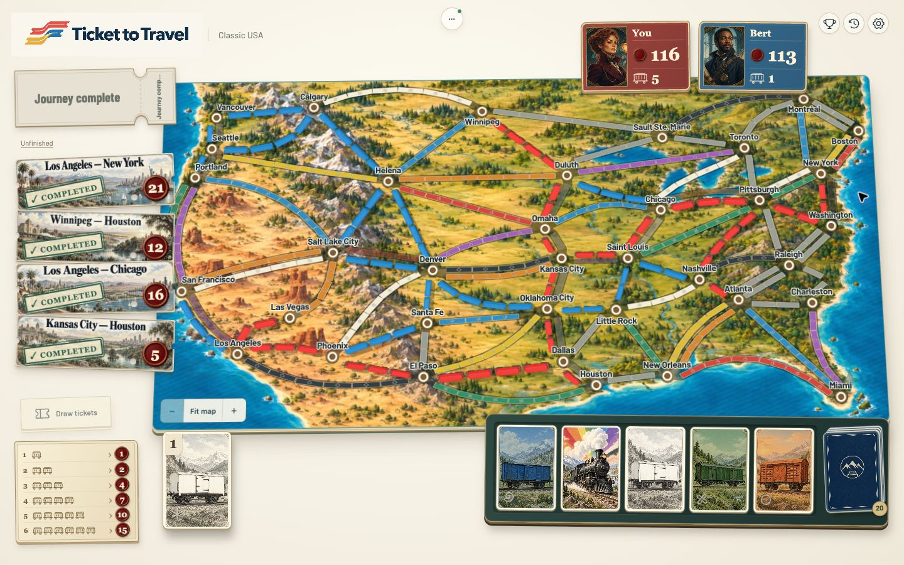

# Full-game design and motion critique

Current design direction: [design-direction.md](../../docs/design-direction.md). This consolidates the conversation, explicitly retires superseded requests, and was read in full by both critics.

Two independent critics played Ada (red) and Bert (blue) in room `6X5XJK`, starting with the normal 45 trains per player. They used actual browser controls and separate identities. Their baseline was frozen production build `0e0d500` on port 6092, while fixes were developed on 6090. They then retested an updated production build in fresh room `62DNEV`. Debug fixtures provided additional density, fleet and market-reset coverage; they did not replace the real match.

- [Ada's critique and evidence](a/report.md)
- [Bert's critique and evidence](b/findings.md)
- [Finding-by-finding resolution log](resolution-log.md)

## Completed full game

| Player | Route points | Completed ticket points | Longest bonus | Total | Trains left |
| --- | ---: | ---: | ---: | ---: | ---: |
| Ada | 52 | 54 | 10 | 116 | 5 |
| Bert | 62 | 41 | 10 | 113 | 1 |

All seven destination tickets completed. Both longest paths were 28 and both received the bonus. The final-round countdown, automatic results opening, results close/reopen and both clients' scores agreed. No gameplay blocker or scoring mismatch was observed. Browser warning/error logs were empty at completion.

## Changes and verification

The fixes address waiting-room consistency and stale readiness, paid-card fan reflow, staged paper-to-train motion, opponent train arrivals, renderer/capture work, crowded ticket access, market reset sequencing, entry/dialog presentation and action wording. Each finding is tracked in the resolution log with evidence and its verification status.

Post-fix coverage includes actual route-marker clicks and payment pins; local and remote claims; ordinary, wild and blind draws; new/existing hand colors; three-locomotive market sweep and redeal; initial and midgame tickets; completed tickets; history/settings/results; all five player models; and desktop plus 768×1024 portrait layouts with five players, twelve tickets and a 34-card hand. During crowded ticket selection, the owned stack scrolls independently while the new choices remain available.

Root confirmed that toggling a hand filter did not rebuild carriage instances and that disabling Living atlas stopped idle renders. Sprite capture reuses the board renderer with small cropped targets and asynchronous GPU readback; it runs while papers lift. The latest observed three-car capture queued work in 60ms and completed in 77ms. Those samples are diagnostic observations, not a cross-device performance benchmark.

Validation: 50 tests passed, 1,708 assertions; Svelte check reported zero errors/warnings; Oxlint, server type check and production build passed. Vite still reports its existing large-chunk advisory.

## Limits

The full normal-rules match ran on the baseline; fixes were verified with a fresh live multiplayer session and targeted fixtures, rather than claiming a second complete match. Screenshot sampling cannot certify every animation frame or universal 60fps. System reduced-motion and hidden-tab behavior were reviewed in code but not independently exercised through browser emulation in this pass. Ambient motion off was exercised directly. Both critics are satisfied within their tested scopes, with no unresolved major issue. Bert's final build check passed a six-card mixed payment, action wording, stable remaining fan and new/existing-color draw endpoints; his first claim sample was 293ms after activation, so exact first-frame continuity is not asserted.
