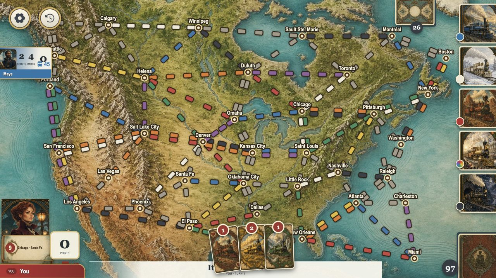

# Railbound redesign exploration

The user requested four optimistic image mockups before choosing a direction for the UI refactor: modern, futuristic, and two distinct upper-class Victorian styles. Implementation will use Three.js for the board and prioritize smooth, tasteful animation. No application code was changed in this exploration.

## Concepts

The numbered files match the generated images displayed in chat. All use the current board as a functional reference. Prompts are in [prompts.md](prompts.md). Images were generated with the built-in image generation tool.

- [01-modern.png](01-modern.png): Daylight Rail.
- [02-futuristic.png](02-futuristic.png): Tomorrow Express.
- [03-victorian-club.png](03-victorian-club.png): The Railway Society.
- [04-victorian-atlas.png](04-victorian-atlas.png): The Grand Railway Atlas.

These are visual concepts, not exact game-state or geographic specifications. Implement the chosen design with existing route data, correct rules, and responsive layout. Animation and performance require validation in the running implementation.

## Current UX inspection

Inspected the running app at 1280×720 on 2026-09-08.

1. Home: clear single-player and multiplayer entry points; visual language differs substantially from the illustrated board.
2. Setup: straightforward name and rival selection, with an automatic-save promise.
3. Destination selection: functional minimum selection and map endpoint previews; the drawer compresses an already busy board.
4. Active game: dense terrain competes with routes. Settings and opponent information overlap northwest cities; the right card market clips at the viewport edge; the hand obscures turn instructions; stacked destinations conceal names.

## Subagent playtest findings for the refactor

A subagent played normal single-player setup and four player actions against Maya: face-up wild draw, normal plus blind draw, gray route claim, and additional destination selection. Bot turns and route scoring worked in this sample. This was not a full game, multiplayer audit, accessibility audit, or performance benchmark.

- P1 — Reload resets progress. Start single player, deal and keep two tickets, play turns, then reload the retained `/game?new=1&name=You&bots=1` URL. Score, trains, routes, and destinations reset despite automatic-save copy. `apps/ui/src/routes/game/+page.ts` retains `startFresh` from `new=1`; `+page.svelte` skips restore whenever it is true and writes the fresh game to storage. Consume the new-game intent once.
- P2 — Layout overlaps and clipping at 1280×720, as captured above. Reserve space for the map, market, hand, turn prompt, and destinations; keep every city and action reachable.
- P2 — Hand accessibility exposes counts without color names. Supply card color and count to assistive technology, and retain accessible route interaction when moving to Three.js.
- P2 — Claim payment copy shows inventory as if it were cost. A length-three route offers “Green — 3 cards + 1 wild” but spends only three green cards. `apps/ui/src/lib/game/GameScreen.svelte` uses total hand counts in payment options. Show actual proposed payment separately from inventory.

## Implementation priorities after selection

Preserve the existing game rules and Bun/Svelte architecture. Separate the Three.js board renderer from game controls and state. Precompute static route geometry, reuse geometry/materials and instance repeated pieces, keep UI text sharp in HTML, and bound pixel ratio and effects. Use short purposeful card/claim/turn animations, reduced-motion support, and avoid continuously animating the entire scene. Measure frame time and interaction responsiveness before claiming performance improvements. Playtest complete games and multiplayer with low-thinking subagents during implementation.
