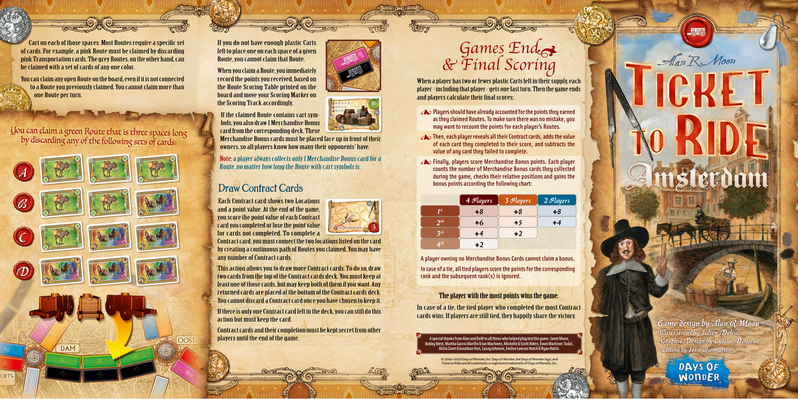
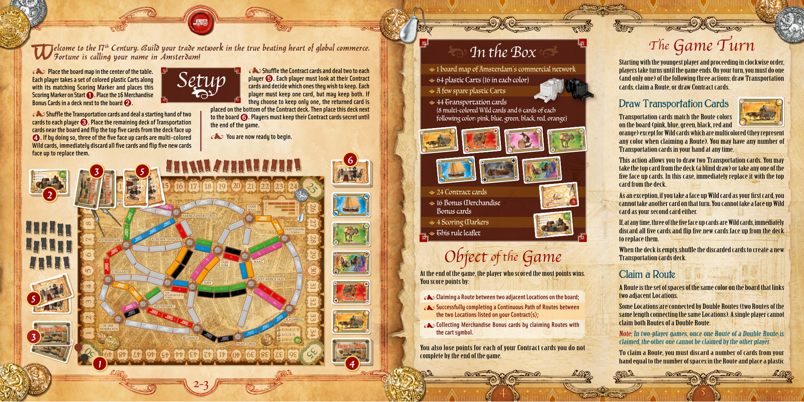

# Amsterdam

[Source PDF](rules.pdf) · [Map reference](amsterdam-map.png)

Parsed locally with pdf-inspector. Original page images preserve diagrams, tables, and layout; consult them where extraction is unclear.

## PDF page 1

Cart on each of those spaces. Most Routes require a specific set If you do not have enough plastic Carts of cards. For example, a pink Route must be claimed by discarding left to place one on each space of a given _Games End Games End_ pink Transportation cards. The grey Routes, on the other hand, can Route, you cannot claim that Route. be claimed with a set of cards of any one color. _& Final Scoring & Final Scoring_ When you claim a Route, you immediately You can claim any open Route on the board, even if it is not connected record the points you received, based on When a player has two or fewer plastic Carts left in their supply, each to a Route you previously claimed. You cannot claim more than the Route Scoring Table printed on the player-including that player-gets one last turn. Then the game ends one Route per turn. board and move your Scoring Marker on and players calculate their final scores: the Scoring Track accordingly. s **Players should have already accounted for the points they earned** If the claimed Route contains cart sym- **as they claimed Routes. To make sure there was no mistake, you** bols, you also draw 1 Merchandise Bonus **may want to recount the points for each player’s Routes.** card from the corresponding deck. These You can claim a green Route that is three spaces long s **Then, each player reveals all their Contract cards, adds the value** Merchandise Bonus cards must be placed face up in front of their by discarding any of the following sets of cards:**of each card they completed to their score, and subtracts the** owners, so all players know how many their opponents’ have. **value of any card they failed to complete.**

Note: a player always collects only 1 Merchandise Bonus card for a

s**Finally, players score Merchandise Bonus points. Each player** Route, no matter how long the Route with cart symbols is. **counts the number of Merchandise Bonus cards they collected during the game, checks their relative positions and gains the** **bonus points according the following chart:** Draw Contract Cards Each Contract card shows two Locations 4 Players 3 Players 2 Players and a point value. At the end of the game, 1st **+**8 **+**8 **+**8 DAM you score the point value of each Contract 2nd **+**6 **+**5 **+**4 card you completed or lose the point valueDE DRIE HENDRICKEN for cards not completed. To complete a 3rd **+**4 **+**2 Contract card, you must connect the two locations listed on the card 4th **+**2 by creating a continuous path of Routes you claimed. You may have any number of Contract cards.**A player owning no Merchandise Bonus Cards cannot claim a bonus.** This action allows you to draw more Contract cards. To do so, draw **In case of a tie, all tied players score the points for the corresponding** two cards from the top of the Contract cards deck. You must keep at **rank and the subsequent rank(s) is ignored.** least one of those cards, but may keep both of them if you want. Any returned cards are placed at the bottom of the Contract cards deck. The player with the most points wins the game. The player with the most points wins the game. You cannot discard a Contract card once you have chosen to keep it. In case of a tie, the tied player who completed the most Contract If there is only one Contract card left in the deck, you can still do this cards wins. If players are still tied, they happily share the victory. action but must keep the card. Game design by Alan R. Moon Contract cards and their completion must be kept secret from other Illustrations by Julien Delval players until the end of the game. **A special thanks from Alan and DoW to all those who helped play test the game: Janet Moon,** **Bobby West, Martha Garcia Murillo & Ian MacInnes, Michelle & Scott Alden, Ewan Martinot-Tudal,**Graphic Design by Cyrille Daujean **Alicia Zaret & Jonathan Yost, Casey Johnson, Emilee Lawson Hatch & Ryan Hatch.**Editing by Jesse Rasmussen © 2004–2020 Days of Wonder, Inc. Days of Wonder, the Days of Wonder logo, and Ticket to Ride are all trademarks or registered trademarks of Days of Wonder, Inc.

## PDF page 2

elcome to the 17 elcome to the 17thth Century. Build your trade network in the true beating heart of global commerce. Century. Build your trade network in the true beating heart of global commerce._The The Game Turn Game Turn_

#### In the Box

# W WFortune is calling your name in Amsterdam! Fortune is calling your name in Amsterdam!

Starting with the youngest player and proceeding in clockwise order, s s**Shuffle the Contract cards and deal two to each**=1 board map of Amsterdam’s commercial networkplayers take turns until the game ends. On your turn, you must do one s s **Place the board map in the center of the table. Place the board map in the center of the table.** **Each player takes a set of colored plastic Carts along Each player takes a set of colored plastic Carts along player**➎➎**. Each player must look at their Contract**=64 plastic Carts (16 in each color)(and only one) of the following three actions: draw Transportation

## Setupcards and decide which ones they wish to keep. Each

**with its matching Scoring Marker and places this with its matching Scoring Marker and places this** cards, claim a Route, or draw Contract cards. =A few spare plastic Carts **Scoring Marker on Start Scoring Marker on Start**➊➊**. Place the 16 Merchandise player must keep one card, but may keep both. If** **Bonus Cards in a deck next to the board**➋➋. **they choose to keep only one, the returned card is** =44 Transportation cards Draw Transportation Cards **placed on the bottom of the Contract deck. Then place this deck next** (8 multi-colored Wild cards and 6 cards of each s s**Shuffle the Transportation cards and deal a starting hand of two** **to the board**➏➏**. Players must keep their Contract cards secret until** following color: pink, blue, green, black, red, orange)Transportation cards match the Route colors **cards to each player**➌➌**. Place the remaining deck of Transportation** **the end of the game.** on the board (pink, blue, green, black, red and **cards near the board and flip the top five cards from the deck face up** orange) except for Wild cards which are multicolored (they represent s s **You are now ready to begin.** ➍➍**. If by doing so, three of the five face up cards are multi-colored** any color when claiming a Route). You may have any number of **Wild cards, immediately discard all five cards and flip five new cards** Transportation cards in your hand at any time. **face up to replace them.** 6 This action allows you to draw two Transportation cards. You may take the top card from the deck (a blind draw) or take any one of the 3 5 five face up cards. In this case, immediately replace it with the top card from the deck. =24 Contract cardsDAM 2 As an exception, if you take a face up Wild card as your first card, you =16 Bonus MerchandiseDE DRIE HENDRICKENcannot take another card on that turn. You cannot take a face up Wild Bonus cards card as your second card either. =4 Scoring Markers If, at any time, three of the five face up cards are Wild cards, immediately discard all five cards and flip five new cards face up from the deck =This rule leaflet to replace them. When the deck is empty, shuffle the discarded cards to create a new

### Object Objectof the of the Game GameTransportation cards deck.

At the end of the game, the player who scored the most points wins. Claim a Route You score points by: A Route is the set of spaces of the same color on the board that links s **Claiming a Route between two adjacent Locations on the board;** two adjacent Locations. 5 s**Successfully completing a Continuous Path of Routes between** Some Locations are connected by Double Routes (two Routes of the **the two Locations listed on your Contract(s);** same length connecting the same Locations). A single player cannot claim both Routes of a Double Route. s**Collecting Merchandise Bonus cards by claiming Routes with** **the cart symbol.**Note: In two-player games, once one Route of a Double Route is claimed, the other one cannot be claimed by the other player. You also lose points for each of your Contract cards you do not To claim a Route, you must discard a number of cards from your complete by the end of the game. hand equal to the number of spaces in the Route and place a plastic

2-3

