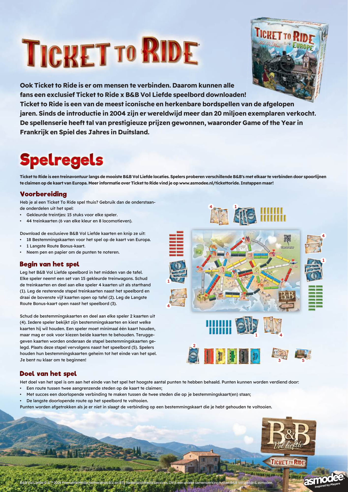
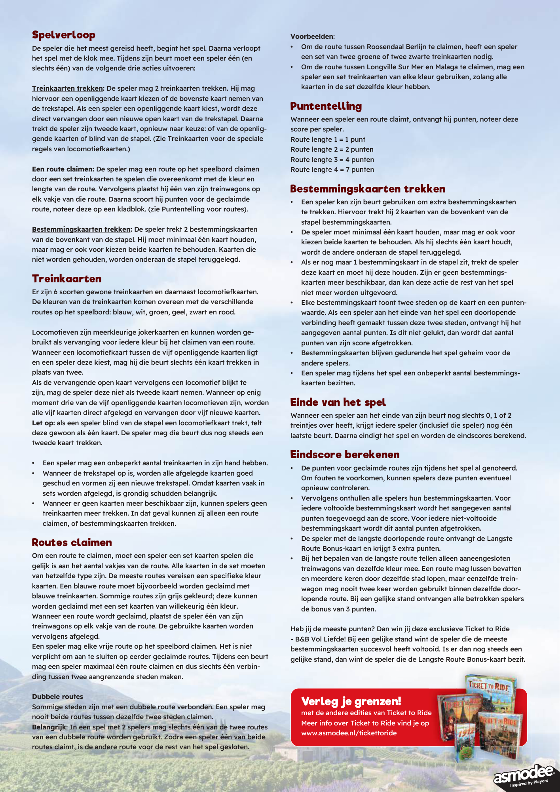

# B&B Vol Liefde

[Source PDF](rules.pdf) · [Map reference](b-and-b-vol-liefde-map.png)

Parsed locally with pdf-inspector. Original page images preserve diagrams, tables, and layout; consult them where extraction is unclear.

## PDF page 1

**Ook Ticket to Ride is er om mensen te verbinden. Daarom kunnen alle** **fans een exclusief Ticket to Ride x B&B Vol Liefde speelbord downloaden! fans een exclusief Ticket to Ride x B&B Vol Liefde speelbord downloaden!** **Ticket to Ride is een van de meest iconische en herkenbare bordspellen van de afgelopen Ticket to Ride is een van de meest iconische en herkenbare bordspellen van de afgelopen** **jaren. Sinds de introductie in 2004 zijn er wereldwijd meer dan 20 miljoen exemplaren verkocht.** **De spellenserie heeft tal van prestigieuze prijzen gewonnen, waaronder Game of the Year in** **Frankrijk en Spiel des Jahres in Duitsland.**

**Spelregels Spelregels Spelregels Spelregels Spelregels Spelregels Spelregels Spelregels Spelregels Spelregels Spelregels Spelregels Spelregels Spelregels Spelregels Spelregels Spelregels Spelregels Spelregels Spelregels Spelregels Spelregels Spelregels Spelregels Spelregels Spelregels Spelregels Spelregels Spelregels Spelregels Spelregels Spelregels Spelregels Spelregels Spelregels Spelregels Spelregels Spelregels Spelregels Spelregels Spelregels Spelregels Spelregels Spelregels Spelregels Spelregels Spelregels Spelregels Spelregels Spelregels Spelregels Spelregels Spelregels Spelregels Spelregels Spelregels Spelregels Spelregels Spelregels Spelregels Spelregels Spelregels Spelregels Spelregels Spelregels Spelregels Spelregels Spelregels Spelregels Spelregels Spelregels Spelregels Spelregels Spelregels Spelregels Spelregels Spelregels Spelregels Spelregels Spelregels Spelregels Spelregels Spelregels Spelregels Spelregels Spelregels Spelregels Spelregels Spelregels Spelregels Spelregels Spelregels Spelregels Spelregels Spelregels Spelregels Spelregels Spelregels Spelregels**

**Ticket to Ride is een treinavontuur langs de mooiste B&B Vol Liefde locaties. Spelers proberen verschillende B&B's met elkaar te verbinden door spoorlijnen** **te claimen op de kaart van Europa. Meer informatie over Ticket to Ride vind je op www.asmodee.nl/tickettoride. Instappen maar!**

## Voorbereiding

**Heb je al een Ticket To Ride spel thuis? Gebruik dan de onderstaan-** **4 1 de onderdelen uit het spel:**

- **Gekleurde treintjes: 15 stuks voor elke speler.**Biches-Warchau Biches-Warchau Biches-Warchau Biches-Warchau Biches-Warchau Biches-Warchau Biches-Warchau Biches-Warchau Biches-Warchau Biches-Warchau Biches-Warchau Biches-Warchau Biches-Warchau Biches-Warchau Biches-Warchau Biches-Warchau Biches-Warchau Biches-Warchau Biches-Warchau Biches-Warchau Biches-Warchau Biches-Warchau Biches-Warchau Biches-Warchau Biches-Warchau Biches-Warchau Biches-Warchau Biches-Warchau Biches-Warchau Biches-Warchau Biches-Warchau Biches-Warchau Biches-Warchau Biches-Warchau Biches-Warchau Biches-Warchau Biches-Warchau Biches-Warchau Biches-Warchau Biches-Warchau Biches-Warchau Biches-Warchau Biches-Warchau Biches-Warchau Biches-Warchau Biches-Warchau Biches-Warchau Biches-Warchau Biches-Warchau Biches-Warchau Biches-Warchau Biches-Warchau Biches-Warchau Biches-Warchau Biches-Warchau Biches-Warchau Biches-Warchau Biches-Warchau Biches-Warchau Biches-Warchau Biches-Warchau Biches-Warchau Biches-Warchau Biches-Warchau Biches-Warchau Biches-Warchau Biches-Warchau Biches-Warchau Biches-Warchau Biches-Warchau Biches-Warchau Biches-Warchau Biches-Warchau Biches-Warchau Biches-Warchau Biches-Warchau Biches-Warchau Biches-Warchau Biches-Warchau Biches-Warchau Biches-Warchau Biches-Warchau Biches-Warchau Biches-Warchau Biches-Warchau Biches-Warchau Biches-Warchau Biches-Warchau Biches-Warchau Biches-Warchau Biches-Warchau Biches-Warchau Biches-Warchau Biches-Warchau Biches-Warchau Biches-Warchau Biches-Warchau Biches-Warchau Biches-Warchau Biches-Warchau Biches-Warchau Biches-Warchau Biches-Warchau Biches-Warchau Biches-Warchau Biches-Warchau Biches-Warchau Biches-Warchau Biches-Warchau Biches-Warchau Biches-Warchau Biches-Warchau Biches-Warchau Biches-Warchau Biches-Warchau Biches-Warchau Biches-Warchau Biches-Warchau Biches-Warchau Biches-Warchau Biches-Warchau Biches-Warchau Biches-Warchau Biches-Warchau Biches-Warchau Biches-Warchau Biches-Warchau Biches-Warchau Biches-Warchau Biches-Warchau Biches-Warchau Biches-Warchau Biches-Warchau Biches-Warchau Biches-Warchau Biches-Warchau Biches-Warchau Biches-Warchau Biches-Warchau Biches-Warchau Biches-Warchau Biches-Warchau Biches-Warchau Biches-Warchau Biches-Warchau Biches-Warchau Biches-Warchau Biches-Warchau Biches-Warchau Biches-Warchau Biches-Warchau Biches-Warchau Biches-Warchau Biches-Warchau Biches-Warchau Biches-Warchau Biches-Warchau Biches-Warchau Biches-Warchau Biches-Warchau Biches-Warchau Biches-Warchau
  Biches-San Benedetto Biches-San Benedetto Biches-San Benedetto Biches-San Benedetto Biches-San Benedetto Biches-San Benedetto Biches-San Benedetto Biches-San Benedetto Biches-San Benedetto Biches-San Benedetto Biches-San Benedetto Biches-San Benedetto Biches-San Benedetto Biches-San Benedetto Biches-San Benedetto Biches-San Benedetto Biches-San Benedetto Biches-San Benedetto Biches-San Benedetto Biches-San Benedetto Biches-San Benedetto Biches-San Benedetto Biches-San Benedetto Biches-San Benedetto Biches-San Benedetto Biches-San Benedetto Biches-San Benedetto Biches-San Benedetto Biches-San Benedetto Biches-San Benedetto Biches-San Benedetto Biches-San Benedetto Biches-San Benedetto Biches-San Benedetto Biches-San Benedetto Biches-San Benedetto Biches-San Benedetto Biches-San Benedetto Biches-San Benedetto Biches-San Benedetto Biches-San Benedetto Biches-San Benedetto Biches-San Benedetto Biches-San Benedetto Biches-San Benedetto Biches-San Benedetto Biches-San Benedetto Biches-San Benedetto Biches-San Benedetto Biches-San Benedetto Biches-San Benedetto Biches-San Benedetto Biches-San Benedetto Biches-San Benedetto Biches-San Benedetto Biches-San Benedetto Biches-San Benedetto Biches-San Benedetto Biches-San Benedetto Biches-San Benedetto Biches-San Benedetto Biches-San Benedetto Biches-San Benedetto Biches-San Benedetto Biches-San Benedetto Biches-San Benedetto Biches-San Benedetto Biches-San Benedetto Biches-San Benedetto Biches-San Benedetto Biches-San Benedetto Biches-San Benedetto Biches-San Benedetto Biches-San Benedetto Biches-San Benedetto Biches-San Benedetto Biches-San Benedetto Biches-San Benedetto Biches-San Benedetto Biches-San Benedetto Biches-San Benedetto Biches-San Benedetto Biches-San Benedetto Biches-San Benedetto Biches-San Benedetto Biches-San Benedetto Biches-San Benedetto Biches-San Benedetto Biches-San Benedetto Biches-San Benedetto Biches-San Benedetto Biches-San Benedetto Biches-San Benedetto Biches-San Benedetto Biches-San Benedetto Biches-San Benedetto Biches-San Benedetto Biches-San Benedetto Biches-San Benedetto Biches-San Benedetto Biches-San Benedetto Biches-San Benedetto Biches-San Benedetto Biches-San Benedetto Biches-San Benedetto Biches-San Benedetto Biches-San Benedetto Biches-San Benedetto Biches-San Benedetto Biches-San Benedetto Biches-San Benedetto Biches-San Benedetto Biches-San Benedetto Biches-San Benedetto Biches-San Benedetto Biches-San Benedetto Biches-San Benedetto Biches-San Benedetto Biches-San Benedetto Biches-San Benedetto Biches-San Benedetto Biches-San Benedetto Biches-San Benedetto Biches-San Benedetto Biches-San Benedetto Biches-San Benedetto Biches-San Benedetto Biches-San Benedetto Biches-San Benedetto Biches-San Benedetto Biches-San Benedetto Biches-San Benedetto Biches-San Benedetto Biches-San Benedetto Biches-San Benedetto Biches-San Benedetto Biches-San Benedetto Biches-San Benedetto Biches-San Benedetto Biches-San Benedetto Biches-San Benedetto Biches-San Benedetto Biches-San Benedetto Biches-San Benedetto Biches-San Benedetto Biches-San Benedetto Biches-San Benedetto Biches-San Benedetto Biches-San Benedetto Biches-San Benedetto Biches-San Benedetto Biches-San Benedetto Biches-San Benedetto Biches-San Benedetto Biches-San Benedetto Biches-San Benedetto Biches-San Benedetto Biches-San Benedetto Biches-San Benedetto Biches-San Benedetto Biches-San Benedetto Biches-San Benedetto Biches-San Benedetto Biches-San Benedetto Biches-San Benedetto Biches-San Benedetto Biches-San Benedetto Biches-San Benedetto Biches-San Benedetto Biches-San Benedetto Biches-San Benedetto Biches-San Benedetto Biches-San Benedetto Biches-San Benedetto Biches-San Benedetto Biches-San Benedetto Biches-San Benedetto Biches-San Benedetto Biches-San Benedetto Biches-San Benedetto Biches-San Benedetto Biches-San Benedetto Biches-San Benedetto Biches-San Benedetto Biches-San Benedetto Biches-San Benedetto Biches-San Benedetto Biches-San Benedetto Biches-San Benedetto Biches-San Benedetto Biches-San Benedetto Biches-San Benedetto Biches-San Benedetto Biches-San Benedetto Biches-San Benedetto Biches-San Benedetto Biches-San Benedetto Biches-San Benedetto Biches-San Benedetto Biches-San Benedetto Biches-San Benedetto Biches-San Benedetto Biches-San Benedetto Biches-San Benedetto Biches-San Benedetto Biches-San Benedetto Biches-San Benedetto Biches-San Benedetto Biches-San Benedetto Biches-San Benedetto Biches-San Benedetto Biches-San Benedetto Biches-San Benedetto Biches-San Benedetto Biches-San Benedetto Biches-San Benedetto Biches-San Benedetto Biches-San Benedetto Biches-San Benedetto Biches-San Benedetto Biches-San Benedetto Biches-San Benedetto Biches-San Benedetto Biches-San Benedetto Biches-San Benedetto Biches-San Benedetto Biches-San Benedetto Biches-San Benedetto Biches-San Benedetto Biches-San Benedetto Biches-San Benedetto Biches-San Benedetto Biches-San Benedetto Biches-San Benedetto

- **44 treinkaarten (6 van elke kleur en 8 locomotieven).** **Download de exclusieve B&B Vol Liefde kaarten en knip ze uit:**
  Biches-Lesbos Biches-Lesbos Biches-Lesbos Biches-Lesbos Biches-Lesbos Biches-Lesbos Biches-Lesbos Biches-Lesbos Biches-Lesbos Biches-Lesbos Biches-Lesbos Biches-Lesbos Biches-Lesbos Biches-Lesbos Biches-Lesbos Biches-Lesbos Biches-Lesbos Biches-Lesbos Biches-Lesbos Biches-Lesbos Biches-Lesbos Biches-Lesbos Biches-Lesbos Biches-Lesbos Biches-Lesbos Biches-Lesbos Biches-Lesbos Biches-Lesbos Biches-Lesbos Biches-Lesbos Biches-Lesbos Biches-Lesbos Biches-Lesbos Biches-Lesbos Biches-Lesbos Biches-Lesbos Biches-Lesbos Biches-Lesbos Biches-Lesbos Biches-Lesbos Biches-Lesbos Biches-Lesbos Biches-Lesbos Biches-Lesbos Biches-Lesbos Biches-Lesbos Biches-Lesbos Biches-Lesbos Biches-Lesbos Biches-Lesbos Biches-Lesbos Biches-Lesbos Biches-Lesbos Biches-Lesbos Biches-Lesbos Biches-Lesbos Biches-Lesbos Biches-Lesbos Biches-Lesbos Biches-Lesbos Biches-Lesbos Biches-Lesbos Biches-Lesbos Biches-Lesbos Biches-Lesbos Biches-Lesbos Biches-Lesbos Biches-Lesbos Biches-Lesbos Biches-Lesbos Biches-Lesbos Biches-Lesbos Biches-Lesbos Biches-Lesbos Biches-Lesbos Biches-Lesbos Biches-Lesbos Biches-Lesbos Biches-Lesbos Biches-Lesbos Biches-Lesbos Biches-Lesbos Biches-Lesbos Biches-Lesbos Biches-Lesbos Biches-Lesbos Biches-Lesbos Biches-Lesbos Biches-Lesbos Biches-Lesbos Biches-Lesbos Biches-Lesbos Biches-Lesbos Biches-Lesbos Biches-Lesbos Biches-Lesbos Biches-Lesbos Biches-Lesbos Biches-Lesbos Biches-Lesbos Biches-Lesbos Biches-Lesbos Biches-Lesbos Biches-Lesbos Biches-Lesbos Biches-Lesbos Biches-Lesbos Biches-Lesbos Biches-Lesbos Biches-Lesbos Biches-Lesbos Biches-Lesbos Biches-Lesbos Biches-Lesbos Biches-Lesbos Biches-Lesbos Biches-Lesbos Biches-Lesbos Biches-Lesbos Biches-Lesbos Biches-Lesbos Biches-Lesbos Biches-Lesbos Biches-Lesbos Biches-Lesbos Biches-Lesbos Biches-Lesbos Biches-Lesbos Biches-Lesbos Biches-Lesbos Biches-Lesbos Biches-Lesbos Biches-Lesbos Biches-Lesbos Biches-Lesbos Biches-Lesbos Biches-Lesbos Biches-Lesbos Biches-Lesbos Biches-Lesbos Biches-Lesbos Biches-Lesbos Biches-Lesbos Biches-Lesbos Biches-Lesbos Biches-Lesbos Biches-Lesbos Biches-Lesbos Biches-Lesbos Biches-Lesbos Biches-Lesbos Biches-Lesbos Biches-Lesbos Biches-Lesbos Biches-Lesbos Biches-Lesbos Biches-Lesbos Biches-Lesbos Biches-Lesbos Biches-Lesbos Biches-Lesbos Biches-Lesbos Biches-Lesbos Biches-Lesbos Biches-Lesbos Biches-Lesbos Biches-Lesbos Biches-Lesbos**4**

- **18 Bestemmingskaarten voor het spel op de kaart van Europa.**
  Biches-Norrhult Biches-Norrhult Biches-Norrhult Biches-Norrhult Biches-Norrhult Biches-Norrhult Biches-Norrhult Biches-Norrhult Biches-Norrhult Biches-Norrhult Biches-Norrhult Biches-Norrhult Biches-Norrhult Biches-Norrhult Biches-Norrhult Biches-Norrhult Biches-Norrhult Biches-Norrhult Biches-Norrhult Biches-Norrhult Biches-Norrhult Biches-Norrhult Biches-Norrhult Biches-Norrhult Biches-Norrhult Biches-Norrhult Biches-Norrhult Biches-Norrhult Biches-Norrhult Biches-Norrhult Biches-Norrhult Biches-Norrhult Biches-Norrhult Biches-Norrhult Biches-Norrhult Biches-Norrhult Biches-Norrhult Biches-Norrhult Biches-Norrhult Biches-Norrhult Biches-Norrhult Biches-Norrhult Biches-Norrhult Biches-Norrhult Biches-Norrhult Biches-Norrhult Biches-Norrhult Biches-Norrhult Biches-Norrhult Biches-Norrhult Biches-Norrhult Biches-Norrhult Biches-Norrhult Biches-Norrhult Biches-Norrhult Biches-Norrhult Biches-Norrhult Biches-Norrhult Biches-Norrhult Biches-Norrhult Biches-Norrhult Biches-Norrhult Biches-Norrhult Biches-Norrhult Biches-Norrhult Biches-Norrhult Biches-Norrhult Biches-Norrhult Biches-Norrhult Biches-Norrhult Biches-Norrhult Biches-Norrhult Biches-Norrhult Biches-Norrhult Biches-Norrhult Biches-Norrhult Biches-Norrhult Biches-Norrhult Biches-Norrhult Biches-Norrhult Biches-Norrhult Biches-Norrhult Biches-Norrhult Biches-Norrhult Biches-Norrhult Biches-Norrhult Biches-Norrhult Biches-Norrhult Biches-Norrhult Biches-Norrhult Biches-Norrhult Biches-Norrhult Biches-Norrhult Biches-Norrhult Biches-Norrhult Biches-Norrhult Biches-Norrhult Biches-Norrhult Biches-Norrhult Biches-Norrhult Biches-Norrhult Biches-Norrhult Biches-Norrhult Biches-Norrhult Biches-Norrhult Biches-Norrhult Biches-Norrhult Biches-Norrhult Biches-Norrhult Biches-Norrhult Biches-Norrhult Biches-Norrhult Biches-Norrhult Biches-Norrhult Biches-Norrhult Biches-Norrhult Biches-Norrhult Biches-Norrhult Biches-Norrhult Biches-Norrhult Biches-Norrhult Biches-Norrhult Biches-Norrhult Biches-Norrhult Biches-Norrhult Biches-Norrhult Biches-Norrhult Biches-Norrhult Biches-Norrhult Biches-Norrhult Biches-Norrhult Biches-Norrhult Biches-Norrhult Biches-Norrhult Biches-Norrhult Biches-Norrhult Biches-Norrhult Biches-Norrhult Biches-Norrhult Biches-Norrhult Biches-Norrhult Biches-Norrhult Biches-Norrhult Biches-Norrhult Biches-Norrhult Biches-Norrhult Biches-Norrhult Biches-Norrhult Biches-Norrhult Biches-Norrhult Biches-Norrhult Biches-Norrhult Biches-Norrhult Biches-Norrhult Biches-Norrhult Biches-Norrhult Biches-Norrhult Biches-Norrhult Biches-Norrhult Biches-Norrhult Biches-Norrhult Biches-Norrhult Biches-Norrhult Biches-Norrhult Biches-Norrhult

- **1 Langste Route Bonus-kaart.**
- **Neem pen en papier om de punten te noteren.**
  **1** **Begin van het spel** **Leg het B&B Vol Liefde speelbord in het midden van de tafel.** **Elke speler neemt een set van 15 gekleurde treinwagons. Schud** **1 de treinkaarten en deel aan elke speler 4 kaarten uit als starthand**

**(1). Leg de resterende stapel treinkaarten naast het speelbord en** **draai de bovenste vijf kaarten open op tafel (2). Leg de Langste**Costa Brava-Sankt Michael Costa Brava-Sankt Michael Costa Brava-Sankt Michael Costa Brava-Sankt Michael Costa Brava-Sankt Michael Costa Brava-Sankt Michael Costa Brava-Sankt Michael Costa Brava-Sankt Michael Costa Brava-Sankt Michael Costa Brava-Sankt Michael Costa Brava-Sankt Michael Costa Brava-Sankt Michael Costa Brava-Sankt Michael Costa Brava-Sankt Michael Costa Brava-Sankt Michael Costa Brava-Sankt Michael Costa Brava-Sankt Michael Costa Brava-Sankt Michael Costa Brava-Sankt Michael Costa Brava-Sankt Michael Costa Brava-Sankt Michael Costa Brava-Sankt Michael Costa Brava-Sankt Michael Costa Brava-Sankt Michael Costa Brava-Sankt Michael Costa Brava-Sankt Michael Costa Brava-Sankt Michael Costa Brava-Sankt Michael Costa Brava-Sankt Michael Costa Brava-Sankt Michael Costa Brava-Sankt Michael Costa Brava-Sankt Michael Costa Brava-Sankt Michael Costa Brava-Sankt Michael Costa Brava-Sankt Michael Costa Brava-Sankt Michael Costa Brava-Sankt Michael Costa Brava-Sankt Michael Costa Brava-Sankt Michael Costa Brava-Sankt Michael Costa Brava-Sankt Michael Costa Brava-Sankt Michael Costa Brava-Sankt Michael Costa Brava-Sankt Michael Costa Brava-Sankt Michael Costa Brava-Sankt Michael Costa Brava-Sankt Michael Costa Brava-Sankt Michael Costa Brava-Sankt Michael Costa Brava-Sankt Michael Costa Brava-Sankt Michael Costa Brava-Sankt Michael Costa Brava-Sankt Michael Costa Brava-Sankt Michael Costa Brava-Sankt Michael Costa Brava-Sankt Michael Costa Brava-Sankt Michael Costa Brava-Sankt Michael Costa Brava-Sankt Michael Costa Brava-Sankt Michael Costa Brava-Sankt Michael Costa Brava-Sankt Michael Costa Brava-Sankt Michael Costa Brava-Sankt Michael Costa Brava-Sankt Michael Costa Brava-Sankt Michael Costa Brava-Sankt Michael Costa Brava-Sankt Michael Costa Brava-Sankt Michael Costa Brava-Sankt Michael Costa Brava-Sankt Michael Costa Brava-Sankt Michael Costa Brava-Sankt Michael Costa Brava-Sankt Michael Costa Brava-Sankt Michael Costa Brava-Sankt Michael Costa Brava-Sankt Michael Costa Brava-Sankt Michael Costa Brava-Sankt Michael Costa Brava-Sankt Michael Costa Brava-Sankt Michael Costa Brava-Sankt Michael Costa Brava-Sankt Michael Costa Brava-Sankt Michael Costa Brava-Sankt Michael Costa Brava-Sankt Michael Costa Brava-Sankt Michael Costa Brava-Sankt Michael Costa Brava-Sankt Michael Costa Brava-Sankt Michael Costa Brava-Sankt Michael Costa Brava-Sankt Michael Costa Brava-Sankt Michael Costa Brava-Sankt Michael Costa Brava-Sankt Michael Costa Brava-Sankt Michael Costa Brava-Sankt Michael Costa Brava-Sankt Michael Costa Brava-Sankt Michael Costa Brava-Sankt Michael Costa Brava-Sankt Michael Costa Brava-Sankt Michael Costa Brava-Sankt Michael Costa Brava-Sankt Michael Costa Brava-Sankt Michael Costa Brava-Sankt Michael Costa Brava-Sankt Michael Costa Brava-Sankt Michael Costa Brava-Sankt Michael Costa Brava-Sankt Michael Costa Brava-Sankt Michael Costa Brava-Sankt Michael Costa Brava-Sankt Michael Costa Brava-Sankt Michael Costa Brava-Sankt Michael Costa Brava-Sankt Michael Costa Brava-Sankt Michael Costa Brava-Sankt Michael Costa Brava-Sankt Michael Costa Brava-Sankt Michael Costa Brava-Sankt Michael Costa Brava-Sankt Michael Costa Brava-Sankt Michael Costa Brava-Sankt Michael Costa Brava-Sankt Michael Costa Brava-Sankt Michael Costa Brava-Sankt Michael Costa Brava-Sankt Michael Costa Brava-Sankt Michael Costa Brava-Sankt Michael Costa Brava-Sankt Michael Costa Brava-Sankt Michael Costa Brava-Sankt Michael Costa Brava-Sankt Michael Costa Brava-Sankt Michael Costa Brava-Sankt Michael Costa Brava-Sankt Michael Costa Brava-Sankt Michael Costa Brava-Sankt Michael Costa Brava-Sankt Michael Costa Brava-Sankt Michael Costa Brava-Sankt Michael Costa Brava-Sankt Michael Costa Brava-Sankt Michael Costa Brava-Sankt Michael Costa Brava-Sankt Michael Costa Brava-Sankt Michael Costa Brava-Sankt Michael Costa Brava-Sankt Michael Costa Brava-Sankt Michael Costa Brava-Sankt Michael Costa Brava-Sankt Michael Costa Brava-Sankt Michael Costa Brava-Sankt Michael Costa Brava-Sankt Michael Costa Brava-Sankt Michael Costa Brava-Sankt Michael Costa Brava-Sankt Michael Costa Brava-Sankt Michael Costa Brava-Sankt Michael Costa Brava-Sankt Michael Costa Brava-Sankt Michael Costa Brava-Sankt Michael Costa Brava-Sankt Michael Costa Brava-Sankt Michael Costa Brava-Sankt Michael Costa Brava-Sankt Michael Costa Brava-Sankt Michael Costa Brava-Sankt Michael Costa Brava-Sankt Michael Costa Brava-Sankt Michael Costa Brava-Sankt Michael Costa Brava-Sankt Michael Costa Brava-Sankt Michael Costa Brava-Sankt Michael Costa Brava-Sankt Michael Costa Brava-Sankt Michael Costa Brava-Sankt Michael Costa Brava-Sankt Michael Costa Brava-Sankt Michael Costa Brava-Sankt Michael Costa Brava-Sankt Michael Costa Brava-Sankt Michael Costa Brava-Sankt Michael Costa Brava-Sankt Michael Costa Brava-Sankt Michael Costa Brava-Sankt Michael Costa Brava-Sankt Michael Costa Brava-Sankt Michael Costa Brava-Sankt Michael Costa Brava-Sankt Michael Costa Brava-Sankt Michael Costa Brava-Sankt Michael Costa Brava-Sankt Michael Costa Brava-Sankt Michael Costa Brava-Sankt Michael Costa Brava-Sankt Michael Costa Brava-Sankt Michael Costa Brava-Sankt Michael Costa Brava-Sankt Michael Costa Brava-Sankt Michael Costa Brava-Sankt Michael Costa Brava-Sankt Michael Costa Brava-Sankt Michael Costa Brava-Sankt Michael Costa Brava-Sankt Michael Costa Brava-Sankt Michael Costa Brava-Sankt Michael Costa Brava-Sankt Michael Costa Brava-Sankt Michael Costa Brava-Sankt Michael Costa Brava-Sankt Michael Costa Brava-Sankt Michael Costa Brava-Sankt Michael Costa Brava-Sankt Michael Costa Brava-Sankt Michael Costa Brava-Sankt Michael Costa Brava-Sankt Michael Costa Brava-Sankt Michael Costa Brava-Sankt Michael Costa Brava-Sankt Michael Costa Brava-Sankt Michael Costa Brava-Sankt Michael Costa Brava-Sankt Michael Costa Brava-Sankt Michael Costa Brava-Sankt Michael Costa Brava-Sankt Michael Costa Brava-Sankt Michael Costa Brava-Sankt Michael Costa Brava-Sankt Michael Costa Brava-Sankt Michael Costa Brava-Sankt Michael Costa Brava-Sankt Michael Costa Brava-Sankt Michael Costa Brava-Sankt Michael Costa Brava-Sankt Michael Costa Brava-Sankt Michael Costa Brava-Sankt Michael Costa Brava-Sankt Michael Costa Brava-Sankt Michael Costa Brava-Sankt Michael Costa Brava-Sankt Michael Costa Brava-Sankt Michael Costa Brava-Sankt Michael Costa Brava-Sankt Michael Costa Brava-Sankt Michael Costa Brava-Sankt Michael Costa Brava-Sankt Michael Costa Brava-Sankt Michael Costa Brava-Sankt Michael Costa Brava-Sankt Michael Costa Brava-Sankt Michael Costa Brava-Sankt Michael Costa Brava-Sankt Michael Costa Brava-Sankt Michael Costa Brava-Sankt Michael Costa Brava-Sankt Michael Costa Brava-Sankt Michael Costa Brava-Sankt Michael Costa Brava-Sankt Michael Costa Brava-Sankt Michael Costa Brava-Sankt Michael Costa Brava-Sankt Michael Costa Brava-Sankt Michael Costa Brava-Sankt Michael Costa Brava-Sankt Michael Costa Brava-Sankt Michael Costa Brava-Sankt Michael Costa Brava-Sankt Michael Costa Brava-Sankt Michael Costa Brava-Sankt Michael Costa Brava-Sankt Michael Costa Brava-Sankt Michael Costa Brava-Sankt Michael Costa Brava-Sankt Michael Costa Brava-Sankt Michael Costa Brava-Sankt Michael Costa Brava-Sankt Michael Costa Brava-Sankt Michael Costa Brava-Sankt Michael Costa Brava-Sankt Michael Costa Brava-Sankt Michael Costa Brava-Sankt Michael Costa Brava-Sankt Michael Costa Brava-Sankt Michael Costa Brava-Sankt Michael Costa Brava-Sankt Michael Costa Brava-Sankt Michael Costa Brava-Sankt Michael Costa Brava-Sankt Michael Costa Brava-Sankt Michael Costa Brava-Sankt Michael Costa Brava-Sankt Michael Costa Brava-Sankt Michael Costa Brava-Sankt Michael Costa Brava-Sankt Michael Costa Brava-Sankt Michael Costa Brava-Sankt Michael Costa Brava-Sankt Michael Costa Brava-Sankt Michael Costa Brava-Sankt Michael Costa Brava-Sankt Michael Costa Brava-Sankt Michael Costa Brava-Sankt Michael Costa Brava-Sankt Michael Costa Brava-Sankt Michael Costa Brava-Sankt Michael Costa Brava-Sankt Michael Costa Brava-Sankt Michael Costa Brava-Sankt Michael Costa Brava-Sankt Michael Costa Brava-Sankt Michael Costa Brava-Sankt Michael Costa Brava-Sankt Michael Costa Brava-Sankt Michael Costa Brava-Sankt Michael Costa Brava-Sankt Michael Costa Brava-Sankt Michael Costa Brava-Sankt Michael Costa Brava-Sankt Michael Costa Brava-Sankt Michael Costa Brava-Sankt Michael Costa Brava-Sankt Michael Costa Brava-Sankt Michael Costa Brava-Sankt Michael Costa Brava-Sankt Michael Costa Brava-Sankt Michael Costa Brava-Sankt Michael Costa Brava-Sankt Michael Costa Brava-Sankt Michael Costa Brava-Sankt Michael Costa Brava-Sankt Michael Costa Brava-Sankt Michael Costa Brava-Sankt Michael Costa Brava-Sankt Michael Costa Brava-Sankt Michael Costa Brava-Sankt Michael Costa Brava-Sankt Michael Costa Brava-Sankt Michael Im Lungau Im Lungau Im Lungau Im Lungau Im Lungau Im Lungau Im Lungau Im Lungau Im Lungau Im Lungau Im Lungau Im Lungau Im Lungau Im Lungau Im Lungau Im Lungau Im Lungau Im Lungau Im Lungau Im Lungau Im Lungau Im Lungau Im Lungau Im Lungau Im Lungau Im Lungau Im Lungau Im Lungau Im Lungau Im Lungau Im Lungau Im Lungau Im Lungau Im Lungau Im Lungau Im Lungau Im Lungau Im Lungau Im Lungau Im Lungau Im Lungau Im Lungau Im Lungau Im Lungau Im Lungau Im Lungau Im Lungau Im Lungau Im Lungau Im Lungau Im Lungau Im Lungau Im Lungau Im Lungau Im Lungau Im Lungau Im Lungau Im Lungau Im Lungau Im Lungau Im Lungau Im Lungau Im Lungau Im Lungau Im Lungau Im Lungau Im Lungau Im Lungau Im Lungau Im Lungau Im Lungau Im Lungau Im Lungau Im Lungau Im Lungau Im Lungau Im Lungau Im Lungau Im Lungau Im Lungau Im Lungau Im Lungau Im Lungau Im Lungau Im Lungau Im Lungau Im Lungau Im Lungau Im Lungau Im Lungau Im Lungau Im Lungau Im Lungau Im Lungau Im Lungau Im Lungau Im Lungau Im Lungau Im Lungau Im Lungau Im Lungau Im Lungau Im Lungau Im Lungau Im Lungau Im Lungau Im Lungau Im Lungau Im Lungau Im Lungau Im Lungau Im Lungau Im Lungau Im Lungau Im Lungau Im Lungau Im Lungau Im Lungau Im Lungau Im Lungau Im Lungau Im Lungau Im Lungau Im Lungau Im Lungau Im Lungau Im Lungau Im Lungau Im Lungau Im Lungau Im Lungau Im Lungau Im Lungau Im Lungau Im Lungau Im Lungau Im Lungau Im Lungau Im Lungau Im Lungau Im Lungau **Route Bonus-kaart open naast het speelbord (3).** Malaga-Berlijn Malaga-Berlijn Malaga-Berlijn Malaga-Berlijn Malaga-Berlijn Malaga-Berlijn Malaga-Berlijn Malaga-Berlijn Malaga-Berlijn Malaga-Berlijn Malaga-Berlijn Malaga-Berlijn Malaga-Berlijn Malaga-Berlijn Malaga-Berlijn Malaga-Berlijn Malaga-Berlijn Malaga-Berlijn Malaga-Berlijn Malaga-Berlijn Malaga-Berlijn Malaga-Berlijn Malaga-Berlijn Malaga-Berlijn Malaga-Berlijn Malaga-Berlijn Malaga-Berlijn Malaga-Berlijn Malaga-Berlijn Malaga-Berlijn Malaga-Berlijn Malaga-Berlijn Malaga-Berlijn Malaga-Berlijn Malaga-Berlijn Malaga-Berlijn Malaga-Berlijn Malaga-Berlijn Malaga-Berlijn Malaga-Berlijn Malaga-Berlijn Malaga-Berlijn Malaga-Berlijn Malaga-Berlijn Malaga-Berlijn Malaga-Berlijn Malaga-Berlijn Malaga-Berlijn Malaga-Berlijn Malaga-Berlijn Malaga-Berlijn Malaga-Berlijn Malaga-Berlijn Malaga-Berlijn Malaga-Berlijn Malaga-Berlijn Malaga-Berlijn Malaga-Berlijn Malaga-Berlijn Malaga-Berlijn Malaga-Berlijn Malaga-Berlijn Malaga-Berlijn Malaga-Berlijn Malaga-Berlijn Malaga-Berlijn Malaga-Berlijn Malaga-Berlijn Malaga-Berlijn Malaga-Berlijn Malaga-Berlijn Malaga-Berlijn Malaga-Berlijn Malaga-Berlijn Malaga-Berlijn Malaga-Berlijn Malaga-Berlijn Malaga-Berlijn Malaga-Berlijn Malaga-Berlijn Malaga-Berlijn Malaga-Berlijn Malaga-Berlijn Malaga-Berlijn Malaga-Berlijn Malaga-Berlijn Malaga-Berlijn Malaga-Berlijn Malaga-Berlijn Malaga-Berlijn Malaga-Berlijn Malaga-Berlijn Malaga-Berlijn Malaga-Berlijn Malaga-Berlijn Malaga-Berlijn Malaga-Berlijn Malaga-Berlijn Malaga-Berlijn Malaga-Berlijn Malaga-Berlijn Malaga-Berlijn Malaga-Berlijn Malaga-Berlijn Malaga-Berlijn Malaga-Berlijn Malaga-Berlijn Malaga-Berlijn Malaga-Berlijn Malaga-Berlijn Malaga-Berlijn Malaga-Berlijn Malaga-Berlijn Malaga-Berlijn Malaga-Berlijn Malaga-Berlijn Malaga-Berlijn Malaga-Berlijn Malaga-Berlijn Malaga-Berlijn Malaga-Berlijn Malaga-Berlijn Malaga-Berlijn Malaga-Berlijn Malaga-Berlijn Malaga-Berlijn Malaga-Berlijn Malaga-Berlijn Malaga-Berlijn Malaga-Berlijn Malaga-Berlijn Malaga-Berlijn Malaga-Berlijn Malaga-Berlijn Malaga-Berlijn Malaga-Berlijn Malaga-Berlijn Malaga-Berlijn Malaga-Berlijn Malaga-Berlijn Malaga-Berlijn Malaga-Berlijn Malaga-Berlijn Malaga-Berlijn
**4**

**Schud de bestemmingskaarten en deel aan elke speler 2 kaarten uit**

**(4). Iedere speler bekijkt zijn bestemmingskaarten en kiest welke** **kaarten hij wil houden. Een speler moet minimaal één kaart houden,**Invergordon-Hua Hin Invergordon-Hua Hin Invergordon-Hua Hin Invergordon-Hua Hin Invergordon-Hua Hin Invergordon-Hua Hin Invergordon-Hua Hin Invergordon-Hua Hin Invergordon-Hua Hin Invergordon-Hua Hin Invergordon-Hua Hin Invergordon-Hua Hin Invergordon-Hua Hin Invergordon-Hua Hin Invergordon-Hua Hin Invergordon-Hua Hin Invergordon-Hua Hin Invergordon-Hua Hin Invergordon-Hua Hin Invergordon-Hua Hin Invergordon-Hua Hin Invergordon-Hua Hin Invergordon-Hua Hin Invergordon-Hua Hin Invergordon-Hua Hin Invergordon-Hua Hin Invergordon-Hua Hin Invergordon-Hua Hin Invergordon-Hua Hin Invergordon-Hua Hin Invergordon-Hua Hin Invergordon-Hua Hin Invergordon-Hua Hin Invergordon-Hua Hin Invergordon-Hua Hin Invergordon-Hua Hin Invergordon-Hua Hin Invergordon-Hua Hin Invergordon-Hua Hin Invergordon-Hua Hin Invergordon-Hua Hin Invergordon-Hua Hin Invergordon-Hua Hin Invergordon-Hua Hin Invergordon-Hua Hin Invergordon-Hua Hin Invergordon-Hua Hin Invergordon-Hua Hin Invergordon-Hua Hin Invergordon-Hua Hin Invergordon-Hua Hin Invergordon-Hua Hin Invergordon-Hua Hin Invergordon-Hua Hin Invergordon-Hua Hin Invergordon-Hua Hin Invergordon-Hua Hin Invergordon-Hua Hin Invergordon-Hua Hin Invergordon-Hua Hin Invergordon-Hua Hin Invergordon-Hua Hin Invergordon-Hua Hin Invergordon-Hua Hin Invergordon-Hua Hin Invergordon-Hua Hin Invergordon-Hua Hin Invergordon-Hua Hin Invergordon-Hua Hin Invergordon-Hua Hin Invergordon-Hua Hin Invergordon-Hua Hin Invergordon-Hua Hin Invergordon-Hua Hin Invergordon-Hua Hin Invergordon-Hua Hin Invergordon-Hua Hin Invergordon-Hua Hin Invergordon-Hua Hin Invergordon-Hua Hin Invergordon-Hua Hin Invergordon-Hua Hin Invergordon-Hua Hin Invergordon-Hua Hin Invergordon-Hua Hin Invergordon-Hua Hin Invergordon-Hua Hin Invergordon-Hua Hin Invergordon-Hua Hin Invergordon-Hua Hin Invergordon-Hua Hin Invergordon-Hua Hin Invergordon-Hua Hin Invergordon-Hua Hin Invergordon-Hua Hin Invergordon-Hua Hin Invergordon-Hua Hin Invergordon-Hua Hin Invergordon-Hua Hin Invergordon-Hua Hin Invergordon-Hua Hin Invergordon-Hua Hin Invergordon-Hua Hin Invergordon-Hua Hin Invergordon-Hua Hin Invergordon-Hua Hin Invergordon-Hua Hin Invergordon-Hua Hin Invergordon-Hua Hin Invergordon-Hua Hin Invergordon-Hua Hin Invergordon-Hua Hin Invergordon-Hua Hin Invergordon-Hua Hin Invergordon-Hua Hin Invergordon-Hua Hin Invergordon-Hua Hin Invergordon-Hua Hin Invergordon-Hua Hin Invergordon-Hua Hin Invergordon-Hua Hin Invergordon-Hua Hin Invergordon-Hua Hin Invergordon-Hua Hin Invergordon-Hua Hin Invergordon-Hua Hin Invergordon-Hua Hin Invergordon-Hua Hin Invergordon-Hua Hin Invergordon-Hua Hin Invergordon-Hua Hin Invergordon-Hua Hin Invergordon-Hua Hin Invergordon-Hua Hin Invergordon-Hua Hin Invergordon-Hua Hin Invergordon-Hua Hin Invergordon-Hua Hin Invergordon-Hua Hin Invergordon-Hua Hin Invergordon-Hua Hin Invergordon-Hua Hin Invergordon-Hua Hin Invergordon-Hua Hin Invergordon-Hua Hin Invergordon-Hua Hin Invergordon-Hua Hin Invergordon-Hua Hin Invergordon-Hua Hin Invergordon-Hua Hin Invergordon-Hua Hin Invergordon-Hua Hin Invergordon-Hua Hin Invergordon-Hua Hin Invergordon-Hua Hin Invergordon-Hua Hin Invergordon-Hua Hin Invergordon-Hua Hin Invergordon-Hua Hin Invergordon-Hua Hin Invergordon-Hua Hin Invergordon-Hua Hin Invergordon-Hua Hin Invergordon-Hua Hin Invergordon-Hua Hin Invergordon-Hua Hin Invergordon-Hua Hin Invergordon-Hua Hin Invergordon-Hua Hin Invergordon-Hua Hin Invergordon-Hua Hin Invergordon-Hua Hin Invergordon-Hua Hin Invergordon-Hua Hin Invergordon-Hua Hin Invergordon-Hua Hin Invergordon-Hua Hin Invergordon-Hua Hin Invergordon-Hua Hin Invergordon-Hua Hin Invergordon-Hua Hin Invergordon-Hua Hin Invergordon-Hua Hin Invergordon-Hua Hin Invergordon-Hua Hin Invergordon-Hua Hin Invergordon-Hua Hin Invergordon-Hua Hin Invergordon-Hua Hin Invergordon-Hua Hin Invergordon-Hua Hin Invergordon-Hua Hin Spárto-Hua Hin Spárto-Hua Hin Spárto-Hua Hin Spárto-Hua Hin Spárto-Hua Hin Spárto-Hua Hin Spárto-Hua Hin Spárto-Hua Hin Spárto-Hua Hin Spárto-Hua Hin Spárto-Hua Hin Spárto-Hua Hin Spárto-Hua Hin Spárto-Hua Hin Spárto-Hua Hin Spárto-Hua Hin Spárto-Hua Hin Spárto-Hua Hin Spárto-Hua Hin Spárto-Hua Hin Spárto-Hua Hin Spárto-Hua Hin Spárto-Hua Hin Spárto-Hua Hin Spárto-Hua Hin Spárto-Hua Hin Spárto-Hua Hin Spárto-Hua Hin Spárto-Hua Hin Spárto-Hua Hin Spárto-Hua Hin Spárto-Hua Hin Spárto-Hua Hin Spárto-Hua Hin Spárto-Hua Hin Spárto-Hua Hin Spárto-Hua Hin Spárto-Hua Hin Spárto-Hua Hin Spárto-Hua Hin Spárto-Hua Hin Spárto-Hua Hin Spárto-Hua Hin Spárto-Hua Hin Spárto-Hua Hin Spárto-Hua Hin Spárto-Hua Hin Spárto-Hua Hin Spárto-Hua Hin Spárto-Hua Hin Spárto-Hua Hin Spárto-Hua Hin Spárto-Hua Hin Spárto-Hua Hin Spárto-Hua Hin Spárto-Hua Hin Spárto-Hua Hin Spárto-Hua Hin Spárto-Hua Hin Spárto-Hua Hin Spárto-Hua Hin Spárto-Hua Hin Spárto-Hua Hin Spárto-Hua Hin Spárto-Hua Hin Spárto-Hua Hin Spárto-Hua Hin Spárto-Hua Hin Spárto-Hua Hin Spárto-Hua Hin Spárto-Hua Hin Spárto-Hua Hin Spárto-Hua Hin Spárto-Hua Hin Spárto-Hua Hin Spárto-Hua Hin Spárto-Hua Hin Spárto-Hua Hin Spárto-Hua Hin Spárto-Hua Hin Spárto-Hua Hin Spárto-Hua Hin Spárto-Hua Hin Spárto-Hua Hin Spárto-Hua Hin Spárto-Hua Hin Spárto-Hua Hin Spárto-Hua Hin Spárto-Hua Hin Spárto-Hua Hin Spárto-Hua Hin Spárto-Hua Hin Spárto-Hua Hin Spárto-Hua Hin Spárto-Hua Hin Spárto-Hua Hin Spárto-Hua Hin Spárto-Hua Hin Spárto-Hua Hin Spárto-Hua Hin Spárto-Hua Hin Spárto-Hua Hin Spárto-Hua Hin Spárto-Hua Hin Spárto-Hua Hin Spárto-Hua Hin Spárto-Hua Hin Spárto-Hua Hin Spárto-Hua Hin Spárto-Hua Hin Spárto-Hua Hin Spárto-Hua Hin Spárto-Hua Hin Spárto-Hua Hin Spárto-Hua Hin Spárto-Hua Hin Spárto-Hua Hin Spárto-Hua Hin Spárto-Hua Hin Spárto-Hua Hin Spárto-Hua Hin Spárto-Hua Hin Spárto-Hua Hin Spárto-Hua Hin Spárto-Hua Hin Spárto-Hua Hin Spárto-Hua Hin Spárto-Hua Hin Spárto-Hua Hin Spárto-Hua Hin Spárto-Hua Hin Spárto-Hua Hin Spárto-Hua Hin Spárto-Hua Hin Spárto-Hua Hin Spárto-Hua Hin Spárto-Hua Hin Spárto-Hua Hin Spárto-Hua Hin Spárto-Hua Hin Spárto-Hua Hin Spárto-Hua Hin Spárto-Hua Hin Spárto-Hua Hin Spárto-Hua Hin Spárto-Hua Hin Spárto-Hua Hin **maar mag er ook voor kiezen beide kaarten te behouden. Terugge-1 4 geven kaarten worden onderaan de stapel bestemmingskaarten ge-** **legd. Plaats deze stapel vervolgens naast het speelbord (5). Spelers 2** **houden hun bestemmingskaarten geheim tot het einde van het spel.**
Langste Route Bonus Langste Route Bonus Langste Route Bonus Langste Route Bonus Langste Route Bonus Langste Route Bonus Langste Route Bonus Langste Route Bonus Langste Route Bonus Langste Route Bonus Langste Route Bonus Langste Route Bonus Langste Route Bonus Langste Route Bonus Langste Route Bonus Langste Route Bonus Langste Route Bonus Langste Route Bonus Langste Route Bonus Langste Route Bonus Langste Route Bonus Langste Route Bonus Langste Route Bonus Langste Route Bonus Langste Route Bonus Langste Route Bonus Langste Route Bonus Langste Route Bonus Langste Route Bonus Langste Route Bonus Langste Route Bonus Langste Route Bonus Langste Route Bonus Langste Route Bonus Langste Route Bonus Langste Route Bonus Langste Route Bonus Langste Route Bonus Langste Route Bonus Langste Route Bonus Langste Route Bonus Langste Route Bonus Langste Route Bonus Langste Route Bonus Langste Route Bonus Langste Route Bonus Langste Route Bonus Langste Route Bonus Langste Route Bonus Langste Route Bonus Langste Route Bonus Langste Route Bonus Langste Route Bonus Langste Route Bonus Langste Route Bonus Langste Route Bonus Langste Route Bonus Langste Route Bonus Langste Route Bonus Langste Route Bonus Langste Route Bonus Langste Route Bonus Langste Route Bonus Langste Route Bonus Langste Route Bonus Langste Route Bonus Langste Route Bonus Langste Route Bonus Langste Route Bonus Langste Route Bonus Langste Route Bonus Langste Route Bonus Langste Route Bonus Langste Route Bonus Langste Route Bonus Langste Route Bonus Langste Route Bonus Langste Route Bonus Langste Route Bonus Langste Route Bonus Langste Route Bonus Langste Route Bonus Langste Route Bonus Langste Route Bonus Langste Route Bonus Langste Route Bonus Langste Route Bonus Langste Route Bonus Langste Route Bonus Langste Route Bonus Langste Route Bonus Langste Route Bonus Langste Route Bonus Langste Route Bonus Langste Route Bonus Langste Route Bonus Langste Route Bonus Langste Route Bonus Langste Route Bonus Langste Route Bonus Langste Route Bonus Langste Route Bonus Langste Route Bonus Langste Route Bonus Langste Route Bonus Langste Route Bonus Langste Route Bonus Langste Route Bonus Langste Route Bonus Langste Route Bonus Langste Route Bonus Langste Route Bonus Langste Route Bonus Langste Route Bonus Langste Route Bonus Langste Route Bonus Langste Route Bonus Langste Route Bonus Langste Route Bonus Langste Route Bonus Langste Route Bonus Langste Route Bonus Langste Route Bonus Langste Route Bonus Langste Route Bonus Langste Route Bonus Langste Route Bonus Langste Route Bonus Langste Route Bonus Langste Route Bonus Langste Route Bonus Langste Route Bonus Langste Route Bonus Langste Route Bonus Langste Route Bonus Langste Route Bonus Langste Route Bonus Langste Route Bonus Langste Route Bonus Langste Route Bonus Langste Route Bonus Langste Route Bonus Langste Route Bonus Langste Route Bonus Langste Route Bonus Langste Route Bonus Langste Route Bonus Langste Route Bonus Langste Route Bonus Langste Route Bonus Langste Route Bonus Langste Route Bonus Langste Route Bonus Langste Route Bonus Langste Route Bonus Langste Route Bonus Langste Route Bonus Langste Route Bonus Langste Route Bonus Langste Route Bonus Langste Route Bonus Langste Route Bonus Langste Route Bonus Langste Route Bonus Langste Route Bonus Langste Route Bonus Langste Route Bonus Langste Route Bonus Langste Route Bonus Langste Route Bonus Langste Route Bonus Langste Route Bonus Langste Route Bonus Langste Route Bonus Langste Route Bonus Langste Route Bonus Langste Route Bonus Langste Route Bonus Langste Route Bonus Langste Route Bonus Langste Route Bonus Langste Route Bonus Langste Route Bonus Langste Route Bonus Langste Route Bonus Langste Route Bonus Langste Route Bonus Langste Route Bonus Langste Route Bonus Langste Route Bonus Langste Route Bonus Langste Route Bonus Langste Route Bonus Langste Route Bonus Langste Route Bonus Langste Route Bonus Langste Route Bonus Langste Route Bonus Langste Route Bonus Langste Route Bonus Langste Route Bonus **Je bent nu klaar om te beginnen! 3 5**

## Doel van het spel

**Het doel van het spel is om aan het einde van het spel het hoogste aantal punten te hebben behaald. Punten kunnen worden verdiend door:**

- **Een route tussen twee aangrenzende steden op de kaart te claimen;**
- **Met succes een doorlopende verbinding te maken tussen de twee steden die op je bestemmingskaart(en) staan;**
- **De langste doorlopende route op het speelbord te voltooien.** **Punten worden afgetrokken als je er niet in slaagt de verbinding op een bestemmingskaart die je hebt gehouden te voltooien.**
  B&B Vol Liefde © & ™ 2026 FremantleMedia Netherlands B.V. en RTL Nederland Media Services. Dit is een unieke samenwerking tussen B&B Vol Liefde & asmodee. B&B Vol Liefde © & ™ 2026 FremantleMedia Netherlands B.V. en RTL Nederland Media Services. Dit is een unieke samenwerking tussen B&B Vol Liefde & asmodee.

## PDF page 2

## Spelverloop

**De speler die het meest gereisd heeft, begint het spel. Daarna verloopt** **het spel met de klok mee. Tijdens zijn beurt moet een speler één (en** **slechts één) van de volgende drie acties uitvoeren:**

<u>Treinkaarten trekken</u>**: De speler mag 2 treinkaarten trekken. Hij mag** **hiervoor een openliggende kaart kiezen of de bovenste kaart nemen van** **de trekstapel. Als een speler een openliggende kaart kiest, wordt deze** **direct vervangen door een nieuwe open kaart van de trekstapel. Daarna** **trekt de speler zijn tweede kaart, opnieuw naar keuze: of van de openliggende kaarten of blind van de stapel. (Zie Treinkaarten voor de speciale regels van locomotiefkaarten.)**

<u>Een route claimen</u>**: De speler mag een route op het speelbord claimen** **door een set treinkaarten te spelen die overeenkomt met de kleur en** **lengte van de route. Vervolgens plaatst hij één van zijn treinwagons op** **elk vakje van die route. Daarna scoort hij punten voor de geclaimde** **route, noteer deze op een kladblok. (zie Puntentelling voor routes).**

<u>Bestemmingskaarten trekken</u>**: De speler trekt 2 bestemmingskaarten van de bovenkant van de stapel. Hij moet minimaal één kaart houden,**

**maar mag er ook voor kiezen beide kaarten te behouden. Kaarten die niet worden gehouden, worden onderaan de stapel teruggelegd.**

## Treinkaarten

**Er zijn 6 soorten gewone treinkaarten en daarnaast locomotiefkaarten.** **De kleuren van de treinkaarten komen overeen met de verschillende** **routes op het speelbord: blauw, wit, groen, geel, zwart en rood.**

**Locomotieven zijn meerkleurige jokerkaarten en kunnen worden gebruikt als vervanging voor iedere kleur bij het claimen van een route.**

**Wanneer een locomotiefkaart tussen de vijf openliggende kaarten ligt** **en een speler deze kiest, mag hij die beurt slechts één kaart trekken in plaats van twee.**

**Als de vervangende open kaart vervolgens een locomotief blijkt te** **zijn, mag de speler deze niet als tweede kaart nemen. Wanneer op enig** **moment drie van de vijf openliggende kaarten locomotieven zijn, worden** **alle vijf kaarten direct afgelegd en vervangen door vijf nieuwe kaarten.** **Let op: als een speler blind van de stapel een locomotiefkaart trekt, telt** **deze gewoon als één kaart. De speler mag die beurt dus nog steeds een tweede kaart trekken.**

- **Een speler mag een onbeperkt aantal treinkaarten in zijn hand hebben.**
- **Wanneer de trekstapel op is, worden alle afgelegde kaarten goed** **geschud en vormen zij een nieuwe trekstapel. Omdat kaarten vaak in sets worden afgelegd, is grondig schudden belangrijk.**
- **Wanneer er geen kaarten meer beschikbaar zijn, kunnen spelers geen** **treinkaarten meer trekken. In dat geval kunnen zij alleen een route claimen, of bestemmingskaarten trekken.**

## Routes claimen

**Om een route te claimen, moet een speler een set kaarten spelen die** **gelijk is aan het aantal vakjes van de route. Alle kaarten in de set moeten** **van hetzelfde type zijn. De meeste routes vereisen een specifi eke kleur** **kaarten. Een blauwe route moet bijvoorbeeld worden geclaimd met blauwe treinkaarten. Sommige routes zijn grijs gekleurd; deze kunnen**

**worden geclaimd met een set kaarten van willekeurig één kleur.** **Wanneer een route wordt geclaimd, plaatst de speler één van zijn** **treinwagons op elk vakje van de route. De gebruikte kaarten worden vervolgens afgelegd.**

**Een speler mag elke vrije route op het speelbord claimen. Het is niet** **verplicht om aan te sluiten op eerder geclaimde routes. Tijdens een beurt** **mag een speler maximaal één route claimen en dus slechts één verbinding tussen twee aangrenzende steden maken.**

**Dubbele routes** **Sommige steden zijn met een dubbele route verbonden. Een speler mag nooit beide routes tussen dezelfde twee steden claimen.**

**Belangrijk: In een spel met 2 spelers mag slechts één van de twee routes** **van een dubbele route worden gebruikt. Zodra een speler één van beide** **routes claimt, is de andere route voor de rest van het spel gesloten.**

**Voorbeelden:**

- **Om de route tussen Roosendaal Berlijn te claimen, heeft een speler** **een set van twee groene of twee zwarte treinkaarten nodig.**
- **Om de route tussen Longville Sur Mer en Malaga te claimen, mag een** **speler een set treinkaarten van elke kleur gebruiken, zolang alle kaarten in de set dezelfde kleur hebben.**

## Puntentelling

**Wanneer een speler een route claimt, ontvangt hij punten, noteer deze score per speler.**

**Route lengte 1 = 1 punt** **Route lengte 2 = 2 punten** **Route lengte 3 = 4 punten** **Route lengte 4 = 7 punten**

## Bestemmingskaarten trekken

- **Een speler kan zijn beurt gebruiken om extra bestemmingskaarten** **te trekken. Hiervoor trekt hij 2 kaarten van de bovenkant van de stapel bestemmingskaarten.**
- **De speler moet minimaal één kaart houden, maar mag er ook voor** **kiezen beide kaarten te behouden. Als hij slechts één kaart houdt, wordt de andere onderaan de stapel teruggelegd.**
- **Als er nog maar 1 bestemmingskaart in de stapel zit, trekt de speler** **deze kaart en moet hij deze houden. Zijn er geen bestemmingskaarten meer beschikbaar, dan kan deze actie de rest van het spel niet meer worden uitgevoerd.**
- **Elke bestemmingskaart toont twee steden op de kaart en een punten-** **waarde. Als een speler aan het einde van het spel een doorlopende** **verbinding heeft gemaakt tussen deze twee steden, ontvangt hij het** **aangegeven aantal punten. Is dit niet gelukt, dan wordt dat aantal punten van zijn score afgetrokken.**
- **Bestemmingskaarten blijven gedurende het spel geheim voor de andere spelers.**
- **Een speler mag tijdens het spel een onbeperkt aantal bestemmings-kaarten bezitten.**

## Einde van het spel

**Wanneer een speler aan het einde van zijn beurt nog slechts 0, 1 of 2** **treintjes over heeft, krijgt iedere speler (inclusief die speler) nog één** **laatste beurt. Daarna eindigt het spel en worden de eindscores berekend.**

## Eindscore berekenen

- **De punten voor geclaimde routes zijn tijdens het spel al genoteerd.** **Om fouten te voorkomen, kunnen spelers deze punten eventueel opnieuw controleren.**
- **Vervolgens onthullen alle spelers hun bestemmingskaarten. Voor iedere voltooide bestemmingskaart wordt het aangegeven aantal** **punten toegevoegd aan de score. Voor iedere niet-voltooide bestemmingskaart wordt dit aantal punten afgetrokken.**
- **De speler met de langste doorlopende route ontvangt de Langste** **Route Bonus-kaart en krijgt 3 extra punten.**
- **Bij het bepalen van de langste route tellen alleen aaneengesloten** **treinwagons van dezelfde kleur mee. Een route mag lussen bevatten en meerdere keren door dezelfde stad lopen, maar eenzelfde trein-** **wagon mag nooit twee keer worden gebruikt binnen dezelfde door-lopende route. Bij een gelijke stand ontvangen alle betrokken spelers** **de bonus van 3 punten.** **Heb jij de meeste punten? Dan win jij deze exclusieve Ticket to Ride**
  **- B&B Vol Liefde! Bij een gelijke stand wint de speler die de meeste** **bestemmingskaarten succesvol heeft voltooid. Is er dan nog steeds een** **gelijke stand, dan wint de speler die de Langste Route Bonus-kaart bezit.**

# Verleg je grenzen!

**met de andere edities van Ticket to Ride met de andere edities van Ticket to Ride** **Meer info over Ticket to Ride vind je op Meer info over Ticket to Ride vind je op www.asmodee.nl/tickettoride**

