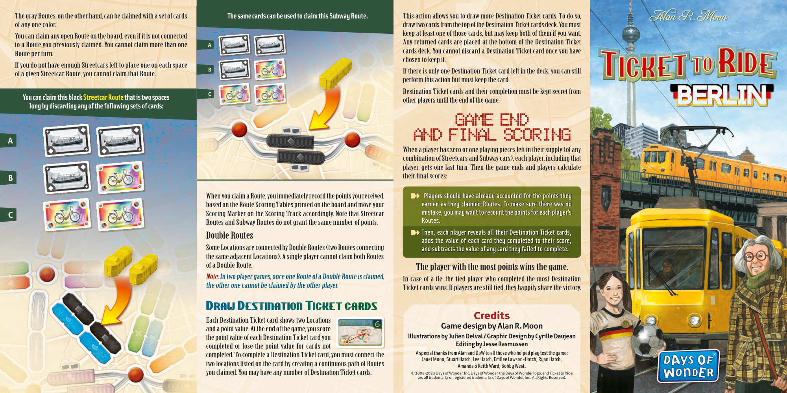
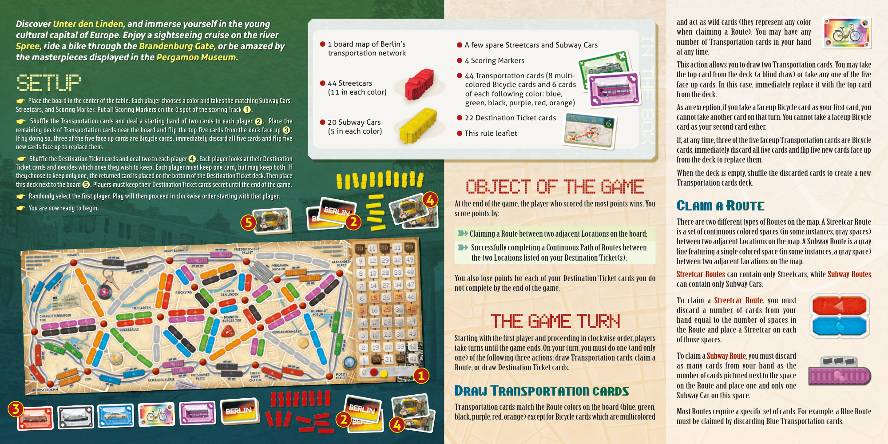

# Berlin

[Source PDF](rules.pdf) · [Map reference](berlin-map.png)

Parsed locally with pdf-inspector. Original page images preserve diagrams, tables, and layout; consult them where extraction is unclear.

## PDF page 1

The gray Routes, on the other hand, can be claimed with a set of cards **The same cards can be used to claim this Subway Route.** This action allows you to draw more Destination Ticket cards. To do so, of any one color. draw two cards from the top of the Destination Ticket cards deck. You must keep at least one of those cards, but may keep both of them if you want. You can claim any open Route on the board, even if it is not connected Any returned cards are placed at the bottom of the Destination Ticket to a Route you previously claimed. You cannot claim more than one You cannot claim more than one**A** cards deck. You cannot discard a Destination Ticket card once you have Route per turn. Route per turn. chosen to keep it. If you do not have enough Streetcars left to place one on each space **B** If there is only one Destination Ticket card left in the deck, you can still of a given Streetcar Route, you cannot claim that Route. perform this action but must keep the card. Destination Ticket cards and their completion must be kept secret from **C** **You can claim this black Streetcar Route that is two spaces** other players until the end of the game. **long by discarding any of the following sets of cards:**

# GAME END

**A**AND FINAL SCORING When a player has zero or one playing pieces left in their supply (of any combination of Streetcars and Subway cars), each player, including that player, gets one last turn. Then the game ends and players calculate their final scores: **B**

When you claim a Route, you immediately record the points you received, ➽**Players should have already accounted for the points they** based on the Route Scoring Tables printed on the board and move your**earned as they claimed Routes. To make sure there was no** Scoring Marker on the Scoring Track accordingly. Note that Streetcar**mistake, you may want to recount the points for each player’s** **C** **Routes.** Routes and Subway Routes do not grant the same number of points. ➽**Then, each player reveals all their Destination Ticket cards,**

## Double Routes Double Routes

**adds the value of each card they completed to their score,** Some Locations are connected by Double Routes (two Routes connecting**and subtracts the value of any card they failed to complete.** the same adjacent Locations). A single player cannot claim both Routes of a Double Route. The player with the most points wins the game. The player with the most points wins the game.

Note: In two player games, once one Route of a Double Route is claimed,

In case of a tie, the tied player who completed the most Destination the other one cannot be claimed by the other player. Ticket cards wins. If players are still tied, they happily share the victory.

### Draw Destination Ticket cards

Credits Each Destination Ticket card shows two Locations >ZOO >ZOO >BRANDENBURGER TOR >BRANDENBURGER TOR **Game design by Alan R. Moon** and a point value. At the end of the game, you score the point value of each Destination Ticket card you**Illustrations by Julien Delval / Graphic Design by Cyrille Daujean** **Editing by Jesse Rasmussen** completed or lose the point value for cards not **A special thanks from Alan and DoW to all those who helped play test the game:** completed. To complete a Destination Ticket card, you must connect the **Janet Moon, Stuart Hatch, Lee Hatch, Emilee Lawson-Hatch, Ryan Hatch,** two locations listed on the card by creating a continuous path of Routes**Amanda & Keith Ward, Bobby West.** you claimed. You may have any number of Destination Ticket cards. © 2004-2023 Days of Wonder, Inc. Days of Wonder, the Days of Wonder logo, and Ticket to Ride are all trademarks or registered trademarks of Days of Wonder, Inc. All Rights Reserved.

## PDF page 2

*Discover Unter den Linden, and immerse yourself in the young*and act as wild cards (they represent any color when claiming a Route). You may have any _cultural capital of Europe. Enjoy a sightseeing cruise on the river_

- 1 board map of Berlin’snumber of Transportation cards in your hand
  *Spree, ride a bike through the Brandenburg Gate, or be amazed by*● A few spare Streetcars and Subway Cars transportation networkat any time. _the masterpieces displayed in the Pergamon Museum._

- 4 Scoring Markers
  This action allows you to draw two Transportation cards. You may take

- 44 Transportation cards (8 multi-the top card from the deck (a blind draw) or take any one of the five
- 44 Streetcars colored Bicycle cards and 6 cards face up cards. In this case, immediately replace it with the top card

# SETUP(11 in each color)

of each following color: blue,from the deck. ☛**Place the board in the center of the table. Each player chooses a color and takes the matching Subway Cars,** green, black, purple, red, orange) **Streetcars, and Scoring Marker. Put all Scoring Markers on the 0 spot of the scoring Track**➊. As an exception, if you take a faceup Bicycle card as your first card, you >ZOO >ZOO

- 22 Destination Ticket cards cannot take another card on that turn. You cannot take a faceup Bicycle
  ☛**Shuffle the Transportation cards and deal a starting hand of two cards to each player**➋**. Place the** ● 20 Subway Cars>BRANDENBURGER TOR >BRANDENBURGER TOR card as your second card either. **remaining deck of Transportation cards near the board and flip the top five cards from the deck face up**➌**.** (5 in each color)

- This rule leaflet
  **If by doing so, three of the five face up cards are Bicycle cards, immediately discard all five cards and flip five**If, at any time, three of the five faceup Transportation cards are Bicycle

## In the box

**new cards face up to replace them.** cards, immediately discard all five cards and flip five new cards face up ☛**Shuffle the Destination Ticket cards and deal two to each player**➍**. Each player looks at their Destination**from the deck to replace them. **Ticket cards and decides which ones they wish to keep. Each player must keep one card, but may keep both. If** When the deck is empty, shuffle the discarded cards to create a new **they choose to keep only one, the returned card is placed on the bottom of the Destination Ticket deck. Then place** **this deck next to the board**➎**. Players must keep their Destination Ticket cards secret until the end of the game.**Transportation cards deck.

### OBJECT OF THE GAME

☛**Randomly select the first player. Play will then proceed in clockwise order starting with that player.** **4** At the end of the game, the player who scored the most points wins. You ☛**You are now ready to begin.** Claim a Route score points by: **5 2** There are two different types of Routes on the map. A Streetcar Route is a set of continuous colored spaces (in some instances, gray spaces) ➽ Claiming a Route between two adjacent Locations on the board; between two adjacent Locations on the map. A Subway Route is a gray ➽ Successfully completing a Continuous Path of Routes between line featuring a single colored space (in some instances, a gray space) the two Locations listed on your Destination Ticket(s); between two adjacent Locations on the map. Streetcar Routes Streetcar Routes can contain only Streetcars, while Subway Routes Subway Routes You also lose points for each of your Destination Ticket cards you do can contain only Subway Cars. not complete by the end of the game. To claim a Streetcar Route Streetcar Route, you must discard a number of cards from your hand equal to the number of spaces in

### THE GAME TURN

the Route and place a Streetcar on each Starting with the first player and proceeding in clockwise order, players of those spaces. take turns until the game ends. On your turn, you must do one (and only one) of the following three actions: draw Transportation cards, claim a To claim a Subway Route Subway Route, you must discard Route, or draw Destination Ticket cards. as many cards from your hand as the **1** number of cards pictured next to the space on the Route and place one and only one Draw Transportation cards Subway Car on this space. Transportation cards match the Route colors on the board (blue, green, Most Routes require a specific set of cards. For example, a Blue Route black, purple, red, orange) except for Bicycle cards which are multicolored must be claimed by discarding Blue Transportation cards.

