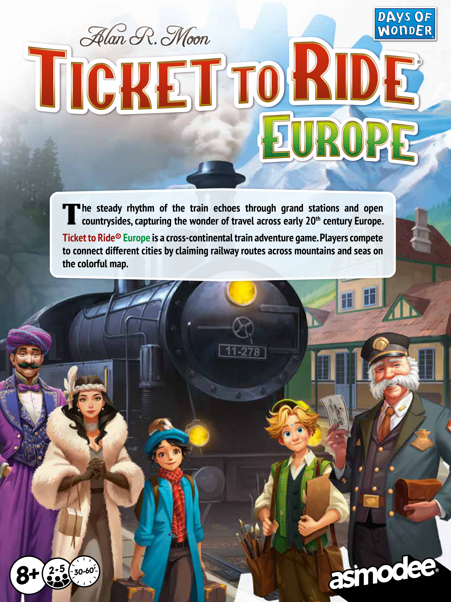
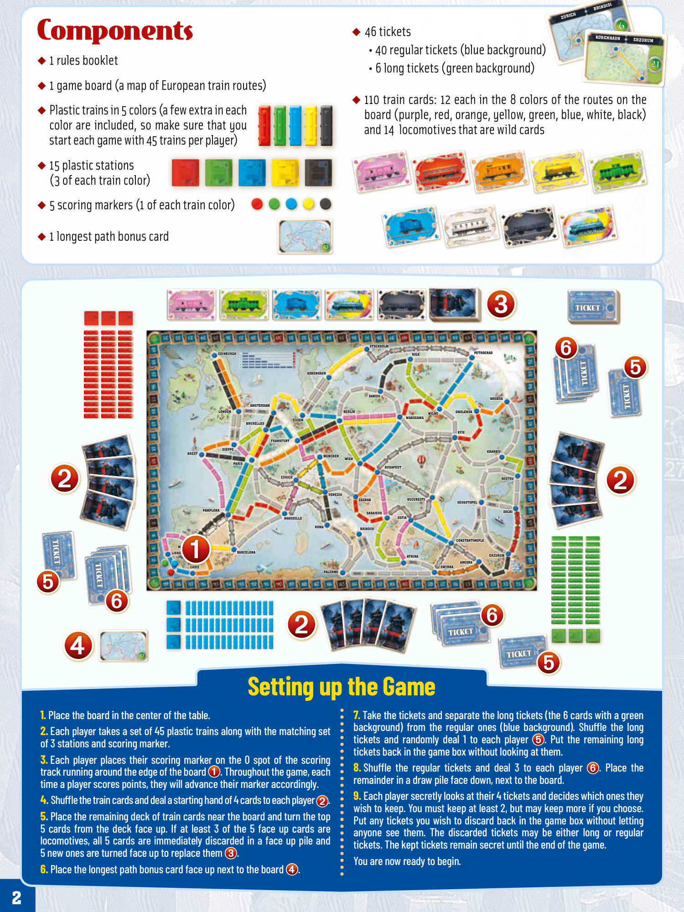
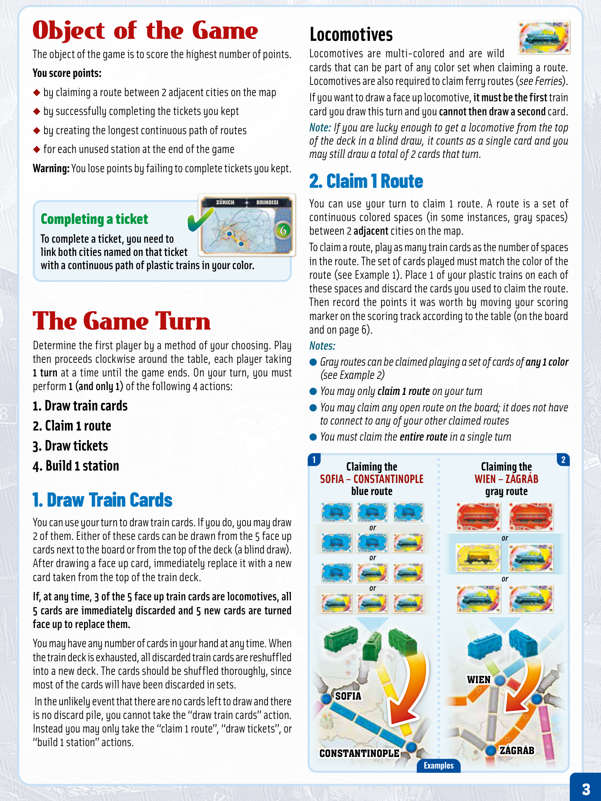
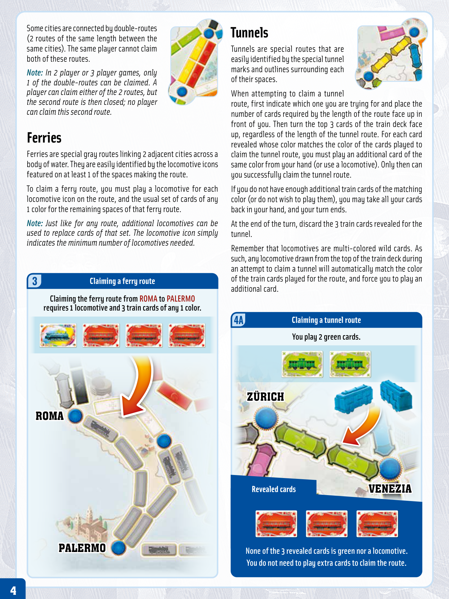

# Europe

[Source PDF](rules.pdf) · [Map reference](map.png) · [Map image source](https://www.spellenwinkel.nl/en-WW/p/ticket-to-ride-europe-nl/9065291)

Parsed locally with pdf-inspector. Original page images preserve diagrams, tables, and layout; consult them where extraction is unclear.

## PDF page 1

## he steady rhythm of the train echoes through grand stations and open

# Tcountrysides, capturing the wonder of travel across early 20th century Europe.

## Ticket to Ride® Europe is a cross-continental train adventure game. Players compete

**to connect different cities by claiming railway routes across mountains and seas on the colorful map.**

2 530-60’ +

## PDF page 2

# Components

#### ◆ 1 rules booklet

◆ 1 game board (a map of European train routes)

◆ Plastic trains in 5 colors (a few extra in each color are included, so make sure that you

### start each game with 45 trains per player)

◆ 15 plastic stations

### (3 of each train color)

◆ 5 scoring markers (1 of each train color)

◆ 46 ticketsKKØØBENHAVN BENHAVN ERZURUM ERZURUM

- 40 regular tickets (blue background) • 6 long tickets (green background)
  ◆

### 110 train cards: 12 each in the 8 colors of the routes on the

board (purple, red, orange, yellow, green, blue, white, black) and 14 locomotives that are wild cards

◆ 1 longest path bonus card **10**

STOCKHOLM STOCKHOLM EDINBURGH EDINBURGH 12 3 4 4 2 1 7 RIGA RIGA PETROGRAD PETROGRAD 6 8 1521 KKØØBENHAVN BENHAVN

DANZIG DANZIG MOSKVA MOSKVA AMSTERDAM AMSTERDAM LONDON LONDON ESSEN ESSEN BERLIN BERLIN WARSZAWA WARSZAWA WILNO WILNO SMOLENSK SMOLENSK BRUXELLES BRUXELLES KYÏV KYÏV FRANKFURT FRANKFURT BREST BREST DIEPPE DIEPPE MÜNCHEN MÜNCHEN WIEN WIEN KHARKIV KHARKIV PARIS PARIS BUDAPEST BUDAPEST ZÜRICH ZÜRICH ROSTOV ROSTOV

VENEZIA VENEZIA ZZÁÁGR GRÁÁBB BUCURESTI BUCURESTI SEVASTOPOL SEVASTOPOL PAMPLONA PAMPLONA SARAJEVO SARAJEVO SOCHI SOCHI MARSEILLE MARSEILLE SOFIA SOFIA ROMA ROMA BRINDISI BRINDISI

MADRID MADRID CONSTANTINOPLE CONSTANTINOPLE LISBOA LISBOA BARCELONA BARCELONA ATH ATHÍÍNA NA ERZURUM ERZURUM CCÁÁDIZ DIZ SMYRNA SMYRNA ANGORA ANGORA PALERMO PALERMO

## Setting up the Game

**10**

**1. Place the board in the center of the table.**
**2. Each player takes a set of 45 plastic trains along with the matching set** **of 3 stations and scoring marker.**
**3. Each player places their scoring marker on the 0 spot of the scoring** **track running around the edge of the board. Throughout the game, each** **time a player scores points, they will advance their marker accordingly.**

#### 4. Shuffle the train cards and deal astarting hand of 4 cards to each player.

**5. Place the remaining deck of train cards near the board and turn the top** **5 cards from the deck face up. If at least 3 of the 5 face up cards are** **locomotives, all 5 cards are immediately discarded in a face up pile and** **5 new ones are turned face up to replace them.**

#### 6. Place the longest path bonus card face up next to the board.

**7. Take the tickets and separate the long tickets (the 6 cards with a green** **background) from the regular ones (blue background). Shuffle the long** **tickets and randomly deal 1 to each player. Put the remaining long** **tickets back in the game box without looking at them.**

#### 8. Shuffle the regular tickets and deal 3 to each player. Place the

**remainder in a draw pile face down, next to the board.**

**9. Each player secretly looks at their 4 tickets and decides which ones they** **wish to keep. You must keep at least 2, but may keep more if you choose.** **Put any tickets you wish to discard back in the game box without letting** **anyone see them. The discarded tickets may be either long or regular** **tickets. The kept tickets remain secret until the end of the game.** **You are now ready to begin.**

## PDF page 3

# Object of the Game

The object of the game is to score the highest number of points. **You score points:** ◆ by claiming a route between 2 adjacent cities on the map ◆ by successfully completing the tickets you kept ◆ by creating the longest continuous path of routes ◆ for each unused station at the end of the game

**Warning:** You lose points by failing to complete tickets you kept.

### Completing a ticket

#### To complete a ticket, you need to link both cities named on that ticket

#### with a continuous path of plastic trains in your color.

# The Game Turn

Determine the first player by a method of your choosing. Play then proceeds clockwise around the table, each player taking **1 turn** at a time until the game ends. On your turn, you must perform **1 (and only 1)** of the following 4 actions:

### 1. Draw train cards 2. Claim 1 route

### 3. Draw tickets 4. Build 1 station

## 1. Draw Train Cards

You can use your turn to draw train cards. If you do, you may draw 2 of them. Either of these cards can be drawn from the 5 face up cards next to the board or from the top of the deck (a blind draw). After drawing a face up card, immediately replace it with a new card taken from the top of the train deck.

#### If, at any time, 3 of the 5 face up train cards are locomotives, all

**5 cards are immediately discarded and 5 new cards are turned face up to replace them.**

You may have any number of cards in your hand at any time. When the train deck is exhausted, all discarded train cards are reshuffled into a new deck. The cards should be shuffled thoroughly, since most of the cards will have been discarded in sets. In the unlikely event that there are no cards left to draw and there is no discard pile, you cannot take the “draw train cards” action. Instead you may only take the “claim 1 route”, “draw tickets”, or “build 1 station” actions.

## Locomotives

Locomotives are multi-colored and are wild cards that can be part of any color set when claiming a route. Locomotives are also required to claim ferry routes (_see Ferries_). If you want to draw a face up locomotive, **it must be the first** train card you draw this turn and you **cannot then draw a second** card.

_Note: If you are lucky enough to get a locomotive from the top_

_of the deck in a blind draw, it counts as a single card and you_ _may still draw a total of 2 cards that turn._

## 2. Claim 1 Route

You can use your turn to claim 1 route. A route is a set of continuous colored spaces (in some instances, gray spaces) between 2 **adjacent** cities on the map. To claim a route, play as many train cards as the number of spaces in the route. The set of cards played must match the color of the route (see Example 1). Place 1 of your plastic trains on each of these spaces and discard the cards you used to claim the route. Then record the points it was worth by moving your scoring marker on the scoring track according to the table (on the board and on page 6). _Notes:_ ● _Gray routes can be claimed playing a set of cards of any 1 color_

- _You may only (see Example 2)claim 1 route on your turn_ ● _You may cl_
- _You must claim the aim any open route on the board; it does not have entire route in a single turn_ _to connect to any of your other claimed routes_ **1 2** **Claiming the Claiming the** **SOFIA – CONSTANTINOPLE WIEN – ZÁGRÁB blue route gray route**
  _or_ _or_

_or_

_or_ _or_

**WIEN WIEN** **SOFIA SOFIA**

**CONSTANTINOPLE CONSTANTINOPLE ZÁGRÁB ZÁGRÁB** **Examples**

## PDF page 4

Some cities are connected by double-routes (2 routes of the same length between the same cities). The same player cannot claim both of these routes.

_Note: In 2 player or 3 player games, only_

_1 of the double-routes can be claimed. A_ _player can claim either of the 2 routes, but_ _the second route is then closed; no player_ _can claim this second route._

# Ferries

Ferries are special gray routes linking 2 adjacent cities across a body of water. They are easily identified by the locomotive icons featured on at least 1 of the spaces making the route.

To claim a ferry route, you must play a locomotive for each locomotive icon on the route, and the usual set of cards of any 1 color for the remaining spaces of that ferry route.

_Note: Just like for any route, additional locomotives can be_

_used to replace cards of that set. The locomotive icon simply_ _indicates the minimum number of locomotives needed._

# Tunnels

Tunnels are special routes that are easily identified by the special tunnel marks and outlines surrounding each of their spaces.

When attempting to claim a tunnel route, first indicate which one you are trying for and place the number of cards required by the length of the route face up in front of you. Then turn the top 3 cards of the train deck face up, regardless of the length of the tunnel route. For each card revealed whose color matches the color of the cards played to claim the tunnel route, you must play an additional card of the same color from your hand (or use a locomotive). Only then can you successfully claim the tunnel route.

If you do not have enough additional train cards of the matching color (or do not wish to play them), you may take all your cards back in your hand, and your turn ends.

At the end of the turn, discard the 3 train cards revealed for the tunnel.

Remember that locomotives are multi-colored wild cards. As such, any locomotive drawn from the top of the train deck during an attempt to claim a tunnel will automatically match the color of the train cards played for the route, and force you to play an additional card. **3 Claiming a ferry route**

**Claiming the ferry route from ROMA to PALERMO requires 1 locomotive and 3 train cards of any 1 color.**

## ROMA ROMA

## PALERMO PALERMO

### 4A Claiming a tunnel route

### You play 2 green cards.

## ZÜRICH ZÜRICH

### Revealed cards VENEZIA VENEZIA

### None of the 3 revealed cards is green nor a locomotive.

### You do not need to play extra cards to claim the route.

