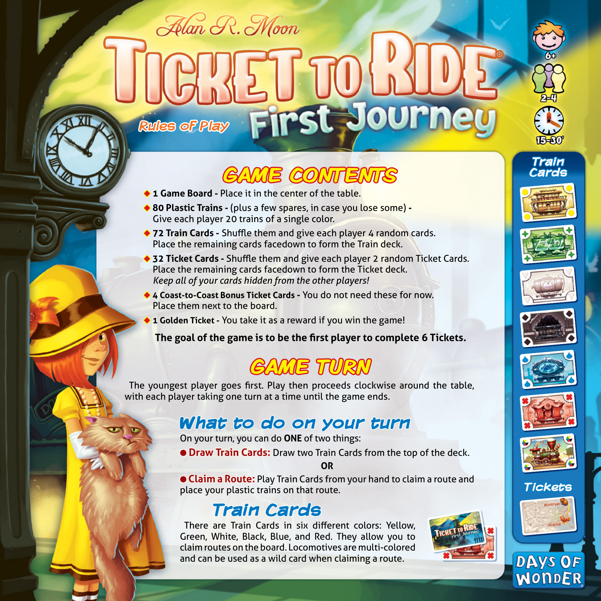
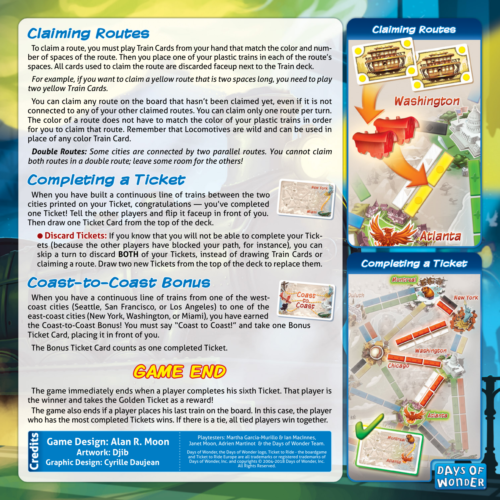

# First Journey Usa

[Source PDF](rules.pdf) · [Map reference](first-journey-usa-map.png)

Parsed locally with pdf-inspector. Original page images preserve diagrams, tables, and layout; consult them where extraction is unclear.

## PDF page 1

### Rules of Play Rules of Play

#### Train Train Cards Cards

# GAME CONTENTS GAME CONTENTS

◆◆ **1 Game Board -**Place it in the center of the table. ◆◆ **80 Plastic Trains -**(plus a few spares, in case you lose some)**-** Give each player 20 trains of a single color. ◆◆ **72 Train Cards -** Shuffle them and give each player 4 random cards. Place the remaining cards facedown to form the Train deck. ◆◆ **32 Ticket Cards -**Shuffle them and give each player 2 random Ticket Cards. Place the remaining cards facedown to form the Ticket deck. _Keep all of your cards hidden from the other players!_ ◆◆ **4 Coast-to-Coast Bonus Ticket Cards -** You do not need these for now. Place them next to the board. ◆◆ **1 Golden Ticket -** You take it as a reward if you win the game!

##### The goal of the game is to be the first player to complete 6 Tickets.

# GAME TURN GAME TURN

The youngest player goes first. Play then proceeds clockwise around the table, with each player taking one turn at a time until the game ends.

## What to do on your turn What to do on your turn

On your turn, you can do **ONE** of two things: ●● **Draw Train Cards: Draw Train Cards:** Draw two Train Cards from the top of the deck. **OR** ●● **Claim a Route: Claim a Route:** Play Train Cards from your hand to claim a route and

#### Tickets Tickets

place your plastic trains on that route.

## Train Cards Train Cards

There are Train Cards in six different colors: Yellow, Green, White, Black, Blue, and Red. They allow you to claim routes on the board. Locomotives are multi-colored and can be used as a wild card when claiming a route.

## PDF page 2

#### Claiming Routes Claiming Routes

## Claiming Routes Claiming Routes

To claim a route, you must play Train Cards from your hand that match the color and num- ber of spaces of the route. Then you place one of your plastic trains in each of the route’s spaces. All cards used to claim the route are discarded faceup next to the Train deck.

_For example, if you want to claim a yellow route that is two spaces long, you need to play_ _two yellow Train Cards._

You can claim any route on the board that hasn’t been claimed yet, even if it is not connected to any of your other claimed routes. You can claim only one route per turn. The color of a route does not have to match the color of your plastic trains in order for you to claim that route. Remember that Locomotives are wild and can be used in place of any color Train Card.

**\*Double Routes:** Some cities are connected by two parallel routes. You cannot claim\* _both routes in a double route; leave some room for the others!_

## Completing a Ticket Completing a Ticket

When you have built a continuous line of trains between the two cities printed on your Ticket, congratulations — you’ve completed one Ticket! Tell the other players and flip it faceup in front of you. Then draw one Ticket Card from the top of the deck.

●● **Discard Tickets: Discard Tickets:** If you know that you will not be able to complete your Tickets (because the other players have blocked your path, for instance), you can skip a turn to discard **BOTH** of your Tickets, instead of drawing Train Cards or claiming a route. Draw two new Tickets from the top of the deck to replace them. **Completing a Ticket Completing a Ticket**

## Coast-to-Coast Bonus Coast-to-Coast Bonus

When you have a continuous line of trains from one of the west- coast cities (Seattle, San Francisco, or Los Angeles) to one of the east-coast cities (New York, Washington, or Miami), you have earned the Coast-to-Coast Bonus! You must say “Coast to Coast!” and take one Bonus Ticket Card, placing it in front of you.

The Bonus Ticket Card counts as one completed Ticket.

# GAME END GAME END

The game immediately ends when a player completes his sixth Ticket. That player is the winner and takes the Golden Ticket as a reward! The game also ends if a player places his last train on the board. In this case, the player who has the most completed Tickets wins. If there is a tie, all tied players win together.

Playtesters: Martha Garcia-Murillo & Ian MacInnes,

#### Game Design: Alan R. Moon Janet Moon, Adrien Martinot & the Days of Wonder Team.

**Artwork: Djib**Days of Wonder, the Days of Wonder logo, Ticket to Ride-the boardgame and Ticket to Ride Europe are all trademarks or registered trademarks of Days of Wonder, Inc. and copyrights © 2004-2018 Days of Wonder, Inc. **Graphic Design: Cyrille Daujean** All Rights Reserved.

### Credits Credits

