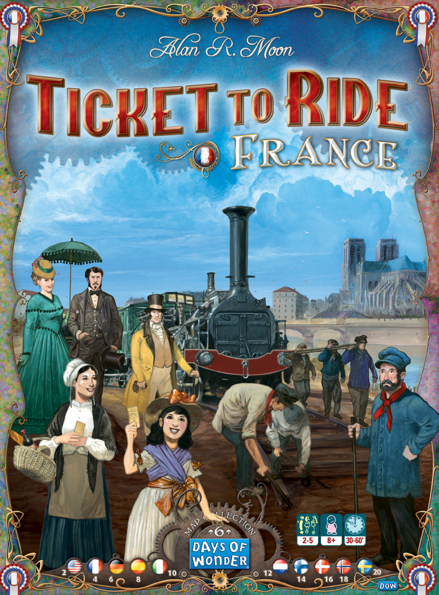
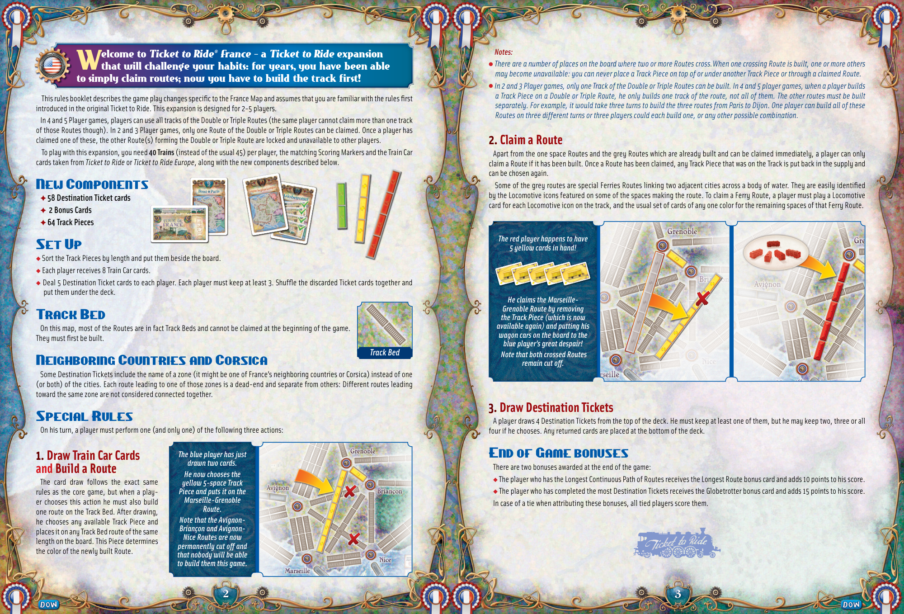
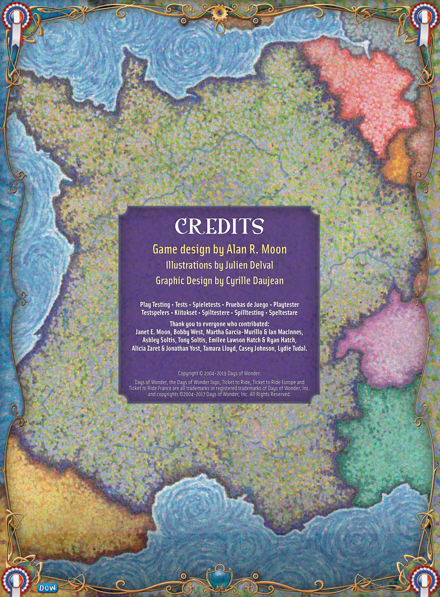

# France

[Source PDF](rules.pdf) · [Map reference](france-map.png)

Parsed locally with pdf-inspector. Original page images preserve diagrams, tables, and layout; consult them where extraction is unclear.

## PDF page 1

The parser returned no text for this page. Refer to the page image below.

## PDF page 2

This rules booklet describes the game play changes specific to the France Map and assumes that you are familiar with the rules first introduced in the original Ticket to Ride. This expansion is designed for 2-5 players. In 4 and 5 Player games, players can use all tracks of the Double or Triple Routes (the same player cannot claim more than one track of those Routes though). In 2 and 3 Player games, only one Route of the Double or Triple Routes can be claimed. Once a player has claimed one of these, the other Route(s) forming the Double or Triple Route are locked and unavailable to other players. To play with this expansion, you need **40 Trains** (instead of the usual 45) per player, the matching Scoring Markers and the Train Car cards taken from _Ticket to Ride_ or _Ticket to Ride Europe_, along with the new components described below.

# New Components

✦ **58 Destination Ticket cards** ✦ **2 Bonus Cards** ✦ **64 Track Pieces**

# Set Up

u Sort the Track Pieces by length and put them beside the board. u Each player receives 8 Train Car cards. u Deal 5 Destination Ticket cards to each player. Each player must keep at least 3. Shuffle the discarded Ticket cards together and put them under the deck.

# Track Bed

On this map, most of the Routes are in fact Track Beds and cannot be claimed at the beginning of the game. They must first be built.

## Track Bed

# Neighboring Countries and Corsica

Some Destination Tickets include the name of a zone (it might be one of France’s neighboring countries or Corsica) instead of one (or both) of the cities. Each route leading to one of those zones is a dead-end and separate from others: Different routes leading toward the same zone are not considered connected together.

# Special Rules

On his turn, a player must perform one (and only one) of the following three actions:

# 1. Draw Train Car Cards

_The blue player has just_ _drawn two cards._

# and Build a Route

The card draw follows the exact same _He now chooses the_ rules as the core game, but when a play-_yellow 5-space Track_ er chooses this action he must also build _Piece and puts it on the_ one route on the Track Bed. After drawing, _Marseille-Grenoble_ he chooses any available Track Piece and _Route._ places it on any Track Bed route of the same _Note that the Avignon-_ length on the board. This Piece determines _Briançon and Avignon-Nice Routes are now_ the color of the newly built Route. _permanently cut off and_ _that nobody will be able_ _to build them this game._

_Notes:_

- _There are a number of places on the board where two or more Routes cross.When one crossing Route is built, one or more others_ _may become unavailable: you can never place a Track Piece on top of or under another Track Piece or through a claimed Route._
- _In 2 and 3 Player games, only one Track of the Double or Triple Routes can be built. In 4 and 5 player games, when a player builds_ _a Track Piece on a Double or Triple Route, he only builds one track of the route, not all of them. The other routes must be built_ _separately. For example, it would take three turns to build the three routes from Paris to Dijon. One player can build all of these_ _Routes on three different turns or three players could each build one, or any other possible combination._

# 2. Claim a Route

Apart from the one space Routes and the grey Routes which are already built and can be claimed immediately, a player can only claim a Route if it has been built. Once a Route has been claimed, any Track Piece that was on the Track is put back in the supply and can be chosen again. Some of the grey routes are special Ferries Routes linking two adjacent cities across a body of water. They are easily identified by the Locomotive icons featured on some of the spaces making the route. To claim a Ferry Route, a player must play a Locomotive card for each Locomotive icon on the track, and the usual set of cards of any one color for the remaining spaces of that Ferry Route.

_The red player happens to have_ _5 yellow cards in hand!_

_He claims the Marseille-Grenoble Route by removing_ _the Track Piece (which is now_ _available again) and putting his_ _wagon cars on the board to the_ _blue player’s great despair!_ _Note that both crossed Routes_ _remain cut off._

# 3. Draw Destination Tickets

A player draws 4 Destination Tickets from the top of the deck. He must keep at least one of them, but he may keep two, three or all four if he chooses. Any returned cards are placed at the bottom of the deck.

# End of Game bonuses

There are two bonuses awarded at the end of the game: uThe player who has the Longest Continuous Path of Routes receives the Longest Route bonus card and adds 10 points to his score. uThe player who has completed the most Destination Tickets receives the Globetrotter bonus card and adds 15 points to his score. In case of a tie when attributing these bonuses, all tied players score them.

## PDF page 3

# CREDITS

## Game design by Alan R. Moon

### Illustrations by Julien Delval Graphic Design by Cyrille Daujean

**Play Testing • Tests • Spieletests • Pruebas de Juego • Playtester** **Testspelers • Kiitokset • Spiltestere • Spilltesting • Speltestare** **Thank you to everyone who contributed:** **Janet E. Moon, Bobby West, Martha Garcia-Murillo & Ian MacInnes,** **Ashley Soltis, Tony Soltis, Emilee Lawson Hatch & Ryan Hatch,** **Alicia Zaret & Jonathan Yost, Tamara Lloyd, Casey Johnson, Lydie Tudal.**

Copyright © 2004-2019 Days of Wonder. Days of Wonder, the Days of Wonder logo, Ticket to Ride, Ticket to Ride Europe and Ticket to Ride France are all trademarks or registered trademarks of Days of Wonder, Inc. and copyrights ©2004-2017 Days of Wonder, Inc. All Rights Reserved.

