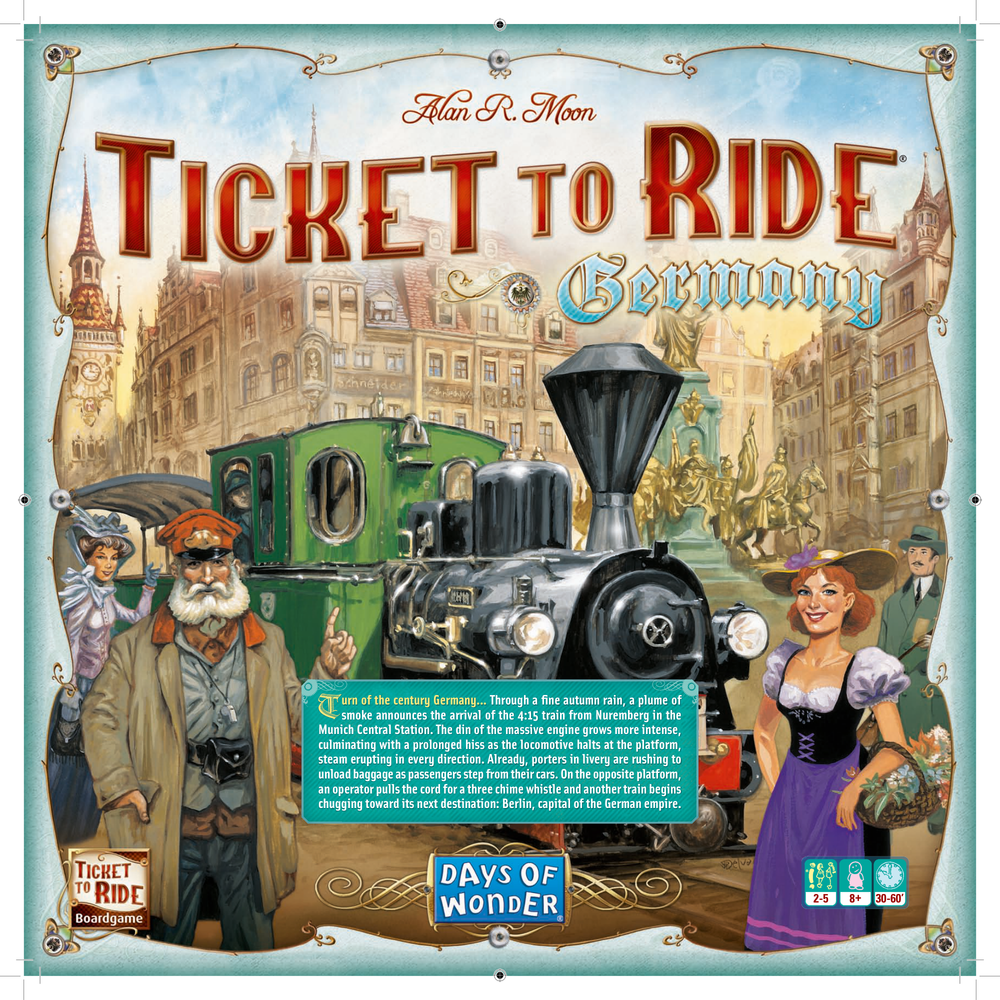
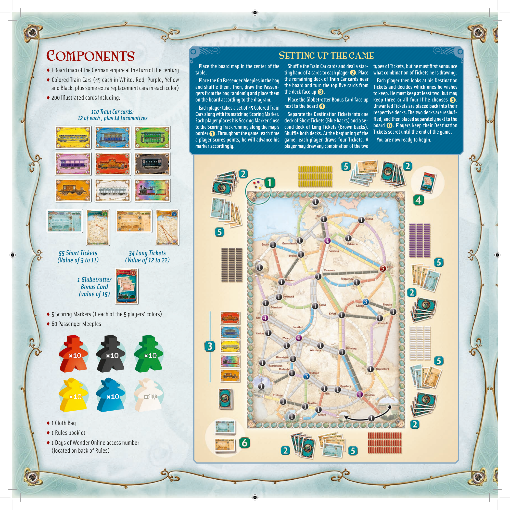
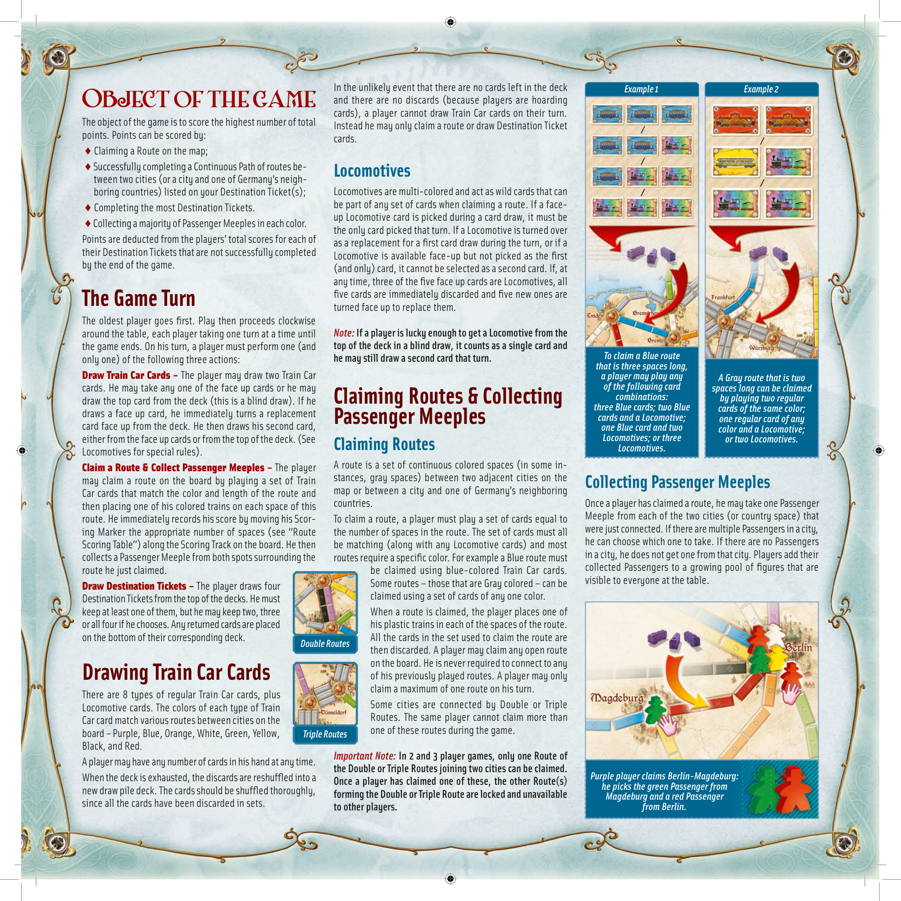
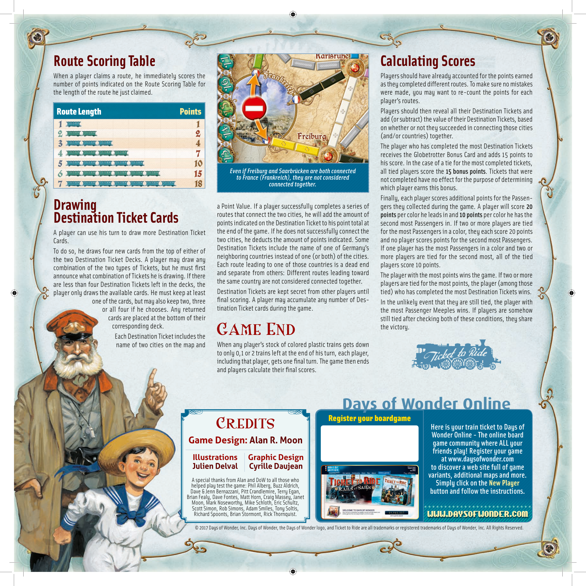

# Germany

[Source PDF](rules.pdf) · [Map reference](germany-map.png)

Parsed locally with pdf-inspector. Original page images preserve diagrams, tables, and layout; consult them where extraction is unclear.

## PDF page 1

## urn of the century Germany... Through a fi ne autumn rain, a plume of

# Tsmoke announces the arrival of the 4:15 train from Nuremberg in the

**Munich Central Station. The din of the massive engine grows more intense,** **culminating with a prolonged hiss as the locomotive halts at the platform,** **steam erupting in every direction. Already, porters in livery are rushing to** **unload baggage as passengers step from their cars. On the opposite platform,** **an operator pulls the cord for a three chime whistle and another train begins** **chugging toward its next destination: Berlin, capital of the German empire.**

**2-5 30-60’8 +**

## PDF page 2

# Components

♦ 1 Board map of the German empire at the turn of the century

♦ Colored Train Cars (45 each in White, Red, Purple, Yellow and Black, plus some extra replacement cars in each color)

#### ♦ 200 Illustrated cards including:

_110 Train Car cards:_ _12 of each, plus 14 Locomotives_

_55 Short Tickets 34 Long Tickets (Value of 3 to 11) (Value of 12 to 22)_

### 1 Globetrotter Bonus Card (value of 15)

♦ 5 Scoring Markers (1 each of the 5 players' colors)

#### ♦ 60 Passenger Meeples

## Setting up the game

**Place the board map in the center of the Shuffl e the Train Car cards and deal a star-types of Tickets, but he must fi rst announce** **table. ting hand of 4 cards to each player. Place what combination of Tickets he is drawing.** ➋ **Place the 60 Passenger Meeples in the bag the remaining deck of Train Car cards near Each player then looks at his Destination** **and shuffl e them. Then, draw the Passen-the board and turn the top fi ve cards from Tickets and decides which ones he wishes** **gers from the bag randomly and place them the deck face up**➌**.** **to keep. He must keep at least two, but may** **on the board according to the diagram. Place the Globetrotter Bonus Card face up keep three or all four if he chooses .** ➎ **Each player takes a set of 45 Colored Train next to the board**➍**. Unwanted Tickets are placed back into their** **Cars along with its matching Scoring Marker. Separate the Destination Tickets into one respective decks. The two decks are reshuf-Each player places his Scoring Marker close deck of Short Tickets (Blue backs) and a se-fl ed, and then placed separately next to the** **to the Scoring Track running along the map’s cond deck of Long Tickets (Brown backs). board**➏**. Players keep their Destination** **border**➊**. Throughout the game, each time Shuffl e both decks. At the beginning of the Tickets secret until the end of the game.** **a player scores points, he will advance his game, each player draws four Tickets. A You are now ready to begin.** **marker accordingly.** **player may draw any combination of the two**

#### ♦ 1 Cloth Bag

#### ♦ 1 Rules booklet

♦ 1 Days of Wonder Online access number (located on back of Rules)

## PDF page 3

In the unlikely event that there are no cards left in the deck _Example 1 Example 2_ and there are no discards (because players are hoarding cards), a player cannot draw Train Car cards on their turn. Instead he may only claim a route or draw Destination Ticket **/** cards. **/**

**/**

### Locomotives

**/** Locomotives are multi-colored and act as wild cards that can **/** be part of any set of cards when claiming a route. If a face-up Locomotive card is picked during a card draw, it must be the only card picked that turn. If a Locomotive is turned over as a replacement for a fi rst card draw during the turn, or if a Locomotive is available face-up but not picked as the fi rst (and only) card, it cannot be selected as a second card. If, at any time, three of the fi ve face up cards are Locomotives, all fi ve cards are immediately discarded and fi ve new ones are turned face up to replace them.

_Note:_ **If a player is lucky enough to get a Locomotive from the**

#### top of the deck in a blind draw, it counts as a single card and

#### he may still draw a second card that turn.

## Object of the game

The object of the game is to score the highest number of total points. Points can be scored by: ♦ Claiming a Route on the map; ♦ Successfully completing a Continuous Path of routes between two cities (or a city and one of Germany’s neighboring countries) listed on your Destination Ticket(s); ♦ Completing the most Destination Tickets. ♦ Collecting a majority of Passenger Meeples in each color. Points are deducted from the players’ total scores for each of their Destination Tickets that are not successfully completed by the end of the game.

# The Game Turn

The oldest player goes fi rst. Play then proceeds clockwise around the table, each player taking one turn at a time until the game ends. On his turn, a player must perform one (and only one) of the following three actions: **Draw Train Car Cards –** The player may draw two Train Car cards. He may take any one of the face up cards or he may draw the top card from the deck (this is a blind draw). If he draws a face up card, he immediately turns a replacement card face up from the deck. He then draws his second card, either from the face up cards or from the top of the deck. (See Locomotives for special rules). **Claim a Route & Collect Passenger Meeples –** The player may claim a route on the board by playing a set of Train Car cards that match the color and length of the route and then placing one of his colored trains on each space of this route. He immediately records his score by moving his Scoring Marker the appropriate number of spaces (see “Route Scoring Table”) along the Scoring Track on the board. He then collects a Passenger Meeple from both spots surrounding the route he just claimed. **Draw Destination Tickets –** The player draws four Destination Tickets from the top of the decks. He must keep at least one of them, but he may keep two, three or all four if he chooses. Any returned cards are placed on the bottom of their corresponding deck.

# Claiming Routes & Collecting Passenger Meeples

### Claiming Routes

A route is a set of continuous colored spaces (in some in- stances, gray spaces) between two adjacent cities on the map or between a city and one of Germany’s neighboring countries. To claim a route, a player must play a set of cards equal to the number of spaces in the route. The set of cards must all be matching (along with any Locomotive cards) and most routes require a specifi c color. For example a Blue route must be claimed using blue-colored Train Car cards. Some routes – those that are Gray colored – can be claimed using a set of cards of any one color. When a route is claimed, the player places one of his plastic trains in each of the spaces of the route. All the cards in the set used to claim the route are then discarded. A player may claim any open route on the board. He is never required to connect to any of his previously played routes. A player may only claim a maximum of one route on his turn. Some cities are connected by Double or Triple Routes. The same player cannot claim more than

_To claim a Blue route_ _that is three spaces long,_ _a player may play any A Gray route that is two_ _of the following card spaces long can be claimed_ _combinations: by playing two regular_ _three Blue cards; two Blue cards of the same color;_ _cards and a Locomotive; one regular card of any_ _one Blue card and two_ _color and a Locomotive;_ _Locomotives; or three_ _or two Locomotives._ _Locomotives._

# Drawing Train Car Cards

There are 8 types of regular Train Car cards, plus Locomotive cards. The colors of each type of Train Car card match various routes between cities on the

Black, and Red. A player may have any number of cards in his hand at any time. When the deck is exhausted, the discards are reshuffl ed into a new draw pile deck. The cards should be shuffl ed thoroughly, since all the cards have been discarded in sets.

_Important Note:_ **In 2 and 3 player games, only one Route of** **the Double or Triple Routes joining two cities can be claimed.** **Once a player has claimed one of these, the other Route(s)** **forming the Double or Triple Route are locked and unavailable to other players.**

### Collecting Passenger Meeples

Once a player has claimed a route, he may take one Passenger Meeple from each of the two cities (or country space) that were just connected. If there are multiple Passengers in a city, he can choose which one to take. If there are no Passengers in a city, he does not get one from that city. Players add their collected Passengers to a growing pool of fi gures that are visible to everyone at the table.

_Purple player claims Berlin-Magdeburg:_ _he picks the green Passenger from_ _Magdeburg and a red Passenger_ _from Berlin._

_Double Routes_

one of these routes during the game. board – Purple, Blue, Orange, White, Green, Yellow, _Triple Routes_

## PDF page 4

## Route Scoring Table

When a player claims a route, he immediately scores the number of points indicated on the Route Scoring Table for the length of the route he just claimed.

##### Route Length Points

## Drawing Destination Ticket Cards

A player can use his turn to draw more Destination Ticket Cards. To do so, he draws four new cards from the top of either of the two Destination Ticket Decks. A player may draw any combination of the two types of Tickets, but he must fi rst announce what combination of Tickets he is drawing. If there are less than four Destination Tickets left in the decks, the player only draws the available cards. He must keep at least one of the cards, but may also keep two, three or all four if he chooses. Any returned cards are placed at the bottom of their corresponding deck. Each Destination Ticket includes the name of two cities on the map and

_Even if Freiburg and Saarbrücken are both connected_ _to France (Frankreich), they are not considered_ _connected together._

a Point Value. If a player successfully completes a series of routes that connect the two cities, he will add the amount of points indicated on the Destination Ticket to his point total at the end of the game. If he does not successfully connect the two cities, he deducts the amount of points indicated. Some Destination Tickets include the name of one of Germany’s neighboring countries instead of one (or both) of the cities. Each route leading to one of those countries is a dead end and separate from others: Different routes leading toward the same country are not considered connected together. Destination Tickets are kept secret from other players until fi nal scoring. A player may accumulate any number of Destination Ticket cards during the game.

### Game End

When any player’s stock of colored plastic trains gets down to only 0,1 or 2 trains left at the end of his turn, each player, including that player, gets one fi nal turn. The game then ends and players calculate their fi nal scores.

## Calculating Scores

Players should have already accounted for the points earned as they completed different routes. To make sure no mistakes were made, you may want to re-count the points for each player’s routes. Players should then reveal all their Destination Tickets and add (or subtract) the value of their Destination Tickets, based on whether or not they succeeded in connecting those cities (and/or countries) together. The player who has completed the most Destination Tickets receives the Globetrotter Bonus Card and adds 15 points to his score. In the case of a tie for the most completed tickets, all tied players score the **15 bonus points**. Tickets that were not completed have no effect for the purpose of determining which player earns this bonus. Finally, each player scores additional points for the Passengers they collected during the game. A player will score **20** **points** per color he leads in and **10 points** per color he has the second most Passengers in. If two or more players are tied for the most Passengers in a color, they each score 20 points and no player scores points for the second most Passengers. If one player has the most Passengers in a color and two or more players are tied for the second most, all of the tied players score 10 points. The player with the most points wins the game. If two or more players are tied for the most points, the player (among those tied) who has completed the most Destination Tickets wins. In the unlikely event that they are still tied, the player with the most Passenger Meeples wins. If players are somehow still tied after checking both of these conditions, they share the victory.

# Days of Wonder Online

##### Register your boardgame

#### CreditsHere is your train ticket to Days of

##### Wonder Online-The online board

##### <u>Game Design: Alan R. Moon</u> game community where ALL your friends play! Register your game

##### Illustrations Graphic Design at www.daysofwonder.com

**Julien Delval Cyrille Daujean to discover a web site full of game variants, additional maps and more.**

A special thanks from Alan and DoW to all those who helped play test the game: Phil Alberg, Buzz Aldrich,**Simply click on the New Player** Dave & Jenn Bernazzani, Pitt Crandlemire, Terry Egan, **button and follow the instructions.** Brian Fealy, Dave Fontes, Matt Horn, Craig Massey, Janet Moon, Mark Noseworthy, Mike Schloth, Eric Schultz, Scott Simon, Rob Simons, Adam Smiles, Tony Soltis, Richard Spoonts, Brian Stormont, Rick Thornquist.www.daysofwonder.com

© 2017 Days of Wonder, Inc. Days of Wonder, the Days of Wonder logo, and Ticket to Ride are all trademarks or registered trademarks of Days of Wonder, Inc. All Rights Reserved.

