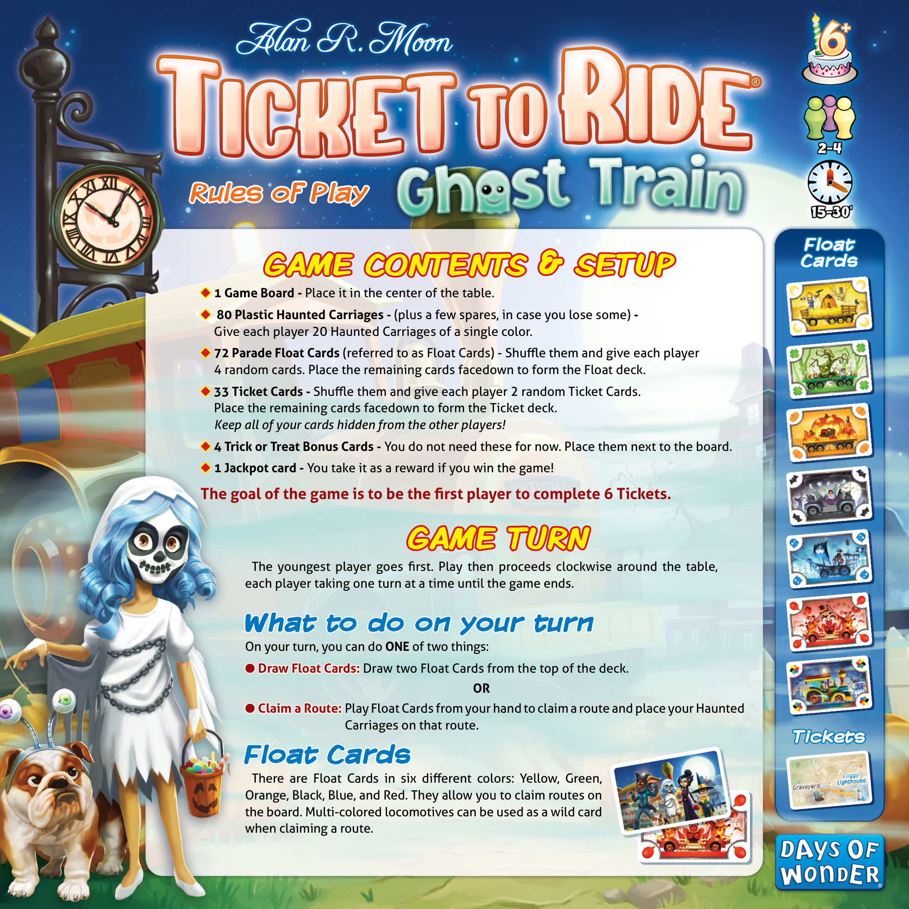
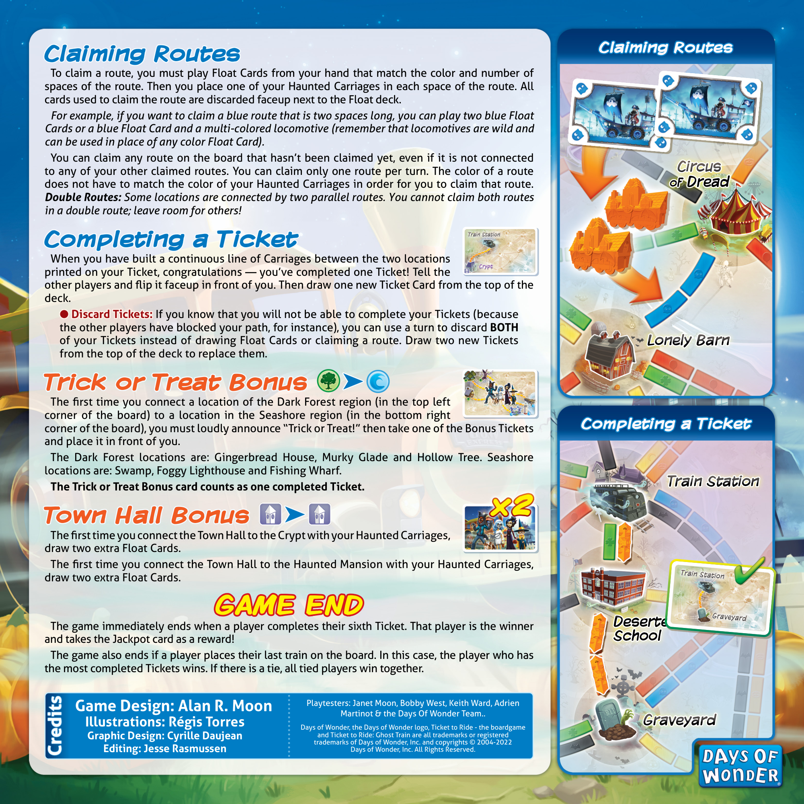

# Ghost Train

[Source PDF](rules.pdf) · [Map reference](ghost-train-map.png)

Parsed locally with pdf-inspector. Original page images preserve diagrams, tables, and layout; consult them where extraction is unclear.

## PDF page 1

## Rules of Play Rules of Play

### Float Float Cards Cards

# GAME CONTENTS & SETUP GAME CONTENTS & SETUP

◆◆ **1 Game Board -**Place it in the center of the table. ◆◆ **80 Plastic Haunted Carriages -**(plus a few spares, in case you lose some)**-** Give each player 20 Haunted Carriages of a single color. ◆◆ **72 Parade Float Cards** (referred to as Float Cards) - Shuffle them and give each player 4 random cards. Place the remaining cards facedown to form the Float deck. ◆◆ **33 Ticket Cards -**Shuffle them and give each player 2 random Ticket Cards. Place the remaining cards facedown to form the Ticket deck. _Keep all of your cards hidden from the other players!_ ◆◆ **4 Trick or Treat Bonus Cards -** You do not need these for now. Place them next to the board. ◆◆ **1 Jackpot card -** You take it as a reward if you win the game!

#### The goal of the game is to be the first player to complete 6 Tickets.

# GAME TURN GAME TURN

The youngest player goes first. Play then proceeds clockwise around the table, each player taking one turn at a time until the game ends.

## What to do on your turn What to do on your turn

On your turn, you can do **ONE** of two things: ●● **Draw Float Cards: Draw Float Cards:** Draw two Float Cards from the top of the deck. **OR** ●● **Claim a Route: Claim a Route:** Play Float Cards from your hand to claim a route and place your Haunted Carriages on that route.

### Tickets Tickets

## Float Cards Float Cards

Foggy Foggy There are Float Cards in six different colors: Yellow, Green,Lighthouse Lighthouse Graveyard Graveyard Orange, Black, Blue, and Red. They allow you to claim routes on the board. Multi-colored locomotives can be used as a wild card when claiming a route.

## PDF page 2

### Claiming Routes Claiming Routes

To claim a route, you must play Float Cards from your hand that match the color and number of spaces of the route. Then you place one of your Haunted Carriages in each space of the route. All cards used to claim the route are discarded faceup next to the Float deck. _For example, if you want to claim a blue route that is two spaces long, you can play two blue Float_ _Cards or a blue Float Card and a multi-colored locomotive (remember that locomotives are wild and_ _can be used in place of any color Float Card)._ You can claim any route on the board that hasn’t been claimed yet, even if it is not connected to any of your other claimed routes. You can claim only one route per turn. The color of a route does not have to match the color of your Haunted Carriages in order for you to claim that route. **\*Double Routes:** Some locations are connected by two parallel routes. You cannot claim both routes\* _in a double route; leave room for others!_

Train Station Train Station

### Completing a Ticket Completing a Ticket

When you have built a continuous line of Carriages between the two locations Crypt Crypt printed on your Ticket, congratulations — you’ve completed one Ticket! Tell the other players and flip it faceup in front of you. Then draw one new Ticket Card from the top of the deck. ●● **Discard Tickets: Discard Tickets:** If you know that you will not be able to complete your Tickets (because the other players have blocked your path, for instance), you can use a turn to discard **BOTH** of your Tickets instead of drawing Float Cards or claiming a route. Draw two new Tickets from the top of the deck to replace them.

### Trick or Treat Bonus Trick or Treat Bonus➤➤

The first time you connect a location of the Dark Forest region (in the top left corner of the board) to a location in the Seashore region (in the bottom right corner of the board), you must loudly announce “Trick or Treat!” then take one of the Bonus Tickets and place it in front of you. The Dark Forest locations are: Gingerbread House, Murky Glade and Hollow Tree. Seashore locations are: Swamp, Foggy Lighthouse and Fishing Wharf. **The Trick or Treat Bonus card counts as one completed Ticket.**

**x2 x2**

### Town Hall Bonus Town Hall Bonus➤➤

The first time you connect the Town Hall to the Crypt with your Haunted Carriages, draw two extra Float Cards. The first time you connect the Town Hall to the Haunted Mansion with your Haunted Carriages, draw two extra Float Cards.

## GAME END GAME END

The game immediately ends when a player completes their sixth Ticket. That player is the winner and takes the Jackpot card as a reward! The game also ends if a player places their last train on the board. In this case, the player who has the most completed Tickets wins. If there is a tie, all tied players win together.

Playtesters: Janet Moon, Bobby West, Keith Ward, Adrien **Game Design: Alan R. Moon** Martinot & the Days Of Wonder Team.. **Illustrations: Régis Torres** Days of Wonder, the Days of Wonder logo, Ticket to Ride-the boardgame **Graphic Design: Cyrille Daujean** trademarks of Days of Wonder, Inc. and copyrights © 2004-2022 and Ticket to Ride: Ghost Train are all trademarks or registered

#### Credits Credits

##### Editing: Jesse Rasmussen

Days of Wonder, Inc. All Rights Reserved.

##### Claiming Routes Claiming Routes

Circus Circus ofof Dread Dread

##### Lonely Barn Lonely Barn

##### Completing a Ticket Completing a Ticket

##### Train Station Train Station

Train Station Train Station

Graveyard Graveyard Deserted Deserted School School

##### Graveyard Graveyard

