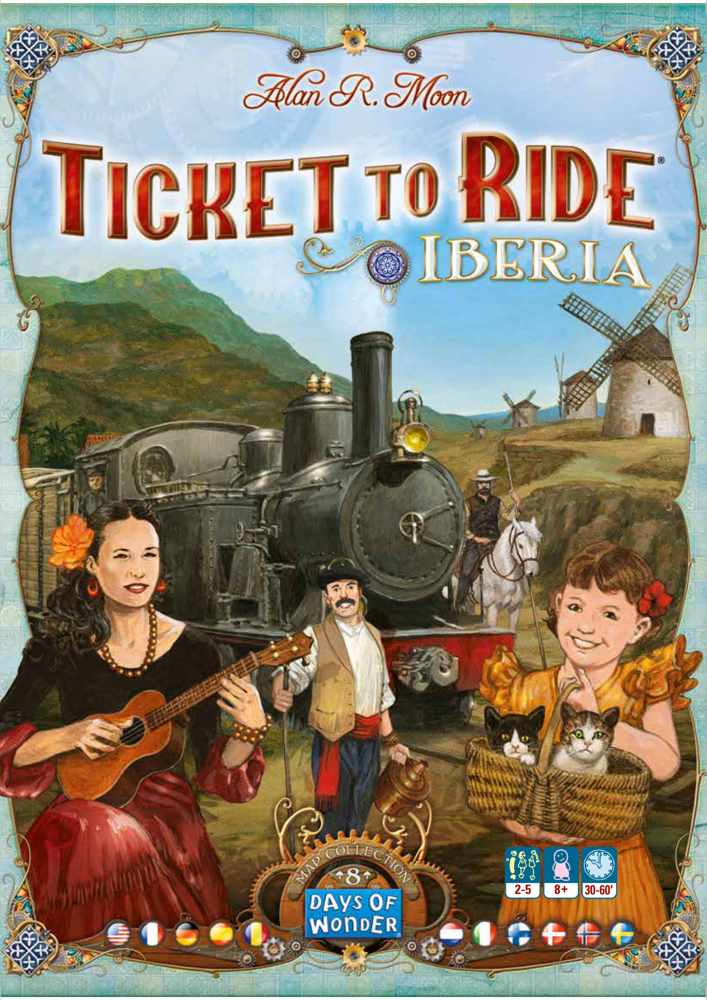
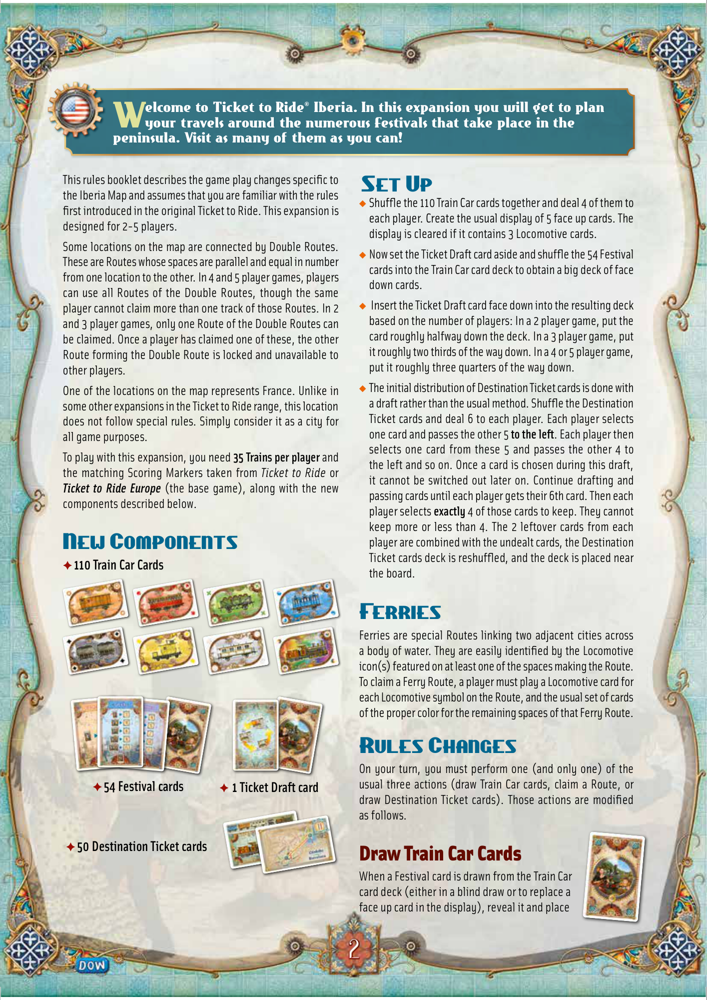
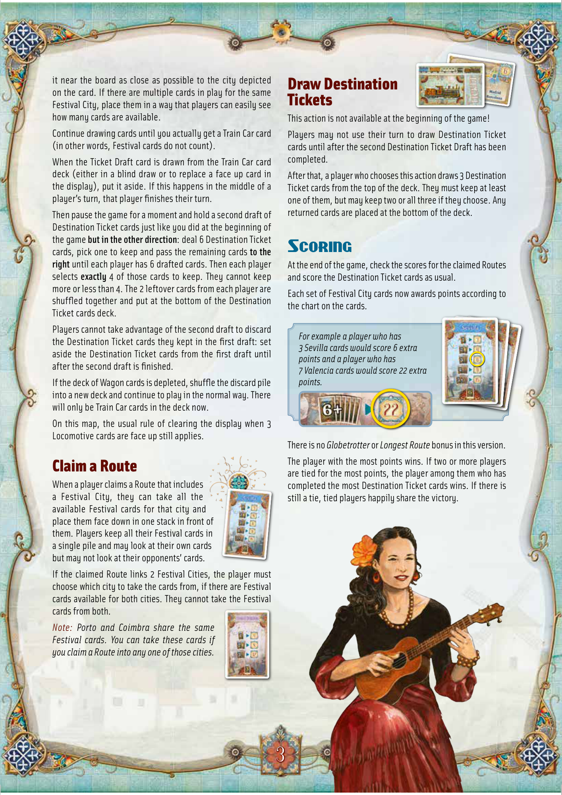

# Iberia

[Source PDF](rules.pdf) · [Map reference](iberia-map.png)

Parsed locally with pdf-inspector. Original page images preserve diagrams, tables, and layout; consult them where extraction is unclear.

## PDF page 1

The parser returned no text for this page. Refer to the page image below.

## PDF page 2

elcome to Ticket to Ride® Iberia. In this expansion you will get to plan

# Wyour travels around the numerous Festivals that take place in the

peninsula. Visit as many of them as you can!

This rules booklet describes the game play changes specific to

## Set Up

the Iberia Map and assumes that you are familiar with the rules u Shuffle the 110 Train Car cards together and deal 4 of them to first introduced in the original Ticket to Ride. This expansion is each player. Create the usual display of 5 face up cards. The designed for 2-5 players. display is cleared if it contains 3 Locomotive cards. Some locations on the map are connected by Double Routes. u Now set the Ticket Draft card aside and shuffle the 54 Festival These are Routes whose spaces are parallel and equal in number cards into the Train Car card deck to obtain a big deck of face from one location to the other. In 4 and 5 player games, players down cards. can use all Routes of the Double Routes, though the same player cannot claim more than one track of those Routes. In 2u Insert the Ticket Draft card face down into the resulting deck and 3 player games, only one Route of the Double Routes can based on the number of players: In a 2 player game, put the be claimed. Once a player has claimed one of these, the other card roughly halfway down the deck. In a 3 player game, put Route forming the Double Route is locked and unavailable to it roughly two thirds of the way down. In a 4 or 5 player game, other players. put it roughly three quarters of the way down.

One of the locations on the map represents France. Unlike inu The initial distribution of Destination Ticket cards is done with some other expansions in the Ticket to Ride range, this location a draft rather than the usual method. Shuffle the Destination does not follow special rules. Simply consider it as a city for Ticket cards and deal 6 to each player. Each player selects all game purposes. one card and passes the other 5 **to the left**. Each player then selects one card from these 5 and passes the other 4 to To play with this expansion, you need **35 Trains per player** and the left and so on. Once a card is chosen during this draft, the matching Scoring Markers taken from _Ticket to Ride_ or it cannot be switched out later on. Continue drafting and _Ticket to Ride Europe_ (the base game), along with the new passing cards until each player gets their 6th card. Then each components described below. player selects **exactly** 4 of those cards to keep. They cannot keep more or less than 4. The 2 leftover cards from each

## New Componentsplayer are combined with the undealt cards, the Destination

Ticket cards deck is reshuffled, and the deck is placed near ✦ **110 Train Car Cards** the board.

## Ferries

Ferries are special Routes linking two adjacent cities across a body of water. They are easily identified by the Locomotive icon(s) featured on at least one of the spaces making the Route. To claim a Ferry Route, a player must play a Locomotive card for each Locomotive symbol on the Route, and the usual set of cards of the proper color for the remaining spaces of that Ferry Route.

## Rules Changes

On your turn, you must perform one (and only one) of the ✦ **54 Festival cards** ✦ **1 Ticket Draft card** usual three actions (draw Train Car cards, claim a Route, or draw Destination Ticket cards). Those actions are modified as follows.

✦ **50 Destination Ticket cards**

## Draw Train Car Cards

When a Festival card is drawn from the Train Car card deck (either in a blind draw or to replace a face up card in the display), reveal it and place

## PDF page 3

it near the board as close as possible to the city depicted on the card. If there are multiple cards in play for the same Festival City, place them in a way that players can easily see how many cards are available.

Continue drawing cards until you actually get a Train Car card (in other words, Festival cards do not count).

When the Ticket Draft card is drawn from the Train Car card deck (either in a blind draw or to replace a face up card in the display), put it aside. If this happens in the middle of a player’s turn, that player finishes their turn.

Then pause the game for a moment and hold a second draft of Destination Ticket cards just like you did at the beginning of the game **but in the other direction**: deal 6 Destination Ticket cards, pick one to keep and pass the remaining cards **to the** **right** until each player has 6 drafted cards. Then each player selects **exactly** 4 of those cards to keep. They cannot keep more or less than 4. The 2 leftover cards from each player are shuffled together and put at the bottom of the Destination Ticket cards deck.

Players cannot take advantage of the second draft to discard the Destination Ticket cards they kept in the first draft: set aside the Destination Ticket cards from the first draft until after the second draft is finished.

If the deck of Wagon cards is depleted, shuffle the discard pile into a new deck and continue to play in the normal way. There will only be Train Car cards in the deck now.

On this map, the usual rule of clearing the display when 3 Locomotive cards are face up still applies.

# Claim a Route

When a player claims a Route that includes a Festival City, they can take all the available Festival cards for that city and place them face down in one stack in front of them. Players keep all their Festival cards in a single pile and may look at their own cards but may not look at their opponents’ cards.

If the claimed Route links 2 Festival Cities, the player must choose which city to take the cards from, if there are Festival cards available for both cities. They cannot take the Festival cards from both.

_Note: Porto and Coimbra share the same_

_Festival cards. You can take these cards if_ _you claim a Route into any one of those cities._

# Draw Destination Tickets

This action is not available at the beginning of the game!

Players may not use their turn to draw Destination Ticket cards until after the second Destination Ticket Draft has been completed.

After that, a player who chooses this action draws 3 Destination Ticket cards from the top of the deck. They must keep at least one of them, but may keep two or all three if they choose. Any returned cards are placed at the bottom of the deck.

# Scoring

At the end of the game, check the scores for the claimed Routes and score the Destination Ticket cards as usual.

Each set of Festival City cards now awards points according to the chart on the cards.

_For example a player who has_ _3 Sevilla cards would score 6 extra_ _points and a player who has_ _7 Valencia cards would score 22 extra_ _points._

There is no _Globetrotter_ or _Longest Route_ bonus in this version.

The player with the most points wins. If two or more players are tied for the most points, the player among them who has completed the most Destination Ticket cards wins. If there is still a tie, tied players happily share the victory.

