# India

[Source PDF](rules.pdf) · [Map reference](map.png)

Parsed locally with pdf-inspector. Original page images preserve diagrams, tables, and layout; consult them where extraction is unclear.

## PDF page 1

The parser returned no text for this page. Refer to the page image below.

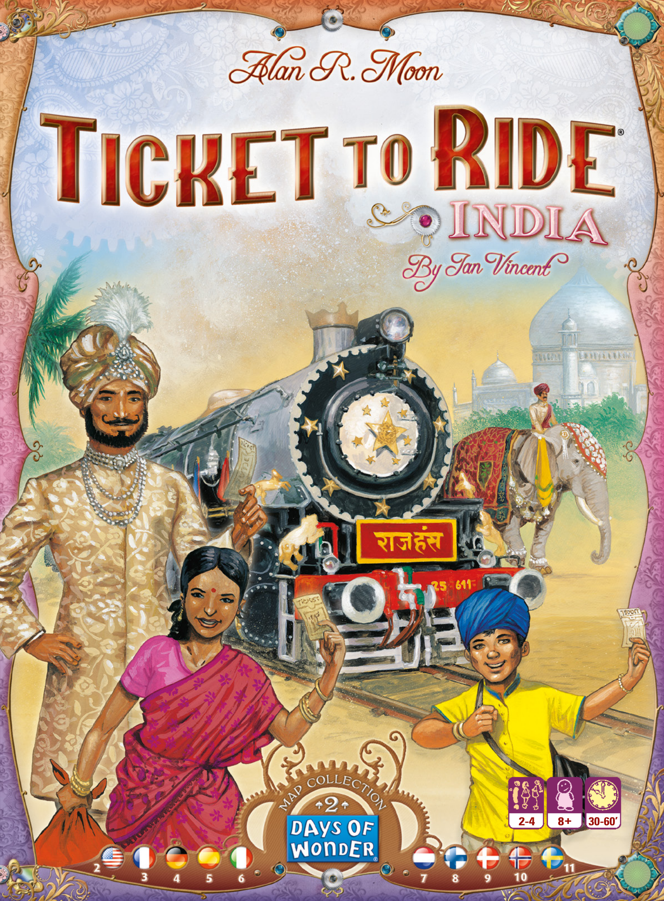

## PDF page 2

**Welcome to the Ticket to Ride® India Map-a challenging Ticket to Ride expansion set in 1911 colonial India.**

This Rules booklet describes the game play changes specific to the Indian Map and assumes that you are familiar with the rules first introduced in the **This game is an expansion and requires that you use the** **following game parts from one of the previous versions** original Ticket to Ride. **of Ticket to Ride:** l **A reserve of 45 Trains per player and matching**

# Introduction Scoring Markers taken from any of the following:

The map of India is designed specifically for 2 to 4 players. In 4 Player games**- Ticket to Ride** only, players can use both tracks of the double-routes. In 2 and 3 Player**- Ticket to Ride Europe** games, once one of the tracks of a double-route is taken, the other one is nol **110 Train Car Cards taken from:** longer available.

**- Ticket to Ride**
**- Ticket to Ride Europe**
**- USA 1910 expansion**

# Destination Tickets

This expansion includes 58 Destination Tickets. At the start of the game, each player is dealt 4 Destination Tickets of which he must keep at least 2. During the game, if a player wishes to draw additional Destination Tickets, he draws 3 new Tickets, of which he must keep at least 1. Destination Tickets not kept, either at game’s start or following a draw of new Destination Tickets in mid-game, are discarded to the bottom of Destination Tickets deck, as in a regular Ticket to Ride game.

# Ferries

Ferries are special gray routes linking two adjacent cities across a body of water. They are easily identified by the Locomotive icon(s) featured on at least one of the spaces making up the route. To claim a Ferry route, a player must play a Locomotive card for each Locomotive symbol on the route, and the usual set of cards of the proper color for the remaining spaces of that Ferry route.

# End Game Bonuses

A 10 point Indian Express bonus is awarded to the player(s) who have the Longest Continuous Path on the board. Each player may also earn Grand Tour of India bonuses. Any Ticket whose 2 Destination Cities are linked via at least 2 distinct continuous paths of its owner’s plastic trains qualifies for a Grand Tour bonus. These 2 paths may intersect, but cannot share trains.ï Mandala ï The size of a player’s bonus varies depending on the number of his qualifying Tickets, as per the Mandala (“Circle” in Sanskrit) bonus table shown on the Map. A player’s first and second qualifying Tickets are worth +5 points each, with the next three worth +10 each. Any qualifying Tickets beyond the fifth one earn no additional points (i.e. the largest bonus a player can receive for his Grand Tour tickets is 40 points). These bonuses are scored in addition to the points earned for completing the Tickets themselves, of course.

# Game Play Hints

Reflecting a country that is both densely populated and colorful, the India map rewards players for claiming key routes early (to avoid being crowded out) and for being careful about which colors they draw. The Grand Tour bonuses can be used opportunistically or as part of a dedicated strategy. Bear in mind that: _ The greater the number of qualifying Tickets, the larger the bonus at game end, regardless the length and point value of the individual Tickets _ The last route allowing you to complete a Grand Tour is the most likely to be blocked by an opponent. Try to make sure that you have alternatives for the last route or that it is difficult for your opponent(s) to build on (or both).

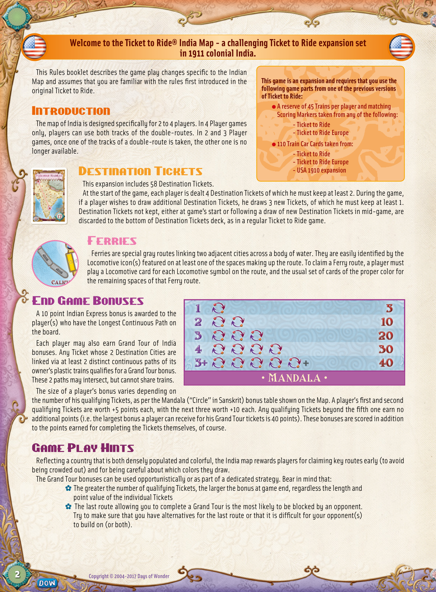

## PDF page 3

## Bienvenue dans l’extension Inde des Aventuriers du Rail™. Partez à la découverte

**du Raj britannique de 1911, tout en rivalisant d’audace et de rapidité avec vos adversaires !**

Ce livret vous présente les règles spécifiques au plateau de l’Inde des Aventuriers du Rail, tout en partant du principe que vous connaissez déjà les **Ce jeu est une extension et nécessite les éléments de jeu** mécanismes du jeu de base. **suivants, disponibles dans une des versions précédentes** **de la série :** l **45 wagons par joueur, ainsi que les marqueurs de**

# Généralités

**score provenant de l’un des jeux suivants :** L’Inde est un plateau prévu pour 2 à 4 joueurs. Dans une partie à 4 joueurs,**- Les Aventuriers du Rail** vous pouvez utiliser les routes doubles. En revanche, dans une partie à 2 ou**- Les Aventuriers du Rail Europe** 3 joueurs, quand l’une des voies d’une route double est prise, la seconde est l **Les 110 cartes Wagon provenant de :** fermée jusqu’à la fin de la partie.

**- Les Aventuriers du Rail**
**- Les Aventuriers du Rail Europe**
**- USA 1910**

# Cartes Destination

Cette extension comporte 58 cartes Destination. En début de partie, chaque joueur reçoit 4 cartes Destination. Il doit en garder au moins 2. En cours de partie, si le joueur décide de reprendre des cartes Destination, il pioche les 3 premières cartes de la pile et doit en garder au moins une. Toute carte Destination rejetée, que ce soit en début de partie ou en cours de jeu, est replacée en dessous de la pile des cartes Destination, comme dans une partie normale.

# Ferries

Les ferries sont des routes maritimes. Les lignes de ferries sont aisément reconnaissables au symbole Locomotive figurant sur au moins un des espaces de la route. Pour prendre possession d’une ligne de ferries, un joueur doit jouer une carte Locomotive pour chaque symbole de Locomotive figurant sur la route, et des cartes de la couleur correspondant à la route pour les autres espaces (les routes grises pouvant être prises avec n’importe quelle série de cartes d’une même couleur).

# Bonus de fin de partie

Le joueur qui a le chemin continu le plus long reçoit le bonus Indian Express et marque 10 points supplémentaires. Chaque joueur peut aussi remporter des points supplémentaires en créant des boucles dans son réseau ferré. Si les deux villes d’une même Destination sont reliées par deux routes différentes utilisant les wagons de son propriétaire, alors cette Destination ï Mandala ï rapportera des points supplémentaires. Les deux routes en question peuvent se croiser, mais un même wagon ne peut pas être utilisé deux fois. Le bonus acquis varie en fonction du nombre de Destinations reliées de cette façon. Consultez le barème Mandala (« boucle » en sanskrit) du plateau pour connaître le nombre de points accordés par le bonus. La 1re et la 2e boucle rapportent 5 points chacune. Chaque boucle au-delà de celles-ci rapporte 10 points supplémentaires (le bonus total maximum est de 40 points). Bien entendu, ces points s’ajoutent à ceux normalement rapportés pour la réussite de la Destination.

# Astuces de jeu

L’Inde est un pays densément peuplé et riche en couleurs. Son plateau récompensera donc les joueurs qui s’emparent des routes-clés rapidement (pour éviter que le réseau ne soit encombré) et qui font attention à prendre les bonnes couleurs au bon moment. Les bonus Mandala peuvent être utilisés de façon opportuniste ou faire partie d’une stratégie à part entière. N’oubliez pas que : _ Plus vous avez de Destinations susceptibles de faire une boucle, plus le bonus sera important, et ce même si les Destinations elles-mêmes ne vous rapportent pas beaucoup de points _ La dernière route d’une boucle est forcément celle que les autres joueurs essaieront de bloquer. Essayez d’avoir une route de secours au cas où, ou finissez par la route la plus difficile à construire pour décourager vos adversaires. Si possible, faites les deux !

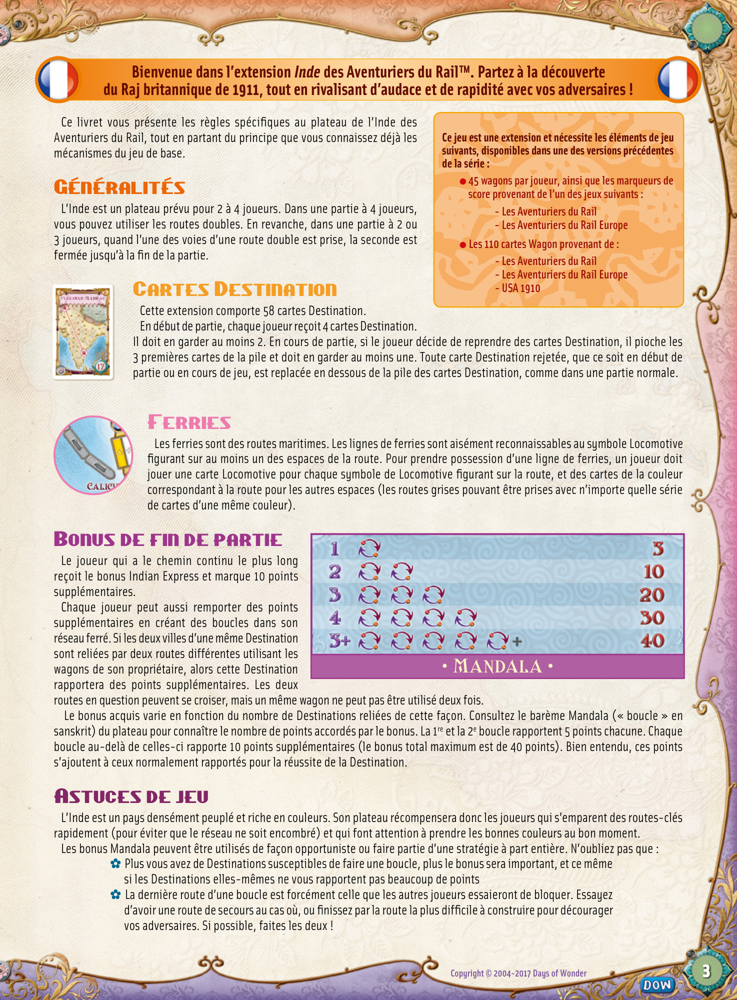

## PDF page 4

## Willkommen beim Indien-Spielplan von „Zug um Zug“™ — einer spannenden „Zug um Zug“-

## Erweiterung, die im Indien der Kolonialzeit spielt und im Jahr 1911 angesiedelt ist.

Dieses Regelheft beschreibt die Änderungen des Spielablaufs, die für den Indien- **Dieses Spiel ist eine Erweiterung und erfordert die folgenden** Spielplan gelten, und setzt ansonsten voraus, dass die Spieler mit den Regeln des **Spielmaterialien aus einer der bereits veröffentlichten „Zug** Grundspiels „Zug um Zug“ vertraut sind. **um Zug“-Versionen:** l **45 Waggons pro Spieler sowie farblich passende**

# Einleitung Zählsteine aus einem der folgenden Spiele:

Der Indien-Spielplan wurde speziell für zwei bis vier Spieler entworfen. Nur in Partien**- „Zug um Zug“** zu viert dürfen die Spieler beide Doppelstrecken nutzen. In Partien zu zweit oder zu**- „Zug um Zug Europa“** dritt kann nur eine der beiden Doppelstrecken genutzt werden. Wenn ein Spieler eine l**110 Wagenkarten aus:** der Doppelstrecken genutzt hat, ist die andere in dieser Partie nicht mehr verfügbar.

**- „Zug um Zug“**
**- „Zug um Zug Europa“**

# Zielkarten-Erweiterung „USA 1910“

Diese Erweiterung enthält 58 Zielkarten. Zu Beginn der Partie erhält jeder Spieler vier Zielkarten, von denen er mindestens zwei behalten muss. Wenn ein Spieler im Laufe der Partie zusätzliche Zielkarten haben möchte, zieht er drei neue Zielkarten, von denen er mindestens eine behalten muss. Zu Beginn oder im Laufe der Partie zurückgegebene Karten werden unter den Stapel der Zielkarten gelegt — wie in den übrigen Spielen der „Zug um Zug“-Familie.

# Fähren

Fähren sind spezielle graue Strecken, die zwei benachbarte Städte miteinander verbinden, welche durch Wasser getrennt sind. Sie sind auch an dem Lokomotivsymbol zu erkennen, das sich auf mindestens einem Feld dieser Strecken befindet. Wenn ein Spieler eine Fähre nutzen möchte, muss er eine Lokomotivkarte pro Lokomotivsymbol ausspielen, das auf dieser Strecke abgebildet ist. Für alle übrigen Felder der Strecke muss er die entsprechende Anzahl an Wagenkarten einer Farbe (eventuell wiederum kombiniert mit Lokomotiven als Joker) abgeben.

# Boni am Ende der Partie

Wer die längste durchgehende Strecke geschaffen hat, erhält die entsprechende „Indien-Express“-Bonuskarte und zehn zusätzliche Punkte. Beim Vergleich der Routenlängen werden nur durchgehende Verbindungen berücksichtigt, die aus Waggons derselben Farbe bestehen. Die Strecke kann Schleifen bilden oder mehrfach durch dieselbe Stadt führen, aber jeder Waggon darf nur ein einziges Mal gezählt werden. Eventuelle Abzweigungen der Route zählen dabei nicht mit. Sollte bei der längsten Strecke ein Gleichstand zwischen mehreren Spielern herrschen, erhalten alle daran beteiligten Spieler jeweils zehn Punkte. Jeder Spieler kann außerdem einen „Große Indientour“-Bonus erhalten. Jede Zielkarte, deren beide Städte der Spieler durch mindestens zwei verschiedene durchgehende Strecken seiner Waggons miteinander verbunden hat, erfüllt die Bedingung für den „Große Indientour“-Bonus. Diese beiden Strecken dürfen sich kreuzen, aber keine gemeinsamen Waggons benutzen. Die Höhe des Bonus ist von der Anzahl der Zielkarten eines Spielers abhängig, welche diese Bedingung erfüllen. Informationen darüber liefert die Bonustabelle des Mandalas („Kreis“ auf Sanskrit) auf dem Spielbrett. Die erste und zweite Zielkarte des Spielers, welche die Bedingung erfüllen, sind jeweils fünf Punkte wert, die nächsten drei bringen je zehn Punkte ein. Hat der Spieler mehr als fünf Zielkarten, welche die Bedingung erfüllen, erhält er dafür keine weiteren zusätzlichen Punkte. (40 ist also die höchste Punktzahl, die ein Spieler für den „Großen Indientour“-Bonus maximal bekommen kann.) Diese Boni gelten selbstverständlich zusätzlich zu den Punkten, die man für die Erfüllung der Zielkarte erhält.

### ï Mandala ï

# Hinweise

Der Indien-Spielplan bildet ein Land ab, das dicht bevölkert und vielfältig ist. Deshalb sollten die Spieler recht früh Strecken nutzen, um nicht verdrängt zu werden, und die Farben der Wagenkarten mit Bedacht wählen. Der „Große Indientour“-Bonus kann opportunistisch oder als Bestandteil einer bestimmten Strategie verwendet werden. Denken Sie daran: _ Je größer die Anzahl der Zielkarten ist, welche die Bedingung erfüllen, desto höher ist der Bonus am Ende der Partie. _ Die letzte Strecke, mit der Sie einen „Große Indientour“-Bonus erhalten würden, wird am ehesten von einem Gegner blockiert. Versuchen Sie, dafür zu sorgen, dass Sie Alternativen für diesen letzten Abschnitt haben, oder dass es für die Gegner schwierig ist, dort Waggons zu platzieren (oder beides).

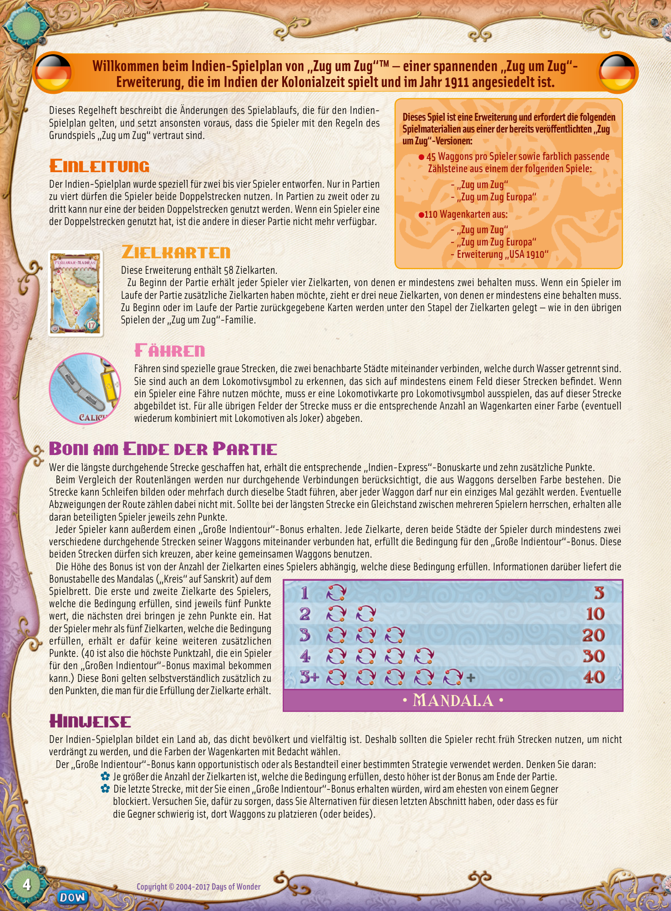

## PDF page 5

## Bienvenido a ¡Aventureros al Tren!™ India, una expansión ambientada en la India colonial

## de 1911 que pondrá a prueba a los jugadores más experimentados.

Este manual da por hecho que estás familiarizado con las reglas habituales **_¡Aventureros al Tren!™ India_ es una expansión y requiere** de _¡Aventureros al Tren!_, y sólo describe las diferencias de reglas específicas **para su uso de los siguientes componentes, presentes en** para jugar en equipo con el mapa de India. **anteriores juegos de esta línea:** l **Una reserva de 45 Vagones de tren por jugador**

# Introducción y los correspondientes Marcadores de Puntuación,

El mapa de India ha sido diseñado específicamente para partidas de 2-4 **tomados de** _¡Aventureros al Tren!_ **o** _¡Aventureros_ _al Tren! Europa._ jugadores. Sólo en las partidas de 4 jugadores se pueden usar los dos recorridos de un Recorrido Doble. En las partidas de 2 y 3 jugadores, una vez que se hal**110 Cartas de Vagón, tomadas de uno de estos juegos** cubierto uno de los Recorridos Dobles, no se puede cubrir el otro. **o de la expansión** \*USA 1910**\*.**

# Billetes de Destino

Esta expansión incluye 58 Billetes de Destino. Al principio de la partida se reparten a cada jugador 4 Billetes de Destino, de los que se deben conservar al menos 2. Si un jugador desea obtener Billetes de Destino adicionales durante la partida, roba 3 Billetes de Destino del mazo, de los que debe conservar al menos uno. Los Billetes de Destino que son rechazados, tanto al inicio de la partida como durante ésta, se reciclan devolviéndolos a la base del mazo de Billetes de Destino, al igual que en las partidas normales de ¡Aventureros al Tren!.

# Ferrys

Los Ferrys son recorridos grises especiales que conectan dos ciudades adyacentes separadas por una masa de agua. Son fácilmente identificables, ya que incluyen el icono de Locomotora en al menos uno de los espacios que constituyen el recorrido. Para cubrir un Recorrido de Ferry, un jugador debe usar una carta de Locomotora por cada icono de Locomotora presente en el recorrido, y el grupo normal de cartas del color apropiado para el resto de espacios del recorrido.

# Final del Juego

Al final del juego se otorga el Premio India Express al jugador que haya conseguido establecer la Ruta Continua Más Larga sobre el mapa, que proporciona 10 puntos adicionales. Cada jugador puede ganar también Premios de Gran Tour de la India. Todos los Billetes de Destino cuyas dos ciudades de destino estén conectadas por al menos dos recorridos continuos distintos, cubiertos por los Vagones de Tren de su propietario, reciben ï Mandala ï el Premio Gran Tour de la India. Estos dos recorridos pueden cruzarse entre sí, pero no compartir Vagones de Tren. Los puntos obtenidos por estos premios dependen del número de Billetes de Destino con este distintivo que posea cada jugador, tal como se indica en el Mandala (“Círculo” en sánscrito) del tablero. Los dos primeros Billetes premiados otorgan 5 puntos cada uno, mientras que los tres siguientes otorgan 10 puntos cada uno. Los Billetes premiados a partir de ese punto no proporcionan puntos adicionales; esto es, la mayor cantidad de puntos que un jugador puede recibir por sus Billetes premiados con el Gran Tour de la India es 40. Estas puntuaciones se suman a los puntos obtenidos normalmente por completar los Billetes de Destino.

# Consejos de Estrategia

Como reflejo de un país colorido y densamente poblado, el mapa de la India recompensa a los jugadores que cubren pronto los recorridos principales (para evitar futuras aglomeraciones) y a los que se muestran cuidadosos a la hora de escoger los colores que roban. Los Premios de Gran Tour de la India pueden ganarse cuando se presenta la ocasión o usarse como parte de una estrategia ya establecida. Recuerda que: _ Mientras más Billetes premiados tengas, mayor será la puntuación adicional al final de la partida, sea cual sea la longitud y el valor en puntos de los Billetes en sí. _ El último recorrido que te permita completar un Gran Tour es el que más posibilidades tiene de estar bloqueados por un adversario. Intenta asegurarte de conservar alternativas para ese último recorrido o al menos de que a tus adversarios les resulte difícil usarlo.

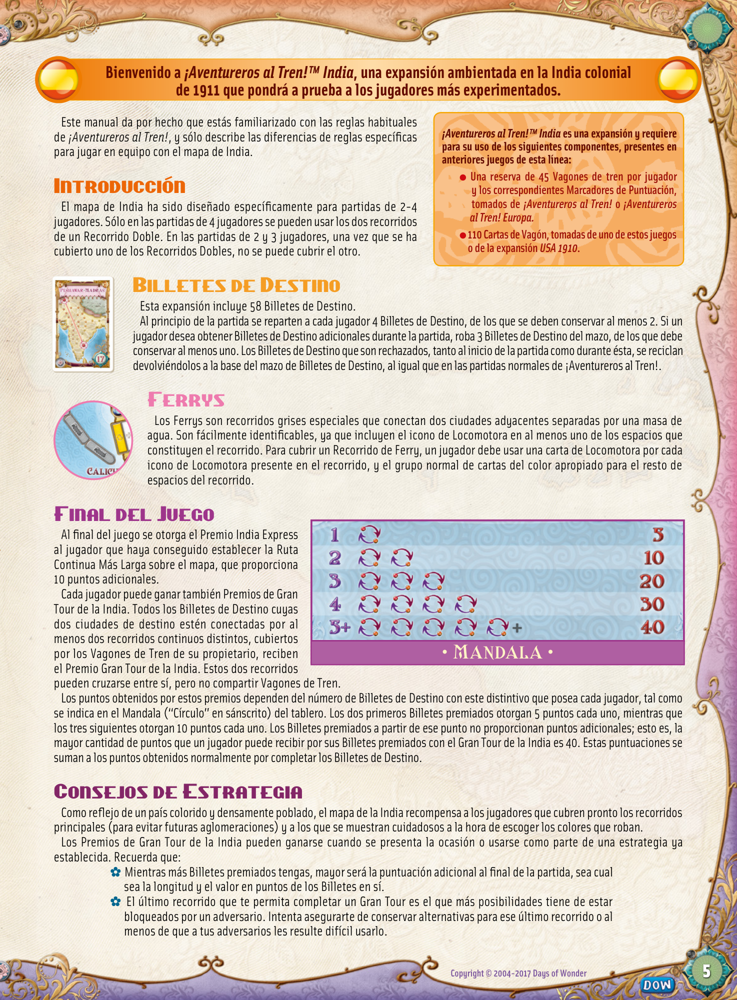

## PDF page 6

**Benvenuti a Ticket to Ride® India-un’entusiasmante espansione di Ticket to Ride ambientata nell’India coloniale del 1911.**

Questo regolamento descrive i cambiamenti specifici al sistema di gioco per **Questo gioco è un’espansione e richiede l’utilizzo dei** la Mappa dell’India e presume che tu conosca già le regole presentate per la **seguenti componenti presenti in una delle precedenti** prima volta nella versione originale di Ticket to Ride. **versioni di Ticket to Ride:** l **Una riserva di 45 vagoni per giocatore e** **i corrispettivi Segnapunti prelevati da uno dei**

# Introduzione

**seguenti giochi:** La Mappa dell’India è concepita per 2-4 giocatori. Nelle partite a 4 giocatori,

**- Ticket to Ride**
i giocatori possono prendere il controllo di entrambe le linee di una Doppia

**- Ticket to Ride Europa**
Linea. Nelle partite a 2 o 3 giocatori, è possibile prendere il controllo di una l **110 Carte Treno prelevate da:** sola delle Doppie Linee.

**- Ticket to Ride**
**- Ticket to Ride Europa**

# Biglietti Destinazione-espansione USA 1910

Questa espansione include 58 Biglietti Destinazione. All’inizio della partita, ogni giocatore riceve 4 Biglietti Destinazione, dei quali deve tenerne almeno 2. Durante la partita, se un giocatore desidera pescare Biglietti Destinazione aggiuntivi, ne pesca 3 e deve tenerne almeno 1. I Biglietti Destinazione che non tiene, sia quelli all’inizio della partita che quelli ottenuti pescando nuovi Biglietti Destinazione durante la partita, vengono collocati in fondo al mazzo dei Biglietti Destinazione, come in una regolare partita di Ticket to Ride.

# Traghetti

I Traghetti sono linee Grigie speciali che collegano due città adiacenti attraverso una massa d’acqua. Sono facilmente riconoscibili dall’icona o dalle icone Locomotiva presenti su almeno una delle caselle che compongono la linea. Per prendere il controllo di una Linea Traghetto, un giocatore deve giocare una carta Locomotiva per ogni simbolo Locomotiva presente sulla linea e la consueta serie di carte del colore appropriato per le caselle rimanenti su quella Linea Traghetto.

# Bonus di Fine Partita

Un bonus Indian Express da 10 punti va assegnato al giocatore o ai giocatori che hanno il Percorso Continuo Più Lungo sul tabellone. Ogni giocatore può inoltre guadagnare dei bonus Grand Tour of India. Ogni Biglietto le cui 2 Città di Destinazione siano collegate da almeno 2 percorsi continui distinti composti dai vagoni in plastica di uno

### ï Mandala ï

stesso proprietario, si qualifica a ottenere un bonus Grand Tour. Questi 2 percorsi possono intersecarsi ma non possono condividere i vagoni. La taglia del bonus di un giocatore dipende dal numero di Biglietti Destinazione qualificanti, come previsto dalla Tabella dei Bonus del Mandala (“Cerchio” in Sanscrito) raffigurata sulla Mappa. Il primo e il secondo Biglietto Destinazione qualificanti di un giocatore valgono +5 punti ciascuno e i tre successivi valgono +10 punti ciascuno. Ogni Biglietto Destinazione qualificante oltre il quinto non procura nessun punto aggiuntivo (in altre parole, il bonus massimo che un giocatore può ottenere dai suoi Biglietti Grand Tour è 40 punti). Questi bonus vanno aggiunti ai punti guadagnati per il completamento dei Biglietti Destinazione veri e propri, naturalmente.

# Suggerimenti di Gioco

La Mappa dell’India rappresenta un paese esotico e densamente popolato, quindi ricompensa i giocatori che prendono il controllo delle linee principali il più presto possibile (evitando di essere tagliati fuori dagli altri) e quelli che fanno attenzione ai colori che pescano. I bonus del Grand Tour possono essere usati opportunisticamente o come parte di una strategia mirata. I giocatori dovranno ricordare che: _ Più alto è il numero di Biglietti Destinazione qualificanti, più alto sarà il bonus alla fine della partita, a prescindere dalla lunghezza e dal valore in punti dei singoli Biglietti Destinazione. _ È molto probabile che l’ultima linea che consente di completare un Grand Tour sia bloccata da un avversario. È consigliabile assicurarsi di avere delle alternative per l’ultima linea, o che sia difficile per il vostro o i vostri avversari prenderne il controllo (o, meglio ancora, entrambe le cose).

**Copyright © 2004-2017 Days of Wonder**

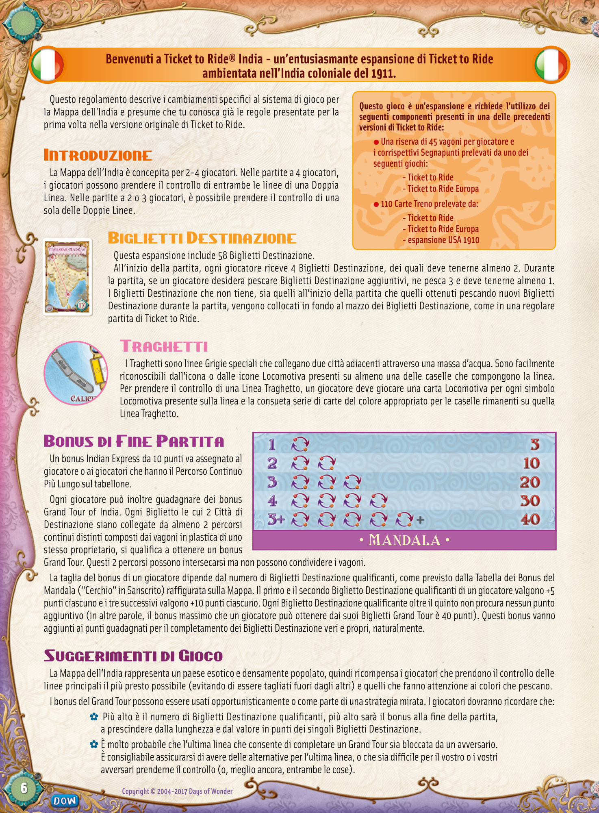

## PDF page 7

**Welkom bij Ticket to Ride® India, een uitdagende Ticket to Ride-uitbreiding die zich afspeelt in het koloniale India van 1911.**

In deze spelregels worden de spelwijzigingen beschreven die van toepassing zijn wanneer je op de Indische kaart speelt. Je wordt daarbij verondersteld de **Dit spel is een uitbreiding. Je hebt de volgende** **onderdelen uit een vorige versie van Ticket to Ride nodig:** regels te kennen van de originele Ticket to Ride-spellen. l**Een voorraad van 45 treintjes per speler en de** **overeenkomstige scorepionnen uit een van de**

# Inleidingvolgende spellen:

De kaart van India is speciaal ontworpen voor 2 tot 4 spelers. In een spel**- Ticket to Ride** met 4 spelers kunnen beide sporen van een dubbele route geclaimd worden.**- Ticket to Ride Europe** In een spel met 2 of 3 spelers kan maar één route geclaimd worden. Zodra ditl **110 treinkaarten uit:** gebeurt, is de andere route afgesloten voor alle andere spelers.

**- Ticket to Ride**
**- Ticket to Ride Europe**
**- Uitbreiding USA 1910**

# Bestemmingskaarten

In deze uitbreiding zitten 58 bestemmingskaarten. Aan het begin van het spel krijgt elke speler 4 bestemmingskaarten. Daarvan moet hij er minstens 2 houden. Als een speler tijdens het spel nieuwe bestemmingskaarten wil trekken, trekt hij er 3 van de stapel en moet er minstens één van houden. Bestemmingskaarten die aan het begin van het spel of bij het trekken van nieuwe kaarten tijdens het spel afgelegd worden, moeten net als in een regulier Ticket to Ride-spel onderaan de stapel bestemmingskaarten gelegd worden.

# Veerboten

Veerboten zijn speciale grijze routes die twee aangrenzende steden met elkaar verbinden over een stuk water. Ze zijn gemakkelijk te herkennen aan de locomotief die op minstens één van de vakjes staat. Om een veerbootroute te claimen moet een speler een locomotiefkaart spelen voor elk vakje met een locomotief-symbool op die route, en de normale reeks kaarten voor de andere vakjes van die veerbootroute.

# Bonuspunten aan het einde van het spel

De speler(s) met de langste ononderbroken route op het bord ontvangt (ontvangen) een ‘Indian Express’-bonus van 10 punten. Elke speler kan ook bonuspunten verdienen met Grote Rondreizen door India. Elke bestemmingskaart waarvan de twee steden met elkaar verbonden zijn door minstens 2 verschillende ononderbroken routes van treintjes levert de eigenaar bonuspunten op. Deze 2 routes mogen elkaar snijden, maar mogen niet van dezelfde treintjes gebruik maken. Het aantal bonuspunten voor een speler hangt af van het aantal treinkaarten dat hij heeft die aan bovenstaande voorwaarden voldoet en wordt bepaald volgens de Mandala-bonustabel op de kaart (Mandala betekent ‚cirkel‘ in het Sanskriet). De eerste en tweede bestemmingskaart van een speler die aan bovenstaande voorwaarden voldoen zijn elk 5 punten waard, en de volgende drie zijn elk 10 punten waard. Een speler kan maar voor 5 bestemmingskaarten bonuspunten verdienen (de maximale bonus voor Grote Rondreizen is dus 40 punten). Deze bonuspunten komen natuurlijk bovenop de punten die een speler verdient door de bestemmingskaarten zelf te behalen.ï Mandala ï

# Speeltips

De kaart van India weerspiegelt het dichtbevolkte en kleurrijke karakter van het land en beloont spelers die belangrijke routes snel kunnen claimen (om te voorkomen dat ze weggedrongen worden) en die voorzichtig zijn bij het kiezen van kleuren. De bonuspunten voor Grote Rondreizen kunnen opportunistisch of als onderdeel van een gerichte strategie gebruikt worden. Aandachtspunten: _ Hoe groter het aantal bestemmingskaarten dat aan de voorwaarden voldoet, hoe groter de bonus op het einde van het spel, ongeacht de lengte en puntenwaarde van de individuele bestemmingskaarten. _ De kans is groot dat tegenstanders zullen proberen je te beletten om een Grote Rondreis te maken door de laatste vrije route in te pikken. Probeer ervoor te zorgen dat je alternatieven hebt voor de laatste vrije route en/of dat je tegenstanders er niet zomaar kunnen bouwen.

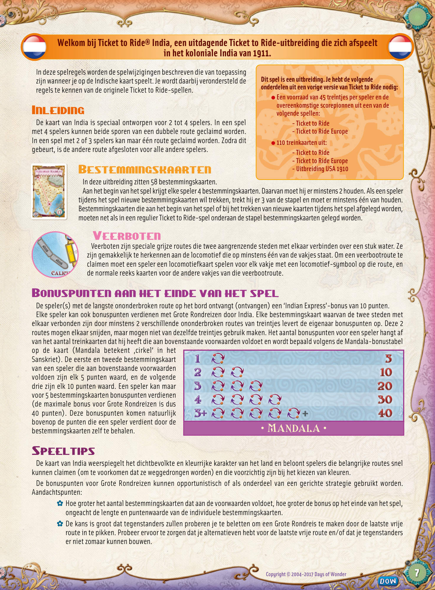

## PDF page 8

## Tervetuloa Menolippu Intia laajennukseen, joka sijoittuu vuoden 1911 Intiaan.

Tässä sääntökirjassa kerrotaan niistä erityissäännöistä, jotka pätevät kun **Menolippu Intia on laajennusosa ja tarvitset siten** pelataan Intian kartalla. Muutoin sovelletaan Menolippu peruspelin sääntöjä. **seuraavia pelitarvikkeita joistakin alla mainituista** **Menolippu tuotteista** l **45 yhdenväristä junavaunua ja väriä vastaavat**

# Johdanto

**pistemerkit jokaiselle pelaajalle, jommasta** Menolippu Intia on suuniteltu 2 - 4 pelaajalle. 4 pelaajan pelissä voidaan **kummasta seuraavista tuotteista:** rakentaa kaksoisreittien molemmat reitit. 2 ja 3 pelaajan pelissä vain toinen

**- Menolippu**
kaksoisreitin reiteistä voidaan rakentaa.**- Menolippu Eurooppa**

l **110 Junakorttia jostakin seuraavista tuotteista:**

# Menoliput-Menolippu

**- Menolippu Eurooppa**
Tässä laajennusosassa on 58 menolippua.

**- Menolippu 1910**
Pelin alussa, jokainen pelaaja saa 4 menolippua, joista tulee pitää vähintään 2. Jos pelaaja haluaa nostaa pelin aikana lisää menolippuja, hän nostaa 3, joista hänen on pidettävä vähintään 1. Ne menoliput, joita pelaaja ei pidä pelin alussa tai nostaessaan uusia menolippuja pelin kuluessa, viedään nostopakan pohjalle aivan kuten Menolippu peruspelissäkin.

# Lautat

Lautat ovat erikoisyhteys, jotka yhdistävät kaksi veden erottamaa kaupunkia. Lauttareitit on helppo erottaa muista reiteistä, sillä vähintään yksi ruutu reitillä sisältää veturisymbolin. Kun pelaaja haluaa rakentaa lauttareitin, hänen on pelattava yksi veturikortti jokaista reitin veturisymbolin sisältävää ruutua kohden, sekä normaaliin tapaan junakortti muita ruutuja kohden.

# Loppubonus

Pelin päättyessä, ylimääräinen 10-pisteen bonus annetaan pelaajalle (tai pelaajille), joka on rakentanut pisimmän yhtenäisen reitin kartalle. Kukin pelaaja voi myös saada Intian matkabonuksen. Tämän bonuksen saa, mikäli pelaaja pystyy rakentamaan hallussaan olevan menolipun käyttäen kahta eri reittiä. Nämä reitit voivat risteytyä, mutta ne eivät saa käyttää yhtäkään samaa reittiä. Pelaajan saaman bonuksen määrä riippuu hänen matkabonuksen hyväksi luettavien menolippujen määrästä oheisen Mandala-taulukon mukaisesti. Pelaajan 1. ja 2. bonusmenolippu ovat +5 pisteen arvoisia ja seuraavat 3 ovat +10 pistettä kukin. Tämän ylittävältä määrältä ei anneta bonusta (su- urin mahdollinen matkabonus on siis 40 pistettä). Nämä bonukset saa tietysti menolipun normaalisti tuottamien pisteiden lisäksi.

### ï Mandala ï

# Pelivinkkejä

Pelilauta kuvaa tiheästi asutettua Intiaa ja kartta palkitsee nopeaa rakentamista. Pelaajien tulee siksi harkita tarkkaan mitä kortteja nostavat. Matkabonusta voi käyttää osana pelistrategiaa, mutta on syytä muistaa että: _ Mitä suurempi määrä matkabonukseen oikeuttavia menolippuja, sen suurempi bonus on pelin päättyessä riippumatta menolipun omasta pistearvosta. _ Viimeinen reitti, jonka tarvitset matkabonuksen saavuttamiseksi tullaan todennäköisesti blokkaamaan vastustajasi toimesta. Yritä siis pitää omat vaihtoehtosi auki mahdollisimman pitkään.

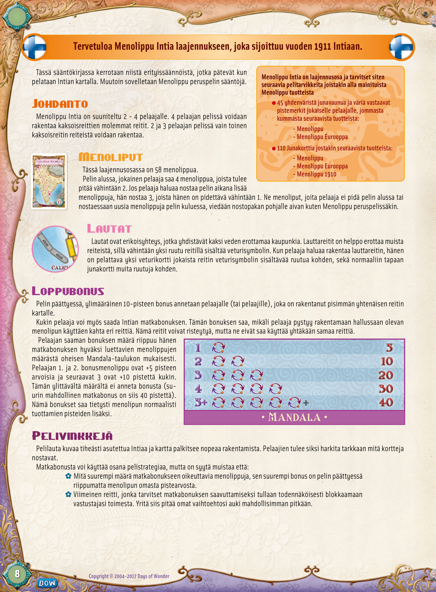

## PDF page 9

**Ticket to Ride® India er en udfordrende udvidelse til Ticket to Ride-temaet for udvidelsen**

## er det britisk koloniserede Indien anno 1911.

Benyt reglerne som introduceret i det originale Ticket to Ride; denne regelbog beskriver kun de supplerende særregler, der gælder for spil med **Dette spil er en udvidelse og kan kun spilles sammen med** udvidelsen India. **følgende dele fra en af de tidligere versioner af Ticket to** **Ride:** l **Et lager af 45 tog per spiller samt tilhørende**

# Dobbeltspor

**pointmarkører fra et af følgende spil:** Udvidelsen India er beregnet for 2 til 4 spillere. Ved 4 spillere må begge**- Ticket to Ride** dobbeltspor anvendes. Ved 2 eller 3 spillere må kun et dobbeltspors ene side**- Ticket to Ride Europe** benyttes. Når en af siderne er brugt, anses den tilbageværende for lukket. l **110 togkort fra:**

**- Ticket to Ride**

# Rutekort-Ticket to Ride Europe

**- USA 1910 expansion**
Denne udvidelse indeholder 58 rutekort. Start med at give hver spiller 4 rutekort; mindst 2 af disse rutekort skal beholdes. Ønsker en spiller i løbet af spillet at trække flere rutekort, trækkes 3 nye rutekort; heraf skal mindst 1 beholdes. Returnerede rutekort – både ved spilstart og i løbet af spillet-lægges altid tilbage i bunden af bunken med rutekort, helt som i det originale spil.

# Færger

Færger er særlige grå strækninger, der forbinder to nabobyer via søvejen. De genkendes let på lokomotiv- symbolet, der findes på mindst ét af felterne i sporet. For at indsætte en færge på en strækning, skal spilleren indløse et lokomotivkort for hvert lokomotiv-symbol på strækningen, samt det sædvanlige sæt kort i en ens farve på resten af strækningen.

# Bonuspoint ved spillets afslutning

10 bonuspoint for Indian Express gives til den eller de spillere, som har indsat tog på den længste, ubrudte strækning på spillebrættet. Spillerne kan desuden optjene bonuspoint for Grand Tour of India: For hver gang man forbinder to destinationsbyer på et af sine rutekort via mindst to separate strækninger udløses bonuspoint; strækningerne må ikke dele nogen togvogne, men gerne krydse hinanden. Antal optjente bonuspoint aflæses på Madala- oversigten vist på spillebrættet (”mandala” betyder ”cirkel” på sanskrit). Antal bonuspoint afgøres af antal rutekort med Grand Tour, som hver enkelt spiller har. En spillers første og anden Grand Tour udløser hver 5 point, de næste 3 udløser hver 10 point. Der gives kun bonuspoint for op til fem Grand Tours (dvs. en spiller kan således højest opnå i alt 40 bonuspoint). Disse bonuspoint lægges til de normale

### ï Mandala ï

point for hvert rutekort.

# Tips

Udvidelsen afspejler et land, der både er tætbefolket og farverigt. I India belønnes spillerne således for tidligt at sikre sig nøglestrækninger (man mænger sig ind foran sine modstanderne) og for at vise omtanke i sit valg af togkort (farver). Bonus for Grand Tour kan naturligvis både udnyttes, når chancen tilfældigvis opstår-eller være del af en klar, overordnet strategi. Husk: _ Jo flere rutekort med Grand Tours ved spillets afslutning, jo højere bonus. Dette gælder uanset det enkelte rutekorts længde eller pointværdi i øvrigt. _ Strækninger, der ville betyde fuldførelsen af en Grand Tour, har også størst sandsynlighed for at blive blokeret af en modstander. Prøv derfor at sikre, at du kan vælge mellem flere alternative strækninger eller at strækningen er svær at indsætte tog på (gerne begge dele).

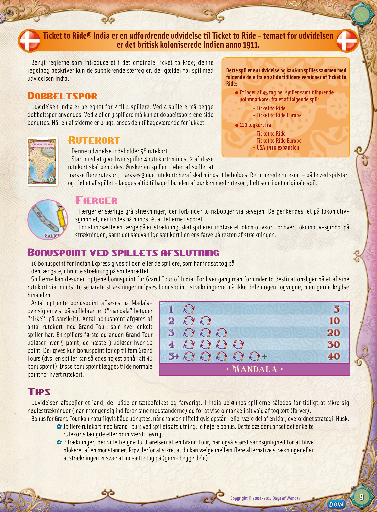

## PDF page 10

**Velkommen til Ticket to Ride® India Kartet – en utfordrende Ticket to Ride utvidelse satt i koloni India anno 1911**

Dette regelheftet beskriver forskjellene i spilloppsettet spesifikt for India **Dette er en utvidelse og forutsetter at du bruker de** Kartet og antar at du er kjent med reglene i det originale Ticket to Ride spillet. **følgende spilldelene fra en av de tidligere versjonene av** **Ticket to Ride:**

#### l Et reserve på 45 togvogner per spiller og

# Introduksjon samsvarende poengmarkører fra en av de følgende

**spillene:** Kartet over India er laget spesifikt for 2 til 4 spillere. Kun med 4 spillere kan dobbelrutene benyttes. Dersom en av rutene, på en dobbelrute, i et 2 og 3**- Ticket to Ride**

**- Ticket to Ride Europe**
spiller spill blir benyttet er den andre ruten ikke lengre tilgjengelig.

#### l 110 vognkort fra:

**- Ticket to Ride**

# Bonusbilletter-Ticket to Ride Europe

**- eller fra USA 1910 utvidelsen**
Denne utvidelsen inneholder 58 Bonusbilletter. I starten av spillet mottar hver spiller 4 bonusbilletter hvorav spilleren må beholde minst 2. Under spillets gang, dersom spilleren ønsker å trekke nye bonusbilletter, må spilleren trekke 3 nye bonusbilletter hvorav spilleren må beholde minimum 1 bonusbillett. Bonusbilletter som blir kastet, enten i starten av spillet eller under spillets gang, legges nederst i billettbunken, som i et vanlig Ticket to Ride spill.

# Ferger

Ferger er spesielle grå ruter som knytter sammen to nabobyer over vann. En fergerute har minst 1 lokomotivsymbol. For å ta i bruk en fergerute må du spille ut like mange lokomotivkort som angitt på ruten, samt et sett av vognkort for å dekke opp for de andre feltene. Du kan selvfølgelig også her spille lokomotivkort som erstatning for vognkort.

# Poengberegning

En 10 poeng Indiaekspress bonus gis til spilleren(e) som har den lengste sammenhengende ruten på kartet. Alle spillere kan også motta Grand Tour of India bonus. Hver gang man forbinder to destinasjonsbyer på en av sine billetter via minst to separate ruter utløses bonusen. Disse 2 rutene kan krysse hverandre, men kan ikke dele vogntog. Størrelsen på spillerens bonus vil variere avhengig av antall bonusbilletter benyttet på

### ï Mandala ï

strekningen, som vist på Mandala (”Sirkel” på Sanskrit) bonustabellen på kartet. Spillerens første og andre billett gir +5 poeng hver, de neste tre bonusbillettene gir +10 poeng. Bonusbilletter etter den femte brukte gir ingen ekstra poeng (hvilket betyr at det høyeste antall poeng en spiller kan motta på Grand Tour of India bonus er 40 poeng). Disse poengene kommer selvfølgelig i tillegg til poengene for fullførte ruter.

# Tips

Utvidelsen avspeiler et land som både er befolknings- og fargerikt. I India belønnes spillerne for å sikre seg nøkkelstrekninger tidlig (for å unngå at det blir overbefolket) og for å passe på sitt valg av vognkort. Grand Tour of India bonus kan utnyttes når sjansen byr seg, eller som en del av en overordnet strategi. Husk: _ Jo flere billetter som er en del av Grand Tour of India bonus ved spillets avslutning, desto større bonus mottar du ved spillets slutt uavhengig av billettenes lengde og verdi. _ Strekningen, som vil gi deg en Grand Tour of India bonus, har størst sannsynlighet for å bli blokkert av en av dine motstandere. Forsøk derfor å sikre deg flere alternativer for å fullføre Indiaturen, eller se til at det er vanskelig for dine motstandere å lage strekninger der (gjerne begge deler).

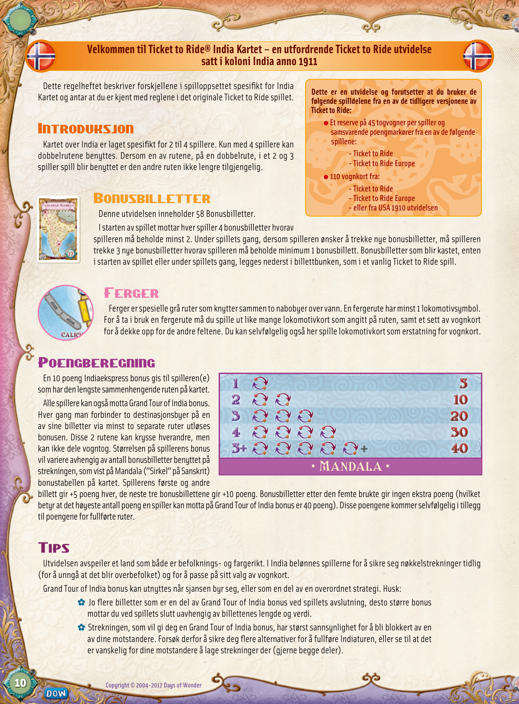

## PDF page 11

**Välkommen till Ticket to Ride® India-ett utmanande tillägg till Ticket to Ride som utspelar**

## sig i ett kolonialt Indien 1911.

Detta regelhäfte tar endast upp regelförändringarna specifika för Indienkartan och förutsätter att du är bekant med reglerna från Ticket to Ride originalspelet. **Detta spel är en expansion och kräver att du använder** **följande delar från något av de tidigare utgivna spelen i** **Ticket to Ride serien:**

# Introduktionl En uppsättning av 45 tåg per spelare och

**poängmarkörer från någon av följande:** Indienkartan är speciellt designad för 2 till 4 spelare. Det är endast i ett 4 personers spel som båda spåren i en dubbelsträcka kan mutas in. I ett 2**- Ticket to Ride**

**- Ticket to Ride Europe**
eller 3 personers spel kan det andra spåret inte mutas in av någon när det första är taget.l **110 Tågkort från**

**- Ticket to Ride**
**- Ticket to Ride Europe**

# Biljettkort-USA 1910 expansionen

Denna expansion innehåller 58 biljettkort. I början av spelet delas 4 biljettkort ut till varje spelare. Av dessa måste han behålla minst 2. En spelare som under spelets gång vill dra nya biljettkort drar 3 biljetter varav minst 1 måste behållas. De biljettkort som väljs bort, både i spelets början och under spelets gång, läggs tillbaka i botten på biljettkortshögen, precis som i vanliga Ticket to Ride.

# Färjor

Färjor är speciella grå sträckor som går genom vatten och binder samman två städer. De är lätta att känna igen på att åtminstone en av rutorna innehåller en lokomotivikon. För att muta in en färjesträcka måste spelaren lösa in ett lokomotiv för varje ikon på sträckan och ett set av tågkort i en färg för de resterande rutorna på färjesträckan.

# Bonus i slutspelet

Indian Express är ett 10 poängs bonuskort som till-delas spelaren som byggt den längsta sammanhängande sträckan på brädet. Varje spelare har också möjligheten att få Grand Tour av India bonusar. Varje biljettkort vars 2 desti- nationsstäder är sammanbundna av minst 2 distinkt sammanhängande vägar med ägarens egna plasttåg ger en Grand Tour bonus. Dessa två vägar får korsaï Mandala ï varandra men kan inte dela tåg. Hur stor bonusen blir beror på antalet biljetter som kvalificerar sig för en bonus och kan utläsas på Mandalan (”Cirkel” på Sanskrit) för bonuspoäng på kartan. Spelarens första och andra kvalificerande biljett är värda +5 poäng var. De nästa tre är värda +10 poäng var. Den femte och övriga ger ingen bonus alls. (Det innebär att den största bonus en spelare kan få för sina Grand Tour biljetter är 40 poäng.) Självklart är bonus-poängen ett plus till poängen för att ha klarat av själva biljetten.

# Speltips

Indienkartan speglar ett land som är både tätbefolkat och färgrikt och belönar spelare som tidigt mutar in nyckelsträckor (för att undvika att bli utmanövrerad) och som tänker efter vilka färger de drar. En strategi är att antingen målmedvetet eller på känn planera för Grand Tour bonusarna. Tänk bara på att: _ Ju fler kvalificerande biljetter desto större bonus i slutet på spelet, oavsett längden eller poängvärdet på de individuella biljetterna. _ Den sista sträckan för att få ihop en Grand Tour kommer sannolikt att blockeras av en motståndare. Försök se till att du har en alternativ väg för den sista sträckan eller att göra det svårt för motståndarna att bygga den (eller båda).

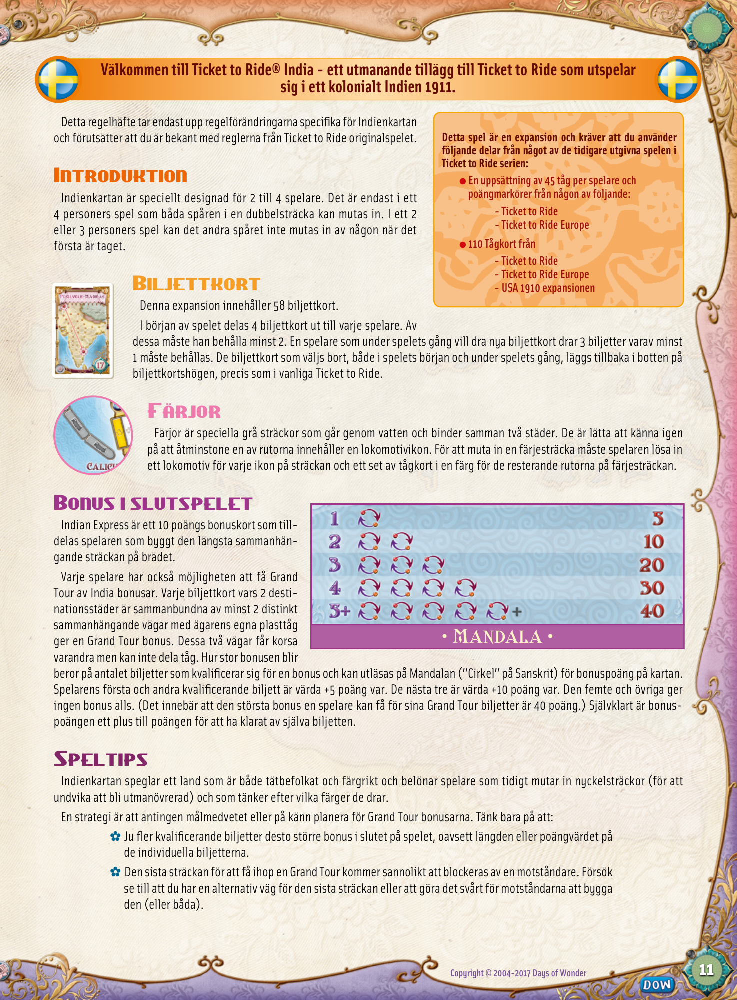

## PDF page 12

## Ticket to Ride

### India

#### Map design by

# Ian Vincent

#### Illustrations by Julien Delval

#### Graphic Design by Cyrille Daujean

#### Play testing Credits

##### Remerciements • Spieletests • Pruebas de Juego • Testspelers

- **Kiitokset • Spiltestere • Spilltesting • speltestare**
  **Thank you to everyone who contributed: David Brain and Brett "Spiel" Gilbert for help picking a theme. Fransje Kaa for lending me Michal.** **Olav Rokne, Linda Lait, Alan & Charlie Paull and their blind test groups. Michal Cross for his inspirational artwork. A legion of amazing** **playtesters at Swiggers, TheGamesClub and London On Board. Everyone who ever told me what they love about this great series of games** **and everyone involved in bringing the series to life!**

| 2   | 3   |
| --- | --- |
| 4   | 5   |
| 6   | 7   |
| 8   | 9   |
| 10  | 11  |

**Copyright © 2004-2017 Days of Wonder** “Days of Wonder”, “Ticket to Ride”, “Ticket to Ride Europe” and “Ticket to Ride India” are trademarks or registered trademarks of Days of Wonder, Inc. All Rights Reserved. „Days of Wonder“, „Zug um Zug“, „Zug um Zug Europa“ und „Zug um Zug India” sind Warenzeichen oder eingetragene Warenzeichen von Days of Wonder, Inc. Alle Rechte vorbehalten. “Days of Wonder”, “Ticket to Ride”, “Ticket to Ride Europe” y “Ticket to Ride India” son marcas comerciales o marcas comerciales registradas de Days of Wonder, Inc. Todos los derechos reservados. “Days of Wonder”, “Ticket to Ride”, “Ticket to Ride Europa” e “Ticket to Ride India” sono marchi o marchi depositati di Days of Wonder, Inc. Tutti i Diritti Riservati. “Days of Wonder”, “Ticket to Ride”, “Ticket to Ride Europe” en “Ticket to Ride India” zijn handelsmerken of geregistreerde handelsmerken van Days of Wonder, Inc. Alle rechten voorbehouden.

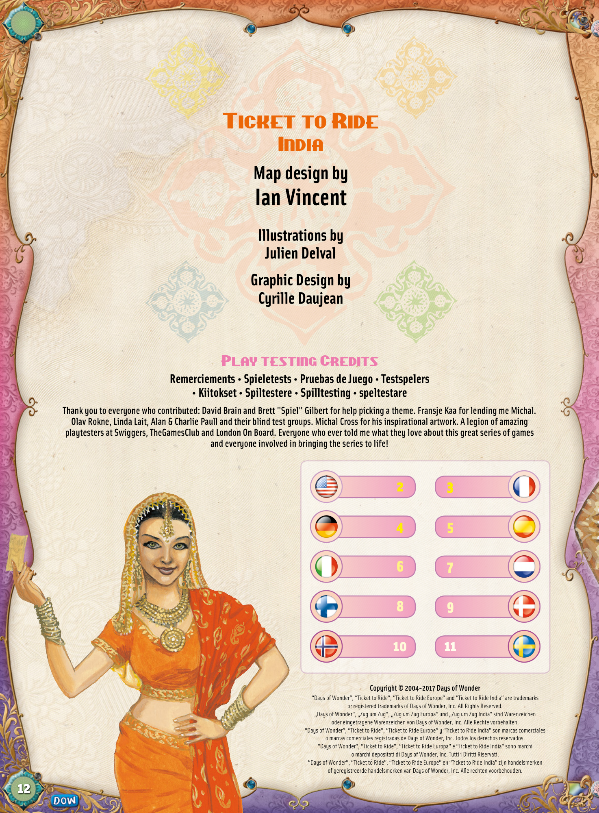
