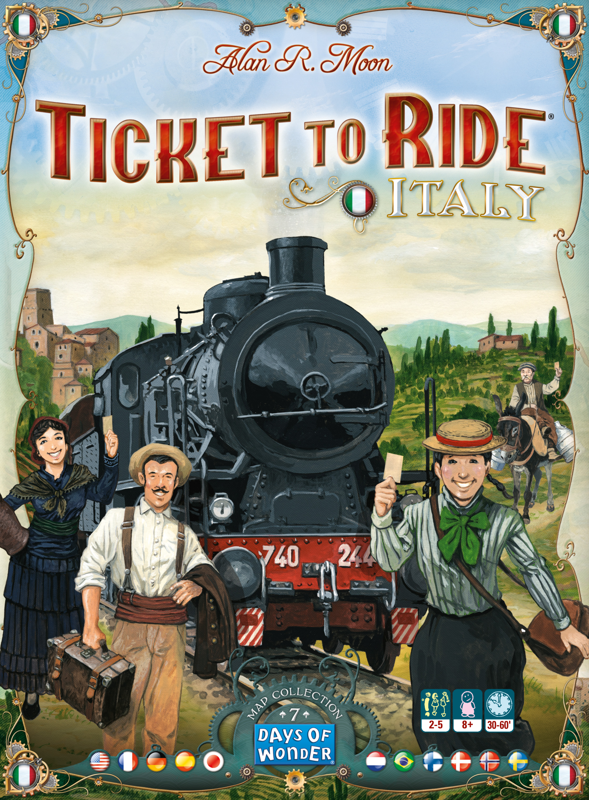
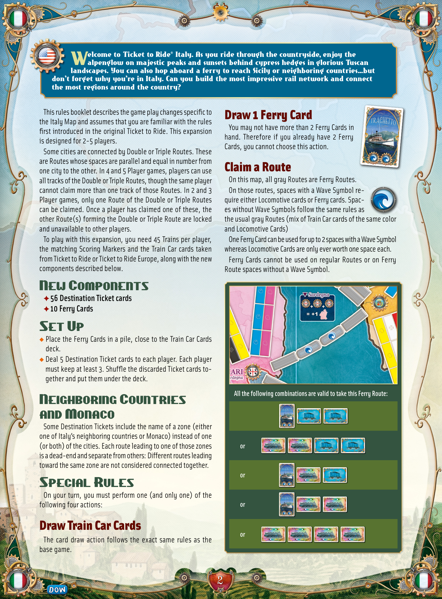
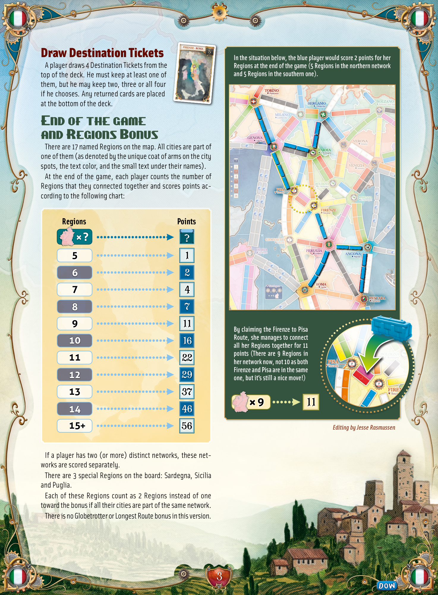
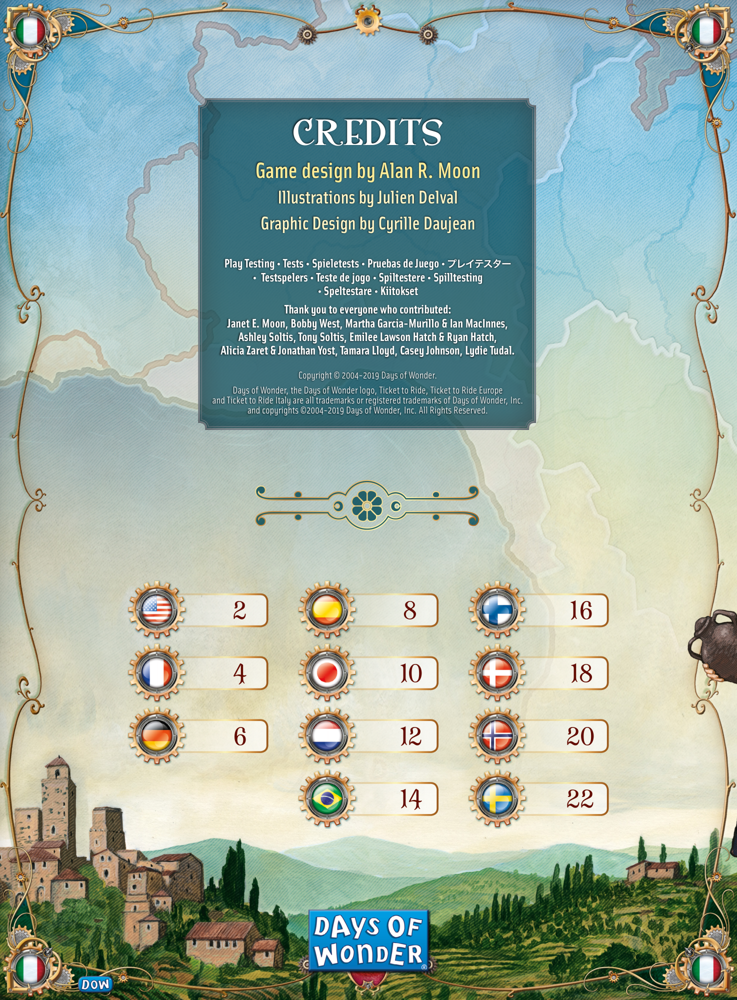

# Italy

[Source PDF](rules.pdf) · [Map reference](italy-map.png)

Parsed locally with pdf-inspector. Original page images preserve diagrams, tables, and layout; consult them where extraction is unclear.

## PDF page 1

The parser returned no text for this page. Refer to the page image below.

## PDF page 2

elcome to Ticket to Ride® Italy. As you ride through the countryside, enjoy the

# Walpenglow on majestic peaks and sunsets behind cypress hedges in glorious Tuscan

landscapes. You can also hop aboard a ferry to reach Sicily or neighboring countries…but don’t forget why you’re in Italy. Can you build the most impressive rail network and connect the most regions around the country?

This rules booklet describes the game play changes specific to the Italy Map and assumes that you are familiar with the rules first introduced in the original Ticket to Ride. This expansion is designed for 2-5 players. Some cities are connected by Double or Triple Routes. These are Routes whose spaces are parallel and equal in number from one city to the other. In 4 and 5 Player games, players can use all tracks of the Double or Triple Routes, though the same player cannot claim more than one track of those Routes. In 2 and 3 Player games, only one Route of the Double or Triple Routes can be claimed. Once a player has claimed one of these, the other Route(s) forming the Double or Triple Route are locked and unavailable to other players. To play with this expansion, you need 45 Trains per player, the matching Scoring Markers and the Train Car cards taken from Ticket to Ride or Ticket to Ride Europe, along with the new components described below.

## New Components

✦ **56 Destination Ticket cards** ✦ **10 Ferry Cards**

## Set Up

u Place the Ferry Cards in a pile, close to the Train Car Cards deck. u Deal 5 Destination Ticket cards to each player. Each player must keep at least 3. Shuffle the discarded Ticket cards together and put them under the deck.

## Neighboring Countries and Monaco

Some Destination Tickets include the name of a zone (either one of Italy’s neighboring countries or Monaco) instead of one (or both) of the cities. Each route leading to one of those zones is a dead-end and separate from others: Different routes leading toward the same zone are not considered connected together.

## Special Rules

On your turn, you must perform one (and only one) of the following four actions:

## Draw Train Car Cards

The card draw action follows the exact same rules as the base game.

## Draw 1 Ferry Card

You may not have more than 2 Ferry Cards in hand. Therefore if you already have 2 Ferry Cards, you cannot choose this action.

## Claim a Route

On this map, all gray Routes are Ferry Routes. On those routes, spaces with a Wave Symbol re- quire either Locomotive cards or Ferry cards. Spaces without Wave Symbols follow the same rules as the usual gray Routes (mix of Train Car cards of the same color and Locomotive Cards) One Ferry Card can be used for up to 2 spaces with a Wave Symbol whereas Locomotive Cards are only ever worth one space each. Ferry Cards cannot be used on regular Routes or on Ferry Route spaces without a Wave Symbol.

**All the following combinations are valid to take this Ferry Route:**

**or**

**or**

**or**

**or**

## PDF page 3

**FIRENZE ROMA**

# Draw Destination Tickets

**In the situation below, the blue player would score 2 points for her** A player draws 4 Destination Tickets from the **Regions at the end of the game (5 Regions in the northern network** top of the deck. He must keep at least one of **and 5 Regions in the southern one).** them, but he may keep two, three or all four if he chooses. Any returned cards are placed at the bottom of the deck.

# End of the game and Regions Bonus

There are 17 named Regions on the map. All cities are part of one of them (as denoted by the unique coat of arms on the city spots, the text color, and the small text under their names). At the end of the game, each player counts the number of Regions that they connected together and scores points ac- cording to the following chart:

### Regions Points

?

## 5 1 6 2

## 7 4 8 7

## 9 11

**By claiming the Firenze to Pisa** **Route, she manages to connect**

## 10 16

**all her Regions together for 11 points (There are 9 Regions in**

## 11 22

**her network now, not 10 as both** **Firenze and Pisa are in the same**

## 12 29one, but it’s still a nice move!) 13 37

### 9 11

## 14 46 15 56 Editing by Jesse Rasmussen

If a player has two (or more) distinct networks, these networks are scored separately. There are 3 special Regions on the board: Sardegna, Sicilia and Puglia. Each of these Regions count as 2 Regions instead of one toward the bonus if all their cities are part of the same network. There is no Globetrotter or Longest Route bonus in this version.

## PDF page 4

# CREDITS

## Game design by Alan R. Moon

### Illustrations by Julien Delval Graphic Design by Cyrille Daujean

**Play Testing • Tests • Spieletests • Pruebas de Juego •** プレイテスター

- **Testspelers • Teste de jogo • Spiltestere • Spilltesting**
- **Speltestare • Kiitokset**

#### Thank you to everyone who contributed:

**Janet E. Moon, Bobby West, Martha Garcia-Murillo & Ian MacInnes,** **Ashley Soltis, Tony Soltis, Emilee Lawson Hatch & Ryan Hatch,** **Alicia Zaret & Jonathan Yost, Tamara Lloyd, Casey Johnson, Lydie Tudal.**

Copyright © 2004-2019 Days of Wonder. Days of Wonder, the Days of Wonder logo, Ticket to Ride, Ticket to Ride Europe and Ticket to Ride Italy are all trademarks or registered trademarks of Days of Wonder, Inc. and copyrights ©2004-2019 Days of Wonder, Inc. All Rights Reserved.

| 2   | 8   | 16  |
| --- | --- | --- |
| 4   | 10  | 18  |
| 6   | 12  | 20  |
|     | 14  | 22  |

