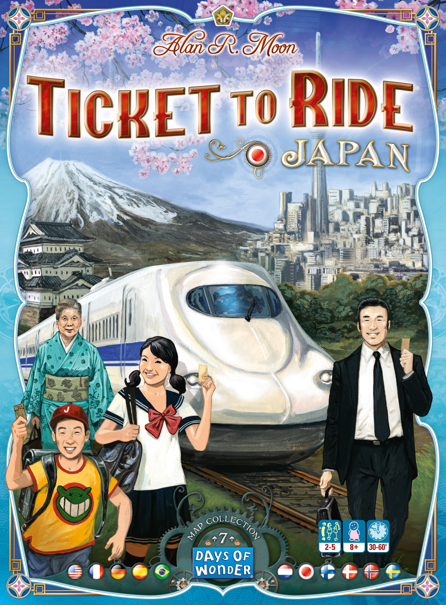
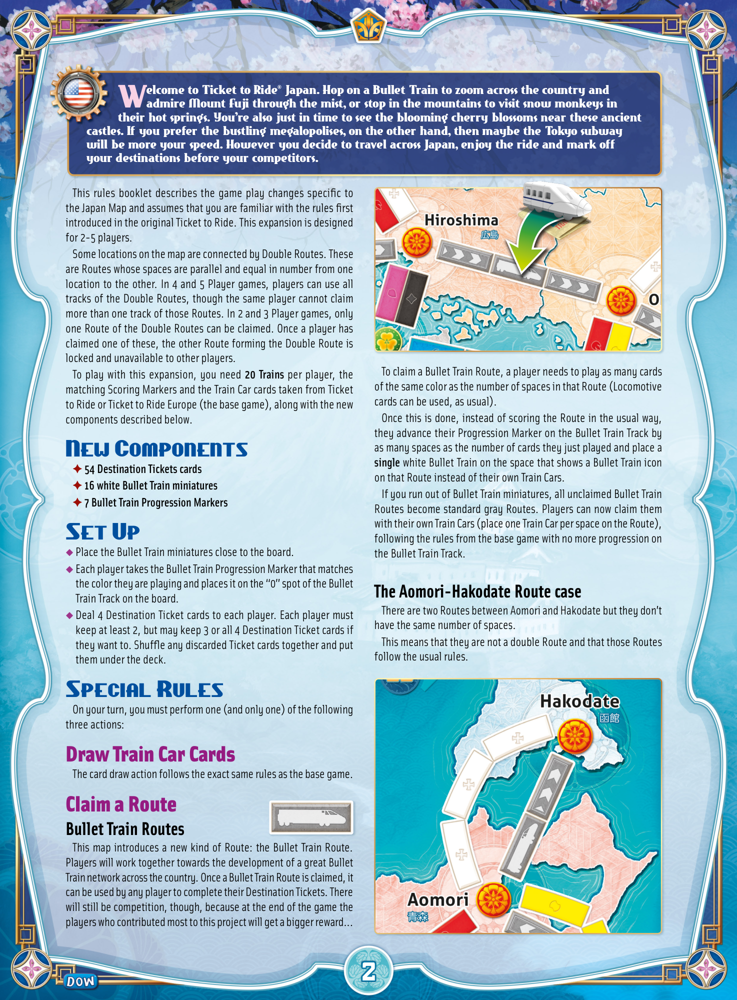
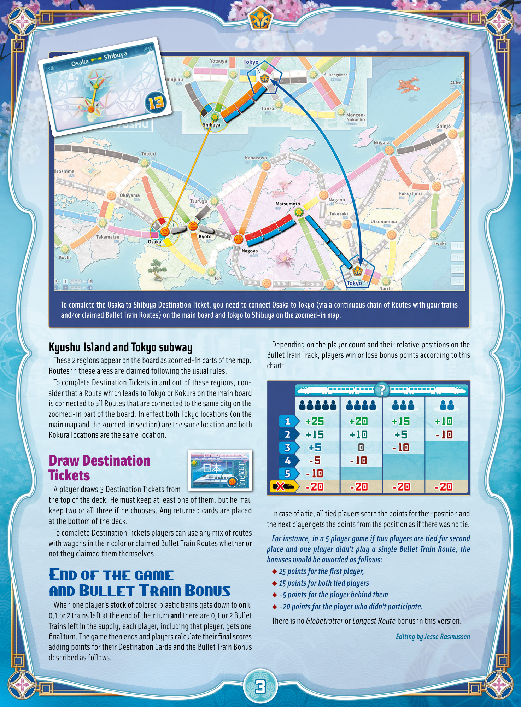
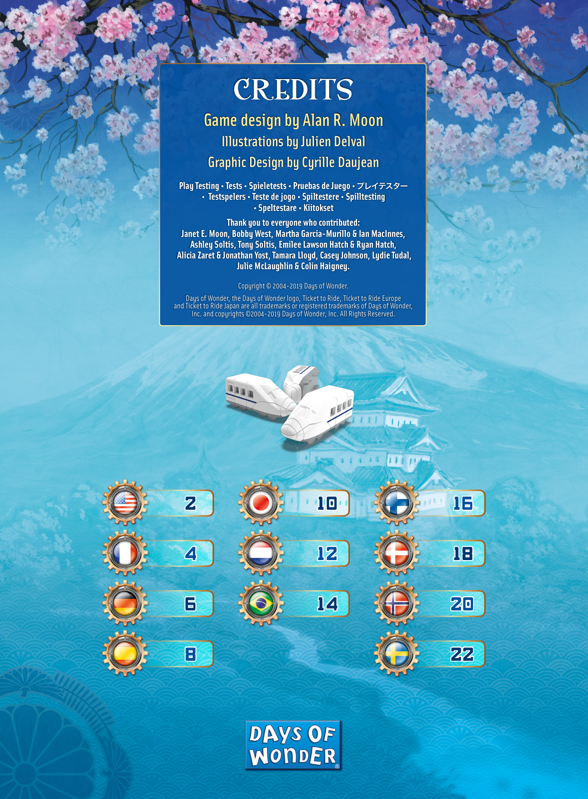

# Japan

[Source PDF](rules.pdf) · [Map reference](japan-map.png)

Parsed locally with pdf-inspector. Original page images preserve diagrams, tables, and layout; consult them where extraction is unclear.

## PDF page 1

The parser returned no text for this page. Refer to the page image below.

## PDF page 2

elcome to Ticket to Ride® Japan. Hop on a Bullet Train to zoom across the country and Wadmire Mount Fuji through the mist, or stop in the mountains to visit snow monkeys in their hot springs. You’re also just in time to see the blooming cherry blossoms near these ancient castles. If you prefer the bustling megalopolises, on the other hand, then maybe the Tokyo subway will be more your speed. However you decide to travel across Japan, enjoy the ride and mark off your destinations before your competitors.

This rules booklet describes the game play changes specific to the Japan Map and assumes that you are familiar with the rules first introduced in the original Ticket to Ride. This expansion is designed for 2-5 players. Some locations on the map are connected by Double Routes. These are Routes whose spaces are parallel and equal in number from one location to the other. In 4 and 5 Player games, players can use all tracks of the Double Routes, though the same player cannot claim more than one track of those Routes. In 2 and 3 Player games, only one Route of the Double Routes can be claimed. Once a player has claimed one of these, the other Route forming the Double Route is locked and unavailable to other players. To play with this expansion, you need **20 Trains** per player, the matching Scoring Markers and the Train Car cards taken from Ticket to Ride or Ticket to Ride Europe (the base game), along with the new components described below.

## New Components

✦ **54 Destination Tickets cards** ✦ **16 white Bullet Train miniatures** ✦ **7 Bullet Train Progression Markers**

## Set Up

u Place the Bullet Train miniatures close to the board. u Each player takes the Bullet Train Progression Marker that matches the color they are playing and places it on the “0” spot of the Bullet uTrain Track on the board. Deal 4 Destination Ticket cards to each player. Each player must keep at least 2, but may keep 3 or all 4 Destination Ticket cards if they want to. Shuffle any discarded Ticket cards together and put them under the deck.

## Special Rules

On your turn, you must perform one (and only one) of the following three actions:

## Draw Train Car Cards

The card draw action follows the exact same rules as the base game.

## Claim a Route

### Bullet Train Routes

This map introduces a new kind of Route: the Bullet Train Route. Players will work together towards the development of a great Bullet Train network across the country. Once a Bullet Train Route is claimed, it can be used by any player to complete their Destination Tickets. There will still be competition, though, because at the end of the game the players who contributed most to this project will get a bigger reward...

To claim a Bullet Train Route, a player needs to play as many cards of the same color as the number of spaces in that Route (Locomotive cards can be used, as usual). Once this is done, instead of scoring the Route in the usual way, they advance their Progression Marker on the Bullet Train Track by as many spaces as the number of cards they just played and place a **single** white Bullet Train on the space that shows a Bullet Train icon on that Route instead of their own Train Cars. If you run out of Bullet Train miniatures, all unclaimed Bullet Train Routes become standard gray Routes. Players can now claim them with their own Train Cars (place one Train Car per space on the Route), following the rules from the base game with no more progression on the Bullet Train Track.

### The Aomori-Hakodate Route case

There are two Routes between Aomori and Hakodate but they don’t have the same number of spaces. This means that they are not a double Route and that those Routes follow the usual rules.

## PDF page 3

**To complete the Osaka to Shibuya Destination Ticket, you need to connect Osaka to Tokyo (via a continuous chain of Routes with your trains** **and/or claimed Bullet Train Routes) on the main board and Tokyo to Shibuya on the zoomed-in map.**

Depending on the player count and their relative positions on the

## Kyushu Island and Tokyo subway

Bullet Train Track, players win or lose bonus points according to this These 2 regions appear on the board as zoomed-in parts of the map. chart: Routes in these areas are claimed following the usual rules. To complete Destination Tickets in and out of these regions, con- sider that a Route which leads to Tokyo or Kokura on the main board is connected to all Routes that are connected to the same city on the zoomed-in part of the board. In effect both Tokyo locations (on the main map and the zoomed-in section) are the same location and both Kokura locations are the same location.

# Draw Destination Tickets

A player draws 3 Destination Tickets from the top of the deck. He must keep at least one of them, but he may keep two or all three if he chooses. Any returned cards are placed In case of a tie, all tied players score the points for their position and at the bottom of the deck. the next player gets the points from the position as if there was no tie. To complete Destination Tickets players can use any mix of routes _For instance, in a 5 player game if two players are tied for second_ with wagons in their color or claimed Bullet Train Routes whether or _place and one player didn’t play a single Bullet Train Route, the_ not they claimed them themselves. _bonuses would be awarded as follows:_ ◆ _25 points for the first player,_

# End of the game

◆ _15 points for both tied players_

# and Bullet Train Bonus◆-5 points for the player behind them

When one player’s stock of colored plastic trains gets down to only◆*-20 points for the player who didn’t participate.* 0,1 or 2 trains left at the end of their turn **and** there are 0,1 or 2 Bullet There is no _Globetrotter_ or _Longest Route_ bonus in this version. Trains left in the supply, each player, including that player, gets one final turn. The game then ends and players calculate their final scores _Editing by Jesse Rasmussen_ adding points for their Destination Cards and the Bullet Train Bonus described as follows.

## PDF page 4

# CREDITS

## Game design by Alan R. Moon

### Illustrations by Julien Delval Graphic Design by Cyrille Daujean

**Play Testing • Tests • Spieletests • Pruebas de Juego •** プレイテスター

- **Testspelers • Teste de jogo • Spiltestere • Spilltesting**
- **Speltestare • Kiitokset**

#### Thank you to everyone who contributed:

**Janet E. Moon, Bobby West, Martha Garcia-Murillo & Ian MacInnes,** **Ashley Soltis, Tony Soltis, Emilee Lawson Hatch & Ryan Hatch,** **Alicia Zaret & Jonathan Yost, Tamara Lloyd, Casey Johnson, Lydie Tudal,** **Julie McLaughlin & Colin Haigney.**

Copyright © 2004-2019 Days of Wonder. Days of Wonder, the Days of Wonder logo, Ticket to Ride, Ticket to Ride Europe and Ticket to Ride Japan are all trademarks or registered trademarks of Days of Wonder, Inc. and copyrights ©2004-2019 Days of Wonder, Inc. All Rights Reserved.

| 2   | 10  | 16  |
| --- | --- | --- |
| 4   | 12  | 18  |
| 6   | 14  | 20  |
| 8   |     | 22  |

