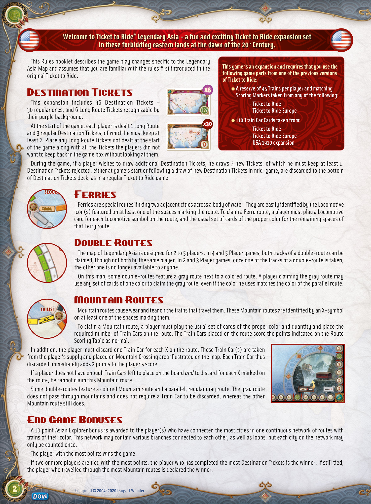

# Legendary Asia

[Source PDF](rules.pdf) · [Map reference](map.png) · [Map image source](https://boardgamegeek.com/image/3080152)

Parsed locally with pdf-inspector. Original page images preserve diagrams, tables, and layout; consult them where extraction is unclear.

## PDF page 1

**Welcome to Ticket to Ride® Legendary Asia-a fun and exciting Ticket to Ride expansion set** **th**

## in these forbidding eastern lands at the dawn of the 20 Century.

This Rules booklet describes the game play changes specific to the Legendary **This game is an expansion and requires that you use the** Asia Map and assumes that you are familiar with the rules first introduced in the **following game parts from one of the previous versions** original Ticket to Ride. **of Ticket to Ride:** **x6**l **A reserve of 45 Trains per player and matching**

# Destination Tickets Scoring Markers taken from any of the following:

This expansion includes 36 Destination Tickets –**- Ticket to Ride** 30 regular ones, and 6 Long Route Tickets recognizable by**- Ticket to Ride Europe** their purple background. l **110 Train Car Cards taken from:** **x30** At the start of the game, each player is dealt 1 Long Route

**- Ticket to Ride**
and 3 regular Destination Tickets, of which he must keep at

**- Ticket to Ride Europe**
least 2. Place any Long Route Tickets not dealt at the start

**- USA 1910 expansion**
of the game along with all the Tickets the players did not want to keep back in the game box without looking at them. During the game, if a player wishes to draw additional Destination Tickets, he draws 3 new Tickets, of which he must keep at least 1. Destination Tickets rejected, either at game‘s start or following a draw of new Destination Tickets in mid-game, are discarded to the bottom of Destination Tickets deck, as in a regular Ticket to Ride game.

# Ferries

Ferries are special routes linking two adjacent cities across a body of water. They are easily identified by the Locomotive icon(s) featured on at least one of the spaces marking the route. To claim a Ferry route, a player must play a Locomotive card for each Locomotive symbol on the route, and the usual set of cards of the proper color for the remaining spaces of that Ferry route.

# Double Routes

The map of Legendary Asia is designed for 2 to 5 players. In 4 and 5 Player games, both tracks of a double-route can be claimed, though not both by the same player. In 2 and 3 Player games, once one of the tracks of a double-route is taken, the other one is no longer available to anyone. On this map, some double-routes feature a gray route next to a colored route. A player claiming the gray route may use any set of cards of one color to claim the gray route, even if the color he uses matches the color of the parallel route.

# Mountain Routes

Mountain routes cause wear and tear on the trains that travel them. These Mountain routes are identified by an X-symbol on at least one of the spaces making them. To claim a Mountain route, a player must play the usual set of cards of the proper color and quantity and place the required number of Train Cars on the route. The Train Cars placed on the route score the points indicated on the Route Scoring Table as normal. In addition, the player must discard one Train Car for each X on the route. These Train Car(s) are taken from the player’s supply and placed on Mountain Crossing area illustrated on the map. Each Train Car thus discarded immediately adds 2 points to the player’s score. If a player does not have enough Train Cars left to place on the board _and_ to discard for each X marked on the route, he cannot claim this Mountain route. Some double-routes feature a colored Mountain route and a parallel, regular gray route. The gray route does not pass through mountains and does not require a Train Car to be discarded, whereas the other Mountain route still does.

# End Game Bonuses

A 10 point Asian Explorer bonus is awarded to the player(s) who have connected the most cities in one continuous network of routes with trains of their color. This network may contain various branches connected to each other, as well as loops, but each city on the network may only be counted once. The player with the most points wins the game. If two or more players are tied with the most points, the player who has completed the most Destination Tickets is the winner. If still tied, the player who travelled through the most Mountain routes is declared the winner.

