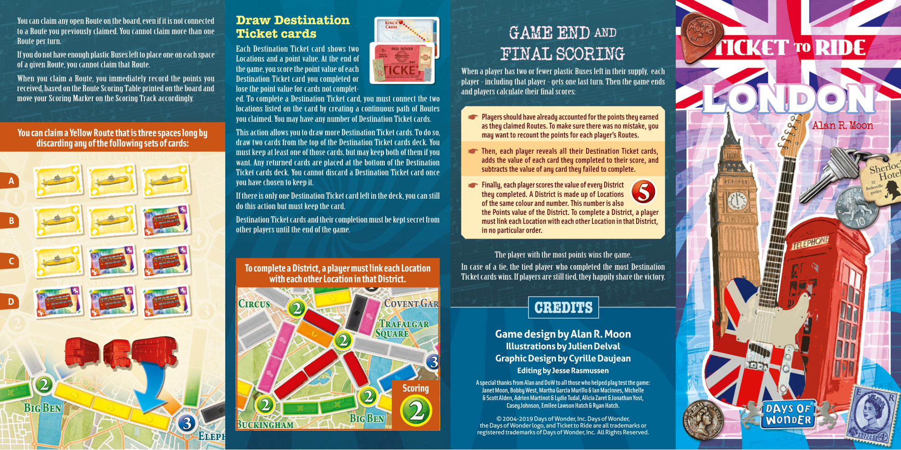
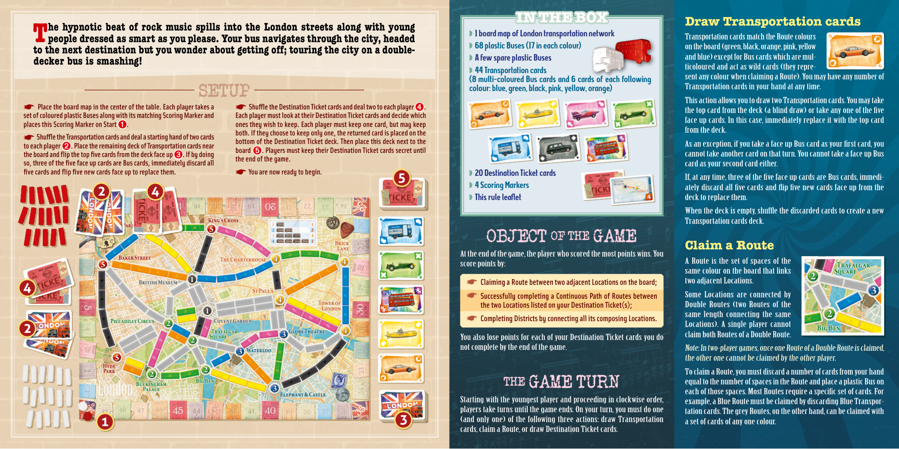

# London

[Source PDF](rules.pdf) · [Map reference](london-map.png)

Parsed locally with pdf-inspector. Original page images preserve diagrams, tables, and layout; consult them where extraction is unclear.

## PDF page 1

You can claim any open Route on the board, even if it is not connected **Draw Destination** to a Route you previously claimed. You cannot claim more than one **Ticket cards** AND

# GAME END

Route per turn. Each Destination Ticket card shows two If you do not have enough plastic Buses left to place one on each space Locations and a point value. At the end ofFINAL SCORING of a given Route, you cannot claim that Route. the game, you score the point value of each When a player has two or fewer plastic Buses left in their supply, each When you claim a Route, you immediately record the points you Destination Ticket card you completed or player-including that player-gets one last turn. Then the game ends received, based on the Route Scoring Table printed on the board and lose the point value for cards not complet- and players calculate their final scores: move your Scoring Marker on the Scoring Track accordingly. ed. To complete a Destination Ticket card, you must connect the two locations listed on the card by creating a continuous path of Routes you claimed. You may have any number of Destination Ticket cards. ☛**Players should have already accounted for the points they earned** **as they claimed Routes. To make sure there was no mistake, you** Alan R. Moon **You can claim a Yellow Route that is three spaces long by** This action allows you to draw more Destination Ticket cards. To do so, **may want to recount the points for each player’s Routes.** **discarding any of the following sets of cards:**draw two cards from the top of the Destination Ticket cards deck. You must keep at least one of those cards, but may keep both of them if you ☛ want. Any returned cards are placed at the bottom of the Destination**Then, each player reveals all their Destination Ticket cards,** **adds the value of each card they completed to their score, and** Ticket cards deck. You cannot discard a Destination Ticket card once **A subtracts the value of any card they failed to complete.** you have chosen to keep it. ☛**Finally, each player scores the value of every District** If there is only one Destination Ticket card left in the deck, you can still**they completed. A District is made up of Locations** **of the same colour and number. This number is also** do this action but must keep the card. **the Points value of the District. To complete a District, a player** **B**Destination Ticket cards and their completion must be kept secret from**must link each Location with each other Location in that District,** other players until the end of the game. **in no particular order.**

The player with the most points wins the game. **C** **To complete a District, a player must link each Location**In case of a tie, the tied player who completed the most Destination Ticket cards wins. If players are still tied, they happily share the victory. **with each other Location in that District.**

**D**

## CREDITS

**Game design by Alan R. Moon** **Illustrations by Julien Delval** **Graphic Design by Cyrille Daujean** **Editing by Jesse Rasmussen** **A special thanks from Alan and DoW to all those who helped play test the game:** **ScoringJanet Moon, Bobby West, Martha Garcia Murillo & Ian MacInnes, Michelle** **& Scott Alden, Adrien Martinot & Lydie Tudal, Alicia Zaret & Jonathan Yost,** **Casey Johnson, Emilee Lawson Hatch & Ryan Hatch.** © 2004-2019 Days of Wonder, Inc. Days of Wonder, the Days of Wonder logo, and Ticket to Ride are all trademarks or registered trademarks of Days of Wonder, Inc. All Rights Reserved.



## PDF page 2

```
IN THE BOX
Draw Transportation cards he hypnotic beat of rock music spills into the London streets along with young
```

◗ 1 board map of London transportation network Transportation cards match the Route colours

# Tpeople dressed as smart as you please. Your bus navigates through the city, headed

◗ 68 plastic Buses (17 in each colour)on the board (green, black, orange, pink, yellow **to the next destination but you wonder about getting off; touring the city on a double-** ◗ A few spare plastic Busesand blue) except for Bus cards which are mul- **decker bus is smashing!** ticoloured and act as wild cards (they repre- ◗ 44 Transportation cards sent any colour when claiming a Route). You may have any number of (8 multi-coloured Bus cards and 6 cards of each following colour: blue, green, black, pink, yellow, orange)Transportation cards in your hand at any time.

## SETUP

This action allows you to draw two Transportation cards. You may take ☛**Place the board map in the center of the table. Each player takes a**☛**Shuffle the Destination Ticket cards and deal two to each player**➍**.**the top card from the deck (a blind draw) or take any one of the five **set of coloured plastic Buses along with its matching Scoring Marker and Each player must look at their Destination Ticket cards and decide which** face up cards. In this case, immediately replace it with the top card **places this Scoring Marker on Start**➊<sup>.</sup> **ones they wish to keep. Each player must keep one card, but may keep** from the deck. **both. If they choose to keep only one, the returned card is placed on the** ☛**Shuffle the Transportation cards and deal a starting hand of two cards** **bottom of the Destination Ticket deck. Then place this deck next to the** **to each player**➋**. Place the remaining deck of Transportation cards near**As an exception, if you take a face up Bus card as your first card, you **board**➎**. Players must keep their Destination Ticket cards secret until** **the board and flip the top five cards from the deck face up**➌**. If by doing** cannot take another card on that turn. You cannot take a face up Bus **the end of the game.** **so, three of the five face up cards are Bus cards, immediately discard all** card as your second card either. **five cards and flip five new cards face up to replace them.**☛**You are now ready to begin.** ◗ 20 Destination Ticket cards **5** If, at any time, three of the five face up cards are Bus cards, immedi- ◗ 4 Scoring Markersately discard all five cards and flip five new cards face up from the **2 4** ◗ This rule leaflet deck to replace them. When the deck is empty, shuffle the discarded cards to create a new Transportation cards deck. OF THE

## OBJECT GAME

```
Claim a Route
```

At the end of the game, the player who scored the most points wins. You A Route is the set of spaces of the score points by: same colour on the board that links ☛ **Claiming a Route between two adjacent Locations on the board;** two adjacent Locations. **4** ☛ **Successfully completing a Continuous Path of Routes between** Some Locations are connected by **the two Locations listed on your Destination Ticket(s);** Double Routes (two Routes of the same length connecting the same ☛ **Completing Districts by connecting all its composing Locations.** Locations). A single player cannot **2** claim both Routes of a Double Route. You also lose points for each of your Destination Ticket cards you do not complete by the end of the game. Note: In two-player games, once one Route of a Double Route is claimed, the other one cannot be claimed by the other player. To claim a Route, you must discard a number of cards from your hand THE equal to the number of spaces in the Route and place a plastic Bus on

## GAME TURN

each of those spaces. Most Routes require a specific set of cards. For Starting with the youngest player and proceeding in clockwise order, example, a Blue Route must be claimed by discarding Blue Transpor- players take turns until the game ends. On your turn, you must do one tation cards. The grey Routes, on the other hand, can be claimed with (and only one) of the following three actions: draw Transportation a set of cards of any one colour. cards, claim a Route, or draw Destination Ticket cards.


