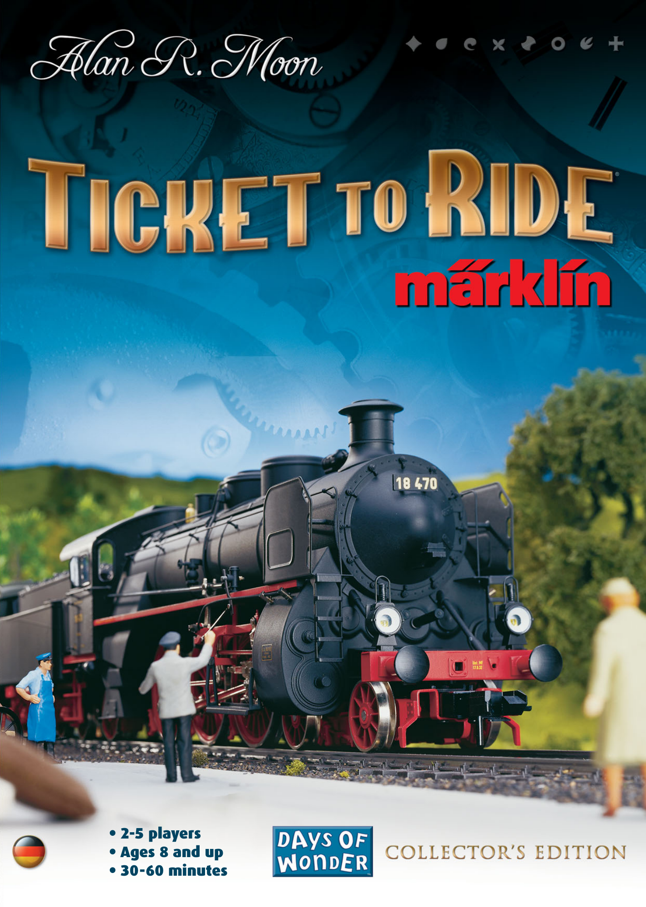
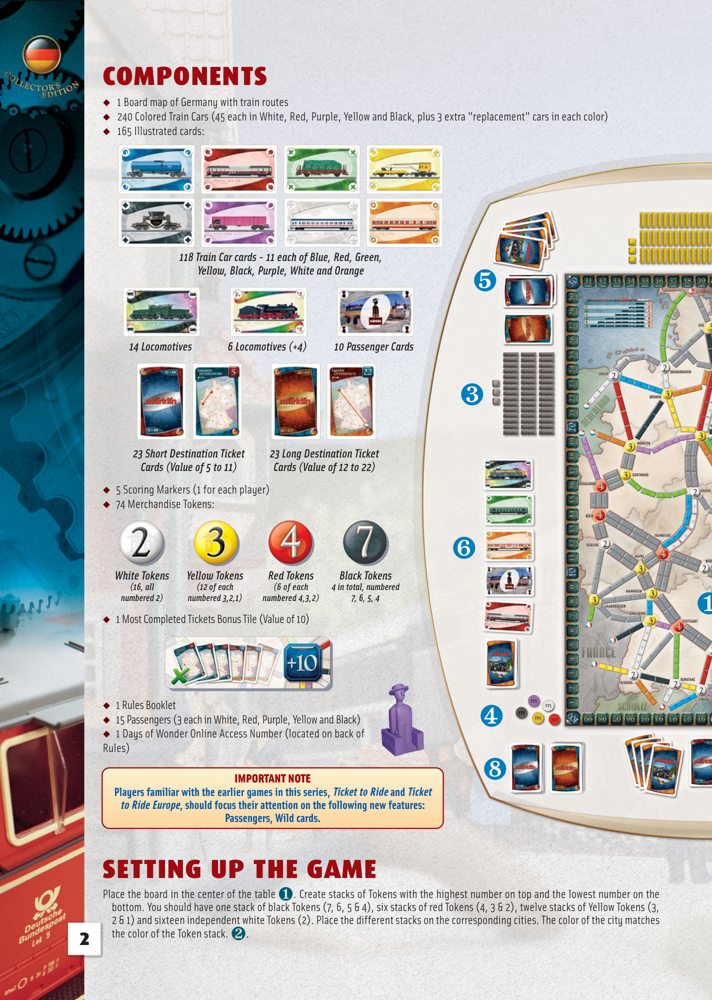
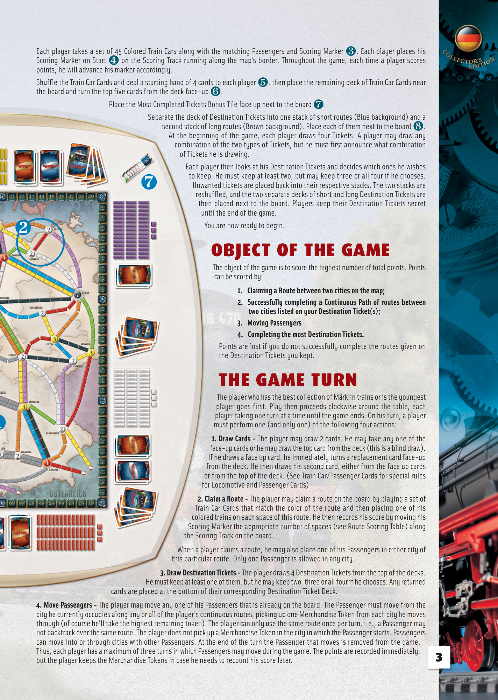
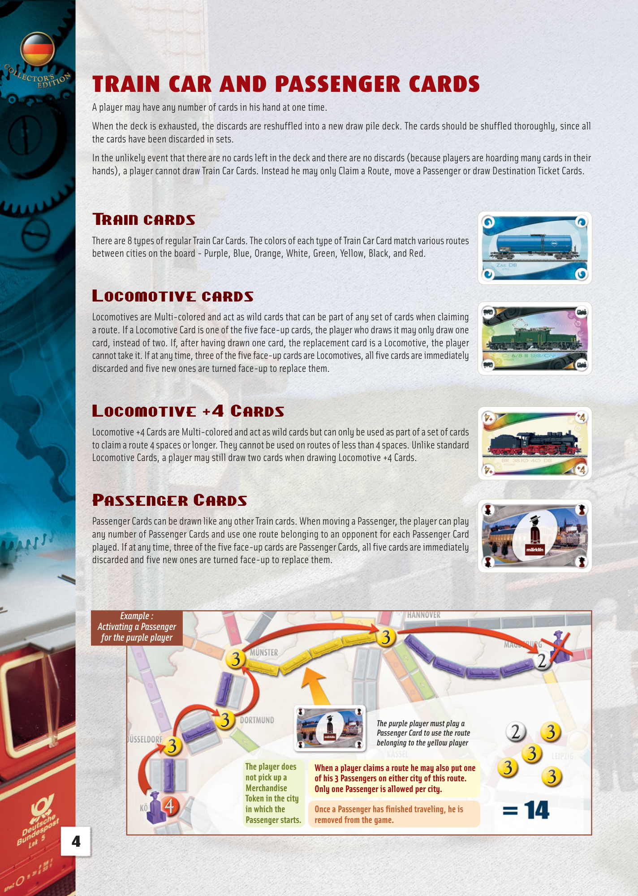
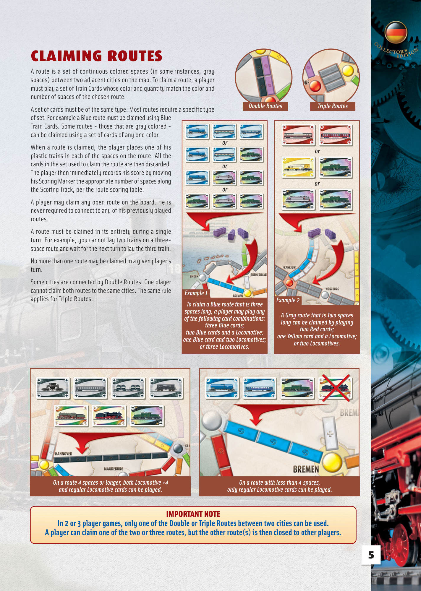
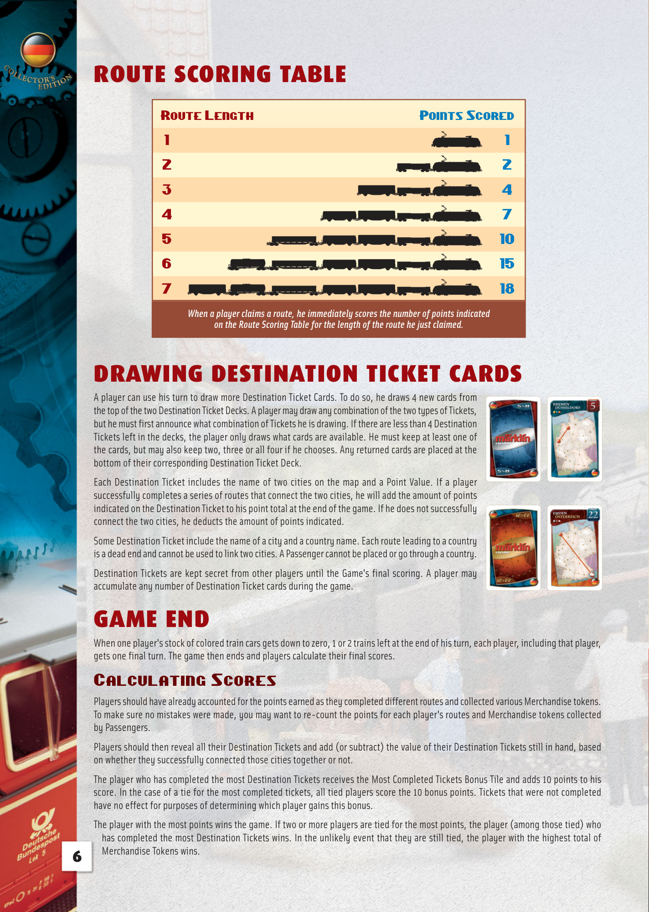
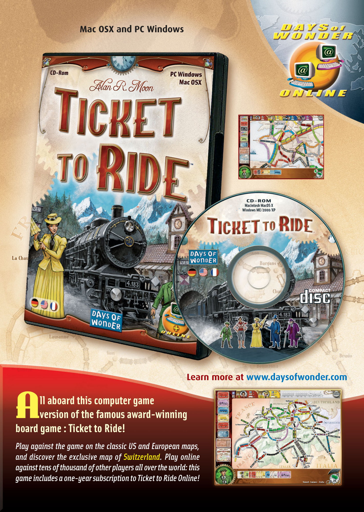
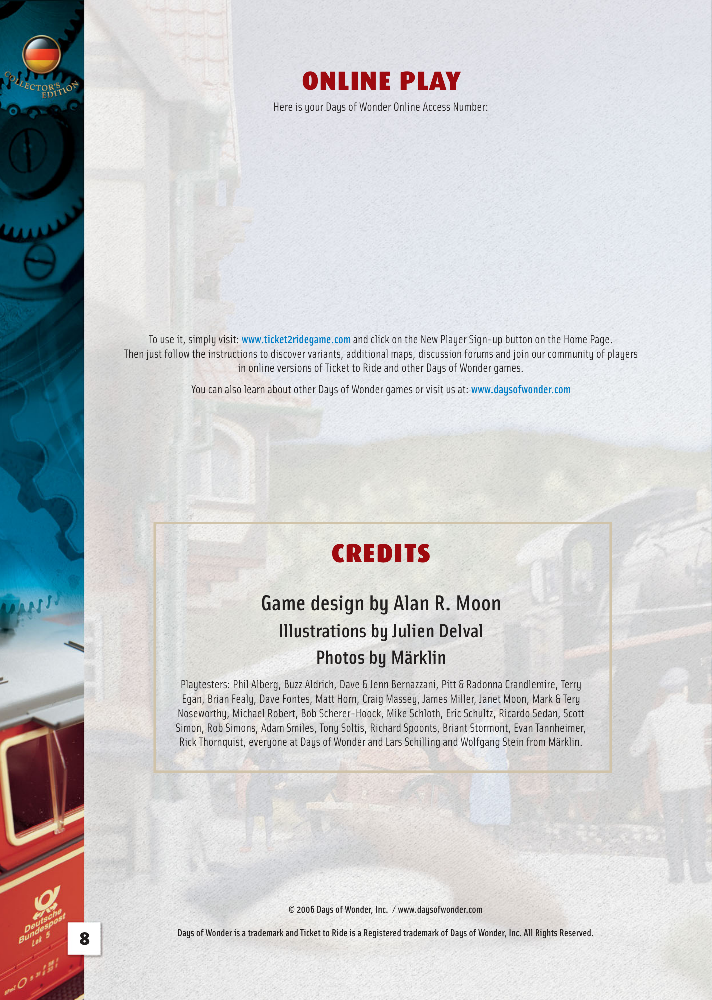

# Märklin

[Source PDF](rules.pdf) · [Map reference](map.png) · [Map image source](https://labsk.net/index.php?topic=247932.0)

Parsed locally with pdf-inspector. Original page images preserve diagrams, tables, and layout; consult them where extraction is unclear.

## PDF page 1

The parser returned no text for this page. Refer to the page image below.

## PDF page 2

| ◆ ◆ ◆ ◆ ◆ ◆  | 165 Illustrated cards: 14 Locomotives White Tokens (16, all numbered 2) | COMPONENTS 1 Board map of Germany with train routes 23 Short Destination Ticket Cards (Value of 5 to 11) 5 Scoring Markers (1 for each player) 74 Merchandise Tokens: 1 Most Completed Tickets Bonus Tile (Value of 10) | Yellow Tokens (12 of each numbered 3,2,1)                                                                                | 118 Train Car cards - 11 each of Blue, Red, Green, Yellow, Black, Purple, White and Orange 6 Locomotives (+4)                                                                                        | Red Tokens (6 of each numbered 4,3,2) | 240 Colored Train Cars (45 each in White, Red, Purple, Yellow and Black, plus 3 extra "replacement" cars in each color) 10 Passenger Cards 23 Long Destination Ticket Cards (Value of 12 to 22) Black Tokens 4 in total, numbered 7, 6, 5, 4                                    | ❺ ❸ ❻ ❶                                                                                |
| ------------ | ----------------------------------------------------------------------- | ----------------------------------------------------------------------------------------------------------------------------------------------------------------------------------------------------------------------- | ------------------------------------------------------------------------------------------------------------------------ | ---------------------------------------------------------------------------------------------------------------------------------------------------------------------------------------------------- | ------------------------------------- | ------------------------------------------------------------------------------------------------------------------------------------------------------------------------------------------------------------------------------------------------------------------------------- | -------------------------------------------------------------------------------------- |
| ◆ ◆ ◆ Rules) | 1 Rules Booklet                                                         |                                                                                                                                                                                                                         | 15 Passengers (3 each in White, Red, Purple, Yellow and Black) 1 Days of Wonder Online Access Number (located on back of |                                                                                                                                                                                                      |                                       |                                                                                                                                                                                                                                                                                 | ❹                                                                                      |
| 2            |                                                                         | Place the board in the center of the table the color of the Token stack.                                                                                                                                                | SETTING UP THE GAME❷.                                                                                         | IMPORTANT NOTE Players familiar with the earlier games in this series, Ticket to Ride and Ticket to Ride Europe, should focus their attention on the following new features: Passengers, Wild cards. | ❶                                     | bottom. You should have one stack of black Tokens (7, 6, 5 & 4), six stacks of red Tokens (4, 3 & 2), twelve stacks of Yellow Tokens (3, 2 & 1) and sixteen independent white Tokens (2). Place the different stacks on the corresponding cities. The color of the city matches | ❽. Create stacks of Tokens with the highest number on top and the lowest number on the |

## PDF page 3

Each player takes a set of 45 Colored Train Cars along with the matching Passengers and Scoring Marker❸. Each player places his Scoring Marker on Start❹on the Scoring Track running along the map's border. Throughout the game, each time a player scores points, he will advance his marker accordingly.

Shuffle the Train Car Cards and deal a starting hand of 4 cards to each player❺, then place the remaining deck of Train Car Cards near the board and turn the top five cards from the deck face-up❻.

Place the Most Completed Tickets Bonus Tile face up next to the board❼.

Separate the deck of Destination Tickets into one stack of short routes (Blue background) and a second stack of long routes (Brown background). Place each of them next to the board❽. At the beginning of the game, each player draws four Tickets. A player may draw any combination of the two types of Tickets, but he must first announce what combination of Tickets he is drawing.

Each player then looks at his Destination Tickets and decides which ones he wishes to keep. He must keep at least two, but may keep three or all four if he chooses.

# ❼Unwanted tickets are placed back into their respective stacks. The two stacks are

reshuffled, and the two separate decks of short and long Destination Tickets are then placed next to the board. Players keep their Destination Tickets secret until the end of the game.

You are now ready to begin. ❷

## OBJECT OF THE GAME

The object of the game is to score the highest number of total points. Points can be scored by:

### 1. Claiming a Route between two cities on the map;

**2. Successfully completing a Continuous Path of routes between two cities listed on your Destination Ticket(s);**

### 3. Moving Passengers

### 4. Completing the most Destination Tickets.

Points are lost if you do not successfully complete the routes given on the Destination Tickets you kept.

## THE GAME TURN

The player who has the best collection of Märklin trains or is the youngest player goes first. Play then proceeds clockwise around the table, each player taking one turn at a time until the game ends. On his turn, a player

# ❶must perform one (and only one) of the following four actions:

**1. Draw Cards -**The player may draw 2 cards. He may take any one of the face-up cards or he may draw the top card from the deck (this is a blind draw). If he draws a face up card, he immediately turns a replacement card face-up
from the deck. He then draws his second card, either from the face up cards or from the top of the deck. (See Train Car/Passenger Cards for special rules for Locomotive and Passenger Cards)

**2. Claim a Route -**The player may claim a route on the board by playing a set of Train Car Cards that match the color of the route and then placing one of his
colored trains on each space of this route. He then records his score by moving his Scoring Marker the appropriate number of spaces (see Route Scoring Table) along the Scoring Track on the board.

When a player claims a route, he may also place one of his Passengers in either city of this particular route. Only one Passenger is allowed in any city.

**3. Draw Destination Tickets -**The player draws 4 Destination Tickets from the top of the decks.
He must keep at least one of them, but he may keep two, three or all four if he chooses. Any returned cards are placed at the bottom of their corresponding Destination Ticket Deck.

**4. Move Passengers -**The player may move any one of his Passengers that is already on the board. The Passenger must move from the city he currently occupies along any or all of the player's continuous routes, picking up one Merchandise Token from each city he moves through (of course he'll take the highest remaining token). The player can only use the same route once per turn, i.e., a Passenger may not backtrack over the same route. The player does not pick up a Merchandise Token in the city in which the Passenger starts. Passengers can move into or through cities with other Passengers. At the end of the turn the Passenger that moves is removed from the game. Thus, each player has a maximum of three turns in which Passengers may move during the game. The points are recorded immediately, but the player keeps the Merchandise Tokens in case he needs to recount his score later.

## PDF page 4

# TRAIN CAR AND PASSENGER CARDS

A player may have any number of cards in his hand at one time.

When the deck is exhausted, the discards are reshuffled into a new draw pile deck. The cards should be shuffled thoroughly, since all the cards have been discarded in sets.

In the unlikely event that there are no cards left in the deck and there are no discards (because players are hoarding many cards in their hands), a player cannot draw Train Car Cards. Instead he may only Claim a Route, move a Passenger or draw Destination Ticket Cards.

## Train cards

There are 8 types of regular Train Car Cards. The colors of each type of Train Car Card match various routes between cities on the board-Purple, Blue, Orange, White, Green, Yellow, Black, and Red.

## Locomotive cards

Locomotives are Multi-colored and act as wild cards that can be part of any set of cards when claiming a route. If a Locomotive Card is one of the five face-up cards, the player who draws it may only draw one card, instead of two. If, after having drawn one card, the replacement card is a Locomotive, the player cannot take it. If at any time, three of the five face-up cards are Locomotives, all five cards are immediately discarded and five new ones are turned face-up to replace them.

## Locomotive +4+ Cards

Locomotive +4 Cards are Multi-colored and act as wild cards but can only be used as part of a set of cards to claim a route 4 spaces or longer. They cannot be used on routes of less than 4 spaces. Unlike standard Locomotive Cards, a player may still draw two cards when drawing Locomotive +4 Cards.

## Passenger Cards

Passenger Cards can be drawn like any other Train cards. When moving a Passenger, the player can play any number of Passenger Cards and use one route belonging to an opponent for each Passenger Card played. If at any time, three of the five face-up cards are Passenger Cards, all five cards are immediately discarded and five new ones are turned face-up to replace them.

_Example :_ _Activating a Passenger_ _for the purple player_

_The purple player must play a_ _Passenger Card to use the route_ _belonging to the yellow player_

|                   |                                                   | belonging to the yellow player |
| ----------------- | ------------------------------------------------- | ------------------------------ |
| The player does   | When a player claims a route he may also put one  |                                |
| not pick up a     | of his 3 Passengers on either city of this route. |                                |
| Merchandise       | Only one Passenger is allowed per city.           |                                |
| Token in the city |                                                   |                                |
| in which the      | Once a Passenger has finished traveling, he is    |                                |
| Passenger starts. | removed from the game.                            |                                |

## PDF page 5

# CLAIMING ROUTES

A route is a set of continuous colored spaces (in some instances, gray spaces) between two adjacent cities on the map. To claim a route, a player must play a set of Train Cards whose color and quantity match the color and number of spaces of the chosen route. _Double Routes Triple Routes_ A set of cards must be of the same type. Most routes require a specific type of set. For example a Blue route must be claimed using Blue Train Cards. Some routes-those that are gray colored-can be claimed using a set of cards of any one color.

When a route is claimed, the player places one of his _or_ plastic trains in each of the spaces on the route. All the cards in the set used to claim the route are then discarded. The player then immediately records his score by moving his Scoring Marker the appropriate number of spaces along _or_ the Scoring Track, per the route scoring table.

A player may claim any open route on the board. He is

| Example 1 | or or or                                                                                                                                                                                                               |
| --------- | ---------------------------------------------------------------------------------------------------------------------------------------------------------------------------------------------------------------------- |
|           | To claim a Blue route that is three spaces long, a player may play any of the following card combinations: three Blue cards; two Blue cards and a Locomotive; one Blue card and two Locomotives; or three Locomotives. |

never required to connect to any of his previously played routes.

A route must be claimed in its entirety during a single turn. For example, you cannot lay two trains on a three- space route and wait for the next turn to lay the third train.

No more than one route may be claimed in a given player's turn.

Some cities are connected by Double Routes. One player cannot claim both routes to the same cities. The same rule applies for Triple Routes. _Example 2_

_A Gray route that is Two spaces_ _long can be claimed by playing_ _two Red cards;_ _one Yellow card and a Locomotive;_ _or two Locomotives._

_On a route 4 spaces or longer, both Locomotive +4 On a route with less than 4 spaces,_ _and regular Locomotive cards can be played. only regular Locomotive cards can be played._

## IMPORTANT NOTE

**In 2 or 3 player games, only one of the Double or Triple Routes between two cities can be used.** **A player can claim one of the two or three routes, but the other route(s) is then closed to other players.**

## PDF page 6

# ROUTE SCORING TABLE

### Route Length Points Scored

1 1 2 2 3 4 4 7 5 10 6 15 7 18 _When a player claims a route, he immediately scores the number of points indicated_ _on the Route Scoring Table for the length of the route he just claimed._

# DRAWING DESTINATION TICKET CARDS

A player can use his turn to draw more Destination Ticket Cards. To do so, he draws 4 new cards from the top of the two Destination Ticket Decks. A player may draw any combination of the two types of Tickets, but he must first announce what combination of Tickets he is drawing. If there are less than 4 Destination Tickets left in the decks, the player only draws what cards are available. He must keep at least one of the cards, but may also keep two, three or all four if he chooses. Any returned cards are placed at the bottom of their corresponding Destination Ticket Deck. Each Destination Ticket includes the name of two cities on the map and a Point Value. If a player successfully completes a series of routes that connect the two cities, he will add the amount of points indicated on the Destination Ticket to his point total at the end of the game. If he does not successfully connect the two cities, he deducts the amount of points indicated. Some Destination Ticket include the name of a city and a country name. Each route leading to a country is a dead end and cannot be used to link two cities. A Passenger cannot be placed or go through a country. Destination Tickets are kept secret from other players until the Game's final scoring. A player may accumulate any number of Destination Ticket cards during the game.

# GAME END

When one player's stock of colored train cars gets down to zero, 1 or 2 trains left at the end of his turn, each player, including that player, gets one final turn. The game then ends and players calculate their final scores.

## Calculating Scores

Players should have already accounted for the points earned as they completed different routes and collected various Merchandise tokens. To make sure no mistakes were made, you may want to re-count the points for each player's routes and Merchandise tokens collected by Passengers. Players should then reveal all their Destination Tickets and add (or subtract) the value of their Destination Tickets still in hand, based on whether they successfully connected those cities together or not. The player who has completed the most Destination Tickets receives the Most Completed Tickets Bonus Tile and adds 10 points to his score. In the case of a tie for the most completed tickets, all tied players score the 10 bonus points. Tickets that were not completed have no effect for purposes of determining which player gains this bonus. The player with the most points wins the game. If two or more players are tied for the most points, the player (among those tied) who has completed the most Destination Tickets wins. In the unlikely event that they are still tied, the player with the highest total of Merchandise Tokens wins.

## PDF page 7

**Mac OSX and PC Windows**

**Learn more at www.daysofwonder.com**

## ll aboard this computer game

# Aversion of the famous award-winning

## board game : Ticket to Ride!

_Play against the game on the classic US and European maps,_ _and discover the exclusive map of Switzerland. Play online_ _against tens of thousand of other players all over the world: this_ _game includes a one-year subscription to Ticket to Ride Online!_

## PDF page 8

# ONLINE PLAY

Here is your Days of Wonder Online Access Number:

To use it, simply visit: **www.ticket2ridegame.com** and click on the New Player Sign-up button on the Home Page. Then just follow the instructions to discover variants, additional maps, discussion forums and join our community of players in online versions of Ticket to Ride and other Days of Wonder games. You can also learn about other Days of Wonder games or visit us at: **www.daysofwonder.com**

# CREDITS

## Game design by Alan R. Moon

### Illustrations by Julien Delval Photos by Märklin

Playtesters: Phil Alberg, Buzz Aldrich, Dave & Jenn Bernazzani, Pitt & Radonna Crandlemire, Terry Egan, Brian Fealy, Dave Fontes, Matt Horn, Craig Massey, James Miller, Janet Moon, Mark & Tery Noseworthy, Michael Robert, Bob Scherer-Hoock, Mike Schloth, Eric Schultz, Ricardo Sedan, Scott Simon, Rob Simons, Adam Smiles, Tony Soltis, Richard Spoonts, Briant Stormont, Evan Tannheimer, Rick Thornquist, everyone at Days of Wonder and Lars Schilling and Wolfgang Stein from Märklin.

**© 2006 Days of Wonder, Inc. / www.daysofwonder.com** **Days of Wonder is a trademark and Ticket to Ride is a Registered trademark of Days of Wonder, Inc. All Rights Reserved.**

