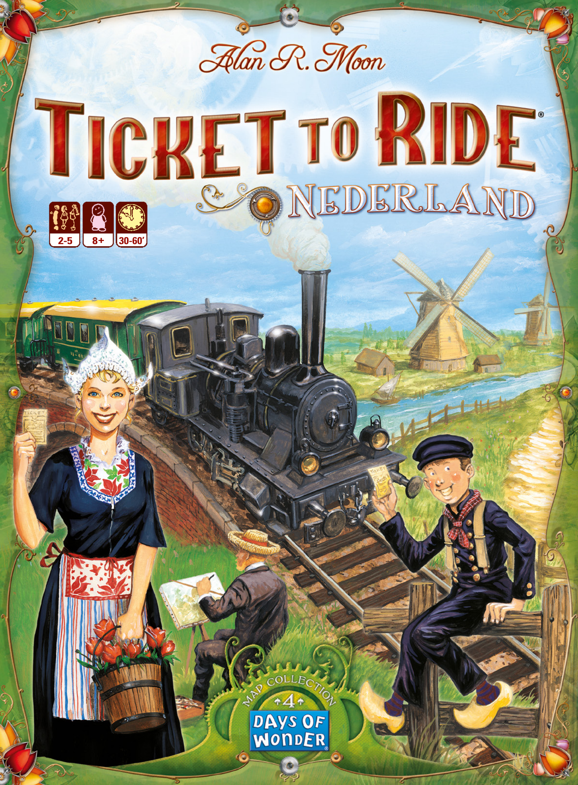
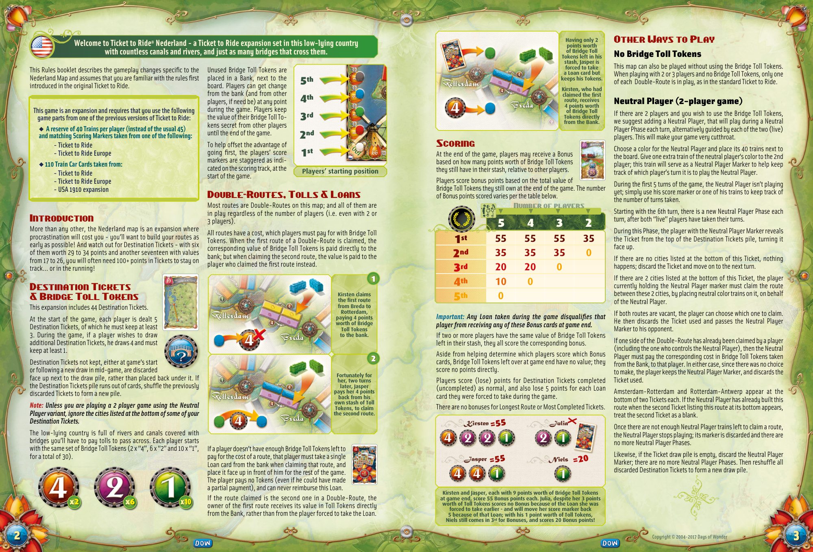
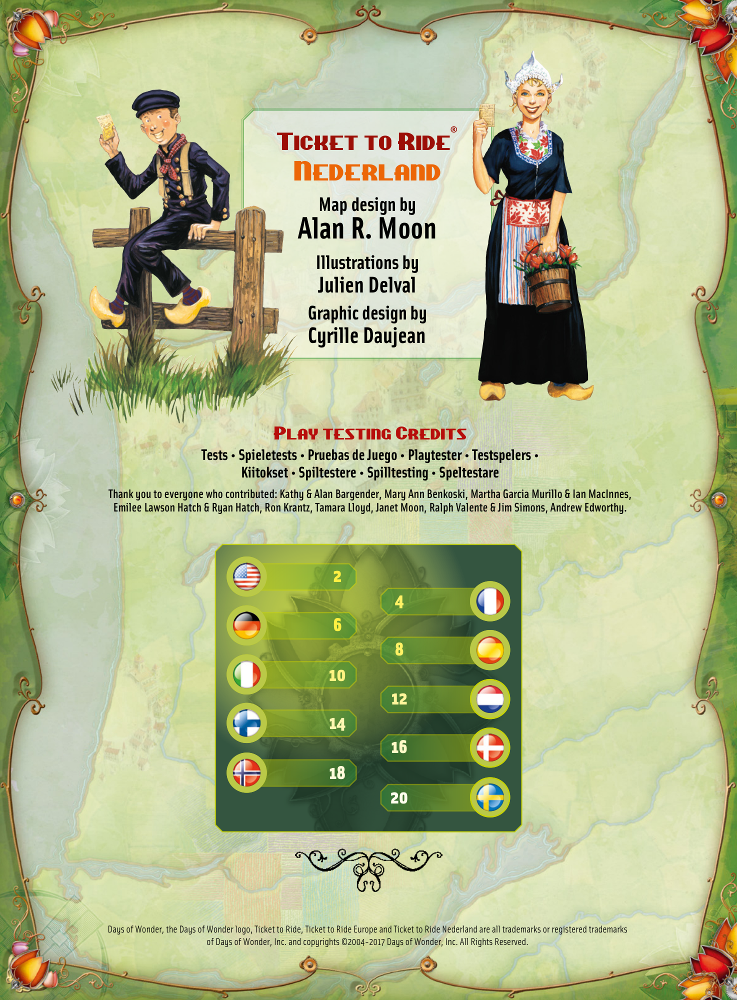

# Nederland

[Source PDF](rules.pdf) · [Map reference](nederland-map.png)

Parsed locally with pdf-inspector. Original page images preserve diagrams, tables, and layout; consult them where extraction is unclear.

## PDF page 1

The parser returned no text for this page. Refer to the page image below.

## PDF page 2

#### Nederland-a Ticket to Ride expansion set in this low-lying country

**Welcome to Ticket to Ride® with countless canals and rivers, and just as many bridges that cross them.**

This Rules booklet describes the gameplay changes specific to the Nederland Map and assumes that you are familiar with the rules first introduced in the original Ticket to Ride.

#### This game is an expansion and requires that you use the following

#### game parts from one of the previous versions of Ticket to Ride:

u **A reserve of 40 Trains per player (instead of the usual 45)** **and matching Scoring Markers taken from one of the following:**

**- Ticket to Ride**
**- Ticket to Ride Europe**
u **110 Train Car Cards taken from:**

**- Ticket to Ride**
**- Ticket to Ride Europe**
**- USA 1910 expansion**

### Introduction

More than any other, the Nederland map is an expansion where procrastination will cost you-you’ll want to build your routes as early as possible! And watch out for Destination Tickets-with six of them worth 29 to 34 points and another seventeen with values from 17 to 26, you will often need 100+ points in Tickets to stay on track... or in the running!

### Destination Tickets & Bridge Toll Tokens

#### This expansion includes 44 Destination Tickets.

At the start of the game, each player is dealt 5 Destination Tickets, of which he must keep at least

3. During the game, if a player wishes to draw additional Destination Tickets, he draws 4 and must keep at least 1. Destination Tickets not kept, either at game‘s start or following a new draw in mid-game, are discarded face up next to the draw pile, rather than placed back under it. If the Destination Tickets pile runs out of cards, shuffle the previously discarded Tickets to form a new pile.
   **\*Note:** Unless you are playing a 2 player game using the Neutral\*
   _Player variant, ignore the cities listed at the bottom of some of your_ _Destination Tickets._ The low-lying country is full of rivers and canals covered with bridges you’ll have to pay tolls to pass across. Each player starts with the same set of Bridge Toll Tokens (2 x “4”, 6 x “2” and 10 x “1”, for a total of 30).
   Unused Bridge Toll Tokens are placed in a Bank, next to the **5th** board. Players can get change from the bank (and from other **4th** players, if need be) at any point during the game. Players keep the value of their Bridge Toll To-**3rd** kens secret from other players until the end of the game. **2nd** To help offset the advantage of st going first, the players’ score**1** markers are staggered as indi- cated on the scoring track, at the **Players’ starting position** start of the game.

### Double-Routes, Tolls & Loans

Most routes are Double-Routes on this map; and all of them are in play regardless of the number of players (i.e. even with 2 or 3 players).

All routes have a cost, which players must pay for with Bridge Toll Tokens. When the first route of a Double-Route is claimed, the corresponding value of Bridge Toll Tokens is paid directly to the bank; but when claiming the second route, the value is paid to the player who claimed the first route instead.

**1**

**Kirsten claims the first route**

**from Breda to** **Rotterdam, paying 4 points**

**Toll Tokens** **worth of Bridge**

**to the bank.**

**points worth** **Having only 2** **of Bridge Toll** **Tokens left in his stash, Jasper is** **forced to take a Loan card but** **keeps his Tokens.** **Kirsten, who had claimed the first** **route, receives** **4 points worth of Bridge Toll** **Tokens directly from the Bank.**

### Scoring

At the end of the game, players may receive a Bonus based on how many points worth of Bridge Toll Tokens they still have in their stash, relative to other players. Players score bonus points based on the total value of Bridge Toll Tokens they still own at the end of the game. The number of Bonus points scored varies per the table below. Number of players

# 5 4 3 2 1st 55 55 55 35

# 2nd 35 35 35 0 3rd 20 20 0

# 4th 10 0 5th 0

**\*Important:** Any Loan taken during the game disqualifies that\* _player from receiving any of these Bonus cards at game end._ If two or more players have the same value of Bridge Toll Tokens left in their stash, they all score the corresponding bonus. Aside from helping determine which players score which Bonus cards, Bridge Toll Tokens left over at game end have no value; they score no points directly. Players score (lose) points for Destination Tickets completed (uncompleted) as normal, and also lose 5 points for each Loan card they were forced to take during the game. There are no bonuses for Longest Route or Most Completed Tickets.

Kirsten Julia **=55**

### Other Ways to Play

## No Bridge Toll Tokens

This map can also be played without using the Bridge Toll Tokens. When playing with 2 or 3 players and no Bridge Toll Tokens, only one of each Double-Route is in play, as in the standard Ticket to Ride.

## Neutral Player (2-player game)

If there are 2 players and you wish to use the Bridge Toll Tokens, we suggest adding a Neutral Player, that will play during a Neutral Player Phase each turn, alternatively guided by each of the two (live) players. This will make your game very cutthroat.

Choose a color for the Neutral Player and place its 40 trains next to the board. Give one extra train of the neutral player‘s color to the 2nd player; this train will serve as a Neutral Player Marker to help keep track of which player’s turn it is to play the Neutral Player.

During the first 5 turns of the game, the Neutral Player isn’t playing yet; simply use his score marker or one of his trains to keep track of the number of turns taken.

Starting with the 6th turn, there is a new Neutral Player Phase each turn, after both “live” players have taken their turns.

During this Phase, the player with the Neutral Player Marker reveals the Ticket from the top of the Destination Tickets pile, turning it face up.

If there are no cities listed at the bottom of this Ticket, nothing happens; discard the Ticket and move on to the next turn.

If there are 2 cities listed at the bottom of this Ticket, the player currently holding the Neutral Player marker must claim the route between these 2 cities, by placing neutral color trains on it, on behalf of the Neutral Player.

If both routes are vacant, the player can choose which one to claim. He then discards the Ticket used and passes the Neutral Player Marker to his opponent.

If one side of the Double-Route has already been claimed by a player (including the one who controls the Neutral Player), then the Neutral Player must pay the corresponding cost in Bridge Toll Tokens taken from the Bank, to that player. In either case, since there was no choice to make, the player keeps the Neutral Player Marker, and discards the Ticket used.

Amsterdam-Rotterdam and Rotterdam-Antwerp appear at the bottom of two Tickets each. If the Neutral Player has already built this route when the second Ticket listing this route at its bottom appears, treat the second Ticket as a blank.

Once there are not enough Neutral Player trains left to claim a route, the Neutral Player stops playing; its marker is discarded and there are no more Neutral Player Phases.

Likewise, if the Ticket draw pile is empty, discard the Neutral Player Marker; there are no more Neutral Player Phases. Then reshuffle all discarded Destination Tickets to form a new draw pile.

#### x2 x6 x10

**2**

**Fortunately for her, two turns** **later, Jasper pays her 4 points** **back from his own stash of Toll** **Tokens, to claim the second route.**

If a player doesn’t have enough Bridge Toll Tokens left to pay for the cost of a route, that player must take a single Loan card from the bank when claiming that route, and place it face up in front of him for the rest of the game. The player pays no Tokens (even if he could have made a partial payment), and can never reimburse this Loan. If the route claimed is the second one in a Double-Route, the owner of the first route receives its value in Toll Tokens directly from the Bank, rather than from the player forced to take the Loan.

Jasper Niels **=55 =20**

**Kirsten and Jasper, each with 9 points worth of Bridge Toll Tokens** **at game end, score 55 Bonus points each. Julia, despite her 3 points** **worth of Toll Tokens scores no Bonus because of the Loan she was** **forced to take earlier-and will move her score marker back** **5 because of that Loan; with his 1 point worth of Toll Tokens,** **Niels still comes in 3rd for Bonuses, and scores 20 Bonus points!**

## PDF page 3

**®**

### Ticket to Ride

## Nederland

##### Map design by

# Alan R. Moon

##### Illustrations by

#### Julien Delval

##### Graphic design by

#### Cyrille Daujean

Play testing Credits **Tests • Spieletests • Pruebas de Juego • Playtester • Testspelers •** **Kiitokset • Spiltestere • Spilltesting • Speltestare** **Thank you to everyone who contributed: Kathy & Alan Bargender, Mary Ann Benkoski, Martha Garcia Murillo & Ian MacInnes,** **Emilee Lawson Hatch & Ryan Hatch, Ron Krantz, Tamara Lloyd, Janet Moon, Ralph Valente & Jim Simons, Andrew Edworthy.**

**2** **4** **6** **8** **10** **12** **14** **16** **18** **20**

Days of Wonder, the Days of Wonder logo, Ticket to Ride, Ticket to Ride Europe and Ticket to Ride Nederland are all trademarks or registered trademarks of Days of Wonder, Inc. and copyrights ©2004-2017 Days of Wonder, Inc. All Rights Reserved.

