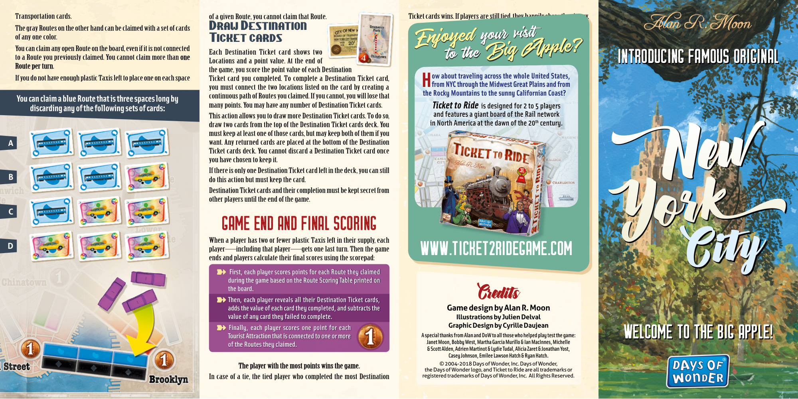
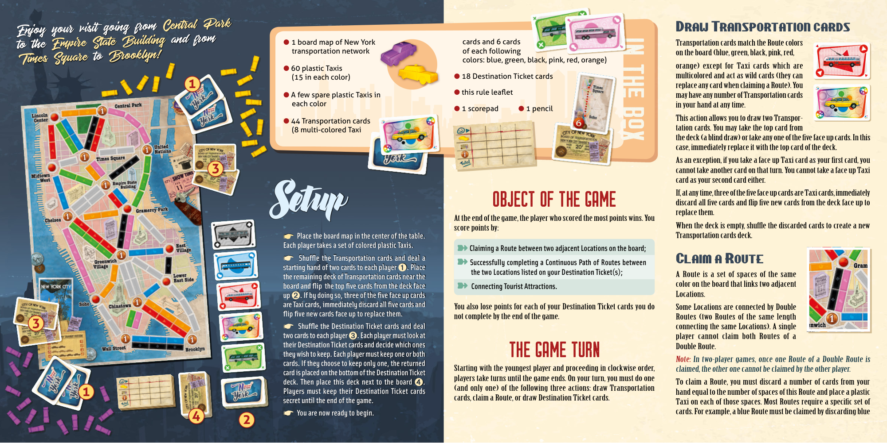

# New York

[Source PDF](rules.pdf) · [Map reference](new-york-map.png)

Parsed locally with pdf-inspector. Original page images preserve diagrams, tables, and layout; consult them where extraction is unclear.

## PDF page 1

Transportation cards. of a given Route, you cannot claim that Route. Ticket cards wins. If players are still tied, they happily share the victory. The gray Routes on the other hand can be claimed with a set of cards Draw Destination of any one color. your visit Ticket cardsEnjoyed You can claim any open Route on the board, even if it is not connected Each Destination Ticket card shows two Apple? Big to a Route you previously claimed. You cannot claim more than oneto the Locations and a point value. At the end of INTRODUCING FAMOUS ORIGINAL Route per turn. the game, you score the point value of each Destination **ow about traveling across the whole United States,** If you do not have enough plastic Taxis left to place one on each space Ticket card you completed. To complete a Destination Ticket card,

# Hfrom NYC through the Midwest Great Plains and from

you must connect the two locations listed on the card by creating a **the Rocky Mountains to the sunny Californian Coast?** continuous path of Routes you claimed. If you cannot, you will lose that **You can claim a blue Route that is three spaces long by** many points. You may have any number of Destination Ticket cards. **_Ticket to Ride_ is designed for 2 to 5 players** **discarding any of the following sets of cards:** This action allows you to draw more Destination Ticket cards. To do so,**and features a giant board of the Rail network** **th** draw two cards from the top of the Destination Ticket cards deck. You**in North America at the dawn of the 20 century.** must keep at least one of those cards, but may keep both of them if you **A**want. Any returned cards are placed at the bottom of the Destination Ticket cards deck. You cannot discard a Destination Ticket card once you have chosen to keep it. If there is only one Destination Ticket card left in the deck, you can still **B** do this action but must keep the card. Destination Ticket cards and their completion must be kept secret from other players until the end of the game. **C**

## GAME END AND FINAL SCORING

When a player has two or fewer plastic Taxis left in their supply, each **D** player—including that player—gets one last turn. Then the game

## WWW.TICKET2RIDEGAME.COM

ends and players calculate their final scores using the scorepad: ➽**First, each player scores points for each Route they claimed** **during the game based on the Route Scoring Table printed on the board.**

#### Credits

➽ **Then, each player reveals all their Destination Ticket cards,** **adds the value of each card they completed, and subtracts the Game design by Alan R. Moon** **value of any card they failed to complete. Illustrations by Julien Delval** **Graphic Design by Cyrille Daujean** ➽ **Finally, each player scores one point for each** **Tourist Attraction that is connected to one or moreA special thanks from Alan and DoW to all those who helped play test the game:**WELCOME TO THE BIG APPLE! **Janet Moon, Bobby West, Martha Garcia Murillo & Ian MacInnes, Michelle of the Routes they claimed.** **& Scott Alden, Adrien Martinot & Lydie Tudal, Alicia Zaret & Jonathan Yost,** **Casey Johnson, Emilee Lawson Hatch & Ryan Hatch.** © 2004-2018 Days of Wonder, Inc. Days of Wonder, The player with the most points wins the game. the Days of Wonder logo, and Ticket to Ride are all trademarks or In case of a tie, the tied player who completed the most Destinationregistered trademarks of Days of Wonder, Inc. All Rights Reserved.

## PDF page 2

| Enjoy your visit going from                            | Central Park | Draw Transportation cards                                                                |
| ------------------------------------------------------ | ------------ | ---------------------------------------------------------------------------------------- |
| to the Empire State Building Times Square to Brooklyn! | and from     | Transportation cards match the Route colors on the board (blue, green, black, pink, red, |

cards and 6 cards

- 1 board map of New York
  of each following transportation network colors: blue, green, black, pink, red, orange)

- 60 plastic Taxis
  l 18 Destination Ticket cards (15 in each color) **1** l this rule leaflet l A few spare plastic Taxis in each color l 1 scorepad l 1 pencil l 44 Transportation cards (8 multi-colored Taxi

# In the box

**3**

## Setup

☛**Place the board map in the center of the table.** **Each player takes a set of colored plastic Taxis.** ☛**Shuffle the Transportation cards and deal a** **starting hand of two cards to each player**➊**. Place** **the remaining deck of Transportation cards near the board and flip the top five cards from the deck face**

**up**➋**. If by doing so, three of the five face up cards** **are Taxi cards, immediately discard all five cards and flip five new cards face up to replace them.**

**3** ☛**Shuffle the Destination Ticket cards and deal** **two cards to each player**➌**. Each player must look at** **their Destination Ticket cards and decide which ones they wish to keep. Each player must keep one or both**

**cards. If they choose to keep only one, the returned card is placed on the bottom of the Destination Ticket**

**deck. Then place this deck next to the board**➍**.** **Players must keep their Destination Ticket cards secret until the end of the game.**

**You are now ready to begin.** ☛

### OBJECT OF THE GAME

At the end of the game, the player who scored the most points wins. You score points by:

➽**Claiming a Route between two adjacent Locations on the board;** **Successfully completing a Continuous Path of Routes between** ➽ **the two Locations listed on your Destination Ticket(s);** ➽ **Connecting Tourist Attractions.**

You also lose points for each of your Destination Ticket cards you do not complete by the end of the game.

### THE GAME TURN

Starting with the youngest player and proceeding in clockwise order, players take turns until the game ends. On your turn, you must do one (and only one) of the following three actions: draw Transportation cards, claim a Route, or draw Destination Ticket cards.

orange) except for Taxi cards which are multicolored and act as wild cards (they can replace any card when claiming a Route). You may have any number of Transportation cards in your hand at any time. This action allows you to draw two Transportation cards. You may take the top card from the deck (a blind draw) or take any one of the five face up cards. In this case, immediately replace it with the top card of the deck. As an exception, if you take a face up Taxi card as your first card, you cannot take another card on that turn. You cannot take a face up Taxi card as your second card either. If, at any time, three of the five face up cards are Taxi cards, immediately discard all five cards and flip five new cards from the deck face up to replace them. When the deck is empty, shuffle the discarded cards to create a new Transportation cards deck.

#### Claim a Route

A Route is a set of spaces of the same color on the board that links two adjacent Locations. Some Locations are connected by Double Routes (two Routes of the same length connecting the same Locations). A single player cannot claim both Routes of a Double Route.

Note: In two-player games, once one Route of a Double Route is

claimed, the other one cannot be claimed by the other player. To claim a Route, you must discard a number of cards from your hand equal to the number of spaces of this Route and place a plastic Taxi on each of those spaces. Most Routes require a specific set of cards. For example, a blue Route must be claimed by discarding blue

