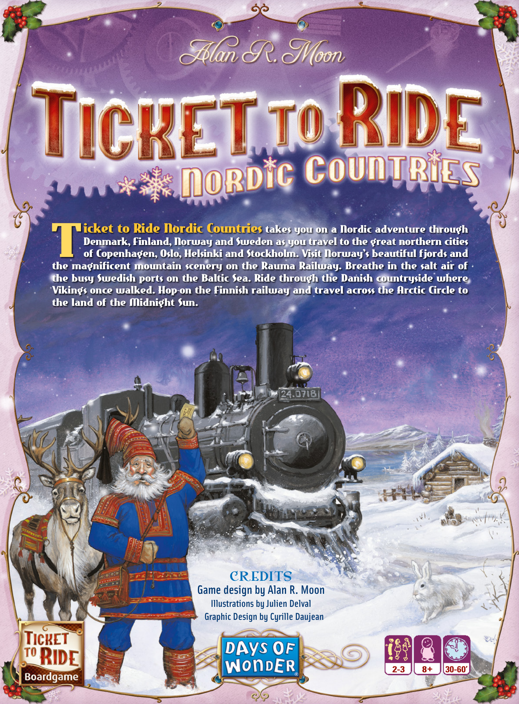
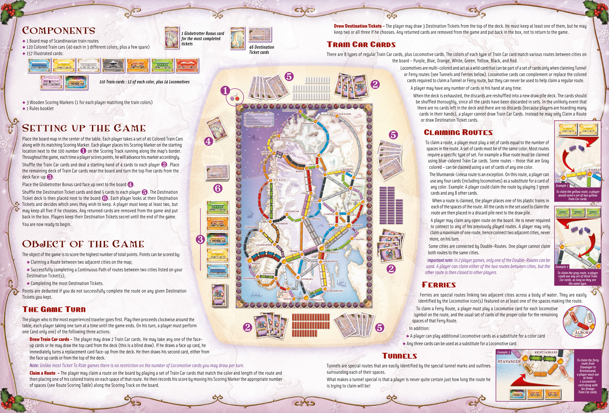
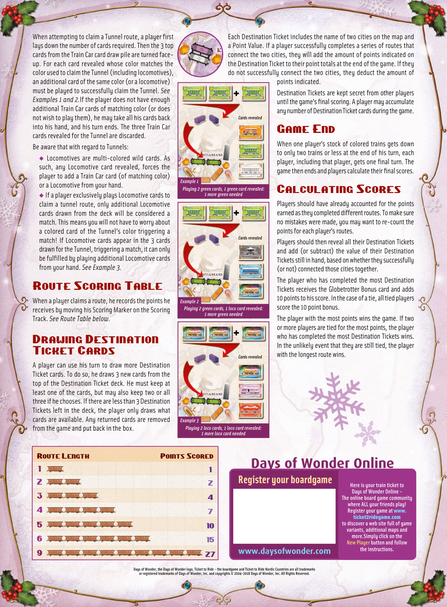

# Nordic Countries

[Source PDF](rules.pdf) · [Map reference](nordic-countries-map.png)

Parsed locally with pdf-inspector. Original page images preserve diagrams, tables, and layout; consult them where extraction is unclear.

## PDF page 1

## icket to Ride Nordic Countries takes you on a Nordic adventure through

Denmark, Finland, Norway and Sweden as you travel to the great northern cities

# Tof Copenhagen, Oslo, Helsinki and Stockholm. Visit Norway’s beautiful fjords and

the magnificent mountain scenery on the Rauma Railway. Breathe in the salt air of the busy Swedish ports on the Baltic Sea. Ride through the Danish countryside where Vikings once walked. Hop-on the Finnish railway and travel across the Arctic Circle to the land of the Midnight Sun.

CREDITS **Game design by Alan R. Moon** **Illustrations by Julien Delval** **Graphic Design by Cyrille Daujean**

## PDF page 2

**Draw Destination Tickets –** The player may draw 3 Destination Tickets from the top of the deck. He must keep at least one of them, but he may Components*1 Globetrotter Bonus card* keep two or all three if he chooses. Any returned cards are removed from the game and put back in the box, not to return to the game. _for the most completed_ u 1 Board map of Scandinavian train routes _tickets_

### Train Car Cards

u 120 Colored Train cars (40 each in 3 different colors, plus a few spare) _46 Destination_ u 157 Illustrated cards: _Ticket cards_ There are 8 types of regular Train Car cards, plus Locomotive cards. The colors of each type of Train Car card match various routes between cities on the board – Purple, Blue, Orange, White, Green, Yellow, Black, and Red. Locomotives are multi-colored and act as a wild card that can be part of a set of cards only when claiming Tunnel or Ferry routes (see Tunnels and Ferries below). Locomotive cards can complement or replace the colored ❺cards required to claim a Tunnel or Ferry route, but they can never be used to help claim a regular route. _110 Train cards : 12 of each color, plus 14 Locomotives_

# ❷A player may have any number of cards in his hand at any time.

❶ When the deck is exhausted, the discards are reshuffled into a new draw pile deck. The cards should u 3 Wooden Scoring Markers (1 for each player matching the train colors) be shuffled thoroughly, since all the cards have been discarded in sets. In the unlikely event that u 1 Rules booklet there are no cards left in the deck and there are no discards (because players are hoarding many cards in their hands), a player cannot draw Train Car Cards. Instead he may only Claim a Route or draw Destination Ticket cards.

## Setting up the Game

### Claiming Routes

Place the board map in the center of the table. Each player takes a set of 40 Colored Train Cars❺ To claim a route, a player must play a set of cards equal to the number of along with its matching Scoring Marker. Each player places his Scoring Marker on the starting❹ spaces in the route. A set of cards must be of the same color. Most routes location next to the 100 number❶ on the Scoring Track running along the map’s border. require a specific type of set. For example a Blue route must be claimed Throughout the game, each time a player scores points, he will advance his marker accordingly. using blue-colored Train Car cards. Some routes – those that are Gray Shuffle the Train Car cards and deal a starting hand of 4 cards to each player❷. Place colored – can be claimed using a set of cards of any one color. the remaining deck of Train Car cards near the board and turn the top five cards from the The Murmansk-Lieksa route is an exception. On this route, a player can deck face-up❸. use any four cards (including locomotives) as a substitute for a card of Place the Globetrotter Bonus card face up next to the board❹. _Example 1_ any color. Example: A player could claim the route by playing 7 green Shuffle the Destination Ticket cards and deal 5 cards to each player❺. The Destination❻ _To claim the yellow route, a player_ cards and any 8 other cards. _would need a set of two yellow_ Ticket deck is then placed next to the board❻. Each player looks at their Destination _Train Car cards._ When a route is claimed, the player places one of his plastic trains in Tickets and decides which ones they wish to keep. A player must keep at least two, but each of the spaces of the route. All the cards in the set used to claim the may keep all five if he chooses. Any returned cards are removed from the game and put route are then placed in a discard pile next to the draw pile. back in the box. Players keep their Destination Tickets secret until the end of the game. A player may claim any open route on the board. He is never required You are now ready to begin. to connect to any of his previously played routes. A player may only claim a maximum of one route, hence connect two adjacent cities, never more, on his turn. ❸

## Object of the GameSome cities are connected by Double-Routes. One player cannot claim

both routes to the same cities. The object of the game is to score the highest number of total points. Points can be scored by: _Important note: In 2 player games, only one of the Double-Routes can be_ u Claiming a Route between two adjacent cities on the map; _used. A player can claim either of the two routes between cities, but the Example 2_ u Successfully completing a Continuous Path of routes between two cities listed on your ❷ _other route is then closed to other players. To claim the gray route, a player_ Destination Ticket(s); _could use any set of three Train_ _Car cards, as long as they are_ u Completing the most Destination Tickets. _the same type._

### Ferries

Points are deducted if you do not successfully complete the route on any given Destination Ferries are special routes linking two adjacent cities across a body of water. They are easily Tickets you kept. identified by the Locomotive icon(s) featured on at least one of the spaces making the route. To claim a Ferry Route, a player must play a Locomotive card for each locomotive

### The Game Turn

symbol on the route, and the usual set of cards of the proper color for the remaining The player who is the most experienced traveler goes first. Play then proceeds clockwise around the spaces of that Ferry Route. table, each player taking one turn at a time until the game ends. On his turn, a player must perform In addition:

# ❷ ❺

one (and only one) of the following three actions: u A player can play additional Locomotive cards as a substitute for a color card **Draw Train Car cards –** The player may draw 2 Train Car cards. He may take any one of the face- u Any three cards can be used as a substitute for a Locomotive card up cards or he may draw the top card from the deck (this is a blind draw). If he draws a face up card, he immediately turns a replacement card face-up from the deck. He then draws his second card, either from _Example 3_ the face up cards or from the top of the deck.Tunnels _To claim the ferry_ _route from_

_Note: Unlike most Ticket To Ride games there is no restriction on the number of Locomotive cards you may draw per turn._ Tunnels are special routes that are easily identified by the special tunnel marks and outlines*Stavanger to*

_Kristiansand,_ **Claim a Route –** The player may claim a route on the board by playing a set of Train Car cards that match the color and length of the route and surrounding each of their spaces. _a player must use_ _at least_ then placing one of his colored trains on each space of that route. He then records his score by moving his Scoring Marker the appropriate number What makes a tunnel special is that a player is never quite certain just how long the route he*1 Locomotive* of spaces (see Route Scoring Table) along the Scoring Track on the board. is trying to claim will be!_card along with_ _his Orange_ _Train Car cards._

## PDF page 3

When attempting to claim a Tunnel route, a player first lays down the number of cards required. Then the 3 top cards from the Train Car card draw pile are turned face- up. For each card revealed whose color matches the color used to claim the Tunnel (including locomotives), an additional card of the same color (or a locomotive) must be played to successfully claim the Tunnel. _See_ *Examples 1 and 2.*If the player does not have enough additional Train Car cards of matching color (or does not wish to play them), he may take all his cards back into his hand, and his turn ends. The three Train Car cards revealed for the Tunnel are discarded. Be aware that with regard to Tunnels: u Locomotives are multi-colored wild cards. As such, any Locomotive card revealed, forces the player to add a Train Car card (of matching color) or a Locomotive from your hand. u If a player exclusively plays Locomotive cards to claim a tunnel route, only additional Locomotive cards drawn from the deck will be considered a match. This means you will not have to worry about a colored card of the Tunnel’s color triggering a match! If Locomotive cards appear in the 3 cards drawn for the Tunnel, triggering a match, it can only be fulfilled by playing additional Locomotive cards from your hand. _See Example 3._

## Route Scoring Table

When a player claims a route, he records the points he receives by moving his Scoring Marker on the Scoring Track. _See Route Table below._

## Drawing Destination Ticket Cards

A player can use his turn to draw more Destination Ticket cards. To do so, he draws 3 new cards from the top of the Destination Ticket deck. He must keep at least one of the cards, but may also keep two or all three if he chooses. If there are less than 3 Destination Tickets left in the deck, the player only draws what cards are available. Any returned cards are removed from the game and put back in the box.

Each Destination Ticket includes the name of two cities on the map and a Point Value. If a player successfully completes a series of routes that connect the two cities, they will add the amount of points indicated on the Destination Ticket to their point totals at the end of the game. If they do not successfully connect the two cities, they deduct the amount of points indicated. Destination Tickets are kept secret from other players until the game’s final scoring. A player may accumulate any number of Destination Ticket cards during the game. _Cards revealed_

## Game End

When one player’s stock of colored trains gets down to only two trains or less at the end of his turn, each player, including that player, gets one final turn. The game then ends and players calculate their final scores. _Example 1_ _Playing 2 green cards, 1 green card revealed:_ _1 more green needed_

## Calculating Scores

Players should have already accounted for the points earned as they completed different routes. To make sure no mistakes were made, you may want to re-count the points for each player’s routes. _Cards revealed_ Players should then reveal all their Destination Tickets and add (or subtract) the value of their Destination Tickets still in hand, based on whether they successfully (or not) connected those cities together. The player who has completed the most Destination Tickets receives the Globetrotter Bonus card and adds 10 points to his score. In the case of a tie, all tied players _Example 2_ _Playing 2 green cards, 1 loco card revealed:_ _1 more green needed_ score the 10 point bonus. The player with the most points wins the game. If two or more players are tied for the most points, the player who has completed the most Destination Tickets wins. In the unlikely event that they are still tied, the player with the longest route wins. _Cards revealed_

### Route Length

_Example 3_ _Playing 2 loco cards, 1 loco card revealed:_ _1 more loco card needed_

# Days of Wonder Online

2**Register your boardgameHere is your train ticket to** **Days of Wonder Online -** 4 **The online board game community** **where ALL your friends play!** 7**Register your game at www.** **ticket2ridegame.com** 10 **to discover a web site full of game variants, additional maps and**

**New Player button and follow** **more.Simply click on the**

**www.daysofwonder.com** **the instructions.**

### Points Scored

**Days of Wonder, the Days of Wonder logo, Ticket to Ride-the boardgame and Ticket to Ride Nordic Countries are all trademarks** **or registered trademarks of Days of Wonder, Inc. and copyrights © 2004-2018 Days of Wonder, Inc. All Rights Reserved.**

