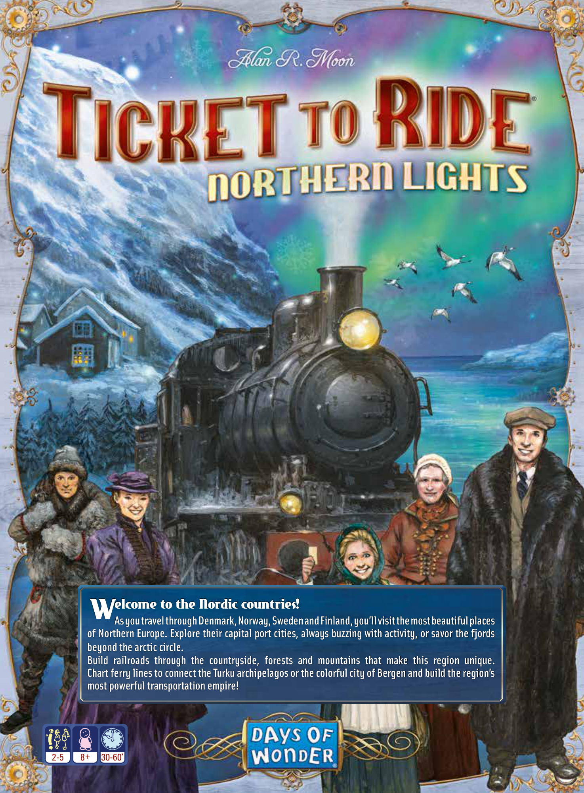
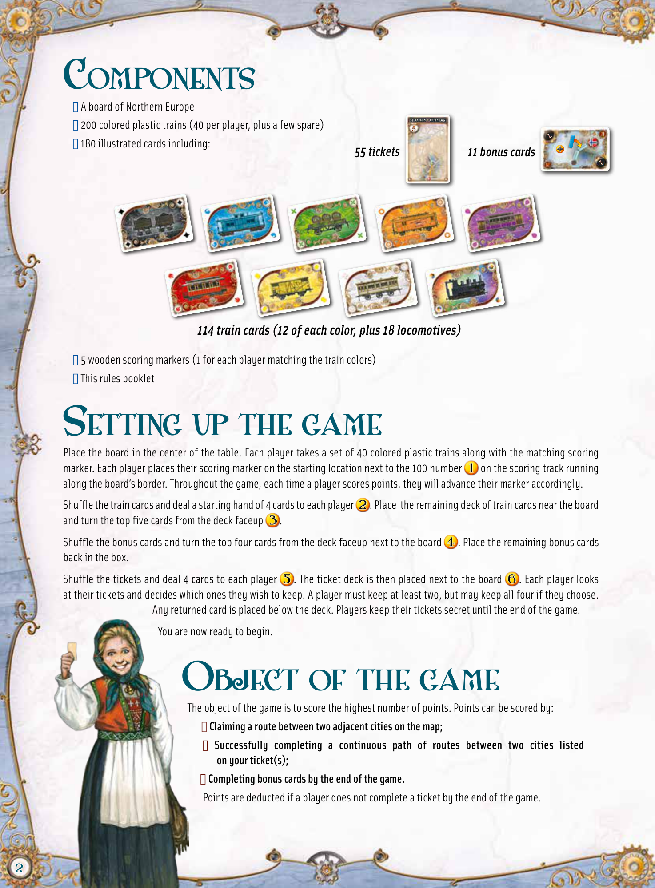
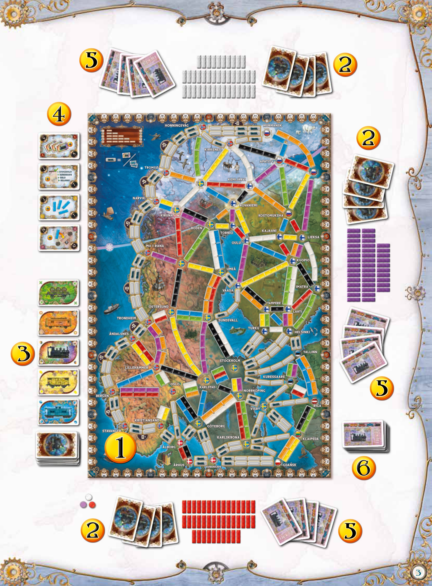
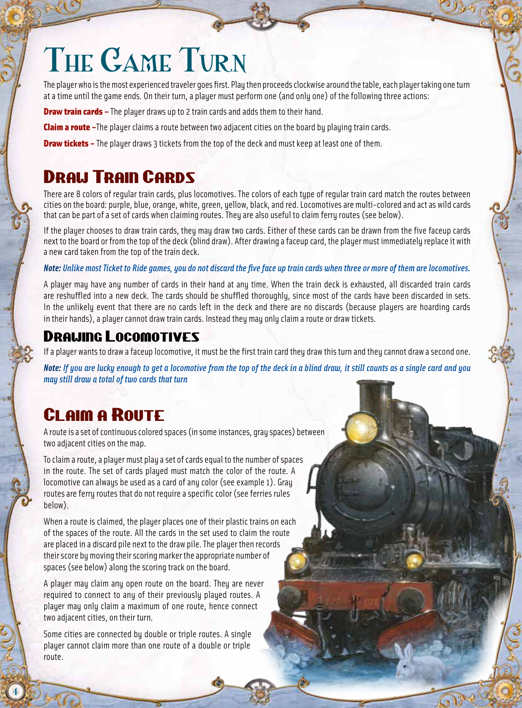
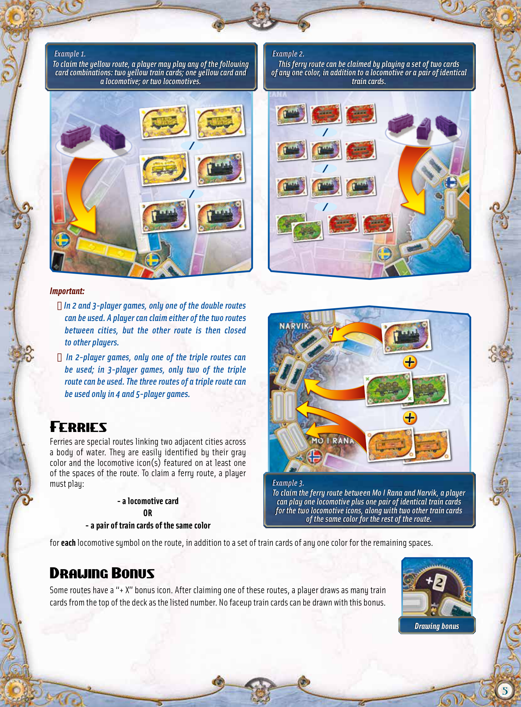
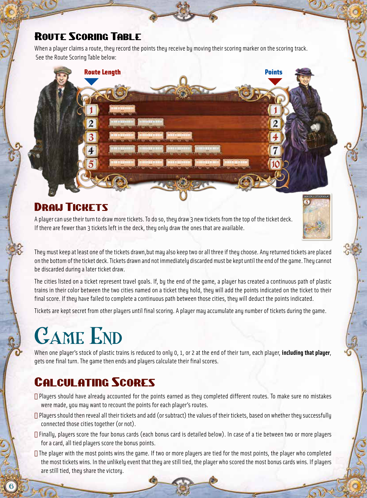
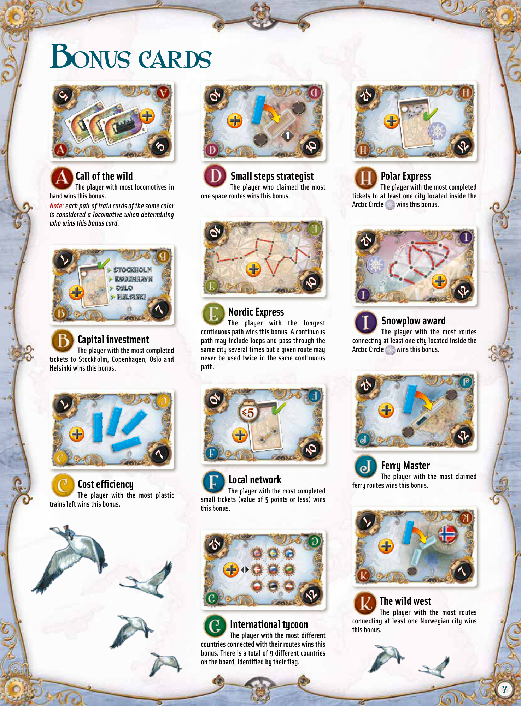
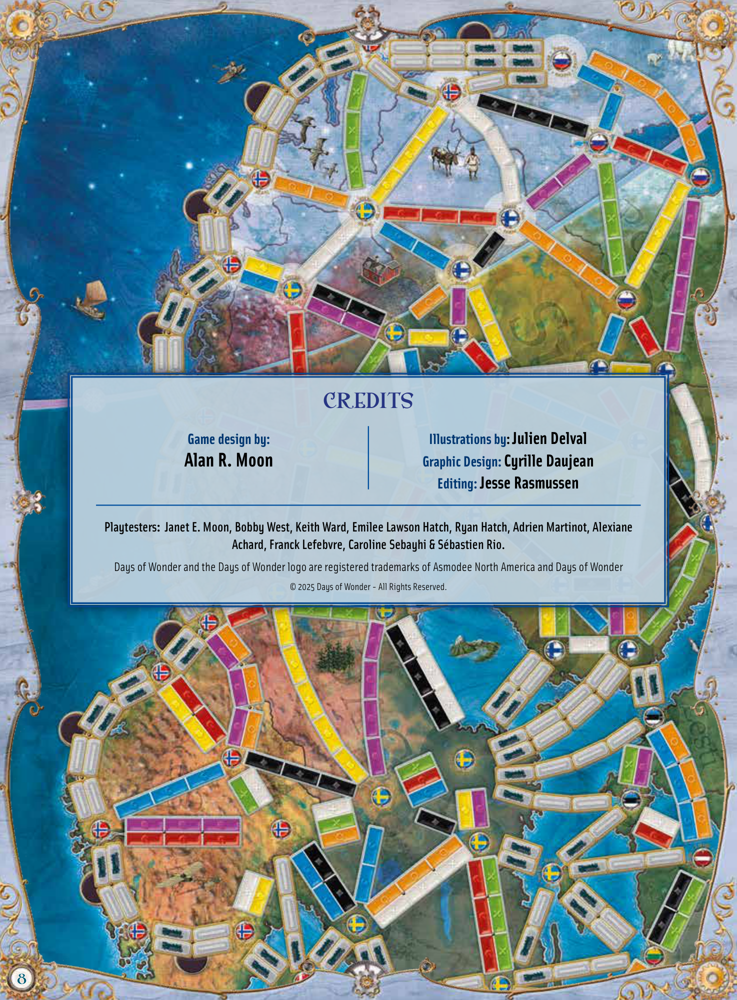

# Northern Lights

[Source PDF](rules.pdf) · [Map reference](northern-lights-map.png)

Parsed locally with pdf-inspector. Original page images preserve diagrams, tables, and layout; consult them where extraction is unclear.

## PDF page 1

elcome to the Nordic countries! W **As you travel through Denmark, Norway, Sweden and Finland, you’ll visit the most beautiful places** **of Northern Europe. Explore their capital port cities, always buzzing with activity, or savor the fjords beyond the arctic circle.**

**Build railroads through the countryside, forests and mountains that make this region unique.** **Chart ferry lines to connect the Turku archipelagos or the colorful city of Bergen and build the region’s** **most powerful transportation empire!**

## PDF page 2

# Components

u A board of Northern Europe STOCKHOLM u 200 colored plastic trains (40 per player, plus a few spare)55 7 u 180 illustrated cards including: _55 tickets 11 bonus cards_ 7

_114 train cards (12 of each color, plus 18 locomotives)_

u 5 wooden scoring markers (1 for each player matching the train colors) u This rules booklet

# Setting up the game

Place the board in the center of the table. Each player takes a set of 40 colored plastic trains along with the matching scoring marker. Each player places their scoring marker on the starting location next to the 100 number on the scoring track running along the board’s border. Throughout the game, each time a player scores points, they will advance their marker accordingly. Shuffle the train cards and deal a starting hand of 4 cards to each player. Place the remaining deck of train cards near the board and turn the top five cards from the deck faceup. Shuffle the bonus cards and turn the top four cards from the deck faceup next to the board. Place the remaining bonus cards back in the box. Shuffle the tickets and deal 4 cards to each player. The ticket deck is then placed next to the board. Each player looks at their tickets and decides which ones they wish to keep. A player must keep at least two, but may keep all four if they choose. Any returned card is placed below the deck. Players keep their tickets secret until the end of the game. You are now ready to begin.

# Object of the game

The object of the game is to score the highest number of points. Points can be scored by: u **Claiming a route between two adjacent cities on the map;** u **Successfully completing a continuous path of routes between two cities listed** **on your ticket(s);** u **Completing bonus cards by the end of the game.** Points are deducted if a player does not complete a ticket by the end of the game.

## PDF page 3

The parser returned no text for this page. Refer to the page image below.

## PDF page 4

# The Game Turn

The player who is the most experienced traveler goes first. Play then proceeds clockwise around the table, each player taking one turn at a time until the game ends. On their turn, a player must perform one (and only one) of the following three actions:

**Draw train cards –** The player draws up to 2 train cards and adds them to their hand.

**Claim a route –**The player claims a route between two adjacent cities on the board by playing train cards.

**Draw tickets –** The player draws 3 tickets from the top of the deck and must keep at least one of them.

## Draw Train Cards

There are 8 colors of regular train cards, plus locomotives. The colors of each type of regular train card match the routes between cities on the board: purple, blue, orange, white, green, yellow, black, and red. Locomotives are multi-colored and act as wild cards that can be part of a set of cards when claiming routes. They are also useful to claim ferry routes (see below).

If the player chooses to draw train cards, they may draw two cards. Either of these cards can be drawn from the five faceup cards next to the board or from the top of the deck (blind draw). After drawing a faceup card, the player must immediately replace it with a new card taken from the top of the train deck.

**\*Note:** Unlike most Ticket to Ride games, you do not discard the five face up train cards when three or more of them are locomotives.\*

A player may have any number of cards in their hand at any time. When the train deck is exhausted, all discarded train cards are reshuffled into a new deck. The cards should be shuffled thoroughly, since most of the cards have been discarded in sets. In  the  unlikely event that there are no cards left in the deck and there are no discards (because players are hoarding cards in their hands), a player cannot draw train cards. Instead they may only claim a route or draw tickets.

### Drawing Locomotives

If a player wants to draw a faceup locomotive, it must be the first train card they draw this turn and they cannot draw a second one.

**\*Note:** If you are lucky enough to get a locomotive from the top of the deck in a blind draw, it still counts as a single card and you\*

_may still draw a total of two cards that turn_

## Claim a Route

A route is a set of continuous colored spaces (in some instances, gray spaces) between two adjacent cities on the map.

To claim a route, a player must play a set of cards equal to the number of spaces in  the route. The set of cards played must match the color of the route. A locomotive can always be used as a card of any color (see example 1). Gray routes are ferry routes that do not require a specific color (see ferries rules below).

When a route is claimed, the player places one of their plastic trains on each of the spaces of the route. All the cards in the set used to claim the route are placed in a discard pile next to the draw pile. The player then records their score by moving their scoring marker the appropriate number of spaces (see below) along the scoring track on the board.

A player may claim any open route on the board. They are never required to connect to any of their previously played routes. A player may only claim a maximum of one route, hence connect two adjacent cities, on their turn.

Some cities are connected by double or triple routes. A single player cannot claim more than one route of a double or triple route.

## PDF page 5

**_Example 1._** _To claim the yellow route, a player may play any of the following_ _card combinations: two yellow train cards; one yellow card and_ _a locomotive; or two locomotives._

## Important:

u _In 2 and 3-player games, only one of the double routes_ _can be used. A player can claim either of the two routes_ _between cities, but the other route is then closed_ _to other players._ u _In 2-player games, only one of the triple routes can_ _be  used; in 3-player games, only two of the triple_ _route can be used. The three routes of a triple route can_ _be used only in 4 and 5-player games._

# Ferries

Ferries are special routes linking two adjacent cities across a  body of water. They are easily identified by their gray color and the locomotive icon(s) featured on at least one of the spaces of the route. To claim a ferry route, a player must play:

**- a locomotive card** **OR**
**- a pair of train cards of the same color**
for **each** locomotive symbol on the route, in addition to a set of train cards of any one color for the remaining spaces.

# Drawing Bonus

Some routes have a “+ X” bonus icon. After claiming one of these routes, a player draws as many train cards from the top of the deck as the listed number. No faceup train cards can be drawn with this bonus.

**_Example 2._** _This ferry route can be claimed by playing a set of two cards_ _of any one color, in addition to a locomotive or a pair of identical_ _train cards._

**_Example 3._** _To claim the ferry route between Mo I Rana and Narvik, a player_ _can play one locomotive plus one pair of identical train cards_ _for the two locomotive icons, along with two other train cards_ _of the same color for the rest of the route._

## PDF page 6

#### Route Scoring Table

When a player claims a route, they record the points they receive by moving their scoring marker on the scoring track. See the Route Scoring Table below:

##### Route Length Points

BERGEN 55

### Draw Tickets

A player can use their turn to draw more tickets. To do so, they draw 3 new tickets from the top of the ticket deck. If there are fewer than 3 tickets left in the deck, they only draw the ones that are available.

They must keep at least one of the tickets drawn,but may also keep two or all three if they choose. Any returned tickets are placed on the bottom of the ticket deck. Tickets drawn and not immediately discarded must be kept until the end of the game. They cannot be discarded during a later ticket draw.

The cities listed on a ticket represent travel goals. If, by the end of the game, a player has created a continuous path of plastic trains in their color between the two cities named on a ticket they hold, they will add the points indicated on the ticket to their final score. If they have failed to complete a continuous path between those cities, they will deduct the points indicated.

Tickets are kept secret from other players until final scoring. A player may accumulate any number of tickets during the game.

# Game End

When one player’s stock of plastic trains is reduced to only 0, 1, or 2 at the end of their turn, each player, **including that player**, gets one final turn. The game then ends and players calculate their final scores.

## Calculating Scores

uPlayers should have already accounted for the points earned as they completed different routes. To make sure no mistakes were made, you may want to recount the points for each player’s routes. uPlayers should then reveal all their tickets and add (or subtract) the values of their tickets, based on whether they successfully connected those cities together (or not). u Finally, players score the four bonus cards (each bonus card is detailed below). In case of a tie between two or more players for a card, all tied players score the bonus points. u The player with the most points wins the game. If two or more players are tied for the most points, the player who completed the most tickets wins. In the unlikely event that they are still tied, the player who scored the most bonus cards wins. If players are still tied, they share the victory.

## PDF page 7

# Bonus cards

### 10 5

1 10

## Small steps strategist

### The player who claimed the most one space routes wins this bonus.

## Call of the wild

### The player with most locomotives in hand wins this bonus.

_Note: each pair of train cards of the same color_

_is considered a locomotive when determining_ _who wins this bonus card._

7 Stockholm Stockholm KØBENHAVN KØBENHAVN OSLO OSLO HELSINKI HELSINKI 7

## Capital investment

### The player with the most completed tickets to Stockholm, Copenhagen, Oslo and

### Helsinki wins this bonus.

## Nordic Express

**The player with the longest continuous path wins this bonus. A continuous** **path may include loops and pass through the same city several times but a given route may** **never be used twice in the same continuous path.**

### 10 55

## Polar Express

### The player with the most completed tickets to at least one city located inside the

### Arctic Circle wins this bonus.

## Snowplow award

### The player with the most routes connecting at least one city located inside the

### Arctic Circle wins this bonus.

## Ferry Master

### The player with the most claimed ferry routes wins this bonus.

## The wild west

### The player with the most routes connecting at least one Norwegian city wins

**this bonus.**

## Cost efficiency

### The player with the most plastic trains left wins this bonus.

## Local network

### The player with the most completed small tickets (value of 5 points or less) wins

**this bonus.**

## International tycoon

### The player with the most different countries connected with their routes wins this

**bonus. There is a total of 9 different countries on the board, identified by their flag.**

## PDF page 8

## CREDITS

### Game design by: Illustrations by: Julien Delval

# Alan R. Moon Graphic Design: Cyrille Daujean

### Editing: Jesse Rasmussen

**Playtesters: Janet E. Moon, Bobby West, Keith Ward, Emilee Lawson Hatch, Ryan Hatch, Adrien Martinot, Alexiane** **Achard, Franck Lefebvre, Caroline Sebayhi & Sébastien Rio.** Days of Wonder and the Days of Wonder logo are registered trademarks of Asmodee North America and Days of Wonder © 2025 Days of Wonder-All Rights Reserved.

