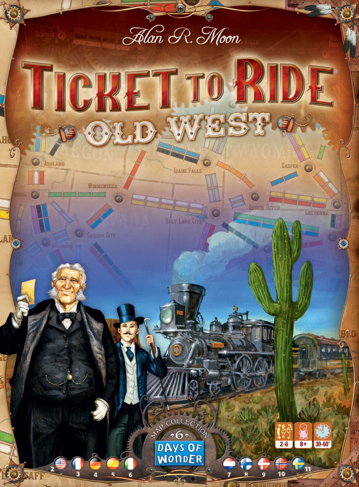
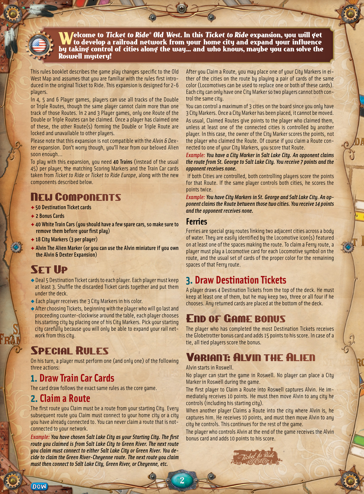
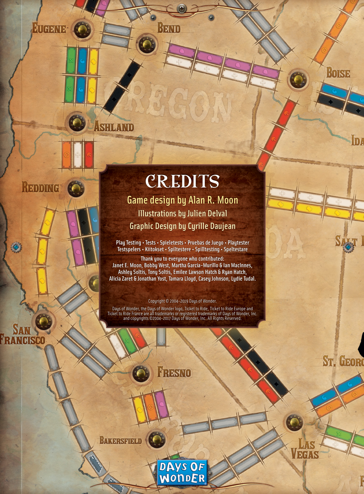

# Old West

[Source PDF](rules.pdf) · [Map reference](old-west-map.png)

Parsed locally with pdf-inspector. Original page images preserve diagrams, tables, and layout; consult them where extraction is unclear.

## PDF page 1

The parser returned no text for this page. Refer to the page image below.

## PDF page 2

This rules booklet describes the game play changes specific to the Old West Map and assumes that you are familiar with the rules first intro- duced in the original Ticket to Ride. This expansion is designed for 2-6 players. In 4, 5 and 6 Player games, players can use all tracks of the Double or Triple Routes, though the same player cannot claim more than one track of those Routes. In 2 and 3 Player games, only one Route of the Double or Triple Routes can be claimed. Once a player has claimed one of these, the other Route(s) forming the Double or Triple Route are locked and unavailable to other players. Please note that this expansion is not compatible with the _Alvin & Dexter_ expansion. Don’t worry though, you’ll hear from our beloved Alien soon enough... To play with this expansion, you need **40 Trains** (instead of the usual

45. per player, the matching Scoring Markers and the Train Car cards taken from _Ticket to Ride_ or _Ticket to Ride Europe_, along with the new components described below.

# New Components

✦**50 Destination Ticket cards** ✦ **2 Bonus Cards** ✦**40 White Train Cars (you should have a few spare cars, so make sure to** **remove them before your first play)** ✦ **18 City Markers (3 per player)** ✦ **Alvin The Alien Marker (or you can use the Alvin miniature if you own** **the Alvin & Dexter Expansion)**

# Set Up

u Deal 5 Destination Ticket cards to each player. Each player must keep at least 3. Shuffle the discarded Ticket cards together and put them under the deck. u Each player receives the 3 City Markers in his color. u After choosing Tickets, beginning with the player who will go last and proceeding counter-clockwise around the table, each player chooses his starting city by placing one of his City Markers. Pick your starting city carefully because you will only be able to expand your rail network from this city.

# Special Rules

On his turn, a player must perform one (and only one) of the following three actions:

# 1. Draw Train Car Cards

The card draw follows the exact same rules as the core game.

# 2. Claim a Route

The first route you Claim must be a route from your starting City. Every subsequent route you Claim must connect to your home city or a city you have already connected to. You can never claim a route that is not-connected to your network. _Example: You have chosen Salt Lake City as your Starting City. The first_ _route you claimed is from Salt Lake City to Green River. The next route_ _you claim must connect to either Salt Lake City or Green River. You de-_ _cide to claim the Green River-Cheyenne route. The next route you claim_ _must then connect to Salt Lake City, Green River, or Cheyenne, etc._

After you Claim a Route, you may place one of your City Markers in either of the cities on the route by playing a pair of cards of the same color (Locomotives can be used to replace one or both of these cards). Each city can only have one City Marker so two players cannot both control the same city. You can control a maximum of 3 cities on the board since you only have 3 City Markers. Once a City Marker has been placed, it cannot be moved. As usual, Claimed Routes give points to the player who claimed them, unless at least one of the connected cities is controlled by another player. In this case, the owner of the City Marker scores the points, not the player who claimed the Route. Of course if you claim a Route connected to one of your City Markers, you score that Route. _Example: You have a City Marker in Salt Lake City. An opponent claims_ _the route from St. George to Salt Lake City. You receive 7 points and the_ _opponent receives none._ If both Cities are controlled, both controlling players score the points for that Route. If the same player controls both cities, he scores the points twice. _Example: You have City Markers in St. George and Salt Lake City. An opponent claims the Route between those two cities. You receive 14 points_ _and the opponent receives none._

## Ferries

Ferries are special gray routes linking two adjacent cities across a body of water. They are easily identified by the Locomotive icon(s) featured on at least one of the spaces making the route. To claim a Ferry route, a player must play a Locomotive card for each Locomotive symbol on the route, and the usual set of cards of the proper color for the remaining spaces of that Ferry route.

# 3. Draw Destination Tickets

A player draws 4 Destination Tickets from the top of the deck. He must keep at least one of them, but he may keep two, three or all four if he chooses. Any returned cards are placed at the bottom of the deck.

# End of Game bonus

The player who has completed the most Destination Tickets receives the Globetrotter bonus card and adds 15 points to his score. In case of a tie, all tied players score the bonus.

# Variant: Alvin the Alien

Alvin starts in Roswell. No player can start the game in Roswell. No player can place a City Marker in Roswell during the game. The first player to Claim a Route into Roswell captures Alvin. He im- mediately receives 10 points. He must then move Alvin to any city he controls (including his starting city). When another player Claims a Route into the city where Alvin is, he captures him. He receives 10 points, and must then move Alvin to any city he controls. This continues for the rest of the game. The player who controls Alvin at the end of the game receives the Alvin bonus card and adds 10 points to his score.

## PDF page 3

# CREDITS

## Game design by Alan R. Moon

### Illustrations by Julien Delval Graphic Design by Cyrille Daujean

**Play Testing • Tests • Spieletests • Pruebas de Juego • Playtester** **Testspelers • Kiitokset • Spiltestere • Spilltesting • Speltestare** **Thank you to everyone who contributed:** **Janet E. Moon, Bobby West, Martha Garcia-Murillo & Ian MacInnes,** **Ashley Soltis, Tony Soltis, Emilee Lawson Hatch & Ryan Hatch,** **Alicia Zaret & Jonathan Yost, Tamara Lloyd, Casey Johnson, Lydie Tudal.**

Copyright © 2004-2019 Days of Wonder. Days of Wonder, the Days of Wonder logo, Ticket to Ride, Ticket to Ride Europe and Ticket to Ride France are all trademarks or registered trademarks of Days of Wonder, Inc. and copyrights ©2004-2017 Days of Wonder, Inc. All Rights Reserved.

