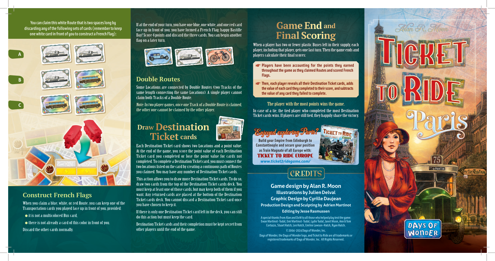
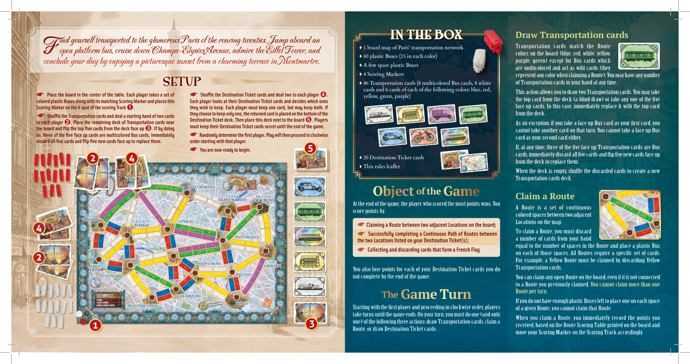

# Paris

[Source PDF](rules.pdf) · [Map reference](paris-map.png)

Parsed locally with pdf-inspector. Original page images preserve diagrams, tables, and layout; consult them where extraction is unclear.

## PDF page 1

**You can claim this white Route that is two spaces long by** If at the end of your turn, you have one blue, one white, and one red card **discarding any of the following sets of cards (remember to keepGame End Game Endand and** face up in front of you, you have formed a French Flag: happy Bastille **one white card in front of you to construct a French Flag):** Day! Score 4 points and discard the three cards. You can begin another

# Final Scoring Final Scoring

flag on a later turn. When a player has two or fewer plastic Buses left in their supply, each When a player has two or fewer plastic Buses left in their supply, each player, including that player, gets one last turn. Then the game ends and player, including that player, gets one last turn. Then the game ends and **A**players calculate their final scores: players calculate their final scores:

☛**Players have been accounting for the points they earned** **throughout the game as they claimed Routes and scored French** **Flags.** **B Double Routes** ☛**Then, each player reveals all their Destination Ticket cards, adds** Some Locations are connected by Double Routes (two Tracks of the**the value of each card they completed to their score, and subtracts** same length connecting the same Locations). A single player cannot**the value of any card they failed to complete.** claim both Tracks of a Double Route.

Note: In two player games, once one Track of a Double Route is claimed, The player with the most points wins the game. The player with the most points wins the game.

**C** the other one cannot be claimed by the other player. In case of a tie, the tied player who completed the most Destination In case of a tie, the tied player who completed the most Destination Ticket cards wins. If players are still tied, they happily share the victory. Ticket cards wins. If players are still tied, they happily share the victory. TRIOMPHE TRIOMPHE ARC DE ARC DE **Draw Draw Destination Destination** LACHAISE LACHAISE PÈRE PÈRE--

## Enjoyed exploring Paris? Enjoyed exploring Paris?

# Ticket Ticketcards cards

**Build your Empire from Edinburgh to** Each Destination Ticket card shows two Locations and a point value.**Constantinople and secure your position** At the end of the game, you score the point value of each Destination**as Train Magnate of all Europe with:** Ticket card you completed or lose the point value for cards not TICKET TO RIDE EUROPE completed. To complete a Destination Ticket card, you must connect the ***www.ticket2ridegame.com/*** two locations listed on the card by creating a continuous path of Routes you claimed. You may have any number of Destination Ticket cards. CREDITS This action allows you to draw more Destination Ticket cards. To do so, draw two cards from the top of the Destination Ticket cards deck. You **Game design by Alan R. Moon** must keep at least one of those cards, but may keep both of them if you **Illustrations by Julien Delval** want. Any returned cards are placed at the bottom of the Destination **Construct French Flags** Ticket cards deck. You cannot discard a Destination Ticket card once**Graphic Design by Cyrille Daujean** When you claim a blue, white, or red Route, you can keep one of the you have chosen to keep it. **Production Design and Sculpting by Adrien Martinot** Transportation cards you played face up in front of you, provided: If there is only one Destination Ticket card left in the deck, you can still**Editing by Jesse Rasmussen**

- it is not a multicolored Bus card,
  do this action but must keep the card. **A special thanks from Alan and DoW to all those who helped play test the game:** **Ewan Martinot–Tudal, Emi Martinot–Tudal, Lydie Tudal, Janet Moon, Ann & Tom**

- there is not already a card of this color in front of you.
  Destination Ticket cards and their completion must be kept secret from**Cortazzo, Stuart Hatch, Lee Hatch, Emilee Lawson-Hatch, Ryan Hatch.** Discard the other cards normally. other players until the end of the game.**© 2004-2024 Days of Wonder, Inc.** **Days of Wonder, the Days of Wonder logo, and Ticket to Ride are all trademarks or** **registered trademarks of Days of Wonder, Inc. All Rights Reserved.**

## PDF page 2

| IN THE BOX IN THE BOX ♦ ♦ 1 board map of Paris’ transportation network 1 board map of Paris’ transportation network ♦ ♦ 60 plastic Buses (15 in each color) 60 plastic Buses (15 in each color) ♦ ♦ A few spare plastic Buses A few spare plastic Buses ♦ ♦ 4 Scoring Markers 4 Scoring Markers ♦ ♦ 46 Transportation cards (8 multicolored Bus cards, 8 white 46 Transportation cards (8 multicolored Bus cards, 8 white cards and 6 cards of each of the following colors: blue, red, cards and 6 cards of each of the following colors: blue, red, yellow, green, purple) yellow, green, purple) ♦ ♦ 20 Destination Ticket cards 20 Destination Ticket cards ARC DE ARC DE TRIOMPHE TRIOMPHE -- NOTRE NOTRE ♦ ♦ This rules leaflet This rules leaflet DAME DAME | Draw Transportation cards Transportation cards match the Route colors on the board (blue, red, white, yellow, purple, green) except for Bus cards which are multicolored and act as wild cards (they represent any color when claiming a Route). You may have any number of Transportation cards in your hand at any time. This action allows you to draw two Transportation cards. You may take the top card from the deck (a blind draw) or take any one of the five face up cards. In this case, immediately replace it with the top card from the deck. As an exception, if you take a face up Bus card as your first card, you cannot take another card on that turn. You cannot take a face up Bus card as your second card either. If, at any time, three of the five face up Transportation cards are Bus cards, immediately discard all five cards and flip five new cards face up from the deck to replace them. When the deck is empty, shuffle the discarded cards to create a new |     |
| ------------------------------------------------------------------------------------------------------------------------------------------------------------------------------------------------------------------------------------------------------------------------------------------------------------------------------------------------------------------------------------------------------------------------------------------------------------------------------------------------------------------------------------------------------------------------------------------------------------------------------------------------------------------------------------------------------------------------------------------------------------------ | ---------------------------------------------------------------------------------------------------------------------------------------------------------------------------------------------------------------------------------------------------------------------------------------------------------------------------------------------------------------------------------------------------------------------------------------------------------------------------------------------------------------------------------------------------------------------------------------------------------------------------------------------------------------------------------------------------------------------------------------------------------------------------------------------------------------------------------------------------------------------------------------------------------------------------------------------------------------------------------------------- | --- |
|                                                                                                                                                                                                                                                                                                                                                                                                                                                                                                                                                                                                                                                                                                                                                                    | Transportation cards deck.                                                                                                                                                                                                                                                                                                                                                                                                                                                                                                                                                                                                                                                                                                                                                                                                                                                                                                                                                                     |     |
| of the of the Object Object Game Game At the end of the game, the player who scored the most points wins. You score points by: Claiming a Route between two adjacent Locations on the board; ☛ Successfully completing a Continuous Path of Routes between ☛                                                                                                                                                                                                                                                                                                                                                                                                                                                                                                       | Claim a Route A Route is a set of continuous colored spaces between two adjacent Locations on the map. To claim a Route, you must discard                                                                                                                                                                                                                                                                                                                                                                                                                                                                                                                                                                                                                                                                                                                                                                                                                                                      |     |

ind yourself transported to the glamorous Paris of the roaring twenties. Jump aboard an ind yourself transported to the glamorous Paris of the roaring twenties. Jump aboard an F F open platform bus, cruise down Champs-Élysées Avenue, admire the Eiffel Tower, and open platform bus, cruise down Champs-Élysées Avenue, admire the Eiffel Tower, and conclude your day by enjoying a picturesque sunset from a charming terrace in Montmartre. conclude your day by enjoying a picturesque sunset from a charming terrace in Montmartre.

## SETUP

☛ **Place the board in the center of the table. Each player takes a set of** ☛ **Shuffle the Destination Ticket cards and deal two to each player** ➍➍**.** **colored plastic Buses along with its matching Scoring Marker and places this Each player looks at their Destination Ticket cards and decides which ones** **Scoring Marker on the 0 spot of the scoring Track**➊➊. **they wish to keep. Each player must keep one card, but may keep both. If** **they choose to keep only one, the returned card is placed on the bottom of the** ☛ **Shuffle the Transportation cards and deal a starting hand of two cards** **Destination Ticket deck. Then place this deck next to the board** ➎➎**. Players** **to each player** ➋➋**. Place the remaining deck of Transportation cards near** **must keep their Destination Ticket cards secret until the end of the game.** **the board and flip the top five cards from the deck face up** ➌➌**. If by doing** **so, three of the five face up cards are multicolored Bus cards, immediately** ☛ **Randomly determine the first player. Play will then proceed in clockwise** **discard all five cards and flip five new cards face up to replace them. order starting with that player.** ☛ **You are now ready to begin. 5** **2 4**

**4** a number of cards from your hand **the two Locations listed on your Destination Ticket(s);** equal to the number of spaces in the Route and place a plastic Bus ☛ **Collecting and discarding cards that form a French Flag** on each of those spaces. All Routes require a specific set of cards. **2** For example, a Yellow Route must be claimed by discarding Yellow Transportation cards. You also lose points for each of your Destination Ticket cards you do not complete by the end of the game. You can claim any open Route on the board, even if it is not connected to a Route you previously claimed. You cannot claim more than one Route per turn. **The The G Game ame T Turn urn** If you do not have enough plastic Buses left to place one on each space Starting with the first player and proceeding in clockwise order, players of a given Route, you cannot claim that Route. take turns until the game ends. On your turn, you must do one (and only When you claim a Route, you immediately record the points you one) of the following three actions: draw Transportation cards, claim a received, based on the Route Scoring Table printed on the board and Route, or draw Destination Ticket cards. move your Scoring Marker on the Scoring Track accordingly.

