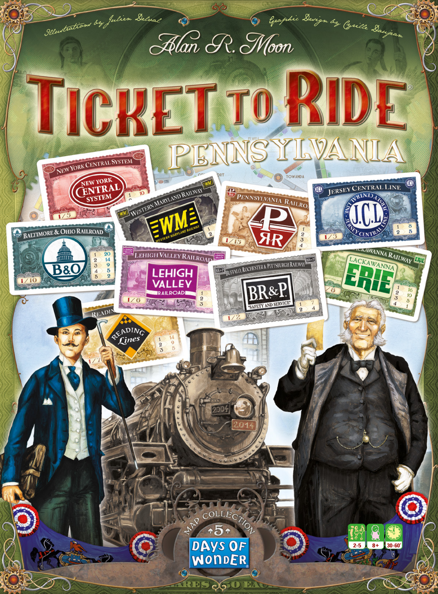
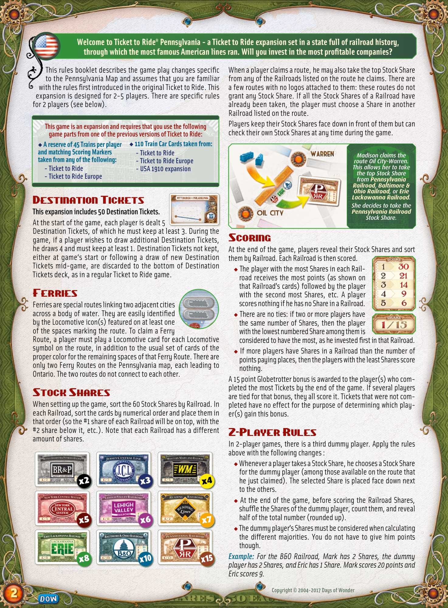
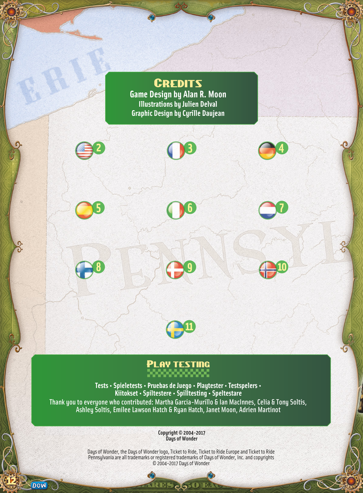

# Pennsylvania

[Source PDF](rules.pdf) · [Map reference](pennsylvania-map.png)

Parsed locally with pdf-inspector. Original page images preserve diagrams, tables, and layout; consult them where extraction is unclear.

## PDF page 1

Julien Delval Graphic Design by Cyril ons by le D strati aujean Illu

**2-5 8+ 30-60’**

## PDF page 2

**Welcome to Ticket to Ride® Pennsylvania-a Ticket to Ride expansion set in a state full of railroad history,** **through which the most famous American lines ran. Will you invest in the most profitable companies?**

This rules booklet describes the game play changes specific to the Pennsylvania Map and assumes that you are familiar with the rules first introduced in the original Ticket to Ride. This expansion is designed for 2-5 players. There are specific rules for 2 players (see below).

**This game is an expansion and requires that you use the following** **game parts from one of the previous versions of Ticket to Ride:** u **A reserve of 45 Trains per player** u **110 Train Car Cards taken from:** **and matching Scoring Markers-Ticket to Ride taken from any of the following:- Ticket to Ride Europe**

**- Ticket to Ride-USA 1910 expansion**
**- Ticket to Ride Europe**

# Destination Tickets

## This expansion includes 50 Destination Tickets.

At the start of the game, each player is dealt 5 Destination Tickets, of which he must keep at least 3. During the game, if a player wishes to draw additional Destination Tickets, he draws 4 and must keep at least 1. Destination Tickets not kept, either at game‘s start or following a draw of new Destination Tickets mid-game, are discarded to the bottom of Destination Tickets deck, as in a regular Ticket to Ride game.

# Ferries

Ferries are special routes linking two adjacent cities across a body of water. They are easily identified by the Locomotive icon(s) featured on at least one of the spaces marking the route. To claim a Ferry Route, a player must play a Locomotive card for each Locomotive symbol on the route, in addition to the usual set of cards of the proper color for the remaining spaces of that Ferry Route. There are only two Ferry Routes on the Pennsylvania map, each leading to Ontario. The two routes do not connect to each other.

# Stock Shares

When setting up the game, sort the 60 Stock Shares by Railroad. In each Railroad, sort the cards by numerical order and place them in that order (so the #1 share of each Railroad will be on top, with the #2 share below it, etc.). Note that each Railroad has a different amount of shares.

When a player claims a route, he may also take the top Stock Share from any of the Railroads listed on the route he claims. There are a few routes with no logos attached to them: these routes do not grant any Stock Share. If all the Stock Shares of a Railroad have already been taken, the player must choose a Share in another Railroad listed on the route. Players keep their Stock Shares face down in front of them but can check their own Stock Shares at any time during the game.

_Madison claims the_ _route Oil City-Warren._ _This allows her to take_ _the top Stock Share_ \*from **Pennsylvania\*** **\*Railroad**, **Baltimore &\*** **\*Ohio Railroad**, or **Erie\*** **\*Lackawanna Railroad**.\* _She decides to take the_ **_Pennsylvania Railroad_** _Stock Share._

# Scoring

At the end of the game, players reveal their Stock Shares and sort them by Railroad. Each Railroad is then scored. u The player with the most Shares in each Railroad receives the most points (as shown on that Railroad’s cards) followed by the player with the second most Shares, etc. A player scores nothing if he has no Share in a Railroad. u There are no ties: if two or more players have the same number of Shares, then the player with the lowest numbered Share among them is considered to have the most, as he invested first in that Railroad. u If more players have Shares in a Railroad than the number of points paying places, then the players with the least Shares score nothing. A 15 point Globetrotter bonus is awarded to the player(s) who com- pleted the most Tickets by the end of the game. If several players are tied for that bonus, they all score it. Tickets that were not com- pleted have no effect for the purpose of determining which player(s) gain this bonus.

# 2-Player Rules

In 2-player games, there is a third dummy player. Apply the rules above with the following changes : u Whenever a player takes a Stock Share, he chooses a Stock Share for the dummy player (among those available on the route that he just claimed). The selected Share is placed face down next to the others. u At the end of the game, before scoring the Railroad Shares, shuffle the Shares of the dummy player, count them, and reveal half of the total number (rounded up). u The dummy player’s Shares must be considered when calculating the different majorities. You do not have to give him points though. _Example: For the B&O Railroad, Mark has 2 Shares, the dummy_ _player has 2 Shares, and Eric has 1 Share. Mark scores 20 points and_ _Eric scores 9._

## x2 x3 x4

## x5 x6 x7

## x8 x10 x15

## PDF page 3

# Credits

### Game Design by Alan R. Moon

#### Illustrations by Julien Delval

#### Graphic Design by Cyrille Daujean

| 2   | 3   | 4   |
| --- | --- | --- |
| 5   | 6   | 7   |
| 8   | 9   | 10  |

**11**

## Play testing

#### Tests • Spieletests • Pruebas de Juego • Playtester • Testspelers •

#### Kiitokset • Spiltestere • Spilltesting • Speltestare

#### Thank you to everyone who contributed: Martha Garcia-Murillo & Ian MacInnes, Celia & Tony Soltis,

#### Ashley Soltis, Emilee Lawson Hatch & Ryan Hatch, Janet Moon, Adrien Martinot

**Copyright © 2004-2017** **Days of Wonder**

Days of Wonder, the Days of Wonder logo, Ticket to Ride, Ticket to Ride Europe and Ticket to Ride Pennsylvania are all trademarks or registered trademarks of Days of Wonder, Inc. and copyrights © 2004-2017 Days of Wonder

