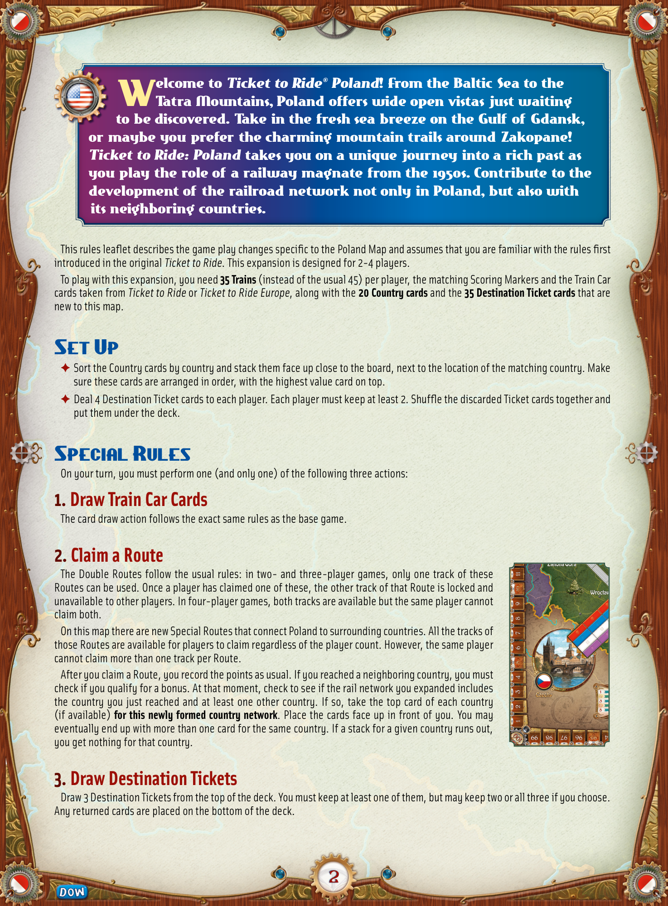
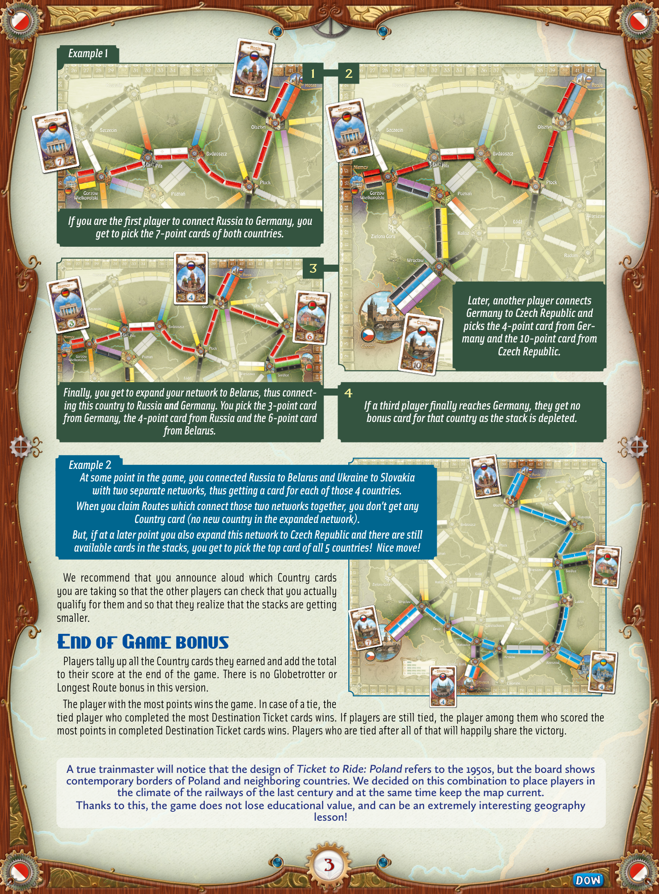

# Poland

[Source PDF](rules.pdf) · [Map reference](poland-map.png)

Parsed locally with pdf-inspector. Original page images preserve diagrams, tables, and layout; consult them where extraction is unclear.

## PDF page 1

This rules leaflet describes the game play changes specific to the Poland Map and assumes that you are familiar with the rules first introduced in the original Ticket to Ride. This expansion is designed for 2-4 players. To play with this expansion, you need **35 Trains** (instead of the usual 45) per player, the matching Scoring Markers and the Train Car cards taken from Ticket to Ride or Ticket to Ride Europe, along with the **20 Country cards** and the **35 Destination Ticket cards** that are new to this map.

## Set Up

✦ Sort the Country cards by country and stack them face up close to the board, next to the location of the matching country. Make sure these cards are arranged in order, with the highest value card on top. ✦ Deal 4 Destination Ticket cards to each player. Each player must keep at least 2. Shuffle the discarded Ticket cards together and put them under the deck.

## Special Rules

On your turn, you must perform one (and only one) of the following three actions:

# 1. Draw Train Car Cards

The card draw action follows the exact same rules as the base game.

# 2. Claim a Route

The Double Routes follow the usual rules: in two- and three-player games, only one track of these Routes can be used. Once a player has claimed one of these, the other track of that Route is locked and unavailable to other players. In four-player games, both tracks are available but the same player cannot claim both. On this map there are new Special Routes that connect Poland to surrounding countries. All the tracks of those Routes are available for players to claim regardless of the player count. However, the same player cannot claim more than one track per Route. After you claim a Route, you record the points as usual. If you reached a neighboring country, you must check if you qualify for a bonus. At that moment, check to see if the rail network you expanded includes the country you just reached and at least one other country. If so, take the top card of each country (if available) **for this newly formed country network**. Place the cards face up in front of you. You may eventually end up with more than one card for the same country. If a stack for a given country runs out, you get nothing for that country.

# 3. Draw Destination Tickets

Draw 3 Destination Tickets from the top of the deck. You must keep at least one of them, but may keep two or all three if you choose. Any returned cards are placed on the bottom of the deck.

## PDF page 2

## Example 1

_If you are the first player to connect Russia to Germany, you_ _get to pick the 7-point cards of both countries._

_Later, another player connects_ _Germany to Czech Republic and_ _picks the 4-point card from Germany and the 10-point card from_ _Czech Republic._

*Finally, you get to expand your network to Belarus, thus connect-*4 _ing this country to Russia **and** Germany. You pick the 3-point card If a third player finally reaches Germany, they get no_ _from Germany, the 4-point card from Russia and the 6-point card_ _bonus card for that country as the stack is depleted._ _from Belarus._

_Example_ 2 _At some point in the game, you connected Russia to Belarus and Ukraine to Slovakia_ _with two separate networks, thus getting a card for each of those 4 countries._ _When you claim Routes which connect those two networks together, you don’t get any_ _Country card (no new country in the expanded network)._ _But, if at a later point you also expand this network to Czech Republic and there are still_ _available cards in the stacks, you get to pick the top card of all 5 countries! Nice move!_

We recommend that you announce aloud which Country cards you are taking so that the other players can check that you actually qualify for them and so that they realize that the stacks are getting smaller.

# End of Game bonus

Players tally up all the Country cards they earned and add the total to their score at the end of the game. There is no Globetrotter or Longest Route bonus in this version. The player with the most points wins the game. In case of a tie, the tied player who completed the most Destination Ticket cards wins. If players are still tied, the player among them who scored the most points in completed Destination Ticket cards wins. Players who are tied after all of that will happily share the victory.

**A true trainmaster will notice that the design of Ticket to Ride: Poland refers to the 1950s, but the board shows** **contemporary borders of Poland and neighboring countries. We decided on this combination to place players in** **the climate of the railways of the last century and at the same time keep the map current.** **Thanks to this, the game does not lose educational value, and can be an extremely interesting geography lesson!**

