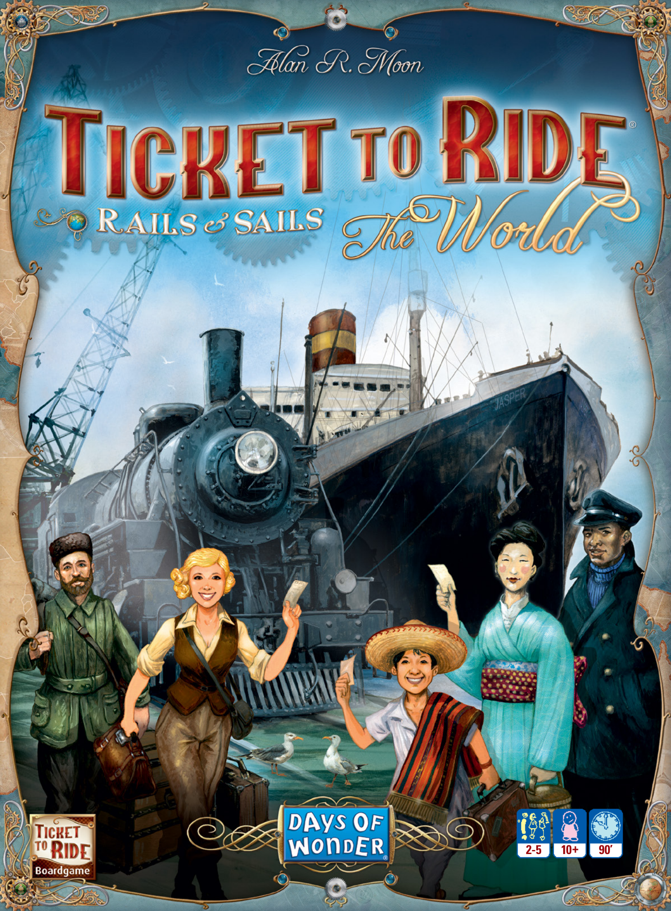
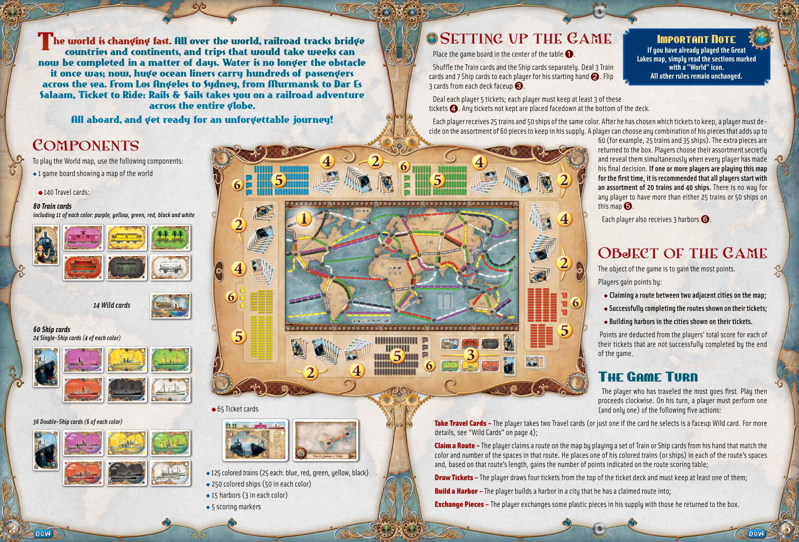
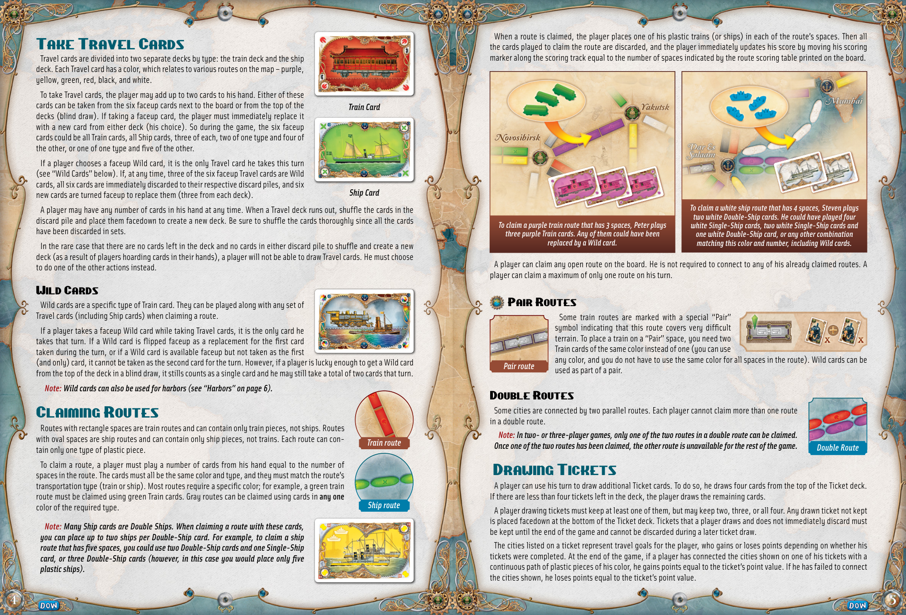
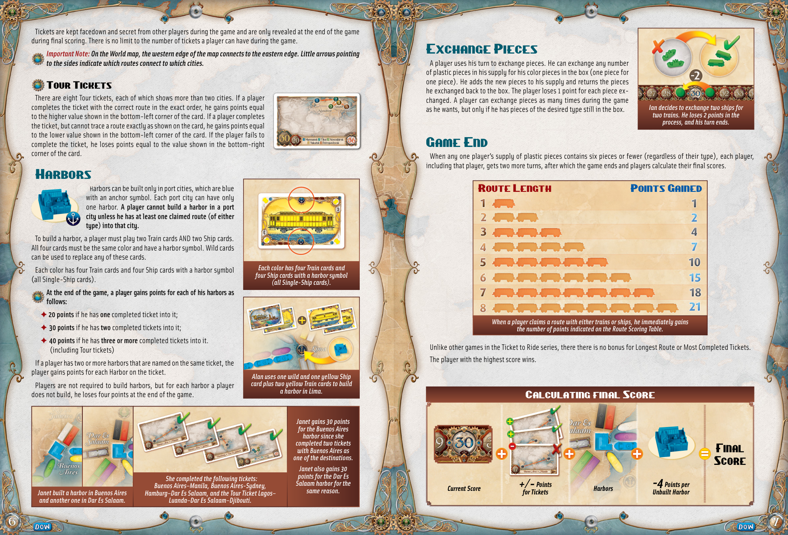
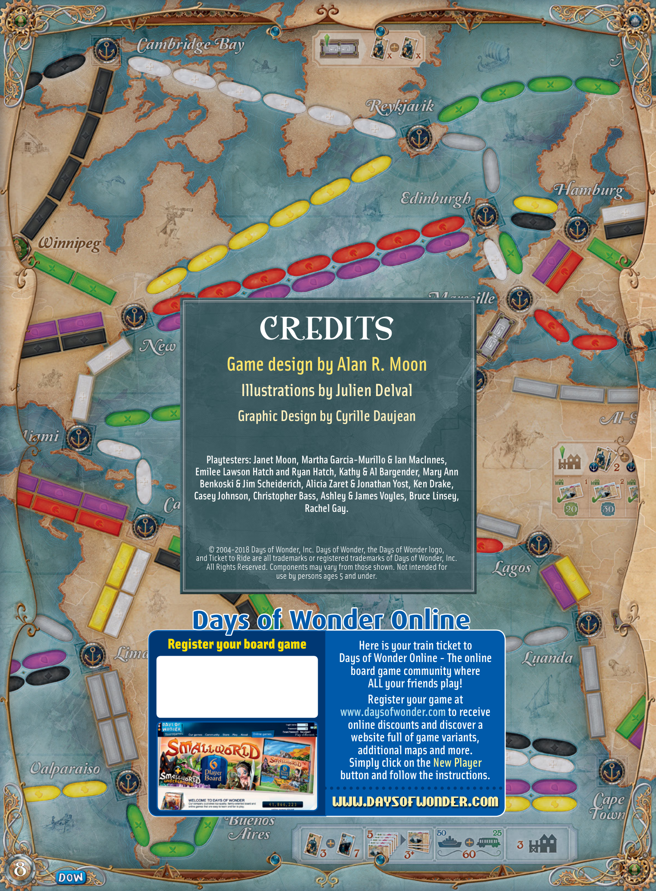

# Rails & Sails: World

[Source PDF](rules.pdf) · [Map reference](map.png)

Parsed locally with pdf-inspector. Original page images preserve diagrams, tables, and layout; consult them where extraction is unclear.

## PDF page 1

The parser returned no text for this page. Refer to the page image below.

## PDF page 2

#### The world is changing fast. All over the world, railroad tracks bridge

#### countries and continents, and trips that would take weeks can

#### now be completed in a matter of days. Water is no longer the obstacle

#### it once was; now, huge ocean liners carry hundreds of passengers

#### across the sea. From Los Angeles to Sydney, from Murmansk to Dar Es

Salaam, Ticket to Ride: Rails & Sails takes you on a railroad adventure across the entire globe.

#### All aboard, and get ready for an unforgettable journey!

# Components

To play the World map, use the following components: u 1 game board showing a map of the world

- 140 Travel cards:

##### 80 Train cards

_including 11 of each color: purple, yellow, green, red, black and white_

## Setting up the Game Important Note

##### If you have already played the Great

Place the game board in the center of the table➊. **Lakes map, simply read the sections marked** Shuffle the Train cards and the Ship cards separately. Deal 3 Train **with a ”World” icon.** cards and 7 Ship cards to each player for his starting hand. Flip **All other rules remain unchanged.** ➋ 3 cards from each deck faceup➌. Deal each player 5 tickets; each player must keep at least 3 of these tickets. Any tickets not kept are placed facedown at the bottom of the deck. ➍ Each player receives 25 trains and 50 ships of the same color. After he has chosen which tickets to keep, a player must de- cide on the assortment of 60 pieces to keep in his supply. A player can choose any combination of his pieces that adds up to 60 (for example, 25 trains and 35 ships). The extra pieces are returned to the box. Players choose their assortment secretly and reveal them simultaneously when every player has made his final decision. **If one or more players are playing this map** **for the first time, it is recommended that all players start with** **an assortment of 20 trains and 40 ships.** There is no way for any player to have more than either 25 trains or 50 ships on this map➎. Each player also receives 3 harbors➏.

##### 14 Wild cards

##### 60 Ship cards

_24 Single-Ship cards (4 of each color)_

- 65 Ticket cards
  _36 Double-Ship cards (6 of each color)_

u 125 colored trains (25 each: blue, red, green, yellow, black) u 250 colored ships (50 in each color) u 15 harbors (3 in each color) u 5 scoring markers

## Object of the Game

The object of the game is to gain the most points. Players gain points by: u **Claiming a route between two adjacent cities on the map;** u **Successfully completing the routes shown on their tickets;** u **Building harbors in the cities shown on their tickets.** Points are deducted from the players’ total score for each of their tickets that are not successfully completed by the end of the game.

### The Game Turn

The player who has traveled the most goes first. Play then proceeds clockwise. On his turn, a player must perform one (and only one) of the following five actions: **Take Travel Cards –** The player takes two Travel cards (or just one if the card he selects is a faceup Wild card. For more details, see “Wild Cards” on page 4); **Claim a Route –** The player claims a route on the map by playing a set of Train or Ship cards from his hand that match the color and number of the spaces in that route. He places one of his colored trains (or ships) in each of the route’s spaces and, based on that route’s length, gains the number of points indicated on the route scoring table; **Draw Tickets –** The player draws four tickets from the top of the ticket deck and must keep at least one of them; **Build a Harbor –** The player builds a harbor in a city that he has a claimed route into; **Exchange Pieces –** The player exchanges some plastic pieces in his supply with those he returned to the box.

## PDF page 3

When a route is claimed, the player places one of his plastic trains (or ships) in each of the route’s spaces. Then all the cards played to claim the route are discarded, and the player immediately updates his score by moving his scoring marker along the scoring track equal to the number of spaces indicated by the route scoring table printed on the board.

# Take Travel Cards

Travel cards are divided into two separate decks by type: the train deck and the ship deck. Each Travel card has a color, which relates to various routes on the map – purple, yellow, green, red, black, and white.

To take Travel cards, the player may add up to two cards to his hand. Either of these cards can be taken from the six faceup cards next to the board or from the top of the _Train Card_ decks (blind draw). If taking a faceup card, the player must immediately replace it with a new card from either deck (his choice). So during the game, the six faceup cards could be all Train cards, all Ship cards, three of each, two of one type and four of the other, or one of one type and five of the other.

If a player chooses a faceup Wild card, it is the only Travel card he takes this turn (see “Wild Cards” below). If, at any time, three of the six faceup Travel cards are Wild cards, all six cards are immediately discarded to their respective discard piles, and six _Ship Card_ new cards are turned faceup to replace them (three from each deck).

A player may have any number of cards in his hand at any time. When a Travel deck runs out, shuffle the cards in the discard pile and place them facedown to create a new deck. Be sure to shuffle the cards thoroughly since all the cards have been discarded in sets.

In the rare case that there are no cards left in the deck and no cards in either discard pile to shuffle and create a new deck (as a result of players hoarding cards in their hands), a player will not be able to draw Travel cards. He must choose to do one of the other actions instead.

## Wild Cards

Wild cards are a specific type of Train card. They can be played along with any set of Travel cards (including Ship cards) when claiming a route.

If a player takes a faceup Wild card while taking Travel cards, it is the only card he takes that turn. If a Wild card is flipped faceup as a replacement for the first card taken during the turn, or if a Wild card is available faceup but not taken as the first (and only) card, it cannot be taken as the second card for the turn. However, if a player is lucky enough to get a Wild card from the top of the deck in a blind draw, it stills counts as a single card and he may still take a total of two cards that turn.

_Note: Wild cards can also be used for harbors (see “Harbors” on page 6)._

# Claiming Routes

Routes with rectangle spaces are train routes and can contain only train pieces, not ships. Routes with oval spaces are ship routes and can contain only ship pieces, not trains. Each route can con- _Train route_ tain only one type of plastic piece.

To claim a route, a player must play a number of cards from his hand equal to the number of spaces in the route. The cards must all be the same color and type, and they must match the route’s transportation type (train or ship). Most routes require a specific color; for example, a green train route must be claimed using green Train cards. Gray routes can be claimed using cards in **any one** color of the required type. _Ship route_

_Note: Many Ship cards are Double Ships. When claiming a route with these cards,_

_you can place up to two ships per Double-Ship card. For example, to claim a ship_ _route that has five spaces, you could use two Double-Ship cards and one Single-Ship_ _card, or three Double-Ship cards (however, in this case you would place only five_ _plastic ships)._

_To claim a white ship route that has 4 spaces, Steven plays_ _two white Double-Ship cards. He could have played four_ _To claim a purple train route that has 3 spaces, Peter plays white Single-Ship cards, two white Single-Ship cards and_ _three purple Train cards. Any of them could have been_ _one white Double-Ship card, or any other combination_ _replaced by a Wild card._ _matching this color and number, including Wild cards._

A player can claim any open route on the board. He is not required to connect to any of his already claimed routes. A player can claim a maximum of only one route on his turn.

## Pair Routes

Some train routes are marked with a special “Pair” symbol indicating that this route covers very difficult terrain. To place a train on a “Pair” space, you need two Train cards of the same color instead of one (you can use

_Pair route_ any color, and you do not have to use the same color for all spaces in the route). Wild cards can be used as part of a pair.

## Double Routes

Some cities are connected by two parallel routes. Each player cannot claim more than one route in a double route.

_Note: In two- or three-player games, only one of the two routes in a double route can be claimed._

_Once one of the two routes has been claimed, the other route is unavailable for the rest of the game. Double Route_

# Drawing Tickets

A player can use his turn to draw additional Ticket cards. To do so, he draws four cards from the top of the Ticket deck. If there are less than four tickets left in the deck, the player draws the remaining cards.

A player drawing tickets must keep at least one of them, but may keep two, three, or all four. Any drawn ticket not kept is placed facedown at the bottom of the Ticket deck. Tickets that a player draws and does not immediately discard must be kept until the end of the game and cannot be discarded during a later ticket draw.

The cities listed on a ticket represent travel goals for the player, who gains or loses points depending on whether his tickets were completed. At the end of the game, if a player has connected the cities shown on one of his tickets with a continuous path of plastic pieces of his color, he gains points equal to the ticket’s point value. If he has failed to connect the cities shown, he loses points equal to the ticket’s point value.

## PDF page 4

Tickets are kept facedown and secret from other players during the game and are only revealed at the end of the game during final scoring. There is no limit to the number of tickets a player can have during the game.

_Important Note: On the World map, the western edge of the map connects to the eastern edge. Little arrows pointing_ _to the sides indicate which routes connect to which cities._

### Tour Tickets

There are eight Tour tickets, each of which shows more than two cities. If a player completes the ticket with the correct route in the exact order, he gains points equal to the higher value shown in the bottom-left corner of the card. If a player completes the ticket, but cannot trace a route exactly as shown on the card, he gains points equal to the lower value shown in the bottom-left corner of the card. If the player fails to complete the ticket, he loses points equal to the value shown in the bottom-right corner of the card.

# Harbors

Harbors can be built only in port cities, which are blue with an anchor symbol. Each port city can have only one harbor. **A player cannot build a harbor in a port** **city unless he has at least one claimed route (of either type) into that city.**

To build a harbor, a player must play two Train cards AND two Ship cards. All four cards must be the same color and have a harbor symbol. Wild cards can be used to replace any of these cards.

Each color has four Train cards and four Ship cards with a harbor symbol _Each color has four Train cards and_ _four Ship cards with a harbor symbol_ (all Single-Ship cards). _(all Single-Ship cards)._ **At the end of the game, a player gains points for each of his harbors as follows:**

✦ **20 points** if he has **one** completed ticket into it;

✦ **30 points** if he has **two** completed tickets into it;

✦ **40 points** if he has **three or more** completed tickets into it. (including Tour tickets)

If a player has two or more harbors that are named on the same ticket, the player gains points for each Harbor on the ticket. _Alan uses one wild and one yellow Ship_ Players are not required to build harbors, but for each harbor a player _card plus two yellow Train cards to build_ _a harbor in Lima._ does not build, he loses four points at the end of the game.

_Janet gains 30 points_ _for the Buenos Aires_ _harbor since she_ _completed two tickets_ _with Buenos Aires as_ _one of the destinations._ _Janet also gains 30_ _She completed the following tickets:_ _points for the Dar Es_ _Buenos Aires–Manila, Buenos Aires-Sydney,_ _Salaam harbor for the_ _Janet built a harbor in Buenos Aires Hamburg–Dar Es Salaam, and the Tour Ticket Lagos–_ _same reason._ _and another one in Dar Es Salaam. Luanda–Dar Es Salaam–Djibouti._

# Exchange Pieces

A player uses his turn to exchange pieces. He can exchange any number of plastic pieces in his supply for his color pieces in the box (one piece for one piece). He adds the new pieces to his supply and returns the pieces he exchanged back to the box. The player loses 1 point for each piece exchanged. A player can exchange pieces as many times during the game as he wants, but only if he has pieces of the desired type still in the box. _Ian decides to exchange two ships for_ _two trains. He loses 2 points in the_ _process, and his turn ends._

# Game End

When any one player’s supply of plastic pieces contains six pieces or fewer (regardless of their type), each player, including that player, gets two more turns, after which the game ends and players calculate their final scores.

## Route Length Points Gained

_When a player claims a route with either trains or ships, he immediately gains_ _the number of points indicated on the Route Scoring Table._

Unlike other games in the Ticket to Ride series, there there is no bonus for Longest Route or Most Completed Tickets.

The player with the highest score wins.

## Calculating final Score

## Final Score

**_Current Score_**

# +/- Points

**_Harbors_**

# -4Points per

**_for Tickets Unbuilt Harbor_**

## PDF page 5

# CREDITS

## Game design by Alan R. Moon

### Illustrations by Julien Delval

#### Graphic Design by Cyrille Daujean

**Playtesters: Janet Moon, Martha Garcia-Murillo & Ian MacInnes,** **Emilee Lawson Hatch and Ryan Hatch, Kathy & Al Bargender, Mary Ann** **Benkoski & Jim Scheiderich, Alicia Zaret & Jonathan Yost, Ken Drake,** **Casey Johnson, Christopher Bass, Ashley & James Voyles, Bruce Linsey,** **Rachel Gay.**

© 2004-2018 Days of Wonder, Inc. Days of Wonder, the Days of Wonder logo, and Ticket to Ride are all trademarks or registered trademarks of Days of Wonder, Inc. All Rights Reserved. Components may vary from those shown. Not intended for use by persons ages 5 and under.

# Days of Wonder Online

##### Register your board game Here is your train ticket to

**Days of Wonder Online-The online board game community where** **ALL your friends play!** **Register your game at www.daysofwonder.com to receive** **online discounts and discover a website full of game variants,** **additional maps and more.** **Simply click on the New Player button and follow the instructions.**

www.daysofwonder.com

