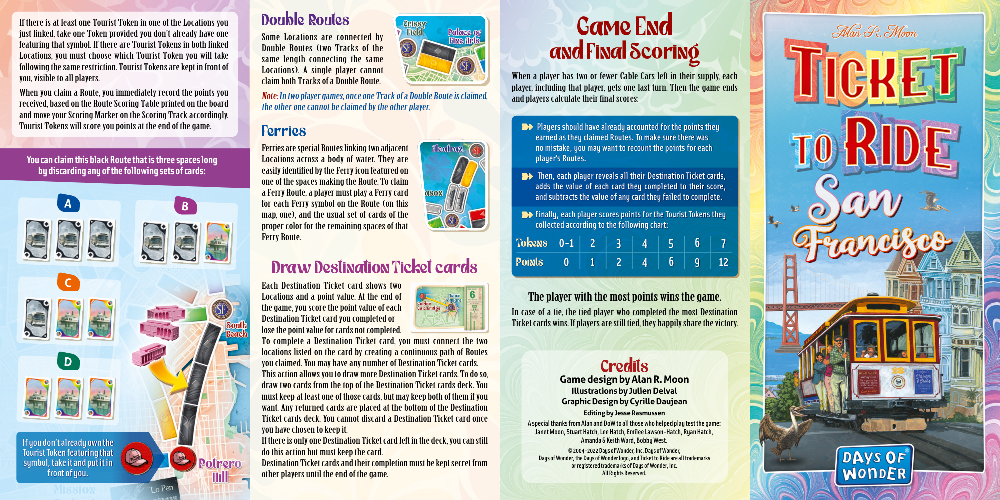
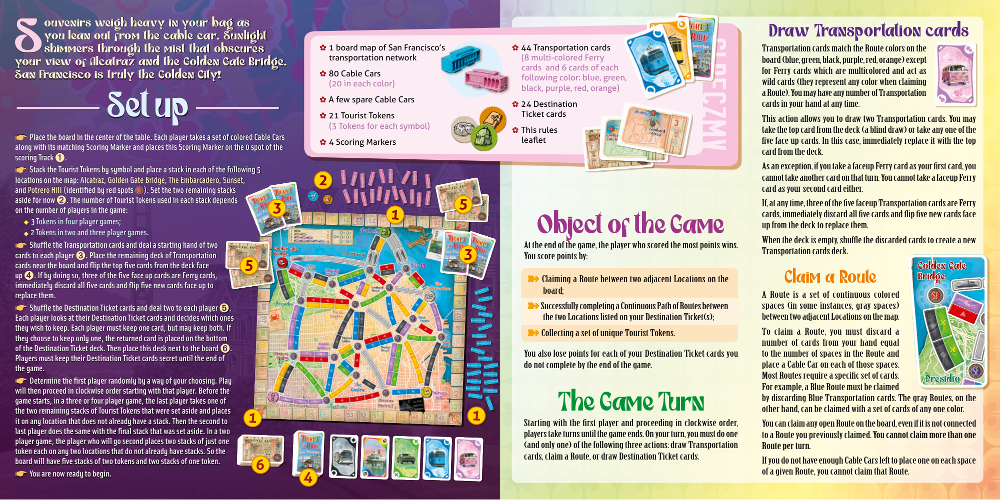

# San Francisco

[Source PDF](rules.pdf) · [Map reference](san-francisco-map.png)

Parsed locally with pdf-inspector. Original page images preserve diagrams, tables, and layout; consult them where extraction is unclear.

## PDF page 1

##### Double Routes

Some Locations are connected by Double Routes (two Tracks of the same length connecting the same Locations). A single player cannot claim both Tracks of a Double Route.

Note: In two player games, once one Track of a Double Route is claimed,

the other one cannot be claimed by the other player.

Ferries Ferries are special Routes linking two adjacent Locations across a body of water. They are **You can claim this black Route that is three spaces long** easily identified by the Ferry icon featured on **by discarding any of the following sets of cards:** one of the spaces making the Route. To claim a Ferry Route, a player must play a Ferry card for each Ferry symbol on the Route (on this **A** **B** map, one), and the usual set of cards of the proper color for the remaining spaces of that Ferry Route.

If there is at least oneone Tourist Token in one of the Locations you just linked, take one Token provided you don’t already have one featuring that symbol. If there are Tourist Tokens in both linked Locations, you must choose which Tourist Token you will take following the same restriction. Tourist Tokens are kept in front of you, visible to all players. When you claim a Route, you immediately record the points you received, based on the Route Scoring Table printed on the board and move your Scoring Marker on the Scoring Track accordingly. Tourist Tokens will score you points at the end of the game.

#### Draw Destination Ticket cards

Each Destination Ticket card shows two Locations and a point value. At the end of the game, you score the point value of each Destination Ticket card you completed or lose the point value for cards not completed. To complete a Destination Ticket card, you must connect the two locations listed on the card by creating a continuous path of Routes you claimed. You may have any number of Destination Ticket cards. This action allows you to draw more Destination Ticket cards. To do so, draw two cards from the top of the Destination Ticket cards deck. You must keep at least one of those cards, but may keep both of them if you want. Any returned cards are placed at the bottom of the Destination Ticket cards deck. You cannot discard a Destination Ticket card once you have chosen to keep it. If there is only one Destination Ticket card left in the deck, you can still

| If you don’t already own the  | Amanda & Keith Ward, Bobby West.                 |                      |
| ----------------------------- | ------------------------------------------------ | -------------------- |
| Tourist Token featuring that  | © 2004-2022 Days of Wonder, Inc. Days of Wonder, |                      |
| symbol, take it and put it in | or registered trademarks of Days of Wonder, Inc. |                      |
| front of you.                 |                                                  | All Rights Reserved. |

do this action but must keep the card. Destination Ticket cards and their completion must be kept secret from other players until the end of the game.

# Game End

## and Final Scoring

When a player has two or fewer Cable Cars left in their supply, each player, including that player, gets one last turn. Then the game ends and players calculate their final scores:

➽**Players should have already accounted for the points they** **earned as they claimed Routes. To make sure there was** **no mistake, you may want to recount the points for each player’s Routes.**

➽**Then, each player reveals all their Destination Ticket cards,** **adds the value of each card they completed to their score,** **and subtracts the value of any card they failed to complete.** ➽ **Finally, each player scores points for the Tourist Tokens they** **collected according to the following chart:** Tokens **0-1 2 3 4 5 6 7** Points **0 1 2 4 6 9 12**

**C**

**D**

**If you don’t already own the**

The player with the most points wins the game. The player with the most points wins the game. In case of a tie, the tied player who completed the most Destination Ticket cards wins. If players are still tied, they happily share the victory.

#### Credits

**Game design by Alan R. Moon** **Illustrations by Julien Delval** **Graphic Design by Cyrille Daujean** **Editing by Jesse Rasmussen** **A special thanks from Alan and DoW to all those who helped play test the game:** **Janet Moon, Stuart Hatch, Lee Hatch, Emilee Lawson-Hatch, Ryan Hatch,** **Amanda & Keith Ward, Bobby West.** **Days of Wonder, the Days of Wonder logo, and Ticket to Ride are all trademarks**

## PDF page 2

ouvenirs weigh heavy in your bag as

#### Draw Transportation cards

you lean out from the cable car. Sunlight Sshimmers through the mist that obscures✿ 1 board map of San Francisco’s ✿ 44 Transportation cardsTransportation cards match the Route colors on the transportation network (8 multi-colored Ferryboard (blue, green, black, purple, red, orange) except your view of Alcatraz and the Golden Gate Bridge. cards and 6 cards of each for Ferry cards which are multicolored and act as San Francisco is truly the Golden City!✿ 80 Cable Cars following color: blue, green, (20 in each color)wild cards (they represent any color when claiming black, purple, red, orange) a Route). You may have any number of Transportation ✿ A few spare Cable Cars ✿ 24 Destination cards in your hand at any time.

## Set up✿ 21 Tourist Tokens Ticket cards

This action allows you to draw two Transportation cards. You may (3 Tokens for each symbol) ✿ This rules take the top card from the deck (a blind draw) or take any one of the ☛**Place the board in the center of the table. Each player takes a set of colored Cable Cars** leafletfive face up cards. In this case, immediately replace it with the top ✿ 4 Scoring Markers **along with its matching Scoring Marker and places this Scoring Marker on the 0 spot of the**In the box card from the deck. **scoring Track**➊. As an exception, if you take a faceup Ferry card as your first card, you ☛**Stack the Tourist Tokens by symbol and place a stack in each of the following 5** **locations on the map: Alcatraz, Golden Gate Bridge, The Embarcadero, Sunset,**cannot take another card on that turn. You cannot take a faceup Ferry **and Potrero Hill (identified by red spots ). Set the two remaining stacks**card as your second card either. **aside for now**➋**. The number of Tourist Tokens used in each stack depends** If, at any time, three of the five faceup Transportation cards are Ferry **on the number of players in the game:** cards, immediately discard all five cards and flip five new cards face ◆ **3 Tokens in four player games;** up from the deck to replace them.

### Object of the Game

◆ **2 Tokens in two and three player games.** When the deck is empty, shuffle the discarded cards to create a new ☛**Shuffle the Transportation cards and deal a starting hand of two** At the end of the game, the player who scored the most points wins. Transportation cards deck. **cards to each player**➌**. Place the remaining deck of Transportation**You score points by: **cards near the board and flip the top five cards from the deck face** **up**➍**. If by doing so, three of the five face up cards are Ferry cards,** ➽ Claiming a Route between two adjacent Locations on the Claim a Route **immediately discard all five cards and flip five new cards face up to** board; **replace them.** A Route is a set of continuous colored ➽ Successfully completing a Continuous Path of Routes between spaces (in some instances, gray spaces) ☛**Shuffle the Destination Ticket cards and deal two to each player**➎**.** **Each player looks at their Destination Ticket cards and decides which ones** the two Locations listed on your Destination Ticket(s); between two adjacent Locations on the map. **they wish to keep. Each player must keep one card, but may keep both. If** ➽ Collecting a set of unique Tourist Tokens. To claim a Route, you must discard a **they choose to keep only one, the returned card is placed on the bottom** number of cards from your hand equal **of the Destination Ticket deck. Then place this deck next to the board**➏**.** You also lose points for each of your Destination Ticket cards you to the number of spaces in the Route and **Players must keep their Destination Ticket cards secret until the end of** do not complete by the end of the game. place a Cable Car on each of those spaces. **the game.** Most Routes require a specific set of cards. ☛**Determine the first player randomly by a way of your choosing. Play** For example, a Blue Route must be claimed **will then proceed in clockwise order starting with that player. Before the** by discarding Blue Transportation cards. The gray Routes, on the **game starts, in a three or four player game, the last player takes one of** The Game Turnother hand, can be claimed with a set of cards of any one color. **the two remaining stacks of Tourist Tokens that were set aside and places** **it on any location that does not already have a stack. Then the second to**Starting with the first player and proceeding in clockwise order, You can claim any open Route on the board, even if it is not connected **last player does the same with the final stack that was set aside. In a two** players take turns until the game ends. On your turn, you must do one to a Route you previously claimed. You cannot claim more than one You cannot claim more than one **player game, the player who will go second places two stacks of just one** (and only one) of the following three actions: draw Transportation Route per turn. Route per turn. **token each on any two locations that do not already have stacks. So the** cards, claim a Route, or draw Destination Ticket cards. **board will have five stacks of two tokens and two stacks of one token.** If you do not have enough Cable Cars left to place one on each space of a given Route, you cannot claim that Route. ☛**You are now ready to begin.**

