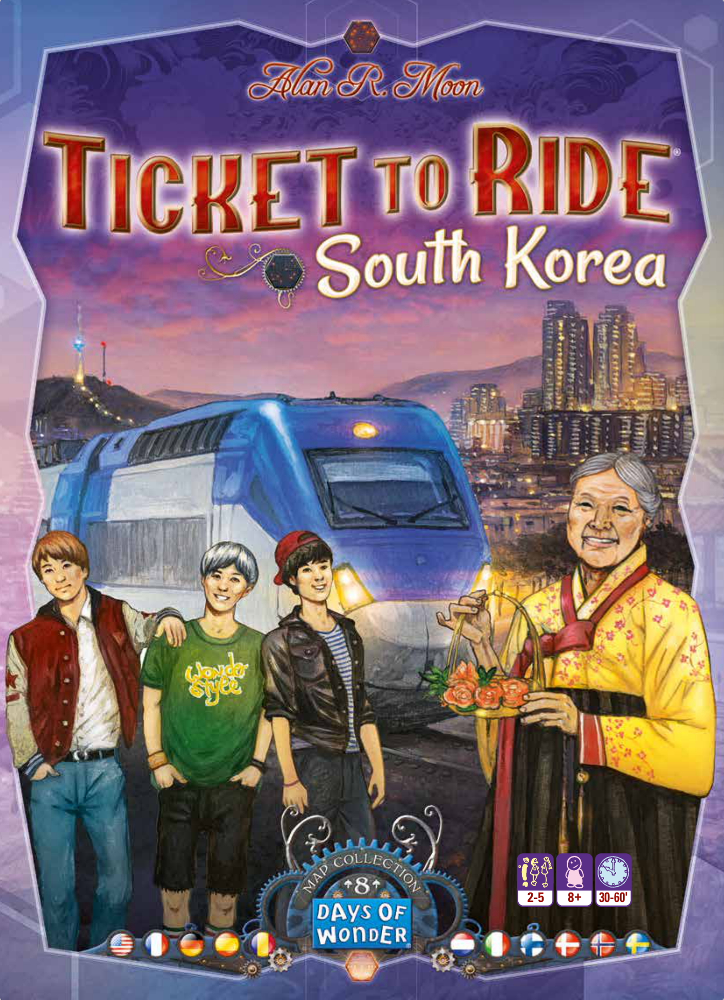
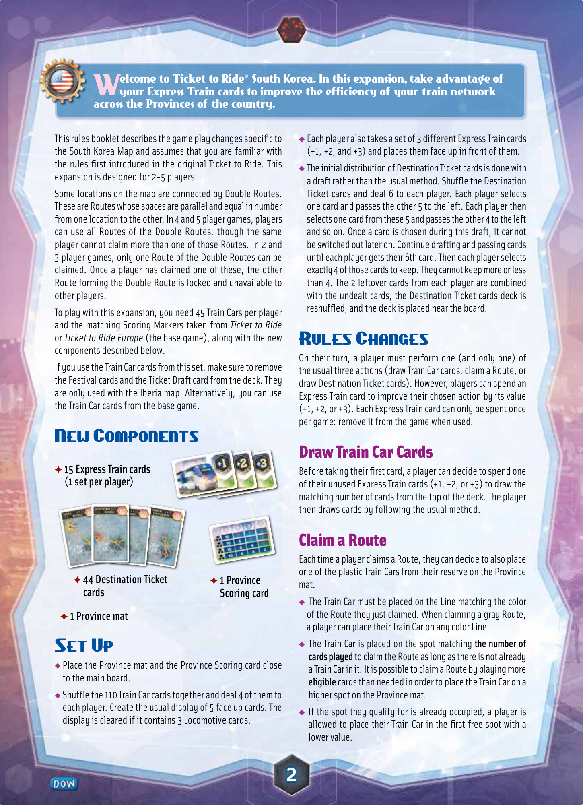
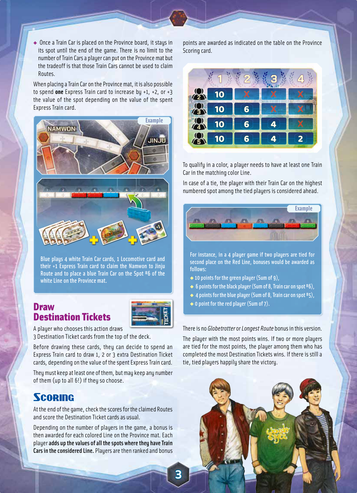

# South Korea

[Source PDF](rules.pdf) · [Map reference](map.png)

Parsed locally with pdf-inspector. Original page images preserve diagrams, tables, and layout; consult them where extraction is unclear.

## PDF page 1

The parser returned no text for this page. Refer to the page image below.

## PDF page 2

elcome to Ticket to Ride® South Korea. In this expansion, take advantage of

# Wyour Express Train cards to improve the efficiency of your train network

across the Provinces of the country.

This rules booklet describes the game play changes specific to the South Korea Map and assumes that you are familiar with the rules first introduced in the original Ticket to Ride. This expansion is designed for 2-5 players.

Some locations on the map are connected by Double Routes. These are Routes whose spaces are parallel and equal in number from one location to the other. In 4 and 5 player games, players can use all Routes of the Double Routes, though the same player cannot claim more than one of those Routes. In 2 and 3 player games, only one Route of the Double Routes can be claimed. Once a player has claimed one of these, the other Route forming the Double Route is locked and unavailable to other players.

To play with this expansion, you need 45 Train Cars per player and the matching Scoring Markers taken from _Ticket to Ride_ or _Ticket to Ride Europe_ (the base game), along with the new components described below.

If you use the Train Car cards from this set, make sure to remove the Festival cards and the Ticket Draft card from the deck. They are only used with the Iberia map. Alternatively, you can use the Train Car cards from the base game.

## New Components

✦ **15 Express Train cards** **(1 set per player)**

u Each player also takes a set of 3 different Express Train cards u (+1, +2, and +3) and places them face up in front of them.

The initial distribution of Destination Ticket cards is done with a draft rather than the usual method. Shuffle the Destination Ticket cards and deal 6 to each player. Each player selects one card and passes the other 5 to the left. Each player then selects one card from these 5 and passes the other 4 to the left and so on. Once a card is chosen during this draft, it cannot be switched out later on. Continue drafting and passing cards until each player gets their 6th card. Then each player selects exactly 4 of those cards to keep. They cannot keep more or less than 4. The 2 leftover cards from each player are combined with the undealt cards, the Destination Ticket cards deck is reshuffled, and the deck is placed near the board.

## Rules Changes

On their turn, a player must perform one (and only one) of the usual three actions (draw Train Car cards, claim a Route, or draw Destination Ticket cards). However, players can spend an Express Train card to improve their chosen action by its value (+1, +2, or +3). Each Express Train card can only be spent once per game: remove it from the game when used.

## Draw Train Car Cards

Before taking their first card, a player can decide to spend one of their unused Express Train cards (+1, +2, or +3) to draw the matching number of cards from the top of the deck. The player then draws cards by following the usual method.

## Claim a Route

Each time a player claims a Route, they can decide to also place one of the plastic Train Cars from their reserve on the Province mat.

u The Train Car must be placed on the Line matching the color of the Route they just claimed. When claiming a gray Route, u a player can place their Train Car on any color Line.

The Train Car is placed on the spot matching **the number of** **cards played** to claim the Route as long as there is not already a Train Car in it. It is possible to claim a Route by playing more **eligible** cards than needed in order to place the Train Car on a

u higher spot on the Province mat.

If the spot they qualify for is already occupied, a player is allowed to place their Train Car in the first free spot with a lower value.

✦ **44 Destination Ticket** ✦ **1 Province** **cards Scoring card**

✦ **1 Province mat**

## Set Up

u Place the Province mat and the Province Scoring card close to the main board.

u Shuffle the 110 Train Car cards together and deal 4 of them to each player. Create the usual display of 5 face up cards. The display is cleared if it contains 3 Locomotive cards.

## PDF page 3

u points are awarded as indicated on the table on the Province Once a Train Car is placed on the Province board, it stays in Scoring card. its spot until the end of the game. There is no limit to the number of Train Cars a player can put on the Province mat but the tradeoff is that those Train Cars cannot be used to claim Routes.

When placing a Train Car on the Province mat, it is also possible

## 1100 XX XX XX

to spend **one** Express Train card to increase by +1, +2, or +3 the value of the spot depending on the value of the spent

## 1100 66 XX XX

Express Train card. **Example**

## 1100 66 44 XX 1100 66 44 22

To qualify in a color, a player needs to have at least one Train Car in the matching color Line.

In case of a tie, the player with their Train Car on the highest numbered spot among the tied players is considered ahead. **Example**

**Blue plays 4 white Train Car cards, 1 Locomotive card and** **their +1 Express Train card to claim the Namwon to Jinju** **Route and to place a blue Train Car on the Spot #6 of the white Line on the Province mat.**

# Draw Destination Tickets

A player who chooses this action draws 3 Destination Ticket cards from the top of the deck.

Before drawing these cards, they can decide to spend an Express Train card to draw 1, 2 or 3 extra Destination Ticket cards, depending on the value of the spent Express Train card.

They must keep at least one of them, but may keep any number of them (up to all 6!) if they so choose.

# Scoring

At the end of the game, check the scores for the claimed Routes and score the Destination Ticket cards as usual.

Depending on the number of players in the game, a bonus is then awarded for each colored Line on the Province mat. Each player **adds up the values of all the spots where they have Train** **Cars in the considered Line.** Players are then ranked and bonus

### For instance, in a 4 player game if two players are tied for

### second place on the Red Line, bonuses would be awarded as follows:

u **10 points for the green player (Sum of 9),** u **6 points for the black player (Sum of 8, Train car on spot #6),** u **4 points for the blue player (Sum of 8, Train car on spot #5),** u **0 point for the red player (Sum of 7).**

There is no _Globetrotter_ or _Longest Route_ bonus in this version.

The player with the most points wins. If two or more players are tied for the most points, the player among them who has completed the most Destination Tickets wins. If there is still a tie, tied players happily share the victory.

