# Stay At Home

[Source PDF](rules.pdf) · [Map reference](map.png)

Parsed locally with pdf-inspector. Original page images preserve diagrams, tables, and layout; consult them where extraction is unclear.

## PDF page 1

2 - 4 Players 20 – 40 min8+

Welcome to Ticket to Ride Stay at Home! In this Print and Play expansion, 2 to 4 family members compete to complete their Tickets in the rooms of their house. These Rules describe the gameplay changes specific to the Stay At Home Map and assume that you are familiar with the rules first introduced in the original Ticket to Ride.

# Components

This game is an expansion and requires that you use the following game parts from one of the previous versions of Ticket to Ride:

- A reserve of **32 Trains Cars per player** (instead of the usual

45. and matching Scoring Markers taken from one of the following: Ticket to Ride / Ticket to Ride Europe / Ticket to Ride Germany

- f Train Car cards taken from either:The deck o Ticket to Ride / Ticket to Ride Europe / Ticket to Ride Germany / USA 1910 expansion You will also need to print, cut and assemble the Board and the Tickets available at: [https://www.daysofwonder.com/tickettoride/stay-at-home/](https://www.daysofwonder.com/tickettoride/stay-at-home/)

# Set Up

Place the Board in the middle of the table. the Train Car cards deck and deal 4 cards to each Shuffle player. Place the deck close to the board and reveal a row of 5 cards (as usual the row is flushed when at least 3 Locomotive cards show up). yer chooses a color and takes the matching 32 Train Each pla Cars and score marker. yer then chooses to assume the role of Dad, Mom, Each pla Sister, or Baby Brother (you can decide at random if you wish) and is dealt 2 Family Tickets at random among the 4 that picture their role. The other 2 Tickets and the remaining sets of Family Tickets (if playing with less than 4 players) are removed from the game. huffle the regular Tickets (they picture Rouky the cat) and S deal 2 Tickets to each player.

yer must keep at least 2 Tickets but can keep 3 or Each pla

4. The Tickets that a player chooses to keep can be any combination of their Family Tickets and regular Tickets. Unchosen Tickets are removed from the game. yer who woke up the earliest today plays first and The pla play then continues in clockwise order.

# Special Rules

On your turn, you must perform one (and only one) of the following three actions:

# Draw Train Car Cards

The card draw action follows the exact same rules as the base game.

# Claim a Route

## Multiple Routes

Some locations are connected by Double or Triple Routes. The same player cannot claim more than one Track of these Routes during the game.

f the Tracks on the two Triple Routes are in play with any All o number of players. n 2-player games, only one Track of the Double Routes I joining two locations can be claimed. Once it’s done, the remaining Track of the Double Route is locked and unavailable to the other player.

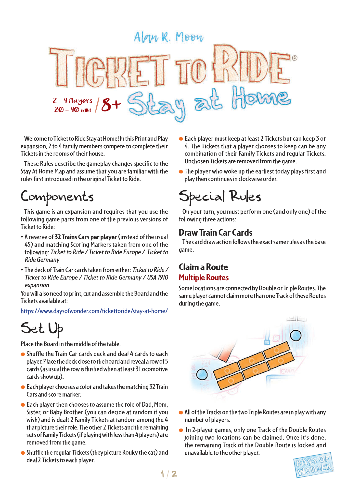

## PDF page 2

### Family Routes

This map introduces a new kind of Route: the Family Route.

You can claim one space on a Family Route as your whole turn. You may claim any number of spaces on the same Family Route during the game (the limitations of Multiple Routes still apply though, which means that you cannot place a Train Car on more than one Track of those Family Routes). You always score 1 point for this turn, regardless of how many spaces on the same Route you previously claimed. At the end of the game, if a Track of a Family Route is complete (all spaces are occupied), every player who has at least one Train Car on this Track can use this Route to complete Tickets.

**Note:** In 2-player games, a player can claim one or two spaces of

a Track on a Family Route as their whole turn. The player scores 2 points if he claims 2 spaces.

# Draw Tickets

Draw 3 Tickets from the top of the deck. You must keep at least one of them, but you may keep two or all three if you choose. Any returned cards are placed at the bottom of the deck.

## End of the Game

There is no End Game Bonus on this map. If two or more players are tied for the most points, the player among those who has completed the most Tickets wins.

.

#### Real Estate Agent

#### Alan R Moon

Architect Adrien Martinot

Interior decorators Cyrille Daujean Julien Delval

A special thanks from Alan and DoW to all those who helped play test the game: Janet Moon, Marielle Lefebvre, Lydie Tudal and Emi and Ewan Martinot —Tudal.

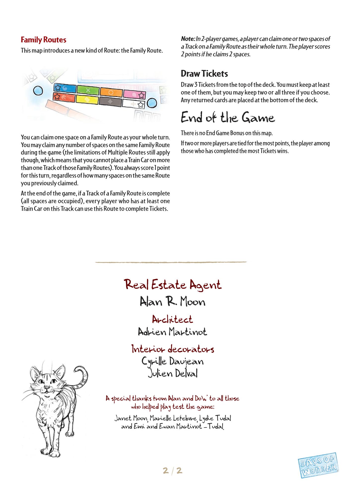

## PDF page 3

The parser returned no text for this page. Refer to the page image below.

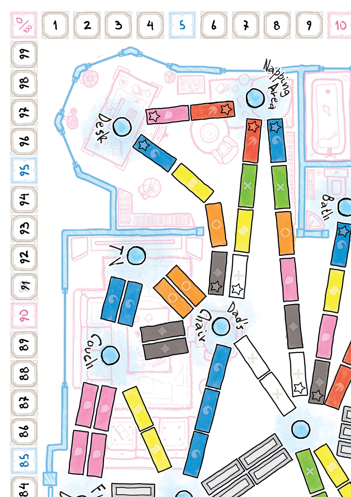

## PDF page 4

The parser returned no text for this page. Refer to the page image below.

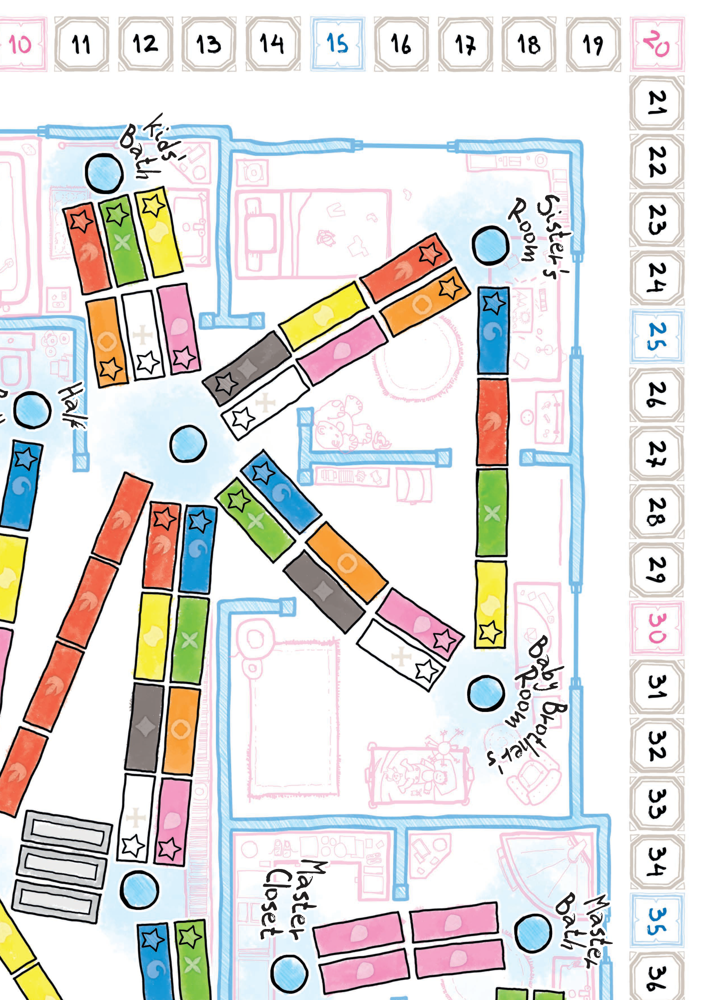

## PDF page 5

The parser returned no text for this page. Refer to the page image below.

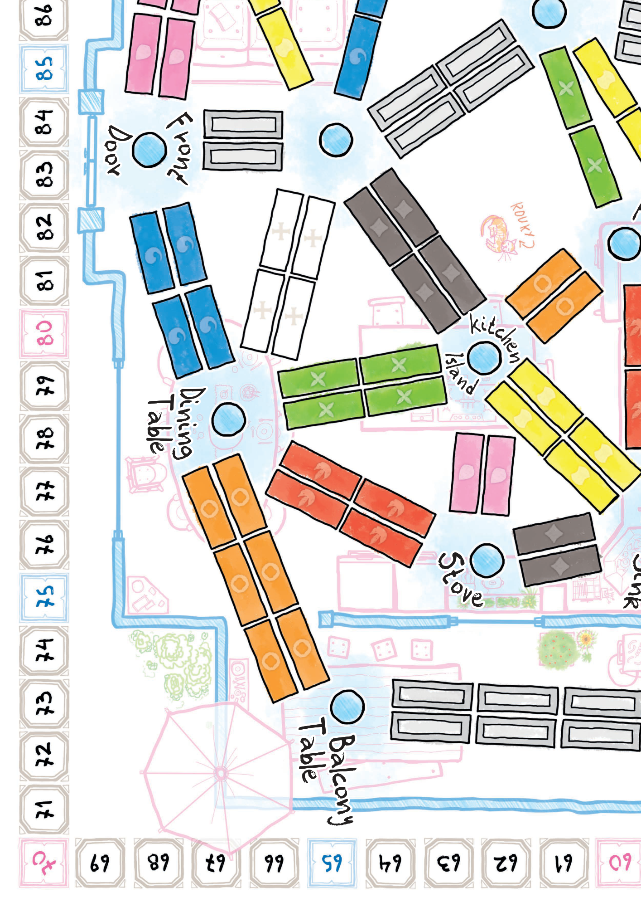

## PDF page 6

The parser returned no text for this page. Refer to the page image below.

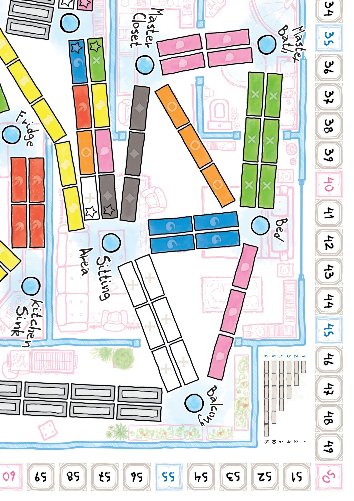

## PDF page 7

Bed Bed

# MOM Dad Dad

Kitchen Sink

Balcony Table Napping Area Dining Table

Bed Bed

# MOM MOMBabyDad

Brother's Room Fridge

## Kitchen Island Desk

Bed Bed Sister's Room SIS MOM Dad Sister's Room

## Kids' Bath

## Dad's Chair

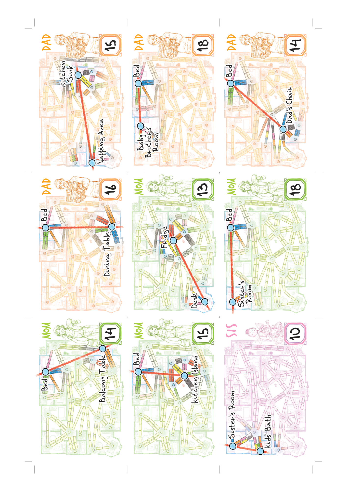

## PDF page 8

Baby Brother's BRO Baby Brother's BRO Sister's Room SIS Room Room

## Kids' Bath

Dad's Chair Couch

# BRO Sister's Room SIS

Baby Brother's Balcony Room

Kitchen Island Kitchen Island

## Front Door

Baby Brother's BRO Sister's Room SIS Room Half Bath

Kitchen Island Balcony Table Front Door

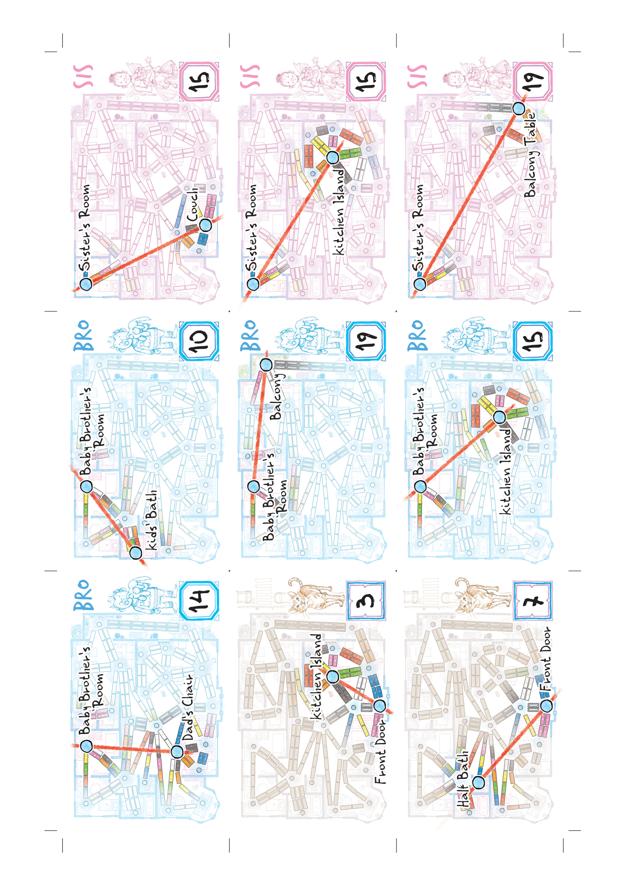

## PDF page 9

## Half Bath Fridge

Front Door7 Couch Couch Desk

## Sitting Area

Dining Table Dining Table Couch Couch TV

Half Bath Napping Area Balcony Table

Front Door TV TV

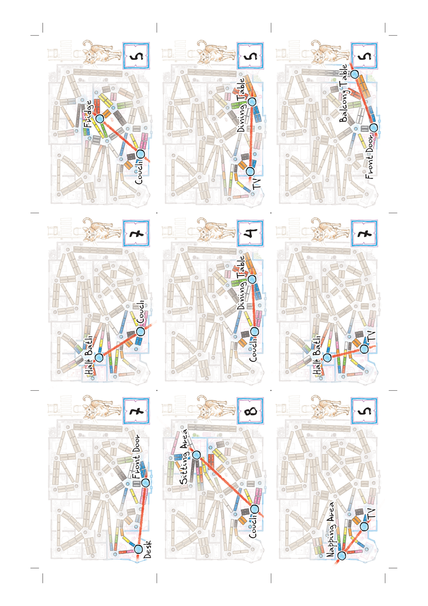

## PDF page 10

## Master Bath Balcony

Kitchen Island Napping Area Kitchen Island TV Bed

Fridge Fridge Dad's Chair

## Desk TV

Sitting Area Half Bath Dad's Chair Dining Table Dining Table Dad's Chair

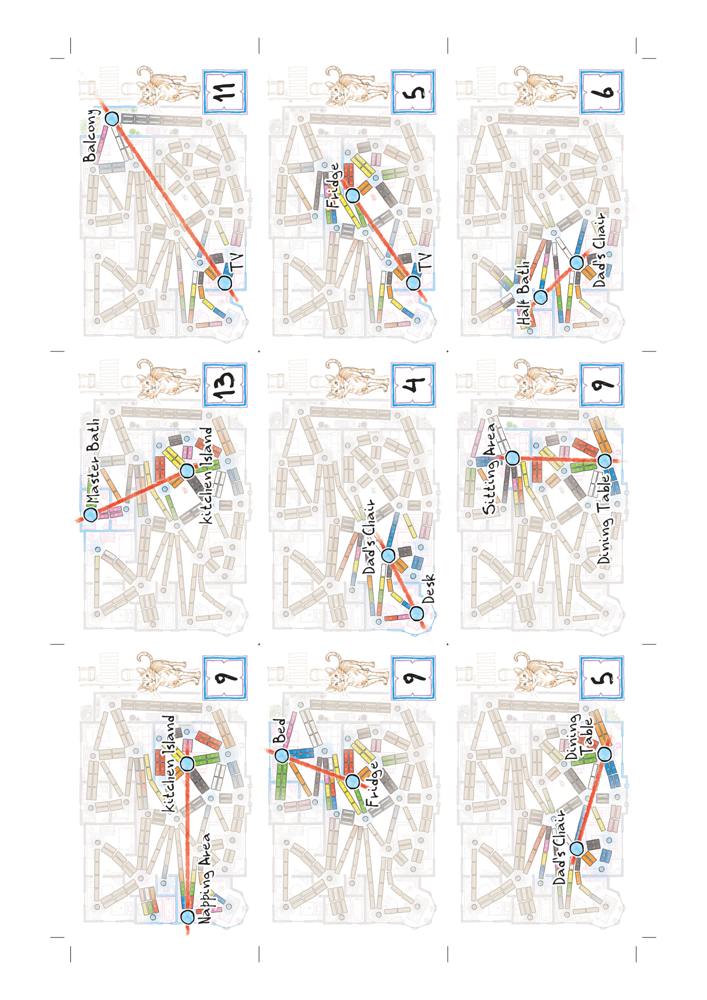

## PDF page 11

Master Master Master Closet Closet Closet

Sitting Area Kitchen Sink Dining Table

Baby Master Bath Balcony Brother's Room Kitchen Sink

Kitchen Sink Kitchen Island

## Master Bath Bed Sister's Room

Master Closet

Fridge

## Balcony Table

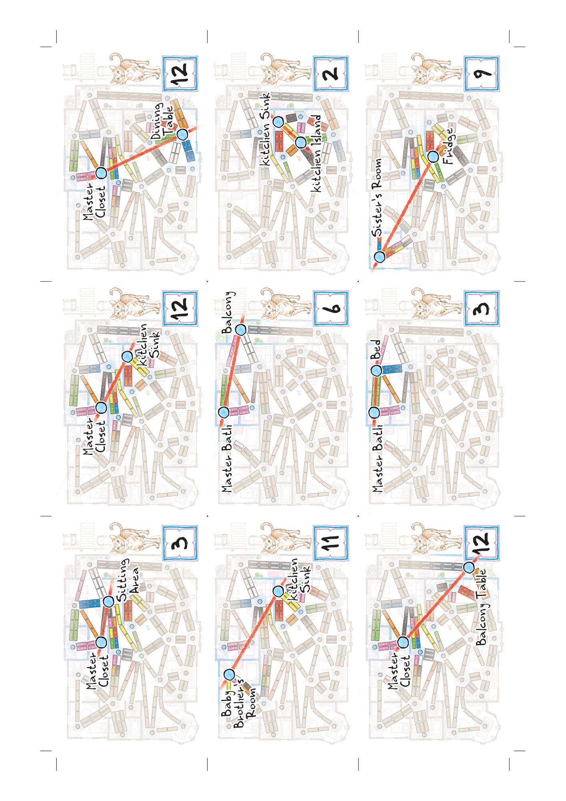

## PDF page 12

Kitchen Kids' Bath Sink

## Napping Area

Stove Balcony Table 12 Desk

## Master Bath

Sitting Sitting Stove Kids' Bath Area Area

Dining Table

Balcony

|          | Baby      |
| -------- | --------- |
| Sister's | Brother's |
| Room     | Room      |

Fridge

Kitchen Sink Stove

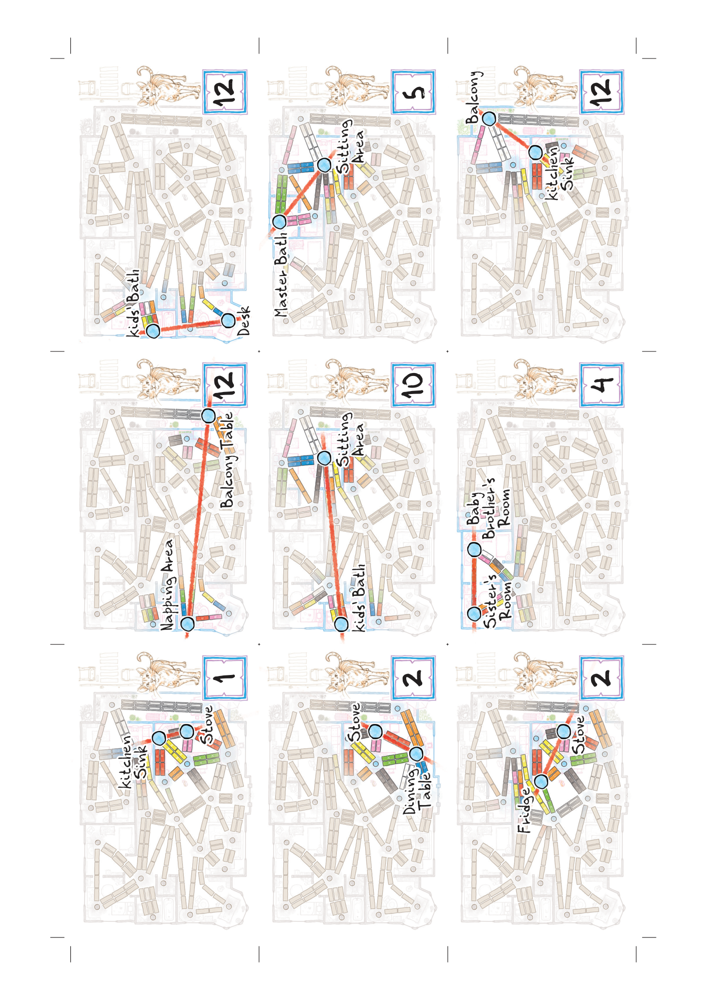

## PDF page 13

The parser returned no text for this page. Refer to the page image below.

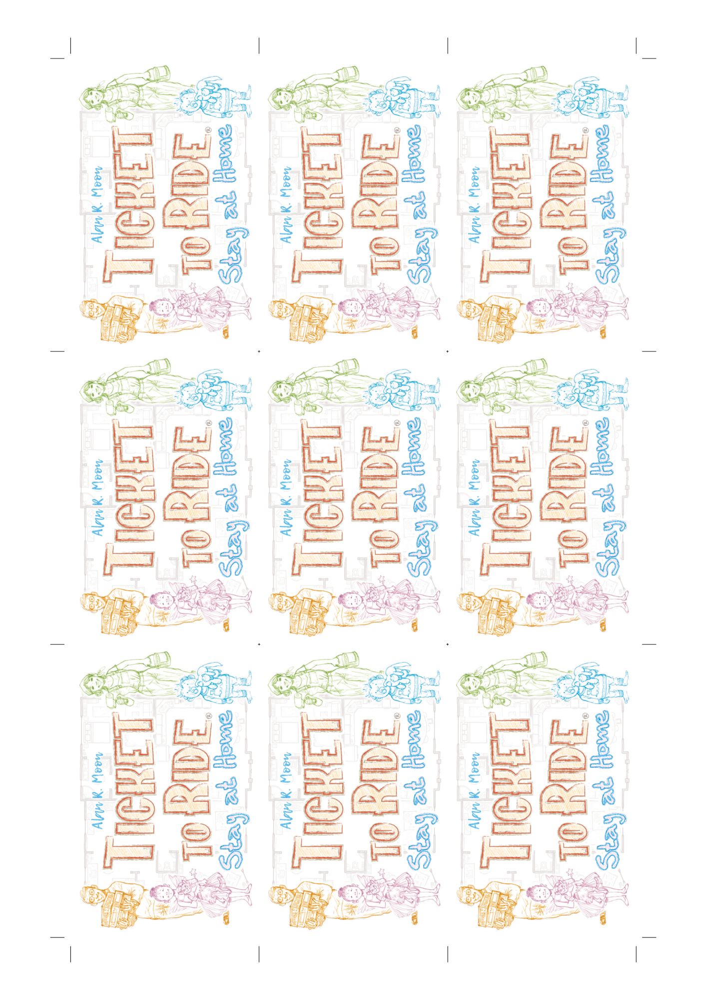
