# Switzerland

[Source PDF](rules.pdf) · [Map reference](switzerland-map.png)

Parsed locally with pdf-inspector. Original page images preserve diagrams, tables, and layout; consult them where extraction is unclear.

## PDF page 1

The parser returned no text for this page. Refer to the page image below.

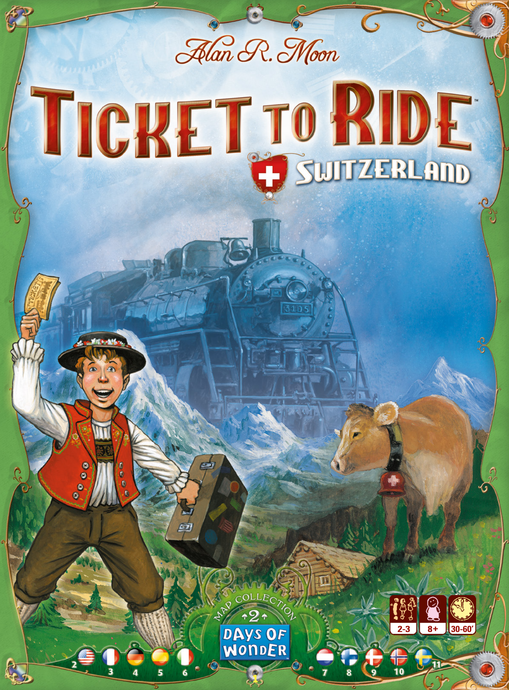

## PDF page 2

## Welcome to Alan R. Moon’s Ticket to Ride™ Swiss Map

**- a fun new addition to the award-winning line of Ticket to Ride games.**
This Rules sheet describes the specific game play changes for the Swiss Map Expansion and assumes that you are familiar with the rules first introduced in the original Ticket to Ride.

This game is an expansion and requires that you use the following game parts from one of the previous versions of Ticket to Ride:

- **A reserve of 40 Trains per player, (instead of the usual 45)** **and matching Scoring Markers taken from one of the following:**
- Ticket to Ride
- Ticket to Ride Europe
- **110 Train Car Cards taken from:**
- Ticket to Ride
- Ticket to Ride Europe
- USA 1910 expansion

# Introduction

The Swiss map is designed specifically for 2 or 3 players. In 3 Player games, players can use both tracks of the double-routes. In 2 Player games, once one of the tracks of a double-route is taken, the other one is no longer available.

# The Board

On the Swiss board map, some of the routes no longer link cities to cities, but connect cities to Switzerland’s neighboring countries instead. There are 3 routes leading from Switzerland to Austria, 4 to France, 5 to Italy and 5 to Germany. As in the original Ticket to Ride game, the player with the longest continuous path of routes at the end of the game receives a bonus of 10 points.

# Destination Tickets

This expansion includes 46 Destination Tickets. 34 Destination Tickets connect city-to-city and play the same as previous versions of the game. 12 Destination Tickets connect either city-to-country or country-to- country. To complete a city-to-country ticket you must connect from the city name on the ticket to one of the countries listed on the ticket. To complete a country-to-country ticket you must connect from the primary country on the ticket to one of the other countries listed. The points earned at the end of the game are those of the highest scoring connection completed from among the possible country destinations marked on the ticket. If none of the possible connections was made, the points lost are those corresponding to the lowest value on the ticket.

he must keep at least 1. Destination Tickets rejected, either at game’s start or following a draw of new Destination Tickets in mid-game, are not discarded as in other Ticket to Ride games. Instead, they are immediately removed from the draw pile for the rest of the game. As such, it is possible to run out of Destination Tickets entirely!

# Locomotive Cards

The 14 traditional Locomotive «wild» cards are played differently. Unlike the standard Locomotive cards in other versions of Ticket to Ride, Locomotive cards can be selected just like standard Train Car cards. Thus a player can pick 2 Locomotive cards during his turn. If 3 of the 5 face-up cards are Locomotive cards, all 5 face-up cards are immediately discarded and replaced by new cards. Locomotive cards can only be played on Tunnel routes (see Tunnels below). Locomotive cards complement or replace the colored cards required to claim a Tunnel route, but they can never be used to help claim a regular (non-Tunnel) route!

# Tunnel Routes

In the Swiss Map expansion, tunnels play just as they do in Ticket to Ride Europe where they were first introduced. Tunnels are special routes identified by the special black Tunnel markings that surround each of their spaces along the route. When attempting to claim a Tunnel route, a player first lays down the number of cards required. Then the 3 top cards from the Train Car card draw pile are turned face-up. For each card revealed whose color matches the color used to claim the Tunnel (including locomotives), an additional card of the same color (or a locomotive) must be played to successfully claim the Tunnel. If the player does not have enough additional Train Car cards of matching color (or does not wish to play them), he may take all his cards back into his hand, and his turn ends. The three Train Car cards revealed for the Tunnel are discarded.

### Be aware that with regard to Tunnels:

u Locomotives are multi-colored wild cards. As such, any Locomotive card drawn forces the player to play an additional Train Car card (of matching color) or a Locomotive when claiming a Tunnel. u If a player exclusively plays Locomotive cards to claim a tunnel route, only additional Locomotive cards drawn from the deck will be considered a match. This means you will not have to worry about a colored card of the Tunnel’s color triggering a match! However, if Locomotive cards appear in the 3 cards drawn for the Tunnel, triggering a match, it can only be fulfilled by playing additional Locomotive cards from your hand.

At the start of the game, each player is dealt 5 Destination Tickets of which he must keep at least 2. During the game, if a player wishes to draw additional Destination tickets he draws 3 new Tickets, of which

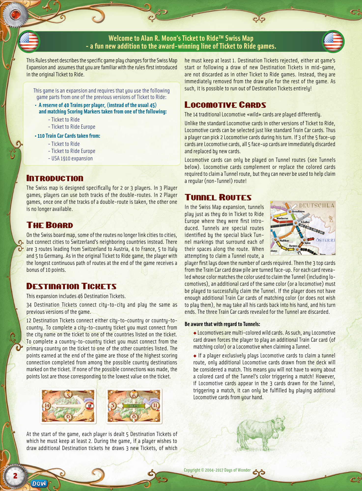

## PDF page 3

## Voici l’extension Suisse des Aventuriers du Rail, un jeu d’Alan R. Moon.

## Une nouvelle extension qui renouvelle un jeu primé dans le monde entier.

Cette feuille de référence a pour but de vous présenter les nouvelles règles de la carte de la Suisse. Attention, il est indispensable que vous connaissiez déjà les règles de la carte nord-américaine (pour les mécanismes de base).

Ce jeu est une extension et nécessite donc de récupérer les éléments suivants dans les versions précédentes de la série :

- **40 trains par couleur (à la place des 45 habituels),** **et les marqueurs de score provenant de l’un des jeux suivants :**
- Les Aventuriers du Rail _ou_
- Les Aventuriers du Rail Europe _ou_
- **Les 110 cartes Wagon provenant de :**
- Les Aventuriers du Rail _ou_
- Les Aventuriers du Rail Europe _ou_
- USA 1910

# Généralités

La Suisse est une carte prévue pour 2 ou 3 joueurs. Dans une partie à 3 joueurs, vous pouvez utiliser les voies doubles. En revanche, dans une partie à 2 joueurs, quand une des voies est construite, la seconde est fermée jusqu’à la fin de la partie.

# Le plateau

Sur le plateau, certaines routes ne mènent pas à une ville, mais permettent de rejoindre un des pays limitrophes de la Suisse. Ainsi, 4 routes mènent en France, 5 en Italie, 5 en Allemagne et 3 en Autriche. Comme dans le jeu original, le joueur ayant réalisé le chemin continu le plus long récupère un bonus de 10 points.

# Les cartes Destination

Il y a 46 cartes Destination. 34 d’entre elles sont des cartes Destination standard, reliant deux villes entre elles. Elles fonctionnent de la même manière que dans les autres versions du jeu. 4 cartes Destination relient une ville aux pays limitrophes de la Suisse et 8 cartes Destination demandent de rallier un des 4 pays aux 3 autres.Un score correspond à chacune de ces liaisons sur les cartes. En fin de partie, le joueur marque autant de points que le score le plus élevé parmi les destinations réalisées. En revanche, si la ville ou le pays d’origine n’ont pu être reliés à aucun pays, le joueur perd autant de points que le score le moins élevé de la carte. En début de partie, on distribue 5 cartes Destination à chaque joueur.

dans la pioche, mais sont retirées du jeu, ce qui signifie que dans cette version, il est possible d’épuiser la pioche des cartes Destination.

# Les cartes Locomotive

_Les 14 cartes locomotive sont jouées différemment._ Les cartes locomotive peuvent être piochées comme n’importe quelle carte wagon. Ainsi, même si un joueur prend une carte Locomotive face visible, il peut piocher une seconde carte. A tout moment, s’il y a 3 cartes Locomotive parmi les 5 cartes visibles, les cartes sont toutes défaussées et remplacées par les 5 premières cartes de la pioche. Une carte Locomotive peut être jouée sur n’importe quel tronçon de tunnel, indépendamment de sa couleur. En revanche, il est impossible de jouer une carte Locomotive sur une route normale.

# Les Tunnels

On les reconnaît sur la carte à leurs contours spécifiques. Pour prendre un tunnel, on joue le nombre de cartes de la couleur requise, comme à l’accoutumée. Puis on retourne les trois premières cartes du sommet de la pioche de cartes Wagon. Pour chaque carte ainsi révélée de la couleur des cartes utilisées pour prendre le tunnel (y incluant les locomotives), le joueur doit mainte-nant rajouter une nouvelle carte Wagon de la même couleur (ou une locomotive). Si le joueur ne possède pas suffisamment de cartes de la couleur correspondante (ou ne souhaite pas les jouer), il reprend toutes ses cartes et passe son tour. En fin de tour les cartes tirées de la pioche sont défaussées.

### Attention :

u Les locomotives sont des cartes multicolores. En conséquence, toute locomotive figurant parmi les trois cartes retournées, oblige le joueur à rajouter une carte Wagon ou locomotive à sa série. u Si un joueur tente de prendre le contrôle d’un tunnel en ne jouant que des cartes Locomotive, il n’a besoin d’ajouter des cartes que s’il y a des cartes Locomotive parmi les 3 cartes révélées. Dans ce cas, le joueur ne peut ajouter que des cartes Locomotive.

Il doit en garder au moins 2. En cours de partie, si le joueur décide de reprendre des cartes Destination, il pioche les 3 premières cartes de la pile et doit en garder au moins une. Les cartes rejetées par un joueur (que ce soit en début du jeu ou en cours de partie) ne sont pas réintégrées

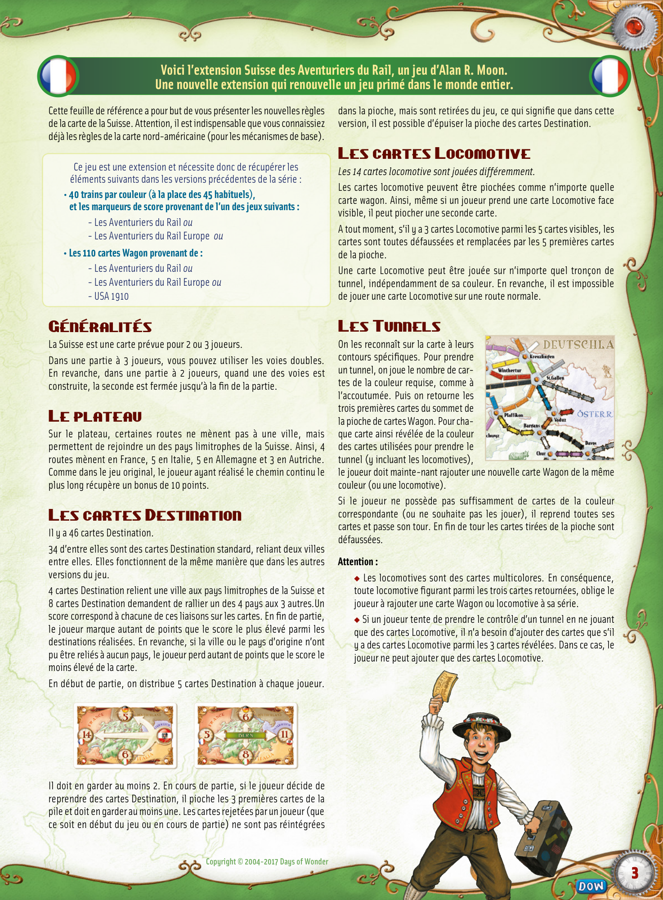

## PDF page 4

**Willkommen bei Alan R. Moons „Zug um Zug“™ Schweiz-Erweiterung – der unterhaltsamen neuen Ergänzung der preisgekrönten „Zug um Zug“-Familie.**

Diese Spielregel beschreibt die besonderen Regeländerungen für den Schweiz-Spielplan und setzt voraus, dass die Spieler mit den Regeln des Grundspiels „Zug um Zug“ vertraut sind.

„Zug um Zug – Schweiz“ ist eine Erweiterung und erfordert die folgenden Spielmaterialien aus einer der bereits veröffentlichten „Zug um Zug“-Versionen:

- **40 Waggons pro Spieler (statt der üblichen 45) sowie farblich** **passende Zählsteine aus einem der folgenden Spiele:**
- „Zug um Zug“
- „Zug um Zug Europa“
- **110 Wagenkarten aus einem der folgenden Spiele:**
- „Zug um Zug“
- „Zug um Zug Europa“
- Erweiterung „USA 1910“

# Einleitung

Der Schweiz-Spielplan wurde speziell für zwei oder drei Spieler entworfen. In Partien zu dritt können die Spieler beide Doppelstrecken nutzen. In Partien zu zweit kann nur eine der beiden Doppelstrecken genutzt werden. Wenn ein Spieler eine der Doppelstrecken genutzt hat, ist die andere in dieser Partie nicht mehr verfügbar.

# Das Spielbrett

Auf dem Schweiz-Spielplan verbinden einige Strecken nicht Städte untereinander, sondern eine Stadt mit einem Nachbarland der Schweiz. Es gibt drei Verbindungen zwischen der Schweiz und Österreich, vier Strecken nach Frankreich, fünf nach Italien und fünf nach Deutschland. Wie in der Originalversion von „Zug um Zug“ erhält der Spieler, der die längste durchgehende Strecke geschaffen hat, 10 zusätzliche Punkte.

# Die Zielkarten

Diese Erweiterung enthält 46 Zielkarten. 34 Zielkarten beziehen sich auf normale Strecken zwischen zwei Städten und werden in der gewohnten Weise eingesetzt. Außerdem gibt es 12 Zielkarten, die entweder eine Stadt mit einem Land oder zwei Länder untereinander verbinden. Wer eine Stadt-Land-Zielkarte erfüllen möchte, muss eine ununterbrochene Verbindung von der genannten Stadt zu einem der aufgeführten Länder herstellen. Zur Erfüllung einer Land-Land-Zielkarte muss das auf der Zielkarte angegebene Ausgangsland mit einem der anderen aufgeführten Länder verbunden werden. Wenn der Spieler am Ende der Partie mehrere der auf der Zielkarte aufgeführten Länderverbindungen hergestellt hat, erhält er die der besten realisierten Strecke entsprechende, _höchste_ Punktzahl. Falls er keine der möglichen Verbindungen herstellen konnte, verliert er die _niedrigste_ der angegebenen Punktzahlen.

denen er mindestens eine behalten muss. Eventuell zurückgegebene Karten werden nicht unter den Stapel der Zielkarten zurückgelegt – das gilt sowohl zu Beginn des Spiels als auch während der Partie; stattdessen kommen sie sofort zurück in die Schachtel und sind für den Rest der Partie nicht mehr verfügbar. So kann es vorkommen, dass der Stapel der Zielkarten vor Ende der Partie aufgebraucht ist.

# Lokomotiven

_Für die 14 herkömmlichen Lokomotiven gelten veränderte Regeln!_ Im Gegensatz zu den Standard-Lokomotivkarten in anderen Versionen von „Zug um Zug“ können Lokomotiven wie normale Wagenkarten genommen werden. So kann ein Spieler während seines Zuges auch zwei Lokomotivkarten aufnehmen. Sollten einmal drei der fünf offen ausliegenden Karten Lokomotiven sein, werden alle fünf Karten auf den Ablagestapel gelegt und fünf neue als Ersatz aufgedeckt. Lokomotiven dürfen ausschließlich für Tunnels (siehe unten) verwendet werden. Lokomotivkarten können die Karten ergänzen oder ersetzen, die erforderlich sind, um eine Tunnelstrecke zu bauen. Es ist allerdings nicht möglich, Lokomotiven für eine normale (Nicht-Tunnel-)Strecke einzusetzen!

# Tunnels

In dieser Erweiterung mit dem Schweiz-Spielplan spielen Tunnels dieselbe Rolle wie bei der Ausgabe „Zug um Zug Europa“, bei der sie zum ersten Mal vorkamen. Tunnels sind besondere Strecken, die leicht an den speziellen Tunnelmarkierungen und Umrahmungen rund um die entsprechenden Felder zu erkennen sind. Wenn ein Spieler versucht, eine Tunnelstrecke zu nutzen, spielt er zunächst die Anzahl an Karten aus, die der Länge der Strecke entspricht. Anschließend werden die obersten drei Karten des Wagennachziehstapels aufgedeckt. Für jede aufgedeckte Karte, deren Farbe dem Kartenset entspricht, das der Spieler für diesen Tunnel ausgespielt hat, muss er nun aus seiner Hand eine _zusätzliche_ Karte dieser Farbe (oder eine Lokomotive) ausspielen. Nur dann kann er diese Tunnelstrecke nutzen. Sollte der Spieler nicht genügend zusätzliche Wagenkarten der geforderten Farbe besitzen (oder diese nicht spielen wollen), kann er keine Waggons auf die Strecke stellen, nimmt seine bereits ausgespielten Karten wieder auf die Hand, und der nächste Spieler ist an der Reihe. Am Ende seines Spielzugs werden die drei Wagenkarten, die für den Tunnel vom Stapel aufgedeckt wurden, auf den Ablagestapel gelegt.

### Beachten Sie bei den Tunnels auch folgende Regeln:

u Lokomotiven sind Joker, die jede Farbe ersetzen. Wird also eine Lokomotivkarte vom Stapel aufgedeckt, muss der Spieler eine zusätzliche Karte in der Farbe seines Kartensets oder eine Lokomotive ausspielen. u Wenn ein Spieler einen Tunnel nutzen möchte und dafür ausschließlich Lokomotivkarten ausspielt, muss er nur dann zusätzliche Karten von seiner Hand spielen (in diesem Fall zusätzliche Lokomotivkarten), wenn sich unter den drei Karten, die vom Stapel aufgedeckt werden, Lokomotivkarten befinden. Jede andere vom Stapel aufgedeckte Wagenkarte ist in diesem Fall ungefährlich! Zu Beginn des Partie erhält jeder Spieler fünf Zielkarten,von denen er mindestens zwei behalten muss. Wenn ein Spieler im Laufe der Partie zusätzliche Zielkarten haben möchte, zieht er drei neue Zielkarten, von

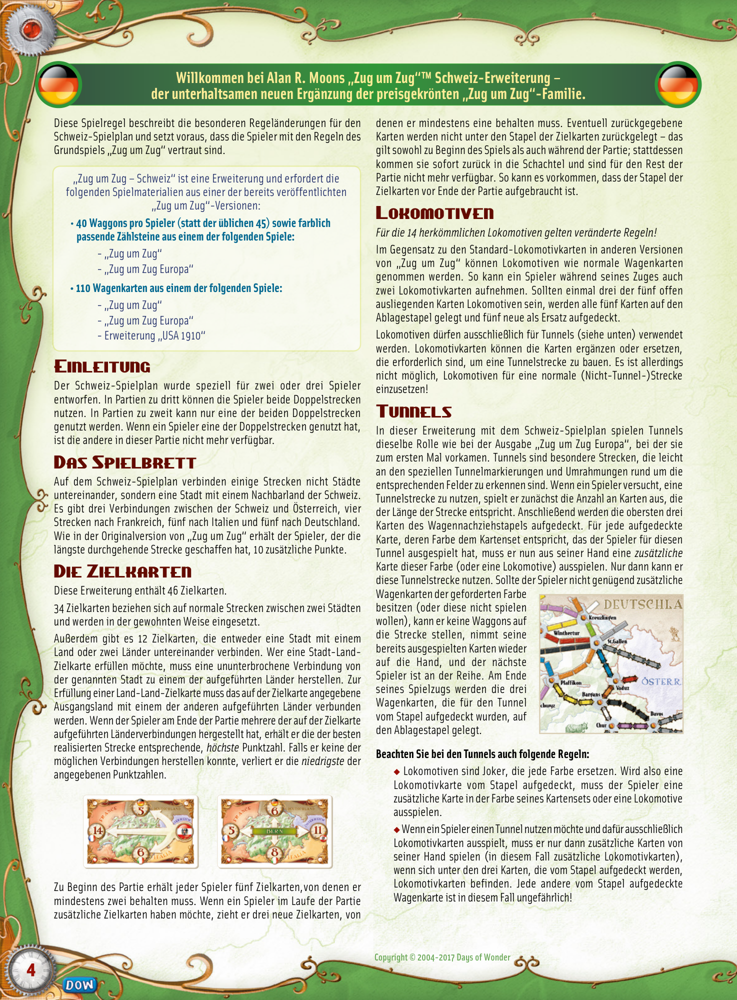

## PDF page 5

## Bienvenidos a la Expansión de Mapa: Suiza, una nueva y divertida incorporación

## a ¡Aventureros al Tren!, el popular juego de Alan R. Moon.

Esta hoja de reglas describe los cambios de juego específicos para la Expansión de Mapa: Suiza, y da por hecho que estás familiarizado con las reglas de juego normales del ¡Aventureros al Tren! original.

Este producto es una ampliación y requiere el uso de los siguientes elementos del juego básico:

- **Una reserva de 40 Vagones de tren por jugador (en vez de los 45** **habituales) y los correspondientes Marcadores de Puntuación, tomados de uno de los siguientes productos:**
- ¡Aventureros al Tren!
- ¡Aventureros al Tren! Europa
- **110 Cartas de Vagón tomadas de uno de los siguientes productos:**
- ¡Aventureros al Tren!
- ¡Aventureros al Tren! Europa
- Expansión USA 1910

# Introducción

Esta expansión ha sido diseñada específicamente para 2 ó 3 jugadores. En las partidas de 3 jugadores se pueden usar las dos vías de los Recorridos Dobles. En las partidas de 2 jugadores, cuando se cubre una de las vías de un Recorrido Doble, la otra vía queda permanentemente cerrada.

# El Tablero

En el mapa de Suiza, algunos de los Recorridos no unen dos ciudades, sino que unen ciudades suizas con países vecinos. Hay 3 Recorridos que llevan a Austria, 4 Recorridos que llevan a Francia, 5 Recorridos que llevan a Italia, y 5 Recorridos que llevan a Alemania. Al igual que en el ¡Aventureros al Tren! original, el jugador que haya realizado la ruta continua más larga al final de la partida sumará 10 a su puntuación.

# Billetes de Destino

Esta expansión incluye 46 Billetes de Destino. 34 Billetes de Destino conectan dos ciudades y se usan de la forma habitual en anteriores ediciones del juego. 12 Billetes de Destino conectan una ciudad con un país vecino, o un país con otro. Para completar un Billete de ciudad-país, debes conectar la ciudad indicada en el Billete con uno de los países indicados. Para completar un Billete de país-país debes conectar el país primario indicado en el Billete con uno de los otros países indicados. Si se realizó alguna de las conexiones posibles, los puntos que se reciben al final de la partida son los correspondientes a la conexión de _mayor puntuación_ completada, entre los países de destino indicados en el Billete. Si no se realizó ninguna de las conexiones posibles, los puntos que se pierden al final de partida son los correspondientes a la conexión de _menor_ _puntuación_ indicada en el Billete.

obtener Billetes de Destino adicionales, roba 3 Billetes nuevos, de los que debe conservar al menos 1. Los Billetes de Destino rechazados, ya sea al inicio de la partida o en el transcurso de ésta (después de robar Billetes), no se descartan del modo habitual, sino que se retiran inmediatamente del mazo de robo durante el resto del juego. Por tanto, es posible que los Billetes de Destino lleguen a agotarse del todo en algún momento de la partida.

# Cartas de Locomotora

En esta expansión, las 14 cartas “comodín” de Locomotora se usan de un modo diferente al habitual en anteriores ediciones. Las Cartas de Locomotora pueden ser seleccionadas y robadas del mismo modo que las Cartas de Vagón. Esto quiere decir que un jugador puede robar 2 Cartas de Locomotora en su turno. Si 3 de las 5 cartas mostradas son Cartas de Locomotora, se descartan inmediatamente estas 5 cartas y se reemplazan por 5 cartas nuevas. Las Cartas de Locomotora sólo pueden ser jugadas en Recorridos de Túnel (ver más abajo). Las Cartas de Locomotora pueden complementar o sustituir las cartas requeridas para cubrir un Recorrido de Túnel, pero no pueden usarse nunca para cubrir o ayudar a cubrir un Recorrido que no sea de Túnel.

# Recorridos de Túnel

En esta expansión, los Túneles se rigen por las mismas reglas que en ¡Aventureros al Tren! Europa, donde aparecieron por primera vez. Los Túneles son Recorridos especiales, y los espacios que los conforman están identificados con un contorno diferente. Cuando se intenta cubrir un Recorrido de Túnel, el jugador debe poner sobre la mesa el número de cartas requerido por la longitud del Recorrido. Entonces se cogen las 3 primeras cartas del mazo de Cartas de Vagón y se muestran. Por cada una de estas cartas cuyo color coincida con el de las cartas que se jugaron para cubrir el Túnel (incluidas Locomotoras), el jugador debe usar una carta adicional de su mano del mismo color (o una Locomotora) para cubrir con éxito el Túnel. Si el jugador no tiene el número necesario de Cartas de Vagón adicionales de ese color (o no desea usarlas), puede devolver a su mano las cartas que jugó para cubrir el Recorrido de Túnel, y su turno termina. Las 3 Cartas de Vagón robadas del mazo se descartan.

### Ten presente que en lo relativo a los Túneles:

u Las Locomotoras son cartas multicolor. Por tanto, si se roba una Carta de Locomotora del mazo de Vagón al intentar cubrir un Túnel, ésta coincidirá automáticamente con las cartas de Vagón que se jugaron para cubrir el recorrido, y obligará al jugador a usar una Carta de Vagón (del color indicado) o una Locomotora. u Si un jugador usa exclusivamente Cartas de Locomotora para cubrir un Recorrido de Túnel, sólo se considerará que coinciden en color las Cartas de Locomotora que se roben del mazo. Eso significa que no tendrás que preocuparte porque una de las cartas normales del mismo color que el Túnel sea considerada una coincidencia de color. Pero, por otra parte, si aparecen Cartas de Locomotora entre las 3 cartas robadas del mazo (lo que se consideraría una coincidencia de color), será necesario jugar Cartas de Locomotora adicionales de tu mano para cubrir el Recorrido con éxito.

Al inicio de la partida, cada jugador recibe 5 Billetes de Destino, de los que debe conservar al menos 2. Durante el juego, si un jugador desea

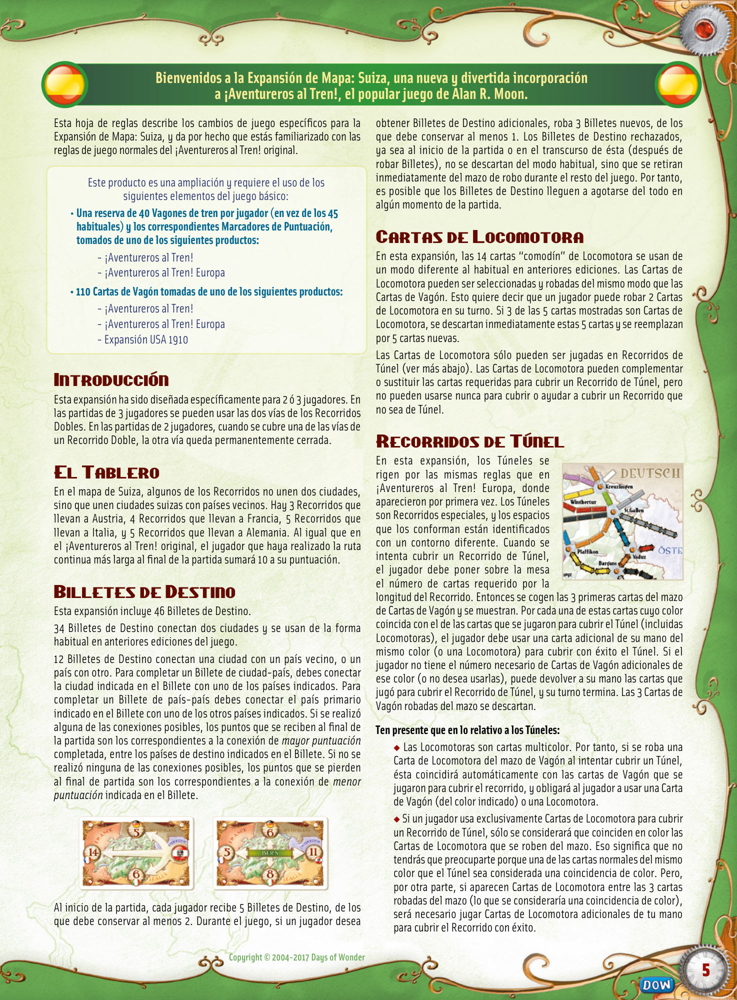

## PDF page 6

**Benvenuti a Ticket to Ride® Svizzera di Alan R. Moon – un divertente nuovo titolo che si aggiunge**

## alla premiata linea di giochi di Ticket to Ride.

Questo regolamento descrive i cambiamenti specifici al sistema di gioco per la Mappa della Svizzera e presume che tu conosca già le regole presentate per la prima volta nella versione originale di Ticket to Ride.

Questo gioco è un’espansione e richiede l’utilizzo dei seguenti componenti presenti in una delle precedenti versioni di Ticket to Ride:

- **Una riserva di 40 vagoni per giocatore, (invece dei consueti 45) e i** **corrispettivi Segnapunti prelevati da uno dei seguenti giochi:**
- Ticket to Ride
- Ticket to Ride Europa
- **110 Carte Treno prelevate da:**
- Ticket to Ride
- Ticket to Ride Europa
- espansione USA 1910

# Introduzione

La Mappa della Svizzera è concepita per 2-3 giocatori. Nelle partite a 3 giocatori è possibile prendere il controllo di entrambe le linee di una Doppia Linea. Nelle partite a 2 giocatori è possibile prendere il controllo di una sola delle Doppie Linee.

# Il Tabellone

Sul tabellone della Mappa della Svizzera, alcune linee non collegano più le città ad altre città, ma collegano città ad altri paesi confinanti con la Svizzera. Ci sono 3 linee che conducono dalla Svizzera all’Austria, 4 alla Francia, 5 all’Italia e 5 alla Germania. Come nel gioco originale di Ticket to Ride, il giocatore con il Percorso Continuo Più Lungo alla fine della partita riceve un bonus di 10 punti.

# Biglietti Destinazione

Questa espansione include 46 Biglietti Destinazione. 34 Biglietti Destinazione collegano le città a altre città e funzionano come nelle versioni precedenti del gioco. 12 Biglietti Destinazione collegano le città a paesi o i paesi ad altri paesi. Per completare un Biglietto Destinazione da città a paese, un giocatore deve collegare la città a uno dei paesi elencati sul Biglietto Destinazione. Per completare un Biglietto Destinazione da paese a paese, un giocatore deve collegare il paese principale indicato sul Biglietto Destinazione a uno degli altri paesi elencati. I punti guadagnati alla fine della partita saranno quelli del collegamento a punteggio più alto completato tra i paesi elencati sul Biglietto Destinazione. Se nessuno dei collegamenti possibili è stato completato, viene sottratto un ammontare di punti corrispondente al valore più basso indicato sul Biglietto Destinazione.

I Biglietti Destinazione che non tiene, sia quelli all’inizio della partita che quelli ottenuti pescando nuovi Biglietti Destinazione durante la partita, non vengono scartati come nelle altre partite a Ticket to Ride. Vengono invece immediatamente rimossi dal mazzo di pesca per il resto della partita. Di conseguenza, è possibile esaurire definitivamente i Biglietti Destinazione!

# Carte Locomotiva

Le 14 tradizionali carte Locomotiva “jolly” si giocano in modo diverso. A differenza delle carte Locomotiva standard nelle altre versioni di Ticket to Ride, le carte Locomotiva possono essere selezionate proprio come le carte Treno normali. Quindi un giocatore può prendere 2 carte Locomotiva durante il suo turno. Se 3 delle 5 carte a faccia in su sono carte Locomotiva, tutte e 5 le carte a faccia in su vengono immediatamente scartate e rimpiazzate da nuove carte. Le carte Locomotiva possono essere giocate soltanto sulle linee delle Gallerie (vedi Gallerie, di seguito). Le carte Locomotiva possono completare o sostituirsi alle carte richieste per prendere il controllo di una linea di una Galleria, ma non possono mai essere usate nel tentativo di prendere il controllo di una linea normale che non sia una Galleria!

# Gallerie

Nella Mappa della Svizzera le Gallerie funzionano proprio come in Ticket to Ride Europa, dove sono state presentate per la prima volta. Le Gallerie sono linee speciali facilmente identificabili dai simboli speciali delle Gallerie e dai bordi evidenziati di ogni loro casella. Quando un giocatore cerca di prendere il controllo di una Linea Galleria, deve prima giocare il numero di carte richiesto dalla lunghezza della linea. Dopodiché scopre a faccia in su le prime 3 carte. Per ogni carta scoperta in questo modo il cui colore corrisponda al colore delle carte giocate per controllare la Galleria (incluse le Locomotive), il giocatore deve giocare dalla sua mano una carta aggiuntiva dello stesso colore (o una Locomotiva) per riuscire a prendere il controllo della Galleria. Se il giocatore non ha abbastanza carte Treno aggiuntive del colore corrispondente (o non desidera giocarle), può riprendere in mano tutte le sue carte e il suo turno termina. Le 3 carte Treno scoperte per la Galleria vengono scartate.

### Riguardo alle Gallerie, occorre ricordare che:

u Le Locomotive sono carte jolly multicolore. Di conseguenza, ogni carta Locomotiva pescata obbliga il giocatore ad aggiungere una carta Treno (del colore corrispondente) o una Locomotiva. u Se un giocatore tenta di attraversare una Galleria usando esclusivamente delle carte Locomotiva, dovrà giocare carte aggiuntive (che in questo caso saranno Locomotive) solo se compaiono delle Locomotive tra le carte pescate per la Galleria.

All’inizio della partita, ogni giocatore riceve 5 Biglietti Destinazione di cui deve tenerne almeno 2. Durante la partita, se un giocatore desidera pescare ulteriori Biglietti Destinazione, ne pesca 3 e deve tenerne almeno 1.

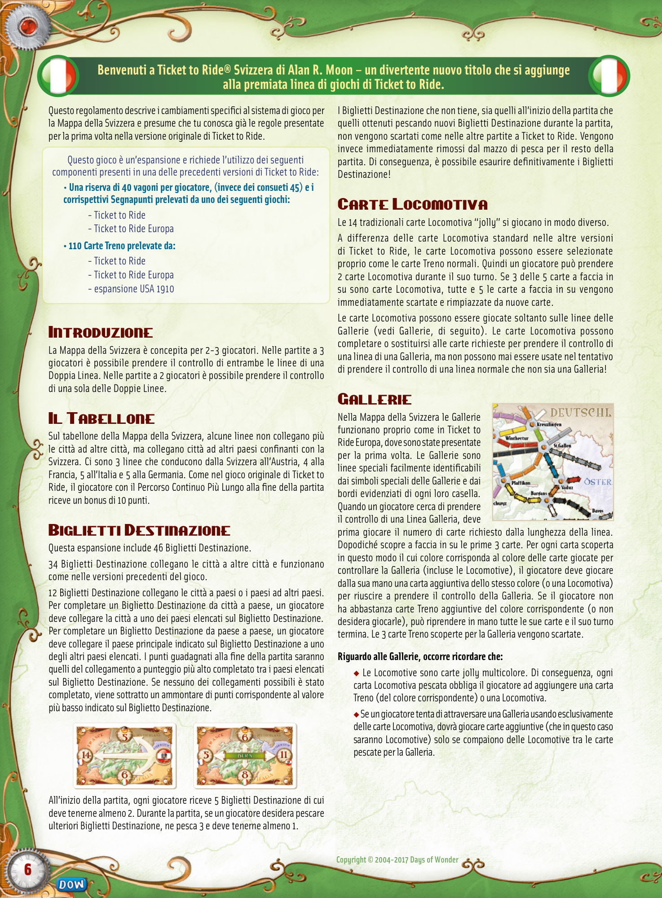

## PDF page 7

## Welkom bij Alan R. Moon‘s Ticket to Ride™ Zwitserland-een nieuwe uitbreiding en vooral

## een leuke toevoeging aan de bestaande reeks.

In deze spelregels worden de spelwijzigingen beschreven die van toepassing zijn wanneer je op de Zwitserse kaart speelt. Je wordt daarbij verondersteld de regels te kennen van de originele Ticket to Ride-spellen.

Dit spel is een uitbreiding. Je hebt de volgende onderdelen uit een andere Ticket to Ride versie nodig:

- **Een voorraad van 40 treintjes per speler, (in plaats van de** **gebruikelijke 45) en de overeenkomstige scorepionnen uit één van de volgende spellen:**
- Ticket to Ride
- Ticket to Ride Europe
- **240 treinkaarten uit :**
- Ticket to Ride
- Ticket to Ride Europe
- de USA 1910 uitbreiding

# Inleiding

De kaart van Zwitserland is speciaal ontworpen voor 2 of 3 spelers. In een spel met 3 spelers kunnen beide sporen van een dubbele route geclaimd worden. In een spel met 2 spelers kan maar één route van een dubbele route geclaimd worden. Zodra dit gebeurt, dan is de andere route afgesloten voor alle andere spelers.

# Het spelbord

Je zal onmiddellijk opmerken dat op de kaart van Zwitserland bepaalde routes niet langer steden met steden onderling verbinden, maar wel de steden verbinden met alle buurlanden van Zwitserland. Er zijn 3 routes die je van Zwitserland naar Oostenrijk voeren, 4 routes die je naar Frankrijk leiden, 5 naar Italië en tot slot ook nog 5 routes die als eindbestemming Duitsland hebben. Zoals in een regulier Ticket to Ride-spel zal de speler met de langste ononderbroken route aan het einde van het spel een bonus krijgen van 10 punten die toegevoegd wordt aan zijn score.

# Bestemmingskaarten

Deze uitbreiding bevat ook 46 bestemmingskaarten. 34 bestemmingskaarten verbinden steden met steden en worden op dezelfde manier gespeeld zoals in de vorige edities van dit spel. 12 bestemmingskaarten verbinden steden met landen of landen met landen onderling. Om een bestemmingskaart te behalen die van een stad naar een land reist, moet je de stad op de kaart verbinden met één van de landen op kaart. Om een bestemmingskaart te behalen die van het ene naar het andere land reist, moet je de stad op de kaart verbinden met één van de andere landen op de kaart. De punten die je aan het einde van het spel krijgt zijn de punten van de hoogst scorende route die je kan behalen van alle mogelijke landbestemmingen zoals aangegeven op de bestemmingskaart. Was het niet mogelijk om één van deze routes te maken, dan verlies je het aantal punten gelijk aan de laagste waarde op de kaart. Aan begin van het spel krijgt elke speler 5 bestemmingskaarten en hier is hij verplicht om er twee van te houden. Tijdens het spel kan de speler 3 bestemmingskaarten trekken [indien hij dit wenst] waarvan hij er minstens

eentje moet houden. Bestemmingskaarten die aan het begin van het spel of tijdens het spel niet gekozen worden, worden niet afgelegd zoals in alle voorgaande edities. Deze kaarten worden echter onmiddellijk uit het spel gehaald en daarom is het ook mogelijk dat de bestemmingskaarten helemaal op raken!

# Locomotieven

_De 14 gebruikelijke locomotiefkaarten (of jokers) worden op een andere_ _manier gespeeld._ Anders dan de standaard locomotiefkaarten in de andere versies van Ticket to Ride, kun je de locomotieven ook trekken zoals de standaard treinkaarten. Het is daarom nu toegestaan dat een speler 2 locomotiefkaarten neemt van de openliggende kaarten. Liggen er echter 3 locomotieven tussen de 5 openliggende kaarten, dan moet je ze nog steeds afleggen en vervangen door nieuwe kaarten. Locomotiefkaarten mag je alleen gebruiken voor tunnelroutes (zie de regels voor de tunnelroutes die hierna volgen). Locomotiefkaarten kunnen een welkome toevoeging zijn of een gekleurde kaart vervangen als je probeert een tunnelroute te claimen, maar ze kunnen nooit gebruikt worden voor het claimen van een normale (niet-tunnel) route!

# Tunnelroutes

Tunnels zijn speciale routes die een- voudig te herkennen zijn aan de speciale tunnelmarkeringen aan de rand van de vakjes van de tunnelroute. Wanneer je een tunnelroute probeert te claimen, legt de speler eerst het juiste aantal kaarten neer. Hierna worden de 3 bovenste kaarten van de gedekte treinkaarten stapel omge- draaid. Voor elke getrokken kaart die qua kleur overeenkomt met de route die men probeert claimen, moet één extra kaart van die kleur (of een locomotief) uit je hand gespeeld worden. Pas dan kan de route succesvol geclaimd worden. Indien de speler niet genoeg kaarten in zijn hand heeft (of deze kaarten niet wenst te spelen), dan mag hij al zijn kaarten terug in zijn hand nemen en eindigt zijn beurt. De drie treinkaarten die getrokken werden voor de tunnel, worden afgelegd.

### Let goed op de volgende zaken die specifiek voor tunnels gelden:

u Locomotieven zijn meerkleurige jokerkaarten. Hierdoor wordt een speler verplicht om een extra treinkaart (van dezelfde kleur of een locomotief) toe te voegen wanneer hij een dergelijke kaart trekt. u Indien een speler alleen locomotiefkaarten speelt om een tunnelroute te claimen, zullen enkel extra locomotiefkaarten (getrokken van de stapel) beschouwd worden als overeenstemmend. Dit wil zeggen dat je je geen zorgen hoeft te maken dat een kaart in de kleur van de tunnelroute een match oplevert (waardoor je nog een extra kaart moet spelen)! Komen er echter locomotiefkaarten tevoorschijn tussen de 3 getrokken kaarten, dan moet je extra locomotiefkaarten uit je hand spelen.

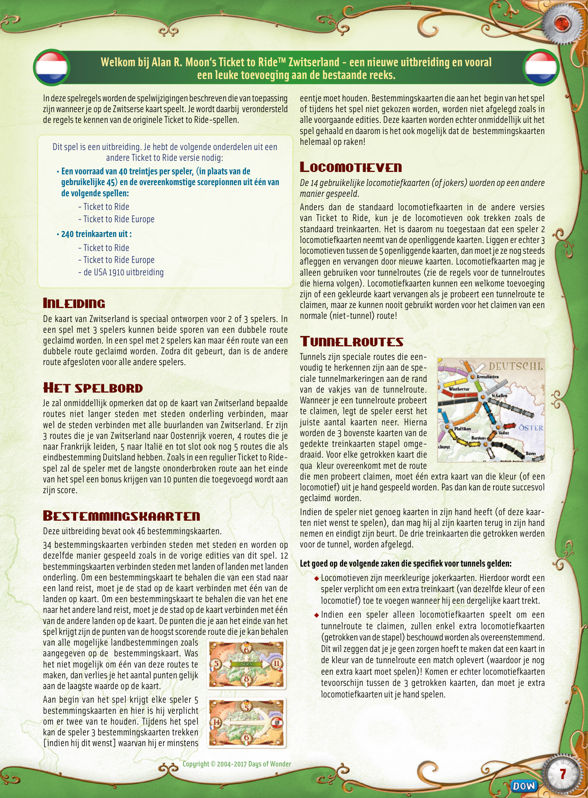

## PDF page 8

**Tervetuloa pelaamaan Alan R. Moonin suunnitteleman Menolippu-pelin Sveitsiin sijoittuvaa laajennusosaa – uusi hauska lisä lukuisia palkintoja voittaneeseen Menolippu tuotesarjaan.**

Näissä säännöissä on selitetty ne sääntömuutokset, jotka koskevat Sveitsi-lisäosaa. Oletuksena on, että Menolipun peruspelin säännöt ovat pelaajille tutut jo ennestään.

Tämä on laajennusosa ja tarvitset seuraavia osia Menolipun muista itsenäisistä peleistä:

- **40 muovista junavaunua per pelaaja (normaalin 45 sijaan)** **ja vastaavat pisteytysmerkit yhdestä seuraavista peleistä:**
- Menolippu,
- Menolippu Eurooppa
- **110 vaunukorttia yhdestä seuraavista:**
- Menolippu,
- Menolippu Eurooppa tai
- USA 1910 laajennusosa

# Johdanto

Sveitsi-laajennusosa on suunniteltu erityisesti 2 – 3 pelaajalle. Mikäli pelaajia on 3, voivat pelaajat käyttää pelilaudan tuplaraidereittien molempia raiteita. 2 pelaajan pelissä voidaan käyttää vain toista; kun toinen on rakennettu, toista reitin raidetta ei saa enää rakentaa.

# Pelilauta

Pelilaudan tietyt reitit eivät yhdistä kahta kaupunkia, vaan yhdistävät kaupunkeja Sveitsin naapurivaltioihin. Sveitsistä on 3 reittiä Itävaltaan, 4 Ranskaan, 5 Italiaan ja 5 Saksaan. Aivan kuten Menolipun peruspelissä, pisimmän yhtenäisen reitin rakentanut pelaaja saa 10 lisäpistettä.

# Menoliput

Laajennusosassa on 46 menolippua. 34 menolippua yhdistää kaksi kaupunkia toisiinsa ja ne toimivat aivan kuten peruspelin menoliput. 12 menolippua yhdistää joko kaupungin naapurivaltioon tai naapuri- valtion toiseen naapurivaltioon. Toteuttaakseen kaupunki-naapurivaltio menolipun, tulee pelaajan yhdistää menolipun kaupunki yhteen menolipussa mainittuun naapurivaltioon. Toteuttaakseen naapurivaltio-naapurivaltio menolipun, tulee pelaajan yhdistää ensisijainen naapurivaltio johonkin muista menolipussa luetelluista naapurivalti- oista. Pelin lopussa menolipusta saavutettu pistemäärä on yhtä suuri kuin menolipun korkein mahdollinen rakennettu yhdistelmä. Jos pelaaja ei onnistu rakentamaan yhtään yhdistelmää, pistemenetys on yhtä suuri kuin menolipun _alhaisin_ mahdollinen yhdistelmä.

Pelin alussa jokaiselle pelaajalle jaetaan 5 menolippua, joista pelaajan tulee pitää vähintään 2. Mikäli pelaaja haluaa nostaa lisää menolippuja pelin aikana, tulee hänen nostaa 3 menolippua, joista hänen täytyy pitää vähintään 1. Hylätyt menoliput (joko alkukädestä tai myöhemmin nostetuista) poistetaan pelistä kokonaan. On siis hyvin mahdollista, että menolippujen nostopakka loppuu kokonaan pelin aikana!

# Vaunukortit

_Pelin vaunukorttien 14 veturikorttia (jokerit) pelataan eri tavoin kuin_ _peruspelissä._ Toisin kuin Menolipun muissa versioissa, veturikortin voi nostaa siinä missä tavallisenkin vaunukortin. Pelaaja voi vuorollaan siis nostaa vaikka 2 veturikorttia. Jos 5 näkyvissä olevasta vaunukortista 3 on veturikortteja, kaikki 5 korttia laitetaan poistopakkaan ja tilalle nostetaan 5 uutta vaunukorttia. Veturikortteja voi pelata ainoastaan tunnelireiteille (ks. tunnelit, alla). Veturikortit voivat täydentää tai korvata värillisen vaunukortin tunnelireittiä rakennettaessa, mutta niitä ei voi koskaan käyttää tavallisen reitin rakentamiseen!

# Tunnelireitit

Sveitsi-lisäosassa tunnelit toimivat aivan samalla tavalla kuin ne toimivat Menolippu Euroopassa, jossa ne ensi kertaa esiteltiin. Tunneli- reitin tunnistaa pelilaudalta reitin ruutujen mustasta rajauksesta. Kun pelaaja yrittää rakentaa tunnelireittiä, pelaajan tulee ensin pelata reitin vaatima määrä vaunukortteja. Tämän jälkeen vaunukorttien nostopakasta paljastetaan 3 korttia. Jokainen paljastetuista korteista, joiden väri täsmää tunnelin rakentamiseen käytettyjen korttien kanssa (ml. veturikortit), edellyttää vuorossa olevalta pelaajalta yhden vastaavan värisen vaunukortin (tai veturin) pelaamista. Jos pelaaja ei pysty tai ei halua pelata vaadittuja lisäkortteja kädestään, hän ottaa vuorollaan pel- aamansa kortit takaisin käteensä ja hänen vuoronsa päättyy. 3 nostopakasta paljastettua korttia laitetaan poistopakkaan.

### Tunneleihin liittyen:

uVeturikortit ovat jokereita. Täten aina kun veturikortti paljastetaan, pelaajan on pakko pelata joko rakennettavaan tunneliin sopiva vaunukortti tai veturikortti. u Jos pelaaja tunnelia rakentaessaan käyttää vain veturikortteja, vain nostopakasta paljastetut veturikortit edellyttävät pelaajaa pelaamaan uusia kortteja. Tämä tarkoittaa sitä, että pelaajan ei tarvitse huolehtia, mikäli rakennettavan tunnelin värin kanssa täsmääviä vaunukortteja paljastuu! Jos paljastettavien korttien joukossa kuitenkin on veturikortti, vain ylimääräisen veturikortin pelaaminen pelastaa rakennushankkeen.

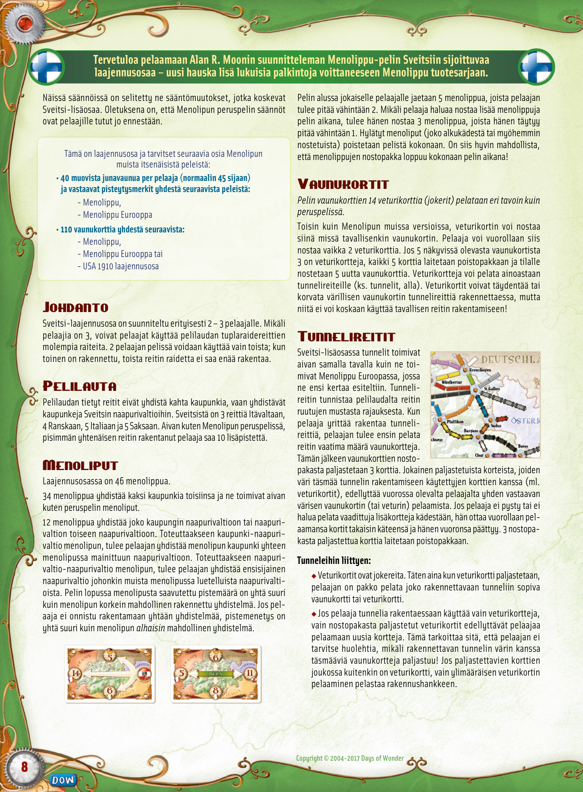

## PDF page 9

**Alan R. Moon’s Ticket to Ride™ Switzerland er en sjov udvidelse til den prisbelønnede spilserie Ticket to Ride.**

Benyt reglerne som introduceret i det originale Ticket to Ride; denne regelbog beskriver kun de supplerende særregler, der gælder for spil med udvidelsen Switzerland.

Dette spil er en udvidelse og kan kun spilles sammen med følgende dele fra en af de tidligere versioner af Ticket to Ride:

- **Et lager af 40 tog per spiller (i stedet for de sædvanlige 45) samt** **tilhørende pointmarkører fra et af følgende spil:**
- Ticket to Ride
- Ticket to Ride Europe
- **110 togkort fra:**
- Ticket to Ride
- Ticket to Ride Europe
- USA 1910 expansion

# Introduktion

Udvidelsen Switzerland er beregnet for 2 til 3 spillere. Ved 3 spillere må begge dobbeltspor anvendes. Ved 2 spillere må kun et dobbeltspors ene side benyttes. Når en af siderne er brugt, anses den tilbageværende for lukket.

# Spillebrættet

I Switzerland forbinder nogle af strækningerne ikke kun byer i Schweiz, men omfatter forbindelser til nabolande. Der er 3 strækninger, der fører fra Schweiz til Østrig, 4 til Frankrig, 5 til Italien og 5 til Tyskland. Som i det originale Ticket to Ride gives en bonus på 10 point til spilleren, som etablerer den længste, ubrudte strækning med sine togvogne.

# Rutekort

Denne udvidelse indeholder 46 rutekort. 34 rutekort forbinder to byer og fungerer helt som i tidligere udgaver af spillet. 12 rutekort forbinder enten by & land eller land & land. For at indsætte tog ifølge rutekort fra by til land, skal man forbinde bynavnet på rutekortet med et af landene på rutekortet. For at gøre det samme for rutekort mellem to lande, skal man forbinde det primære land på rutekortet med et af de øvrige på listen. Point for disse rutekort beregnes ved spillets afslutning. Hvis der er opnået forbindelse til flere mulige mål på rutekortet, gives altid point for den højest mulige værdi. Er der ikke opnået forbindelse, mistes pointantal svarende til den lavest mulige værdi på rutekortet.

Start med at give hver spiller 5 rutekort; mindst 2 af disse rutekort skal beholdes. Ønsker en spiller i løbet af spillet at trække flere rutekort, trækkes 3 nye rutekort; heraf skal mindst 1 beholdes. Returnerede rutekort – både ved spilstart og i løbet af spillet-lægges i denne udvidelse tilbage i bunden af bunken med rutekort. Bemærk: det er muligt at løbe tør for rutekort!

# Lokomotivkort

_”Jokerne” i form af de 14 lokomotivkort fungerer lidt anderledes med_ _denne udvidelse._ I modsætning til tidligere versioner af Ticket to Ride, kan lokomotivkort her tages uden særlige hensyn, helt som almindelige, farvede togvognskort. Man kan derfor godt vælge 2 synlige lokomotivkort under ens tur. Er 3 af de 5 synlige togkort lokomotiver, fjernes alle 5 straks og erstattes af nye. Lokomotivkort kan udelukkende bruges til tunneller (se afsnittet om Tunneller nedenfor). Lokomotivkort kan supplere eller erstatte farvede togvognskort ved indsætning af tog på spor med en tunnel, men aldrig bruges til indsætning af tog på et normalt spor (uden tunnel)!

# Tunneller

I udvidelsen Switzerland fungerer tunneller helt som i Ticket to Ride Europe, hvor de først blev introduceret. Tunneller er særlige strækninger, der let genkendes på den sorte ramme omkring hvert af felterne på sporet. Når man forsøger at indsætte tog på en tunnel-strækning, fremvises først de ifølge strækningens længde krævede togvognskort. Så vendes de 3 øverste kort i stakken med togvognskort. For hvert af disse kort, der har samme farve som et af de præsenterede togvognskort, koster ruten yderligere et togvognskort (eller lokomotiv) i den pågældende farve. Har man ikke nok ekstra togvognskort (eller ønsker man ikke at bruge dem), får man alle sine kort tilbage, når turen slutter. De 3 vendte togvognskort fra bunken anses for brugte.

### Husk ved bygning af tunneller følgende:

u Lokomotiver er flerfarvede jokere. Derfor vil et lokomotiv, der trækkes under denne proces, altid helt naturligt matche farven og øge prisen for projektet. u Har en spiller udelukkende brugt lokomotiver på sit tunnel- projekt, forøges prisen kun, hvis der blandt de vendte kort er lokomotiver. Det betyder, at du ikke behøver bekymre dig om farvede togvognskort. Kun et lokomotiv kan udløse yderligere omkostninger! Skulle et lokomotivkort til gengæld afsløres, stiger prisen omvendt hver gang med et lokomotiv.

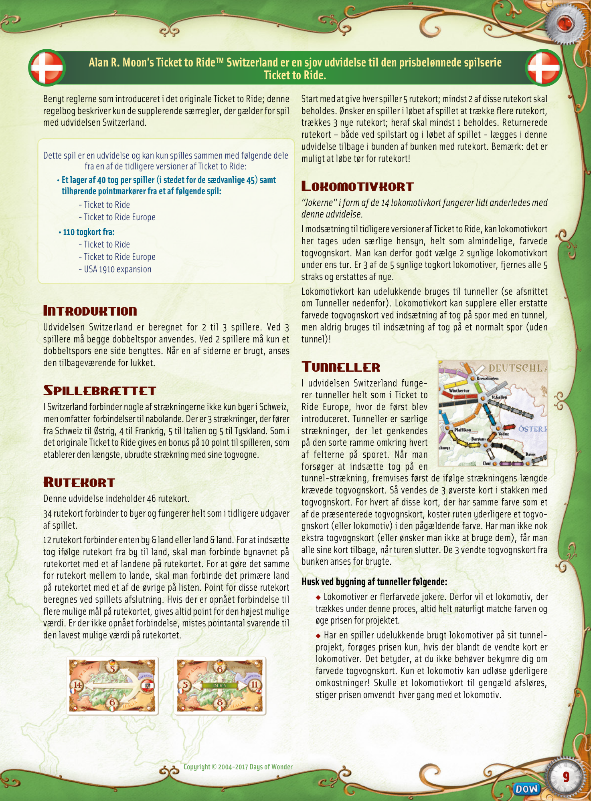

## PDF page 10

## Velkommen til Alan R. Moon’s Ticket to Ride™ Swiss Map Expansion –

## en morsom utvidelse til Ticket to Ride-spillene.

Disse reglene gjelder kun for denne utvidelsen og baserer seg på at spillerne er kjent med reglene for Ticket to Ride.

Du trenger følgende spillebrikker fra Ticket to Ride versjoner:

- **40 Tog pr spiller (istedenfor de vanlige 45) og matchende** **Poengmarkører fra enten:**
- Ticket to Ride
- Ticket to Ride Europa
- **110 Vogntog fra enten:**
- Ticket to Ride
- Ticket to Ride Europa
- USA 1910 Utvidelsen

# Introduksjon

Denne utvidelsen er laget for 2 eller 3 spillere. Ved 3 spillere kan spillerne bruke begge spor på dobbel-rutene. Ved 2 spillere gjelder ikke det andre sporet når et av sporene er tatt.

# Brettet

Noen av rutene går ikke fra en by til en annen i Sveits, men til en by i et av nabolandene. Det er 3 ruter som går fra Sveits til Østerrike, 4 til Frankrike, 5 til Italia og 5 til Tyskland. Som i det originale Ticket to Ride spillet vil spilleren med den lengste ruten ved slutten av spillet få 10 bonus poeng.

# Destinasjonsbilletter

Denne utvidelsen har 46 Destinasjonsbilletter. 34 Destinasjonsbilletter for togruter fra by til by, som brukes på samme måte som i de andre spillene. 12 Destinasjonsbilletter for togruter fra by til land eller land til land. En Destinasjonsbillett som fører fra by til land må brukes fra byen som står på billetten til det landet som står på billetten. En Destinasjonsbillett som fører fra land til land må brukes fra landet som står på billetten til det andre landet på billetten. Poengfordeling: Når en spiller foretar overganger på Destinasjons-

spillerne ikke ønsker å beholde skal legges vekk og ikke brukes igjen. Legg derfor merke til at Destinasjonsbillettene kan bli ”utsolgt”!

# Lokomotivkort

_De 14 tradisjonelle Lokomitiv kortene brukes forskjellig._ Lokomotivkortene blir trukket som vanlige Togvognkort. En spiller kan ved sin tur trekke 2 Lokomotivkort. Hvis 3 av de 5 kortene med bildet opp er Lokomotivkort, skal alle kortene byttes ut med nye. Lokomotivkort kan kun spilles på togruter med Tunnel ( se nedenfor). Lokomotivkort brukes som de fargede kortene som brukes for å kreve en togrute med Tunnel. De kan ikke brukes til å kreve en vanlig rute.

# Tunnel

I denne utgivelsen skal Tunneler bli spilt slik de gjør i Ticket to Ride Europa, hvor de første gang ble introdusert. Tunneler er spesielle togruter. Når en spiller prøver å kreve en togrute med Tunnel må spilleren først legge frem det antallet kort som kreves. Da skal de 3 øverste Vognkortene snus med bildet opp. Om en av disse kortene har samme farge som kortene som ble brukt for å kreve Tunnelen, må spilleren bruke et ekstra kort med samme farge for å ta over Tunnelen. Om spilleren ikke har matchende kort eller ikke ønsker å spille flere kort kan spilleren trekke kortene tilbake til hånden, da avsluttes spillerens tur. De 3 Vognkortene som ble snudd legges til side.

### Vær oppmerksom på følgende, i forbindelse med tunneler:

u Lokomotiver er flerfargede kort. Dermed må spilleren enten spille et ekstra kort av samme farge eller et Lokomotivkort. u Om en spiller bruker Lokomotivkort for å kreve en Tunnel, vil kun Lokomotivkort kunne brukes mot det. Dette betyr at hvis et Lokomotivkort er blandt de kortene som skal snus, og det matcher, kan man kun bruke et Lokomotivkort fra hånden for å fullføre kravet av Tunnelen.

billetten får man poeng ut fra den høyeste verdien av alle fullførte verdier på billetten. Om ingen av overgangene blir fullført, må spilleren trekke fra den laveste poengverdien på Destinasjonsbilletten. Ved spillets begynnelse skal hver spiller få tildelt 5 Destinasjonsbilletter, hvorav de må beholde minst 2. Hvis en spiller ønsker en ekstra Destinasjonsbillett i løpet av spillet, skal spilleren få 3 Destinasjonsbilletter, hvorav man må beholde minst 1. Alle Destinasjonsbilletter som

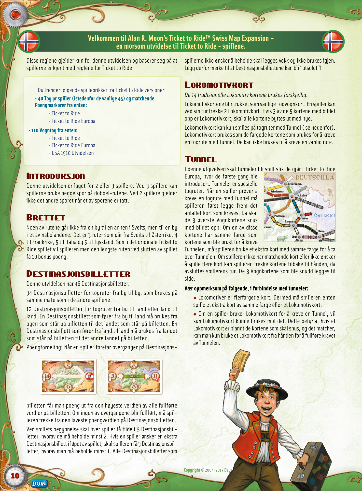

## PDF page 11

| •         | Detta regelhäftet beskriver de specifika reglerna för Swiss Map Expansion och antar att du är bekant med reglerna som introducerades i Ticket to Ride. Detta spelet är en expansion och kräver att du använder följande delar ifrån någon av de tidigare utgivna spelen i Ticket to Ride serien: En reserv på 40 tåg per spelare, (istället för 45 som är normalt) och poängmarkörer ifrån något av följande spel: - Ticket to Ride-Ticket to Ride Europe • 110 Tågkort från: - Ticket to Ride-Ticket to Ride Europe-USA 1910 expansion Introduktion Den Schweiziska kartan är designad specifikt för 2-3 spelare. Med 3 spelare kan spelarna använda båda spåren på de dubbelspåriga sträckorna. Med 2 spelare kan bara den ena av de två sträckorna                                                                                                                                                                                                                                                                                                                                                                                                                                                                    | Välkommen till Alan R. Moon’s Ticket to Ride™ Swiss Map – ett nytt roligt tillägg till de prisbelönta spelen i Ticket to Ride serien. I starten på spelet så delar man ut 5 biljettkort till varje spelare varav minst 2 av korten måste behållas. Om en spelare under spelets gång vill ha ytterligare biljettkort tilldelas han/hon 3 stycken varav minst 1 av dessa måste behållas. Biljettkort som spelarna inte vill ha tas ut ur spel men läggs inte i en ny hög som i tidigare versioner av Ticket to Ride.(Så det är fullt möjligt att biljettkorten tar slut.) Lokomotivkort De 14 traditionella lokomotivkorten “jokrar”, spelas annorlunda. Till skillnad ifrån andra versioner av Ticket to Ride, så kan uppvända lokomotivkort bli valda precis som vanliga tågkort, dvs att en spelare kan välja två lokomotivkort under sin runda. Om 3 av de 5 uppvända korten är lokomotivkort så går alla 5 kort omedelbart till slänghögen och 5 nya kort vänds upp. Lokomotivkort kan endast användas på tunnelsträckor (se Tunnlar). Lokomotivkorten kan användas som komplement eller ersätta ett tågkort som krävs för att muta in en tunnelsträcka, men de kan inte användas för att muta in en vanlig sträcka (dvs icke tunnelsträcka)!                                                                                                                                                                                          |
| --------- | ------------------------------------------------------------------------------------------------------------------------------------------------------------------------------------------------------------------------------------------------------------------------------------------------------------------------------------------------------------------------------------------------------------------------------------------------------------------------------------------------------------------------------------------------------------------------------------------------------------------------------------------------------------------------------------------------------------------------------------------------------------------------------------------------------------------------------------------------------------------------------------------------------------------------------------------------------------------------------------------------------------------------------------------------------------------------------------------------------------------------------------------------------------------------------------------------------------------------ | ----------------------------------------------------------------------------------------------------------------------------------------------------------------------------------------------------------------------------------------------------------------------------------------------------------------------------------------------------------------------------------------------------------------------------------------------------------------------------------------------------------------------------------------------------------------------------------------------------------------------------------------------------------------------------------------------------------------------------------------------------------------------------------------------------------------------------------------------------------------------------------------------------------------------------------------------------------------------------------------------------------------------------------------------------------------------------------------------------------------------------------------------------------------------------------------------------------------------------------------------------------------------------------------------------------------------------------------------------------------------------------------------------------------------------------------- |
| användas. | Spelplan På den Schweiziska kartan så slutar vissa sträckor inte längre vid städer utan sammanbinder städer med angränsande grannländer istället. Där finns 3 sträckor som leder ifrån Schweiz till Österrike, 4 till Frankrike, 5 till Italien och 5 till Tyskland. Precis som i original Ticket to Ride så får spelaren med den längsta sammanhängande sträckan vid spelets slut 10 extra poäng. Biljettkort Denna expansionen innehåller 46 Biljettkort. 34 stycken är ifrån stad till stad och spelas på samma sätt som i föregående versioner av spelet. 12 stycken är ifrån stad till land eller ifrån ett land till ett annat land. För att fullfölja ett sådant biljettkort måste du bygga en sammanhängande rutt av sträckor mellan staden med det angivna landet på biljettkortet. För att fullfölja ett land till land biljettkort måste du bygga en sammanhängande rutt av sträckor mellan det primära landet till ett av de andra länderna som står listat på kortet. Poängen som delas ut vid spelets slut är för den förbindelsen som är värd mest poäng och färdigställd av de olika förbindelserna. Om ingen förbindelse på biljettkortet är avklarad så förlorar man den minsta poängsumman på kortet. | Tunnelsträckor I Swiss Map expansion så fungerar tunnlar precis som de gör i Ticket to Ride Europe där de först intro- ducerades. Tunnlar är speciella sträckor som identifieras av de svarta kanterna som omger tunnel- sträckan. När en spelare försöker muta in en tunnelsträcka så lägger spelaren först ner korten som krävs för att bygga sträckan. Sedan vänder spelaren upp tre kort ur drahögen och för varje kort av dem som matchar sträckans färg (inklusive lok) så måste spelaren spela ett kort extra i samma färg. Om spelaren inte har tillräckligt med kort i samma färg (eller väljer att inte spela dem), så får spelaren tillbaka alla sina kort till sin hand, varpå spelarens tur tar slut. De tre korten som blev uppvända ifrån drahögen slängs i slänghögen. Att tänka på angående tunnlar: • Lokomovtivkort är flerfärgade jokrar. När spelaren vänder upp ett lokomotivkort så måsta spelaren betala ett extra tågkort i samma färg eller ett lokomotiv. • Om en spelare endast spelar lokomotivkort när spelaren mutar in en tunnelsträcka så räknas bara lokomotivkort som vänds upp från drahögen. Detta betyder att spelaren inte behöver räkna in normala tågkort. Men skulle lokomotivkort dyka upp bland de kort som dras till tunneln så måste spelaren spela 1 extra för varje lokomotivkort som dras. Dessa kan bara spelas med lokomotivkort ifrån handen. Copyright © 2004-2017 Days of Wonder 11 |

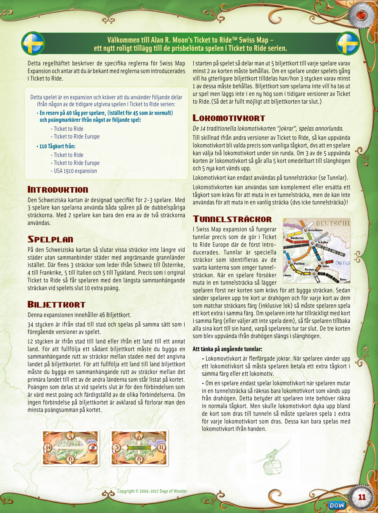

## PDF page 12

The parser returned no text for this page. Refer to the page image below.

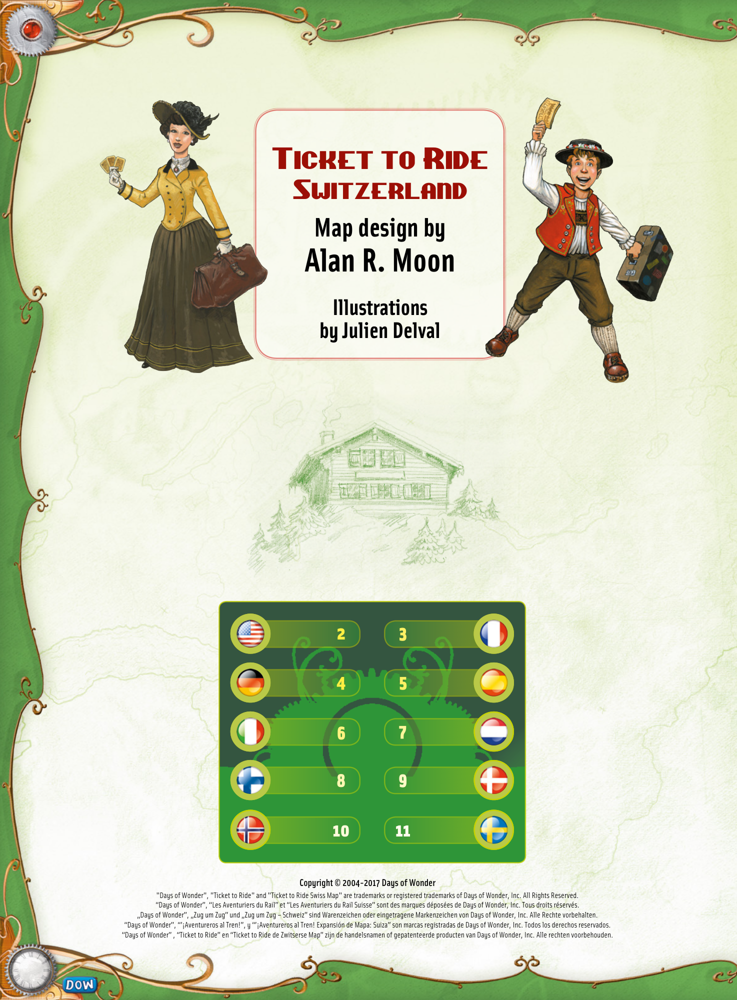
