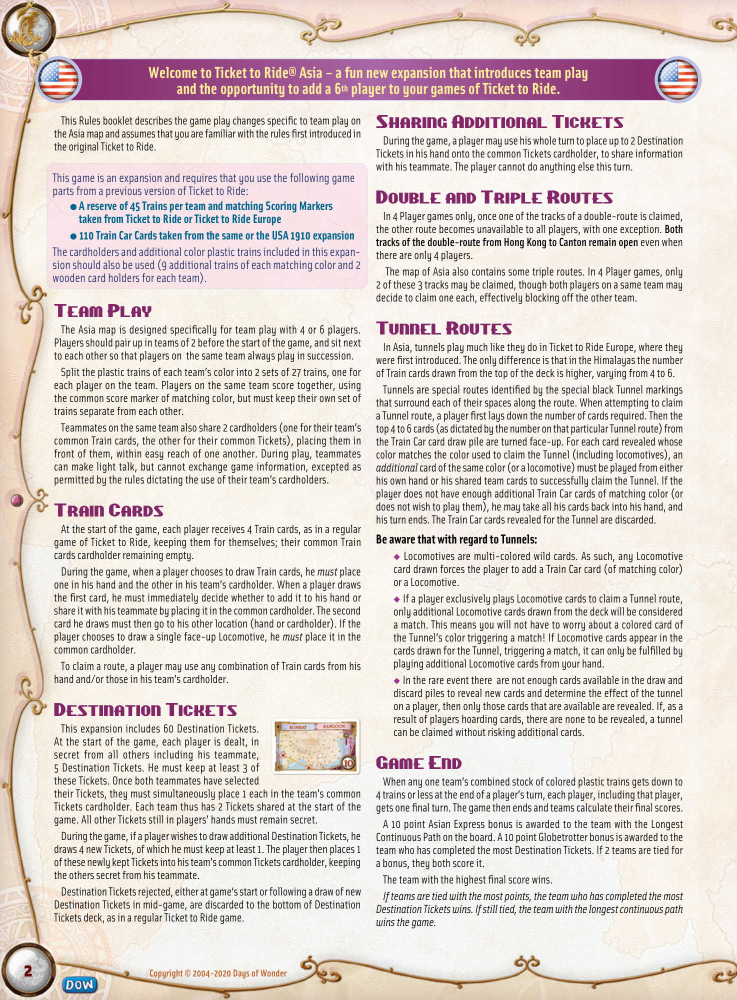

# Team Asia

[Source PDF](rules.pdf) · [Map reference](map.png) · [Map image source](https://boardgamegeek.com/image/3080151)

Parsed locally with pdf-inspector. Original page images preserve diagrams, tables, and layout; consult them where extraction is unclear.

## PDF page 1

## Welcome to Ticket to Ride® Asia – a fun new expansion that introduces team play

## and the opportunity to add a 6th

This Rules booklet describes the game play changes specific to team play on the Asia map and assumes that you are familiar with the rules first introduced in the original Ticket to Ride.

This game is an expansion and requires that you use the following game parts from a previous version of Ticket to Ride: l **A reserve of 45 Trains per team and matching Scoring Markers** **taken from Ticket to Ride or Ticket to Ride Europe** l **110 Train Car Cards taken from the same or the USA 1910 expansion** The cardholders and additional color plastic trains included in this expansion should also be used (9 additional trains of each matching color and 2 wooden card holders for each team).

# Team Play

The Asia map is designed specifically for team play with 4 or 6 players. Players should pair up in teams of 2 before the start of the game, and sit next to each other so that players on the same team always play in succession. Split the plastic trains of each team’s color into 2 sets of 27 trains, one for each player on the team. Players on the same team score together, using the common score marker of matching color, but must keep their own set of trains separate from each other. Teammates on the same team also share 2 cardholders (one for their team’s common Train cards, the other for their common Tickets), placing them in front of them, within easy reach of one another. During play, teammates can make light talk, but cannot exchange game information, excepted as permitted by the rules dictating the use of their team’s cardholders.

# Train Cards

At the start of the game, each player receives 4 Train cards, as in a regular game of Ticket to Ride, keeping them for themselves; their common Train cards cardholder remaining empty. During the game, when a player chooses to draw Train cards, he _must_ place one in his hand and the other in his team’s cardholder. When a player draws the first card, he must immediately decide whether to add it to his hand or share it with his teammate by placing it in the common cardholder. The second card he draws must then go to his other location (hand or cardholder). If the player chooses to draw a single face-up Locomotive, he _must_ place it in the common cardholder. To claim a route, a player may use any combination of Train cards from his hand and/or those in his team’s cardholder.

# Destination Tickets

This expansion includes 60 Destination Tickets. At the start of the game, each player is dealt, in secret from all others including his teammate, 5 Destination Tickets. He must keep at least 3 of these Tickets. Once both teammates have selected their Tickets, they must simultaneously place 1 each in the team’s common Tickets cardholder. Each team thus has 2 Tickets shared at the start of the game. All other Tickets still in players’ hands must remain secret. During the game, if a player wishes to draw additional Destination Tickets, he draws 4 new Tickets, of which he must keep at least 1. The player then places 1 of these newly kept Tickets into his team’s common Tickets cardholder, keeping the others secret from his teammate. Destination Tickets rejected, either at game‘s start or following a draw of new Destination Tickets in mid-game, are discarded to the bottom of Destination Tickets deck, as in a regular Ticket to Ride game.

## player to your games of Ticket to Ride.

# Sharing Additional Tickets

During the game, a player may use his whole turn to place up to 2 Destination Tickets in his hand onto the common Tickets cardholder, to share information with his teammate. The player cannot do anything else this turn.

# Double and Triple Routes

In 4 Player games only, once one of the tracks of a double-route is claimed, the other route becomes unavailable to all players, with one exception. **Both** **tracks of the double-route from Hong Kong to Canton remain open** even when there are only 4 players. The map of Asia also contains some triple routes. In 4 Player games, only 2 of these 3 tracks may be claimed, though both players on a same team may decide to claim one each, effectively blocking off the other team.

# Tunnel Routes

In Asia, tunnels play much like they do in Ticket to Ride Europe, where they were first introduced. The only difference is that in the Himalayas the number of Train cards drawn from the top of the deck is higher, varying from 4 to 6. Tunnels are special routes identified by the special black Tunnel markings that surround each of their spaces along the route. When attempting to claim a Tunnel route, a player first lays down the number of cards required. Then the top 4 to 6 cards (as dictated by the number on that particular Tunnel route) from the Train Car card draw pile are turned face-up. For each card revealed whose color matches the color used to claim the Tunnel (including locomotives), an _additional_ card of the same color (or a locomotive) must be played from either his own hand or his shared team cards to successfully claim the Tunnel. If the player does not have enough additional Train Car cards of matching color (or does not wish to play them), he may take all his cards back into his hand, and his turn ends. The Train Car cards revealed for the Tunnel are discarded.

### Be aware that with regard to Tunnels:

u Locomotives are multi-colored wild cards. As such, any Locomotive card drawn forces the player to add a Train Car card (of matching color) or a Locomotive. u If a player exclusively plays Locomotive cards to claim a Tunnel route, only additional Locomotive cards drawn from the deck will be considered a match. This means you will not have to worry about a colored card of the Tunnel’s color triggering a match! If Locomotive cards appear in the cards drawn for the Tunnel, triggering a match, it can only be fulfilled by playing additional Locomotive cards from your hand. u In the rare event there are not enough cards available in the draw and discard piles to reveal new cards and determine the effect of the tunnel on a player, then only those cards that are available are revealed. If, as a result of players hoarding cards, there are none to be revealed, a tunnel can be claimed without risking additional cards.

# Game End

When any one team’s combined stock of colored plastic trains gets down to 4 trains or less at the end of a player’s turn, each player, including that player, gets one final turn. The game then ends and teams calculate their final scores. A 10 point Asian Express bonus is awarded to the team with the Longest Continuous Path on the board. A 10 point Globetrotter bonus is awarded to the team who has completed the most Destination Tickets. If 2 teams are tied for a bonus, they both score it. The team with the highest final score wins. _If teams are tied with the most points, the team who has completed the most_ _Destination Tickets wins. If still tied, the team with the longest continuous path_ _wins the game._

