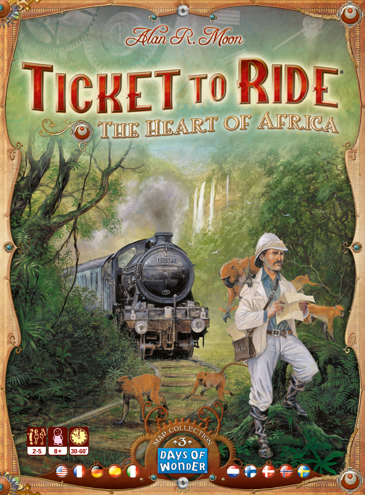
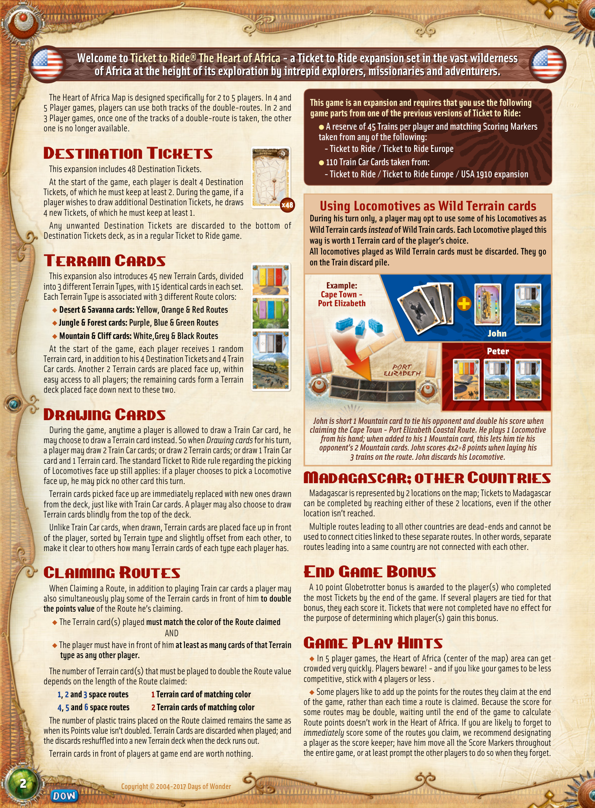
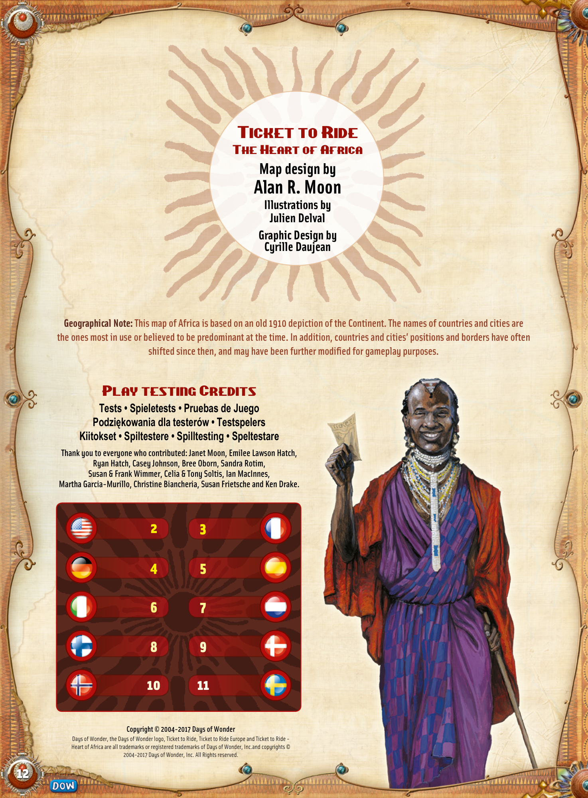

# The Heart Of Africa

[Source PDF](rules.pdf) · [Map reference](the-heart-of-africa-map.png)

Parsed locally with pdf-inspector. Original page images preserve diagrams, tables, and layout; consult them where extraction is unclear.

## PDF page 1

The parser returned no text for this page. Refer to the page image below.

## PDF page 2

**Welcome to Ticket to Ride® The Heart of Africa-a Ticket to Ride expansion set in the vast wilderness**

### of Africa at the height of its exploration by intrepid explorers, missionaries and adventurers.

#### This game is an expansion and requires that you use the following

#### game parts from one of the previous versions of Ticket to Ride:

l **A reserve of 45 Trains per player and matching Scoring Markers** **taken from any of the following:**

**- Ticket to Ride / Ticket to Ride Europe**
l **110 Train Car Cards taken from:**

**- Ticket to Ride / Ticket to Ride Europe / USA 1910 expansion**

## Using Locomotives as Wild Terrain cards

#### During his turn only, a player may opt to use some of his Locomotives as

**Wild Terrain cards** _instead_ **of Wild Train cards. Each Locomotive played this** **way is worth 1 Terrain card of the player’s choice.** **All locomotives played as Wild Terrain cards must be discarded. They go on the Train discard pile.**

#### Example: Cape Town -Port Elizabeth

#### John

#### Peter

The Heart of Africa Map is designed specifically for 2 to 5 players. In 4 and 5 Player games, players can use both tracks of the double-routes. In 2 and 3 Player games, once one of the tracks of a double-route is taken, the other one is no longer available.

# Destination Tickets

This expansion includes 48 Destination Tickets. At the start of the game, each player is dealt 4 Destination Tickets, of which he must keep at least 2. During the game, if a player wishes to draw additional Destination Tickets, he draws**x48** 4 new Tickets, of which he must keep at least 1. Any unwanted Destination Tickets are discarded to the bottom of Destination Tickets deck, as in a regular Ticket to Ride game.

# Terrain Cards

This expansion also introduces 45 new Terrain Cards, divided into 3 different Terrain Types, with 15 identical cards in each set. Each Terrain Type is associated with 3 different Route colors: u **Desert & Savanna cards: Yellow, Orange & Red Routes** u **Jungle & Forest cards: Purple, Blue & Green Routes** u **Mountain & Cliff cards: White,Grey & Black Routes** At the start of the game, each player receives 1 random Terrain card, in addition to his 4 Destination Tickets and 4 Train Car cards. Another 2 Terrain cards are placed face up, within easy access to all players; the remaining cards form a Terrain deck placed face down next to these two.

# Drawing Cards

During the game, anytime a player is allowed to draw a Train Car card, he may choose to draw a Terrain card instead. So when _Drawing cards_ for his turn, a player may draw 2 Train Car cards; or draw 2 Terrain cards; or draw 1 Train Car card and 1 Terrain card. The standard Ticket to Ride rule regarding the picking of Locomotives face up still applies: if a player chooses to pick a Locomotive face up, he may pick no other card this turn. Terrain cards picked face up are immediately replaced with new ones drawn from the deck, just like with Train Car cards. A player may also choose to draw Terrain cards blindly from the top of the deck. Unlike Train Car cards, when drawn, Terrain cards are placed face up in front of the player, sorted by Terrain type and slightly offset from each other, to make it clear to others how many Terrain cards of each type each player has.

# Claiming Routes

When Claiming a Route, in addition to playing Train car cards a player may also simultaneously play some of the Terrain cards in front of him **to double** **the points value** of the Route he’s claiming. u The Terrain card(s) played **must match the color of the Route claimed** AND u The player must have in front of him **at least as many cards of that Terrain** **type as any other player.**

The number of Terrain card(s) that must be played to double the Route value depends on the length of the Route claimed: **1, 2 and 3 space routes 1 Terrain card of matching color** **4, 5 and 6 space routes 2 Terrain cards of matching color** The number of plastic trains placed on the Route claimed remains the same as when its Points value isn’t doubled. Terrain Cards are discarded when played; and the discards reshuffled into a new Terrain deck when the deck runs out. Terrain cards in front of players at game end are worth nothing.

_John is short 1 Mountain card to tie his opponent and double his score when_ _claiming the Cape Town-Port Elizabeth Coastal Route. He plays 1 Locomotive_ _from his hand; when added to his 1 Mountain card, this lets him tie his_ _opponent’s 2 Mountain cards. John scores 4x2=8 points when laying his_ _3 trains on the route. John discards his Locomotive._

# Madagascar; other Countries

Madagascar is represented by 2 locations on the map; Tickets to Madagascar can be completed by reaching either of these 2 locations, even if the other location isn’t reached. Multiple routes leading to all other countries are dead-ends and cannot be used to connect cities linked to these separate routes. In other words, separate routes leading into a same country are not connected with each other.

# End Game Bonus

A 10 point Globetrotter bonus is awarded to the player(s) who completed the most Tickets by the end of the game. If several players are tied for that bonus, they each score it. Tickets that were not completed have no effect for the purpose of determining which player(s) gain this bonus.

# Game Play Hints

u In 5 player games, the Heart of Africa (center of the map) area can get crowded very quickly. Players beware! - and if you like your games to be less competitive, stick with 4 players or less. u Some players like to add up the points for the routes they claim at the end of the game, rather than each time a route is claimed. Because the score for some routes may be double, waiting until the end of the game to calculate Route points doesn’t work in the Heart of Africa. If you are likely to forget to _immediately_ score some of the routes you claim, we recommend designating a player as the score keeper; have him move all the Score Markers throughout the entire game, or at least prompt the other players to do so when they forget.

## PDF page 3

## Ticket to Ride

The Heart of Africa

### Map design by

# Alan R. Moon

#### Illustrations by

#### Julien Delval

#### Graphic Design by

#### Cyrille Daujean

**Geographical Note: This map of Africa is based on an old 1910 depiction of the Continent. The names of countries and cities are** **the ones most in use or believed to be predominant at the time. In addition, countries and cities’ positions and borders have often** **shifted since then, and may have been further modified for gameplay purposes.**

Play testing Credits **Tests • Spieletests • Pruebas de Juego** **Podziękowania dla testerów • Testspelers** **Kiitokset • Spiltestere • Spilltesting • Speltestare** **Thank you to everyone who contributed: Janet Moon, Emilee Lawson Hatch,** **Ryan Hatch, Casey Johnson, Bree Oborn, Sandra Rotim,** **Susan & Frank Wimmer, Celia & Tony Soltis, Ian MacInnes,** **Martha Garcia-Murillo, Christine Biancheria, Susan Frietsche and Ken Drake.**

| 2   | 3   |
| --- | --- |
| 4   | 5   |
| 6   | 7   |
| 8   | 9   |
| 10  | 11  |

**Copyright © 2004-2017 Days of Wonder** Days of Wonder, the Days of Wonder logo, Ticket to Ride, Ticket to Ride Europe and Ticket to Ride-Heart of Africa are all trademarks or registered trademarks of Days of Wonder, Inc.and copyrights © 2004-2017 Days of Wonder, Inc. All Rights reserved.

