# United Kingdom

[Source PDF](rules.pdf) · [Map reference](united-kingdom-map.png)

Parsed locally with pdf-inspector. Original page images preserve diagrams, tables, and layout; consult them where extraction is unclear.

## PDF page 1

Julien Delval Graphic Design by Cyril ons by le D strati aujean Illu

**2-4 8+ 30-60’**

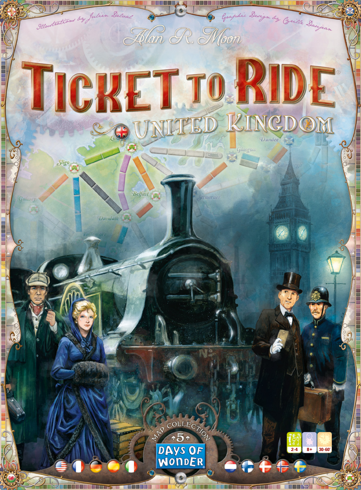

## PDF page 2

#### United Kingdom-a Ticket to Ride expansion that makes you relive the early

**Welcome to Ticket to Ride® days of the railroad adventure. It all began in England, back in the 19th century…**

This rules booklet describes the game play changes specific to the United Kingdom Map and assumes that you are familiar with the rules first introduced in the original Ticket to Ride. This expansion is designed for 2-4 players. In 3 and 4 Player games, players can use both tracks of the double-routes. In 2 Player games, once one of the tracks of a double-route is taken, the other one is no longer available.

**To play with this expansion, you just need 35 Trains (instead of** **the usual 45) and the matching Scoring Markers taken from Ticket** **to Ride or Ticket to Ride Europe. You do not need the Train cards** **from your original game as the expansion comes with a complete,** **specific UK Train card deck that includes 6 extra Locomotive Cards.**

## Locomotives

At the start of the game, each player receives a Locomotive in addition to their 4 Train Cards. u Any 4 cards can be played as a Locomotive; u When 3 or more Locomotives appear among the available fa- ce-up cards, do NOT discard them.

## Destination Tickets

#### This expansion includes 57 Destination Tickets.

**2** At the start of the game, each player is dealt 5 Destination Tickets, of which he must keep at least 3. During the game, if a player wishes to draw additional Destination Tickets, he draws 3 and must keep at least 1. Destination Tickets not kept, either at game’s start or following a draw of new Destination Tickets in mid-game, are discarded to the bottom of Destination Tickets deck, as in a regular Ticket to Ride game.

## Ferries

Ferries are special routes linking two adja- cent cities across a body of water. They are easily identified by the Locomotive icon(s) featured on at least one of the spaces making the route. To claim a Ferry Route, a player must play a Locomotive card for each Locomotive symbol on the route, and the usual set of cards of the proper color for the remaining spaces of that Ferry Route.

## Technology Cards

This expansion introduces Technology Cards. Players start the game without any technology. They can only claim 1 and 2 space routes and they can only claim routes in England. Ferry routes cannot be claimed. _Exception: The Southampton-New York route is a special route_ _that can be claimed at any time and without any Technology._

At the beginning of their turn, **before** taking their regular action, a player may discard Locomotives to buy ONE Technology Card. Re- member that any 4 cards may be used as a Locomotive (or any 3 cards if you have the Booster Technology), even in this occasion.

# Available Technologies

### Wales Concession x4

#### Cost : 1 Locomotive

Allows you to claim routes into any of the 5 cities in Wales.

### Ireland / France Concession x4

#### Cost : 1 Locomotive

Allows you to claim routes into any of the 10 cities in Ireland and into France.

### Scotland Concession x4

#### Cost : 1 Locomotive

Allows you to claim routes into any of the 10 cities in Scotland.

### Mechanical Stoker x4

#### Cost : 1 Locomotive

Allows you to claim 3 space routes.

### Superheated Steam Boiler x4

#### Cost : 2 Locomotives

Allows you to claim 4, 5, and 6 space routes. The Mechanical Stoker is still needed to claim 3 space routes.

### Propellers x4

#### Cost : 2 Locomotives

Allows you to claim Ferry routes.

### Booster x4

#### Cost : 2 Locomotives

You may now use any 3 cards as a Locomotive (instead of the normal 4).

### Boiler Lagging x4

#### Cost : 2 Locomotives

You score 1 extra point for each route that you claim.

### Steam Turbines x4

#### Cost : 2 Locomotives

You score 2 extra points for each Ferry route that you claim. When combined with Boiler Lagging, you score 3 points for each Ferry route that you claim.

### Double Heading x4

#### Cost : 4 Locomotives

At the end of the game, you score 2 points for each Ticket that you completed.

### Right of Way x1

#### Cost : 4 Locomotives

You may play this card to claim a route that was already claimed by another player. When playing this card, you must still play the correct number of cards to claim the route. Simply place your trains on it next to the other player’s trains. You must immediately claim the route when you take this card, and after you have claimed the route, you return the card to the table so it can be taken by another player.

**_Important Note: Many times, a player will need several Technology cards to claim a route. See examples below._**

# Advanced Technologies

### Thermocompressor x1

#### Cost : 1 Locomotive

Claim 2 Routes this turn, then return this card.

### Water Tenders x2

#### Cost : 2 Locomotives

When drawing Train Cards, you can decide to draw 3 blind cards instead of the regular 2.

### Risky Contracts x1

#### Cost : 2 Locomotives

At the end of the game, score 20 points if you have the most completed Tickets. If not, lose 20 points. _This card must be bought before the Train Cards are res-_ _huffled. Once the reshuffle has occurred, these cards cannot be purchased and must be put back in the box._

### Equalising Beam x1

#### Cost : 2 Locomotives

At the end of the game, score 15 points if you have the longest Route. If not, **3** lose 15 points. _This card must be bought before the Train Cards are res-_ _huffled. Once the reshuffle has occurred, these cards cannot be purchased and must be put back in the box._

### Diesel Powerx1

#### Cost : 3 Locomotives

When claiming a Route, you may play 1 less card than required. You must still play at least 1 Card, and you cannot ignore a Locomotive on a Ferry route.

## Scoring

uThere is no Globetrotter or Longest Route Bonus in this expansion. u Some players like to add up the points for the routes they claim at game end, rather than each time a route is claimed. Because the score for some routes may be affected by technologies such as the _Boiler Lagging_ or the _Steam Turbines_, waiting until the end to compute Routes points doesn’t work in this expansion. If you are likely to forget to immediately score some of the routes you claim, we recommend designating a player as the scorekeeper; have him move all the Score Markers throughout the entire game, or at least prompt the other players to do so when they forget.

_If a player wants to claim the route from Stranraer to Londonderry,_ _Concession card, the Mechanical Stoker card, and the Propellers card._ _he would need the Scotland Concession card, the Ireland/France_

_If a player wants to claim_ _the route from Newcastle to_ _Edinburgh, he would need the_ _Scotland Concession card and_ _the Mechanical Stoker card._

#### Reminder: The Southampton-New York route is a special route that

#### can be claimed at any time and without any Technology.

## Variant: Advanced Technologies

Advanced Technologies can be added to the game for a more com- petitive experience. Note that the number of Advanced Technologies is limited.

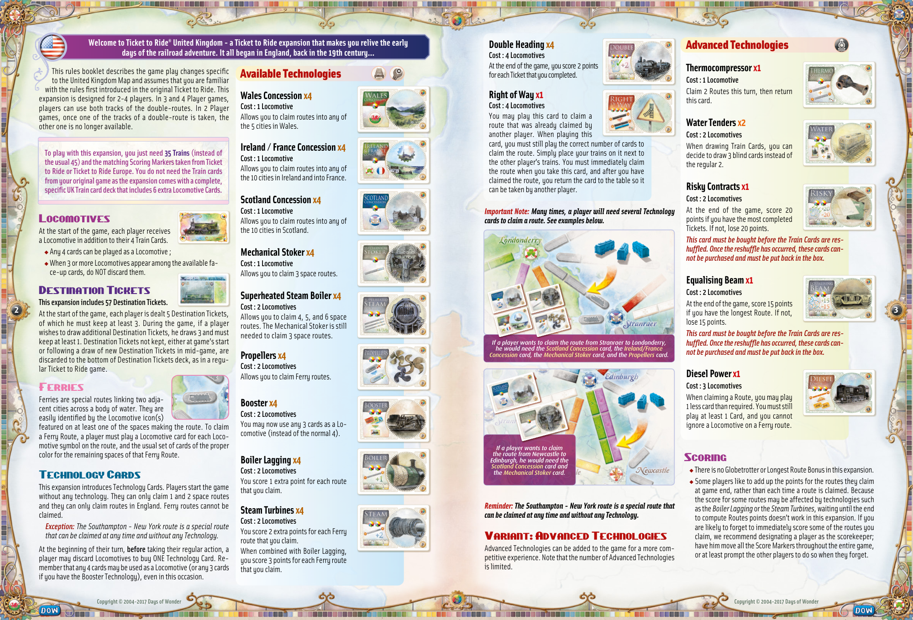

## PDF page 3

#### Bienvenue dans l’extension Les Aventuriers du Rail

™ **- Royaume-Uni ! Tout commence en Angleterre e** **au XIX siècle… revivez les premiers instants de l’épopée ferroviaire, et construisez l’histoire !**

Ce livret vous présente les règles spécifiques au plateau du Royaume-Uni des Aventuriers du Rail, tout en partant du prin- cipe que vous connaissez déjà les mécanismes du jeu de base. Le Royaume-Uni est un plateau prévu pour 2 à 4 joueurs. Dans une partie à 3 ou 4 joueurs, vous pouvez utiliser les routes doubles. En revan- che, dans une partie à 2 joueurs, quand l’une des voies d’une route double est prise, la seconde est fermée jusqu’à la fin de la partie.

**Cette extension nécessite 35 wagons du jeu de base Les Aventuriers du Rail ou Les Aventuriers du Rail Europe (au lieu de 45 ha-** **bituellement) ainsi que les marqueurs de score correspondants.** **Vous n’avez pas besoin des cartes Wagon de votre jeu de base car** **l’extension Royaume-Uni comporte déjà de telles cartes, avec 6 cartes Locomotive supplémentaires.**

## Locomotives

Au début de la partie, chaque joueur reçoit une carte Locomotive et 4 cartes Wagon. De plus, dans cette extension : u 4 cartes quelconques peuvent remplacer une Locomotive; u Si, au cours du jeu, 3 cartes visibles sur 5 sont des Locomotives, elles ne sont pas remplacées.

## Cartes Destination

#### Cette extension comporte 57 cartes Destination.

**4** En début de partie, chaque joueur reçoit 5 cartes et doit en garder au moins 3. En cours de partie, si un joueur décide de reprendre des cartes Destination, il pioche les 3 premières cartes de la pile et doit en garder au moins une. Toute carte Destination rejetée, que ce soit en début de partie ou en cours de jeu, est replacée en dessous de la pile des cartes Destination, comme dans une partie normale.

## Ferries

Les ferries sont des routes maritimes. Les lignes de ferries sont aisément reconnais- sables au symbole Locomotive figurant sur au moins un des espaces de la route. Pour prendre possession d’une ligne de ferries, un joueur doit jouer une carte Locomotive pour chaque symbole de Locomotive figurant sur la route, et des cartes de la couleur correspondant à la route pour les autres espaces (les routes grises pouvant être prises avec n’importe quelle série de cartes d’une même couleur).

## Cartes Technologie

Les cartes Technologie sont une nouveauté de cette extension. Les joueurs commencent la partie sans aucune technologie. Ils peuvent uniquement construire des routes terrestres d’un ou deux espaces, et à condition qu’elles se trouvent en Angleterre. _Exception : Le transatlantique Southampton-New York est une_ _route spéciale : aucune technologie n’est nécessaire pour s’emparer de cette route._

Au début de son tour, **avant** de faire son action, un joueur peut acheter une carte Technologie en dépensant le nombre de Locomotives requis. Souvenez-vous que 4 cartes quelconques (ou même 3 si vous avez la technologie Booster) peuvent toujours remplacer une Locomotive, y compris dans ce cas.

# Technologies disponibles

### Concession : Pays de Galles x4

#### Coût : 1 Locomotive

Vous pouvez prendre les routes qui se trouvent ou mènent au Pays de Galles.

### Concession : Irlande / France x4

#### Coût : 1 Locomotive

Vous pouvez prendre les routes qui se trouvent ou mènent en Irlande et en France.

### Concession : Écosse x4

#### Coût : 1 Locomotive

Vous pouvez prendre les routes qui se trouvent ou mènent en Écosse.

### Alimentation automatique x4

#### Coût : 1 Locomotive

Vous pouvez prendre les routes de 3 espaces.

### Tuyaux de surchauffe x4

#### Coût : 2 Locomotives

Vous pouvez prendre les routes de 4, 5 et 6 espaces. _Attention : sans l’Alimentation automatique, vous ne pouvez toujours pas_ _prendre les routes de 3 espaces._

### Hélices x4

#### Coût : 2 Locomotives

Vous pouvez prendre les ferries.

### Booster x4

#### Coût : 2 Locomotives

3 cartes quelconques peuvent remplacer une Locomotive (au lieu de 4).

### Isolation thermique x4

#### Coût : 2 Locomotives

Chaque route que vous prenez après l’acquisition de cette carte vous rapporte 1 point supplémentaire.

### Turbines à vapeur x4

#### Coût : 2 Locomotives

Chaque ferry que vous prenez après l’acquisition de cette carte vous rapporte 2 points supplémentaires. Si vous avez l’Isolation thermique, chaque ferry vous rapporte donc 3 points supplémentaires.

### Double motrice x4

#### Coût : 4 Locomotives

À la fin de la partie, chaque carte Destination réussie vous rapporte 2 points supplémentaires.

### Droit de passage x1

#### Coût : 4 Locomotives

Vous pouvez acheter cette carte pour vous emparer immédiatement d’une route sur laquelle un autre joueur a déjà posé ses wagons. Vous devez tout de même payer le nombre de cartes Wagon requises et placer vos wagons à côté de ceux du ou des joueurs qui s’y trouvent déjà. La carte «Droit de passage» est ensuite remise en place à disposition des autres joueurs.

**_Note importante : Il est fréquent qu’un joueur ait besoin de plusieurs technologies pour s’emparer d’une route. Voici quelques exemples._**

# Technologies avancées

### Thermocompresseurs x1

#### Coût : 1 Locomotive

Vous pouvez acheter cette carte pour vous emparer immédiatement de deux routes en un seul tour. Vous devez dépenser les cartes Wagon et les wagons requis comme d’habitude. La carte «Thermocompresseurs» est ensuite remise en place à disposition des autres joueurs.

### Réservoirs x2

#### Coût : 2 Locomotives

Lorsque vous piochez des cartes Wagon, vous pouvez piocher 3 cartes en aveugle au lieu de 2.

### Contrats risqués x1

#### Coût : 2 Locomotives

À la fin de la partie, vous marquez 20 points si vous avez réussi le plus grand nombre de cartes Destination. Sinon, vous perdez 20 points. _Cette carte doit être achetée avant l’épuisement de la pioche de cartes Wagon. À défaut, elle est défaussée au mo-_ _ment où vous reformez la pioche à partir de la défausse._

### Suspension améliorée x1 5

#### Coût : 2 Locomotives

À la fin de la partie, vous marquez 15 points si vous avez la route la plus longue. Sinon, vous perdez 15 points. _Cette carte doit être achetée avant l’épuisement de la pioche de cartes Wagon. À défaut, elle est défaussée au mo-_ _ment où vous reformez la pioche à partir de la défausse._

### Diesel x1

#### Coût : 3 Locomotives

Toutes les routes vous coûtent une carte de moins que d’habitude, avec un minimum d’une carte. Sur un ferry, vous devez tout de même payer toutes les Locomotives.

## Fin du jeu

u Il n’y a aucun bonus Globetrotter / Route la plus longue dans cette extension. uDe nombreux joueurs ont l’habitude de ne pas marquer les points au fur et à mesure sur la piste de score, préférant attendre la fin du jeu pour tout compter. Cela ne fonctionne pas sur ce plateau à cause des technologies comme Isolation thermique ou Turbines à vapeur qui augmentent la valeur de certaines routes. Nous vous recommandons donc de désigner en début de partie un joueur dont la mission sera de s’occuper du score : il veillera à déplacer les marqueurs de chacun au fil du jeu, ou bien dira aux joueurs de déplacer leur marqueur s’ils oublient.

_ser des cartes suivantes : Concession : Écosse, Concession : Irlande /_ _Pour prendre la route Stranraer-Londonderry, un joueur doit dispo-France, Alimentation automatique, Hélices._

_Newcastle-Edinburgh,_ _Pour prendre la route_ _un joueur doit disposer_ _des cartes suivantes :_ _Concession : Écosse,_ _Alimentation automatique._

#### Rappel : Le transatlantique Southampton-New York est une excep-

#### tion : il ne fait appel à aucune carte Technologie.

## Variante : Technologies avancées

Pour une expérience de jeu plus compétitive, vous pouvez jouer avec les technologies avancées. Attention, le nombre de cartes est limité !

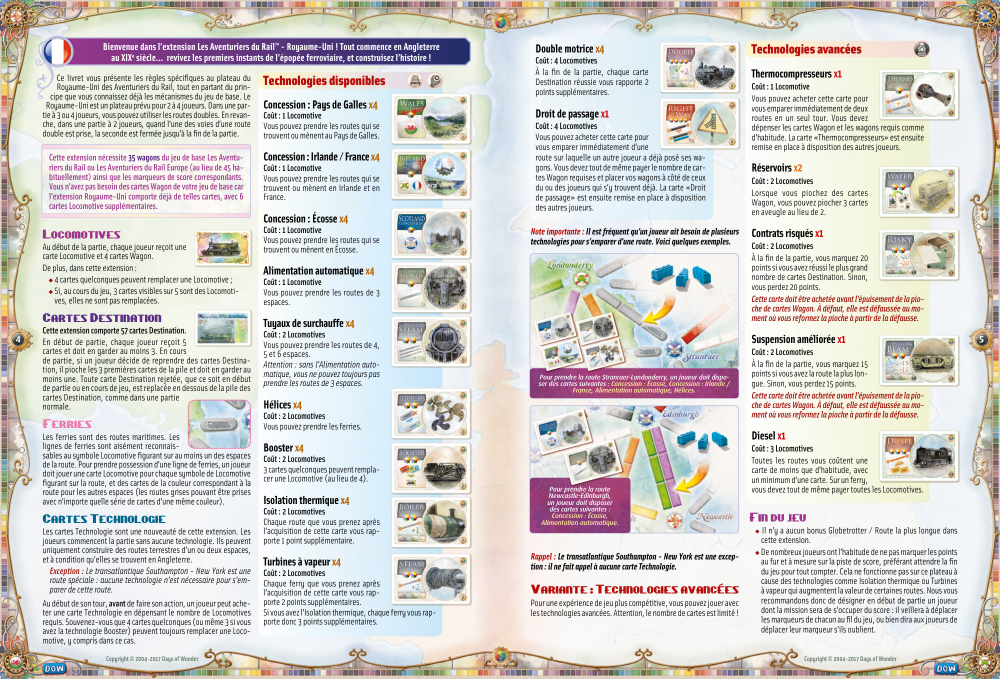

## PDF page 4

#### – Vereinigtes Königreich“ – einem Erweiterungsset für „Zug um Zug“,

#### Willkommen bei „Zug um Zug™

**das Sie in die Anfangstage der Eisenbahn versetzt. Alles begann in England, damals im 19. Jahrhundert …**

Dieses Spielregelheft beschreibt die Änderungen im Spielablauf mit dem Spielplan des Vereinigten Königreichs und setzt voraus, dass die Spieler mit der Spielregel des Grundspiels „Zug um Zug“ vertraut sind. Diese Erweiterung ist für 2 bis 4 Spieler geeignet. In einer Partie zu dritt oder viert können jeweils beide Doppelstrecken genutzt werden. Beim Spiel zu zweit kann nur eine der beiden Doppelstrecken genutzt werden. Sobald eine davon genutzt wurde, ist die andere nicht mehr verfügbar.

**Für diese Erweiterung werden 35 Waggons (statt der üblichen**

**45) und ein farblich passender Zählstein pro Spieler aus „Zug** **um Zug“ oder „Zug um Zug Europa“ benötigt. Es werden keine** **Wagenkarten aus einem dieser Originalspiele benötigt, da diese** **Erweiterung eigene Wagenkarten für das Vereinigte Königreich enthält, unter denen 6 zusätzliche Lokomotivkarten sind.**

## Lokomotiven

Zu Beginn der Partie erhält jeder Spieler eine Lokomotive, zusätzlich zu seinen üblichen vier Wagenkarten. Außerdem gilt in dieser Erweiterung: uJe 4 beliebige Wagenkarten können als Lokomotive gespielt werden. u Wenn 3 oder mehr der offen ausliegenden Karten Lokomotiven sind, werden sie NICHT abgelegt.

## Zielkarten

#### 6 Diese Erweiterung enthält 57 Zielkarten.

Zu Beginn der Partie erhält jeder Spieler 5 Zielkarten, von denen er mindestens 3 behalten muss. Wenn ein Spieler im Laufe der Partie zusätzliche Zielkarten haben möchte, zieht er 3 neue Zielkarten, von denen er mindestens 1 behalten muss. Zu Beginn oder im Laufe der Partie zurückgegebene Karten werden unter den Stapel der Zielkarten gelegt – wie in den übrigen Spielen der „Zug um Zug“-Familie.

## Fähren

Fähren sind spezielle Strecken, die zwei be- nachbarte Städte miteinander verbinden, welche durch Wasser getrennt sind. Sie sind auch an dem Lokomotivsymbol zu erkennen, das sich auf mindestens einem Feld dieser Strecken befindet. Wenn ein Spieler eine Fähre nutzen möchte, muss er eine Lokomotivkarte pro Lokomotivsymbol ausspielen, das auf dieser Strecke abgebildet ist. Für alle übrigen Felder der Strecke muss er die entsprechende Anzahl an Wagenkarten der entsprechenden Farbe abgeben.

## Technologiekarten

In dieser Erweiterung gibt es erstmalig Technologiekarten. Alle Spieler beginnen die Partie ohne Technologien und können lediglich Strecken in England der Länge 1 und 2 nutzen. Auch Fähren können noch nicht genutzt werden. _Ausnahme: Die Strecke Southampton–New York ist eine besondere_ _Strecke und darf jederzeit genutzt werden, ohne eine Technologie_ _zu benötigen._

Ein Spieler kann zu Beginn seines Zuges (noch vor seiner Aktion) Lokomotiven ablegen, um genau 1 Technologiekarte zu kaufen. Auch in diesem Fall gelten 4 beliebige Wagenkarten als Lokomotive (oder sogar 3, wenn der Spieler die Booster-Technologie hat).

# Verfügbare Technologien

### Konzession für Wales x4

#### Kosten: 1 Lokomotive

Gibt das Recht, alle Strecken von/zu den 5 Städten in Wales zu nutzen.

### Konzession für Irland/Frankreich x4

#### Kosten: 1 Lokomotive

Gibt das Recht, alle Strecken von/zu den 10 Städten in Irland und nach Frankreich zu nutzen.

### Konzession für Schottland x4

#### Kosten: 1 Lokomotive

Gibt das Recht, alle Strecken von/zu den 10 Städten in Schottland zu nutzen.

### Stoker x4

#### Kosten: 1 Lokomotive

Gibt das Recht, Strecken der Länge 3 zu nutzen.

### Dampfkessel mit Überhitzer x4

#### Kosten: 2 Lokomotiven

Gibt das Recht, Strecken der Länge 4, 5 und 6 zu nutzen. _Für Strecken der Länge 3 wird dennoch_ _die Stoker-Technologie benötigt._

### Schiffsschrauben x4

#### Kosten: 2 Lokomotiven

Gibt das Recht, Fähren zu nutzen.

### Booster x4

#### Kosten: 2 Lokomotiven

Hiermit können von nun an 3 beliebige Wagenkarten als Lokomotive gespielt werden (statt 4 wie üblich).

### Kesselisolierung x4

#### Kosten: 2 Lokomotiven

Jede genutzte Strecke bringt 1 Punkt mehr.

### Dampfturbinen x4

#### Kosten: 2 Lokomotiven

Jede genutzte Fähre bringt 2 Punkte mehr. _In Kombination mit der Kesselisolierung gibt eine genutzte Fähre sogar_ _3 Punkte mehr._

### Doppeltraktion x4

#### Kosten: 4 Lokomotiven

Bringt beim Spielende 2 Punkte für jede erfüllte Zielkarte.

### Wegerecht x1

#### Kosten: 4 Lokomotiven

Diese Karte kann gespielt werden, um eine Strecke zu nutzen, die bereits von einem anderen Spieler genutzt wurde. Die notwendigen Wagenkarten müssen wie üblich ausge- spielt werden. Die Waggons werden entlang der Strecke neben die des anderen Spielers gestellt. Es muss sofort eine Strecke genutzt werden, wenn diese Technologiekarte gekauft wird. Danach kommt sie wieder zurück und kann erneut von allen Spielern gekauft werden.

**_Wichtig: Diese Beispiele zeigen, dass ein Spieler häufig mehrere Technologien benötigt, um eine Strecke nutzen zu können._**

# Fortgeschrittene Technologien

### Dampfstrahlpumpen x1

#### Kosten: 1 Lokomotive

Erlaubt sofort 2 Strecken zu nutzen. Diese Technologie kommt danach wieder in die Auslage.

### Wassertender x2

#### Kosten: 2 Lokomotiven

Erlaubt beim Nehmen von Wagenkarten 3 Karten vom verdeckten Stapel zu ziehen (statt wie üblich 2 Karten aus der Auslage/vom Stapel).

### Riskante Verträge x1

#### Kosten: 2 Lokomotiven

Falls der Besitzer dieser Karte bei Spielende die meisten Zielkarten erfüllt hat, erhält er 20 zusätzliche Punkte. Falls nicht, verliert er 20 Punkte. _Diese Karte ist nur so lange verfügbar, bis der Stapel der_ _Wagenkarten zum ersten Mal verbraucht ist und ein neuer_ _Stapel gebildet wird. Dann kommt die Karte zurück in die_ _Spielschachtel._

### Ausgleichshebel x1

#### Kosten: 2 Lokomotiven

**7**

Falls der Besitzer dieser Karte bei Spielende die längste durchgehende Strecke geschaffen hat, erhält er 15 zusätzliche Punkte. Falls nicht, verliert er 15 Punkte. _Diese Karte ist nur so lange verfügbar, bis der Stapel der_ _Wagenkarten zum ersten Mal verbraucht ist und ein neuer_ _Stapel gebildet wird. Dann kommt die Karte zurück in die_ _Spielschachtel._

### Dieselantrieb x1

#### Kosten: 3 Lokomotiven

Wenn eine Strecke genutzt wird, kann 1 Karte weniger ausgelegt werden, als normalerweise benötigt. Es muss jedoch immer mindestens 1 Karte ausgelegt werden. Das gilt nicht für Lokomotivkarten bei Fähren, diese dürfen nicht ignoriert werden.

## Wertung

u Bei diesem Spielplan gibt es keine Bonuskarte „Globetrotter“ oder „Längste Strecke“. uEinige Spieler addieren die Punkte für die genutzten Strecken gerne am Ende einer Partie, statt es währenddessen zu machen. Das funktioniert mit diesem Spielplan nicht, weil manche Technologien (wie Kesselisolierung oder Dampfturbinen) zusätzliche Punkte für Stre-cken geben. Falls manchmal vergessen wird, Punkte für eine genutzte Strecke zu geben, empfiehlt es sich, einen „Punktewäch- ter“ zu bestimmen. Dieser Spieler bewegt die Zählsteine oder weist seine Mitspieler darauf hin, wenn sie es vergessen sollten.

_Um die Strecke Stranraer–Londonderry zu nutzen, benötigt ein Spieler_ _4 Technologien: Konzession für Schottland, Konzession für Irland/_ _Frankreich, Stoker und Schiffsschrauben._

_Für die Strecke Newcastle–_ _Edinburgh benötigt ein Spieler_ _die Konzession für Schottland_ _und den Stoker._

**_Erinnerung: Die Strecke Southampton–New York ist eine besondere Strecke und darf jederzeit genutzt werden, ohne eine Technologie zu benötigen._**

## Variante: Fortgeschrittene Technologien

Fortgeschrittene Technologien bringen mehr Wettbewerb in eine Partie. Die Anzahl dieser Technologien ist beschränkt, es gibt nur wenige von jeder Art.

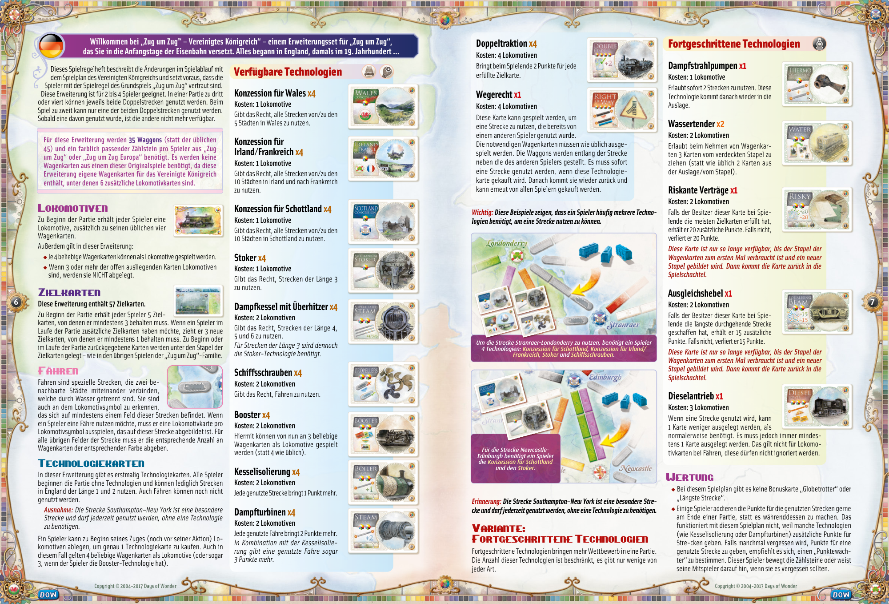

## PDF page 5

#### Reino Unido, una expansión que te transportará a los primeros

**Bienvenidos a ¡Aventureros al Tren!™ días de la aventura del ferrocarril. Todo comenzó en Inglaterra, en el siglo XIX…**

Este manual da por hecho que estás familiarizado con las reglas habituales de ¡Aventureros al Tren!, y sólo describe las diferencias de reglas específicas para jugar con el mapa de Reino Unido. Esta expansión ha sido diseñada para 2-4 jugadores. En las partidas de 3 y 4 jugadores se pueden usar los dos Recorridos Dobles. En las partidas de 2 jugadores, una vez que se cubre uno de los recorridos de un Recorrido Doble, ya no se puede cubrir el otro.

#### ¡Aventureros al Tren!™ Reino Unido es una expansión y requiere para

#### su uso de los siguientes componentes, presentes en anteriores juegos de esta línea:

u **Una reserva de 35 vagones de tren (en lugar de los habituales 45)** **y los correspondientes Marcadores de Puntuación, tomados de uno de estos juegos:**

**- ¡Aventureros al Tren!**
**- ¡Aventureros al Tren! Europa**
**No se necesitan las cartas de Tren de estos juegos, ya que esta expansión incluye un mazo de cartas de Tren completo, creado específica-** **mente para este mapa, que también incluye 6 cartas de Locomotora.**

## Locomotoras

Al principio de la partida, cada jugador recibe una Locomotora además de sus 4 cartas de Vagón. También, en esta expansión: u 4 cartas cualesquiera pueden jugarse como una Locomotora. u Cuando aparezcan 3 o más Locomotoras entre las cartas disponibles que están boca arriba, NO las descartes. **8**

## Billetes de Destino

#### Esta expansión incluye 57 Billetes de Destino.

Al principio de la partida se reparte a cada jugador 5 Billetes de Destino, de los que debe conservar al menos 3. Durante la partida, si un jugador desea robar nuevos Billetes de Destino, coge 3 y debe conservar al menos 1. Los Billetes de Destino descar- tados de este modo, ya sea al principio de la partida o al robar nuevos Billetes de Destino en el desarrollo del juego, se dejan en la parte inferior del mazo de Billetes de Destino, como en las partidas del _¡Aventureros al Tren!_ original.

## Ferrys

Los Ferrys son recorridos grises especiales que conectan dos ciudades adyacentes separadas por una masa de agua. Son fácilmente identificab- les, ya que incluyen el icono de Locomotora en al menos uno de los espacios que constituyen el recorrido. Para cubrir un Recorrido de Ferry, un jugador debe usar una carta de Locomotora por cada icono de Locomotora presente en el recorrido, y el grupo normal de cartas del color apropiado para el resto de espacios del recorrido.

## Cartas de Tecnología

Esta expansión presenta las cartas de Tecnología. Los jugadores comienzan la partida sin ninguna tecnología. Sólo pueden cubrir los recorridos de 1 y 2 espacios, y sólo pueden cubrir recorridos de Inglaterra. No pueden cubrir recorridos de Ferry. _Excepción: El recorrido Southampton – New York es especial y puede_ _cubrirse en cualquier momento y sin ninguna tecnología._

Al inicio de su turno, **antes** de llevar a cabo su acción normal, un jugador puede descartar 1 o más Locomotoras para comprar UNA carta de Tecnología. Recuerda que se pueden usar 4 cartas cualesquiera como si fuesen 1 Locomotora (o 3 si se tiene la tecnología _Elevador de presión_), incluso con este fin.

# Tecnologías disponibles

### Concesión de Gales x4

#### Coste: 1 Locomotora

Permite cubrir recorridos que lleguen hasta cualquiera de las 5 ciudades de Gales.

### Concesión de Irlanda/Francia x4

#### Coste: 1 Locomotora

Permite cubrir recorridos que lleguen hasta cualquiera de las 10 ciudades de Irlanda y hasta Francia.

### Concesión de Escocia x4

#### Coste: 1 Locomotora

Permite cubrir recorridos que lleguen hasta cualquiera de las 10 ciudades de Escocia.

### Fogonero mecánico x4

#### Coste: 1 Locomotora

Permite cubrir recorridos de 3 espacios.

### Caldera de vapor sobrecalentado x4

#### Coste: 2 Locomotoras

Permite cubrir recorridos de 4, 5 y 6 espacios. _Sigue siendo necesario el Fogonero_ _mecánico para cubrir recorridos de 3 espacios._

### Árboles propulsores x4

#### Coste: 2 Locomotoras

Permite cubrir recorridos de Ferry.

### Elevador de presión x4

#### Coste: 2 Locomotoras

Permite usar 3 cartas cualesquiera (en lugar de 4) como Locomotora.

### Caldera con revestimiento calorífugo x4

#### Coste: 2 Locomotoras

Cada recorrido cubierto proporciona 1 punto adicional.

### Turbinas de vapor x4

#### Coste: 2 Locomotoras

Cada recorrido de Ferry cubierto proporciona 2 puntos adicionales. _Cuando se combina con la Caldera con_ _revestimiento calorífugo, los recorridos de Ferry proporcio-_ _nan 3 puntos (en lugar de 2)._

### Doble tracción x4

#### Coste: 4 Locomotoras

Al final de la partida, cada Billete de Destino completado proporciona 2 puntos adicionales.

### Derecho de paso x1

#### Coste: 4 Locomotoras

Permite cubrir un recorrido que ya ha sido cubierto por otro jugador. Al jugar esta carta también se deben jugar el número necesario de cartas para cubrir el recorrido, como es habitual. Simplemente se colocan los trenes del jugador que use esta carta junto a los del jugador que ya había cubierto el recorrido. Cuando un jugador coge esta carta debe cubrir el recorrido inmediatamente, y después devolver esta carta a la mesa, para que pueda ser adquirida por otro jugador.

#### Importante: En muchas ocasiones, un jugador necesitará varias cartas de Tec-

#### nología para cubrir un recorrido, como se puede observar en estos ejemplos.

# Tecnologías avanzadas

### Termocompresores x1

#### Coste: 1 Locomotora

Permite cubrir 2 recorridos en un mismo turno. Esta carta se devuelve a la mesa después de usarse.

### Ténder de agua x2

#### Coste: 2 Locomotoras

Permite robar 3 cartas (en lugar de 2) al robar cartas de Vagón.

### Contratos arriesgados x1

#### Coste: 2 Locomotoras

Al final de la partida, proporciona 20 puntos si el jugador que la posee es el que ha completado más Billetes de Destino. En caso contrario, resta 20 puntos. _Esta carta debe comprarse antes de que se vuelvan a barajar_ _las cartas de Vagón. Una vez que se han vuelto a barajar, esta_ _carta se devuelve a la caja y no puede ser comprada._

### Eje de equilibrio x1

#### Coste: 2 Locomotoras

Al final de la partida, proporciona 15 puntos si el jugador que la posee el que tiene la ruta continua más larga. En caso cont-**9** rario, pierde 15 puntos. _Esta carta debe comprarse antes de que se vuelvan a barajar_ _las cartas de Vagón. Una vez que se han vuelto a barajar, esta_ _carta se devuelve a la caja y no puede ser comprada._

### Motor diésel x1

#### Coste: 3 Locomotoras

Permite cubrir un recorrido con 1 carta menos de las requeridas. Sigue siendo obligatorio jugar al menos 1 carta, y no se puede ignorar una Locomotora en un recorrido de Ferry.

_Si un jugador quiere cubrir el recorrido de Stranraer a Londonderry,_ _necesitaría la carta de Concesión de Escocia, la carta de Concesión_ _de Irlanda/Francia, la carta de Fogonero mecánico y la carta de_ _Árboles propulsores._

_el recorrido de Newcastle a_ _Si un jugador quiere cubrir_

_Edinburgh, necesitaría la carta_ _de Concesión de Escocia y la_ _carta de Fogonero mecánico._

**_Recordatorio: El recorrido Southampton – New York es especial y puede cubrirse en cualquier momento y sin ninguna tecnología._**

## Variante: Tecnologías avanzadas

Para disfrutar de una experiencia más competitiva, se pueden añadir las tecnologías avanzadas. Ten en cuenta que el número de tecnologías avanzadas es limitado.

## Final del juego

u En esta expansión no hay Premio de “Ruta Continua Más Larga” ni “Mayor Número de Billetes Completados”. u A algunos jugadores les gusta sumar los puntos de los recorridos que cubren al final de la partida, en lugar de cada vez que cubren un nuevo recorrido. Dado que la puntuación de algunos recorridos puede verse afectada por tecnologías como _Caldera con revestimiento calorífugo_ o las _Turbinas de vapor_, no es conveniente esperar hasta el final para sumar los puntos si se está usando esta expansión. Si crees que es probable que os olvidéis de anotar los puntos inmediatamente después de cubrir un recorrido, os recomendamos que designéis a un jugador como encargado de la puntuación, y que sea este quien mueva los Marcadores de Puntuación a lo largo de toda la partida, o al menos quien avise a los jugadores que olviden sumar sus puntos.

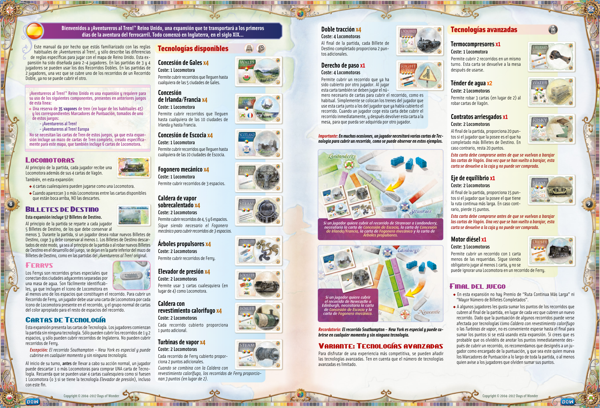

## PDF page 6

#### Regno Unito-un’espansione di Ticket to Ride che vi permetterà di rivivere

**Benvenuti a Ticket to Ride® gli albori dell’avventura ferroviaria. Tutto ebbe inizio nell’Inghilterra del 19° secolo...**

Questo regolamento descrive i cambiamenti specifici al sistema di gioco per la Mappa del Regno Unito e presume che tu conosca già le regole presentate per la prima volta nella versione originale di Ticket to Ride. Questa espansione è concepita per 2-4 giocatori. Nelle partite a 3 e 4 giocatori, i giocatori possono usare entrambe le Doppie Linee. Nelle partite a 2 giocatori, una volta che è stato preso il controllo di una delle due linee, l’altra non sarà più disponibile.

**Per giocare con questa espansione servono solo 35 Vagoni (anziché** **i consueti 45) e i corrispettivi Segnapunti prelevati da Ticket to Ride** **o Ticket to Ride Europa. Non vanno usate le carte Treno del gioco** **originale, in quanto questa espansione contiene un mazzo di carte** **Treno specifico per il Regno Unito che include 6 carte Locomotiva extra.**

## Locomotive

All’inizio della partita, ogni giocatore riceve una Locomotiva in aggiunta alle sue 4 carte Treno. Inoltre, in questa espansione: u 4 carte qualsiasi possono essere giocate come una Locomotiva; u Quando 3 o più Locomotive compaiono tra le carte disponibili a faccia in su, NON vanno scartate.

## Biglietti Destinazione

#### Questa espansione include 57 Biglietti Destinazione.

**10** All’inizio della partita, ogni giocatore riceve 5 Biglietti Destinazione, di cui deve tenerne almeno 3. Durante la partita, se un giocatore desidera pescare ulteriori Biglietti Destinazione, ne pesca 3 e deve tenerne almeno 1. I Biglietti Destinazione che non tiene, sia all’inizio della partita che a seguito di una nuova pesca durante la partita, vengono scartati in fondo al mazzo dei Biglietti Destinazione, come nelle regolari partite di Ticket to Ride.

## Traghetti

I traghetti sono linee speciali che collegano due città adiacenti attraverso una massa d’acqua. Sono facilmente riconoscibili dall’icona o dalle icone Locomotiva presenti su almeno una delle caselle che compongono la linea. Per prendere il controllo di una Linea Traghetto, un giocatore deve giocare una carta Locomotiva per ogni simbolo Locomotiva presente sulla linea e la consueta serie di carte del colore appropriato per le caselle rimanenti su quella Linea Traghetto.

## Carte Tecnologia

Questa espansione introduce nel gioco le carte Tecnologia. I giocatori iniziano la partita privi di Tecnologie. Possono prendere il controllo solo delle linee lunghe 1 o 2 caselle e solo di quelle che si trovano in Inghilterra. Non possono prendere il controllo delle Linee Traghetto. _Eccezione: La linea Southampton-New York è una linea speciale di_ _cui è possibile prendere il controllo in qualsiasi momento e senza_ _bisogno di nessuna Tecnologia._

All’inizio del suo turno, prima di effettuare la sua azione regolare, un giocatore può scartare un certo numero di Locomotive per acquistare UNA carta Tecnologia. Occorre ricordare che è possibile usare 4 carte qualsiasi al posto di una Locomotiva (o 3 carte qualsiasi se si possiede la Tecnologia Potenziatore), anche in questa occasione.

# Tecnologie Disponibili

### Concessione del Galles x4

#### Costo: 1 Locomotiva

Ti consente di prendere il controllo delle linee collegate alle 5 città del Galles.

### Concessione di Irlanda/Francia x4

#### Costo: 1 Locomotiva

Ti consente di prendere il controllo delle linee collegate alle 10 città dell’Irlanda e della Francia.

### Concessione della Scozia x4

#### Costo: 1 Locomotiva

Ti consente di prendere il controllo delle linee collegate alle 10 città della Scozia.

### Alimentatore Meccanico x4

#### Costo: 1 Locomotiva

Ti consente di prendere il controllo delle linee lunghe 3 caselle.

### Caldaia a Vapore Surriscaldata x4

#### Costo: 2 Locomotive

Ti consente di prendere il controllo delle linee lunghe 4, 5 e 6 caselle. _È comunque necessario avere l’Alimentatore Meccanico_ _per prendere il controllo delle linee lunghe 3 caselle._

### Propellente x4

#### Costo: 2 Locomotive

Ti consente di prendere il controllo delle Linee Traghetto.

### Potenziatore x4

#### Costo: 2 Locomotive

Ora puoi usare 3 carte qualsiasi al posto di una Locomotiva (anziché le 4 normali).

### Caldaia Termoisolata x4

#### Costo: 2 Locomotive

Guadagni 1 punto extra per ogni linea di cui prendi il controllo.

### Turbine a Vapore x4

#### Costo: 2 Locomotive

Guadagni 2 punti extra per ogni Linea Traghetto di cui prendi il controllo. _In combinazione con la Caldaia Termoisolata, guadagni 3 punti extra per ogni Linea Traghetto di_ _cui prendi il controllo._

### Testata Rinforzata x4

#### Costo: 4 Locomotive

Alla fine della partita, guadagni 2 punti per ogni Biglietto Destinazione che hai completato.

### Diritto di Transito x1

#### Costo: 4 Locomotive

Puoi giocare questa carta per prendere il controllo di una linea di cui un altro giocatore ha già preso il controllo. Quando giochi questa carta devi comunque giocare il numero richiesto di carte per prendere il controllo di quella linea. Non devi fare altro che collocare i tuoi vagoni accanto ai vagoni dell’altro giocatore. Devi immediatamente prendere il controllo della linea quando prendi questa carta, e dopo che hai preso il controllo della linea devi rimettere la carta nella riserva delle Tecnologie, affinché possa essere presa da un altro giocatore.

#### Nota Importante: In molte occasioni un giocatore avrà bisogno di varie carte

#### Tecnologia per prendere il controllo di una linea. Vedi gli esempi sottostanti.

# Tecnologie Avanzate

### Termocompressori x1

#### Costo: 1 Locomotiva

Prendi il controllo di 2 linee in questo turno, poi rimetti questa carta nella riserva delle Tecnologie.

### Cisterne d’Acqua x2

#### Costo: 2 Locomotive

Quando peschi carte Treno, puoi decidere di pescare 3 carte alla cieca anziché le 2 regolari.

### Contratti Rischiosi x1

#### Costo: 2 Locomotive

Alla fine della partita, guadagni 20 punti se possiedi il maggior numero di Biglietti completati. Altrimenti perdi 20 punti. _Questa carta deve essere acquistata prima che le carte_ _Treno siano rimescolate. Fatto questo, questa carta non_ _può essere acquistata e deve essere rimessa nella scatola._

### Traversine Equalizzanti x1

#### Costo: 2 Locomotive

Alla fine della partita guadagni 15 punti se possiedi il Percorso Continuo Più **11** Lungo. Altrimenti perdi 15 punti. _Questa carta deve essere acquistata prima che le Carte_ _Treno siano rimescolate. Fatto questo, questa carta non_ _può essere acquistata e deve essere rimessa nella scatola._

### Alimentazione Diesel x1

#### Costo: 3 Locomotive

Quando prendi il controllo di una linea, puoi giocare 1 carta in meno di quanto richiesto. Devi comunque giocare almeno 1 carta e non puoi ignorare un’icona Locomotiva su una Linea Traghetto.

## Calcolare il Punteggio

u Non sono previsti bonus Globetrotter o per il Percorso Continuo Più Lungo in questa espansione. u Ad alcuni giocatori piace sommare i punti delle linee di cui prendono il controllo direttamente alla fine della partita, anziché farlo man mano che ne assumono il controllo. Dal momento che il punteggio di alcune linee può essere influenzato da tecnologie come Caldaia Termoisolata o Turbine a Vapore, attendere la fine della partita per calcolare i punti delle linee non funziona in questa espansione. Se rischi di dimenticare di calcolare immediatamente il punteggio delle linee quando ne prendi il controllo, ti consigliamo di scegliere un giocatore che svolga il ruolo di segnapunti: sarà lui a muovere tutti i Segnapunti nel corso della partita, o quantomeno a incoraggiare gli altri giocatori a farlo quando se ne dimenticano.

_Se un giocatore vuole prendere il controllo della linea da Stranraer_ _a Londonderry, avrà bisogno della carta Concessione della Scozia,_ _della carta Concessione di Irlanda/Francia, della carta Alimentatore_ _Meccanico e della carta Propellente._

_Se un giocatore vuole prendere_

_Newcastle a Edimburgo,avrà_ _il controllo della linea da_

_bisogno della carta Concessione_ _della Scozia e della carta_ _Alimentatore Meccanico._

#### Promemoria: La linea Southampton-New York è una linea speciale di cui

#### è possibile prendere il controllo in qualsiasi momento e senza il bisogno di nessuna Tecnologia.

## Variante: Tecnologie Avanzate

È possibile aggiungere alla partita le Tecnologie Avanzate per un’esperienza di gioco più competitiva. Ricorda che il numero delle Tecnologie Avanzate è limitato.

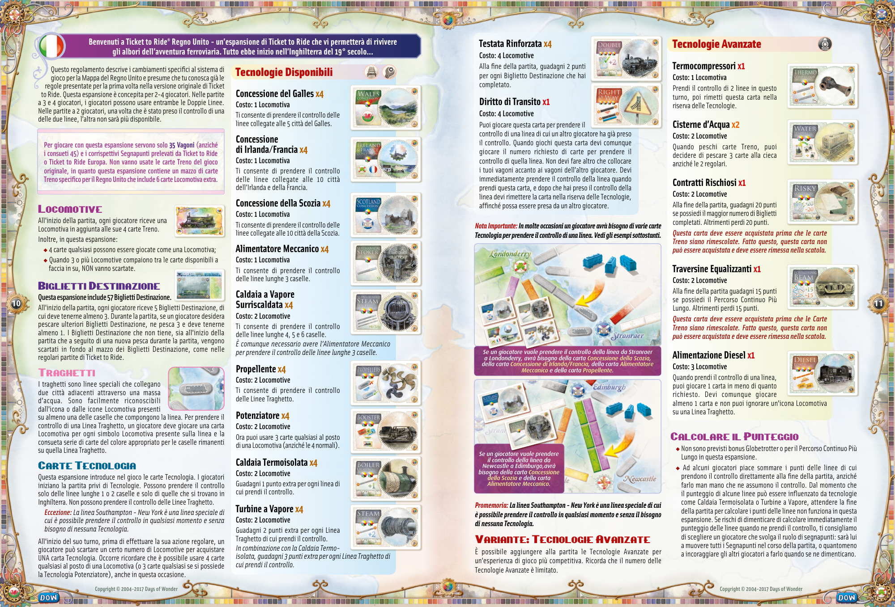

## PDF page 7

**Welkom bij Ticket to Ride Verenigd Koninkrijk-een Ticket to Ride-uitbreiding waarin je de eerste dagen van het** **spoorwegavontuur opnieuw beleeft. Het begon allemaal in Engeland, in de 19de eeuw…**

In deze spelregels worden de spelwijzigingen beschreven die van toepassing zijn wanneer je op de kaart van het Verenigd Koninkrijk speelt. Je wordt daarbij verondersteld de regels te kennen van de originele Ticket to Ride-spellen. Deze uitbreiding werd speciaal ontworpen voor 2 tot 4 spelers. In een spel met 3 of 4 spelers kunnen beide sporen van een dubbele route geclaimd worden. In een spel met 2 spelers kan maar één route geclaimd worden. Zodra dit gebeurt, is de andere route afgesloten voor alle andere spelers.

**Voor deze uitbreiding heb je maar 35 treinen (in plaats van de gebruikelijke 45) en de overeenkomstige scorepionnen van Ticket to Ride of** **Ticket to Ride Europa nodig. Je hebt de treinkaarten van je originele spel** **niet nodig omdat deze uitbreiding voorzien is van een volledige stapel** **treinkaarten specifiek voor het Verenigd Koninkrijk met 6 extra loco- motiefkaarten.**

## Locomotieven

Aan het begin van het spel krijgt elke speler een locomotiefkaart samen met zijn 4 treinkaarten. Verder geldt voor deze uitbreiding: u Een combinatie van 4 willekeurige kaarten kan ingezet worden als locomotief; u Als er 3 of meer locomotieven open liggen tussen de beschikbare kaarten, dan hoef je deze NIET af te leggen.

## Bestemmingskaarten

#### Deze uitbreiding bevat 57 bestemmingskaarten.

**12** Bij het begin van het spel krijgt elke speler 5 bestemmingskaarten waarvan hij er minstens 3 moet houden. Als een speler in de loop van het spel extra bestemmingskaarten wil trekken, trekt hij er 3 van de stapel en moet hij er minstens één van houden. Bestemmingskaarten die aan het begin van het spel of bij het trekken van nieuwe bestemmingskaarten tijdens het spel afgelegd worden, moeten net als in een regulier Ticket to Ride-spel onderaan de stapel bestemmingskaarten geplaatst worden.

## Veerboten

Veerboten zijn speciale routes tussen twee aangrenzende steden over een stuk water. Je kunt ze gemakkelijk herkennen aan het locomotief-symbool op minstens één van de vakjes op de route. Om een veerbootroute te claimen moet een speler een locomotiefkaart spelen voor elk locomotief-symbool op de route, plus de gebruikelijke kaartenset met de juiste kleur voor het resterende deel van de veerbootroute.

## Technologiekaarten

Deze uitbreiding brengt technologiekaarten in het spel. De spelers beginnen het spel zonder enige technologie. Ze kunnen alleen routes met 1 en 2 vakjes claimen en ze kunnen alleen routes in Engeland claimen. Ze kunnen geen veerbootroutes claimen. _Uitzondering: De route Southampton-New York is een speciale route._ _De spelers kunnen op elk moment en zonder enige technologie deze_ _route claimen._ Aan het begin van zijn beurt en voor het uitvoeren van een gewone actie, mag een speler locomotieven afleggen om een ENKELE tech- nologiekaart te kopen. Vergeet niet dat je 4 willekeurige kaarten kunt gebruiken als een locomotief (of 3 willekeurige kaarten als je de Booster technologie hebt), zelfs in dit geval.

# Beschikbare technologieën

### Wales concessie x4

#### Kostprijs: 1 locomotief

Geeft je de mogelijkheid om routes te claimen naar één van de 5 steden in Wales.

### Ierland/Frankrijk concessie x4

#### Kostprijs: 1 locomotief

Geeft je de mogelijkheid om routes te claimen naar één van de 10 steden in Ierland en Frankrijk.

### Schotland concessie x4

#### Kostprijs: 1 locomotief

Geeft je de mogelijkheid om routes te claimen naar één van de 10 steden in Schotland.

### Mechanische stoker x4

#### Kostprijs: 1 locomotief

Geeft je de mogelijkheid om routes te claimen met 3 vakjes.

### Oververhitte stoomketel x4

#### Kostprijs: 2 locomotieven

Geeft je de mogelijkheid om routes te claimen met 4, 5 en 6 vakjes. Je hebt nog altijd de Mechanische stoker nodig om routes met 3 vakjes te claimen.

### Schroeven x4

#### Kostprijs: 2 locomotieven

Geeft je de mogelijkheid om veerbootroutes te claimen.

### Booster x4

#### Kostprijs: 2 locomotieven

Je mag nu 3 willekeurige kaarten gebruiken als een locomotief (in plaats van de normale 4).

### Ketelbekleding x4

#### Kostprijs: 2 locomotieven

Je scoort 1 extra punt voor elke route die je claimt.

### Stoomturbines x4

#### Kostprijs: 2 locomotieven

Je scoort 2 extra punten voor elke veerbootroute die je claimt. In combinatie met een Ketelbekleding scoor je 3 punten voor elke veerbootroute die je claimt.

### Voorspan x4

#### Kostprijs: 4 locomotieven

Aan het einde van het spel scoor je 2 punten voor elke bestemmingskaart die je behaald hebt.

### Recht van doorgang x1

#### Kostprijs: 4 locomotieven

Je mag deze kaart spelen om een route te claimen die een andere speler al geclaimd heeft. Als je deze kaart speelt, moet je alsnog het juiste aantal kaarten spelen om de route te claimen. Plaats gewoon je treintjes op de route, naast de treintjes van de andere speler. Als je deze kaart neemt, moet je de route onmiddellijk claimen. Na het claimen van de route leg je de kaart weer op de tafel, zodat een andere speler deze kan nemen.

**_Belangrijke opmerking: een speler zal vaak meerdere technologiekaarten nodig hebben om een route te kunnen claimen. Zie voorbeelden hieronder._**

# Geavanceerde technologieën

### Thermocompressors x1

#### Kostprijs: 1 locomotief

Claim tijdens deze beurt 2 routes en geef dan deze kaart terug.

### Watertenders x2

#### Kostprijs: 2 locomotieven

Bij het trekken van treinkaarten kun je besluiten om 3 gesloten kaarten te trekken in plaats van de gebruikelijke 2.

### Riskante contracten x1

#### Kostprijs: 2 locomotieven

Aan het einde van het spel scoor je 20 punten als je het grootste aantal bestemmingskaarten behaald hebt. Als dit niet het geval is, dan verlies je 20 punten. _Deze kaart moet worden gekocht voordat de treinkaarten_ _opnieuw geschud worden. Zodra de treinkaarten opnieuw_ _geschud zijn, kunnen deze kaarten niet meer worden gekocht_ _en moeten ze weer in de doos worden gelegd._

### Evenwichtsboom x1

#### Kostprijs: 2 locomotieven

Aan het einde van het spel scoor je 15 punten als je de langste route hebt. Als dit niet het geval is, verlies je 15 punten. **13**

_Deze kaart moet worden gekocht voor de treinkaarten opnieuw_ _geschud worden. Zodra de treinkaarten opnieuw geschud zijn,_ _kunnen deze kaarten niet meer worden gekocht en moeten ze_ _weer in de doos worden gelegd._

### Dieselaandrijving x1

#### Kostprijs: 3 locomotieven

Bij het claimen van een route mag je 1 kaart minder spelen dan nodig. Je moet alsnog minstens 1 kaart spelen en je kunt geen locomotief negeren op een veerbootroute.

_claimen, dan heeft hij de Schotland concessiekaart, de Ierland/_ _Als een speler de route van Stranraer naar Londonderry wil_

_Frankrijk concessiekaart, de Mechanische stokerkaart en de_ _Schroevenkaart nodig._

_Als een speler de route van_ _Newcastle naar Edinburgh_ _wil claimen, dan heeft hij de_ _Schotland concessiekaart en de_ _Mechanische stokerkaart nodig._

#### Vergeet niet: De route Southampton-New York is een speciale route.

#### De spelers kunnen op elk moment en zonder enige technologie deze route claimen.

## Variant: Geavanceerde technologieën

Je kunt geavanceerde technologieën toevoegen om meer concurrentie toe te voegen aan het spel. Hou er rekening mee dat het aantal geavanceerde technologieën beperkt is.

## Score

u In deze uitbreiding is er geen sprake van een Globetrotter of Langste Route bonus. u Sommige spelers tellen graag hun punten voor de routes die ze geclaimd hebben aan het einde van het spel en niet telkens als ze een route claimen. De score voor sommige routes kan echter worden be- ïnvloed door technologieën zoals de Ketelbekleding of de Stoomturbines. Wachten tot aan het einde van het spel om de routepunten te berekenen werkt dus niet in deze uitbreiding. Als je de neiging zou hebben om te vergeten onmiddellijk je score te bepalen voor de routes die je claimt raden we aan om een speler aan te wijzen voor het bijhouden van de scores. Laat hem alle scorepionnen verplaatsen tijdens het spel of laat hem de spelers eraan herinneren dat ze dit zelf moeten doen.

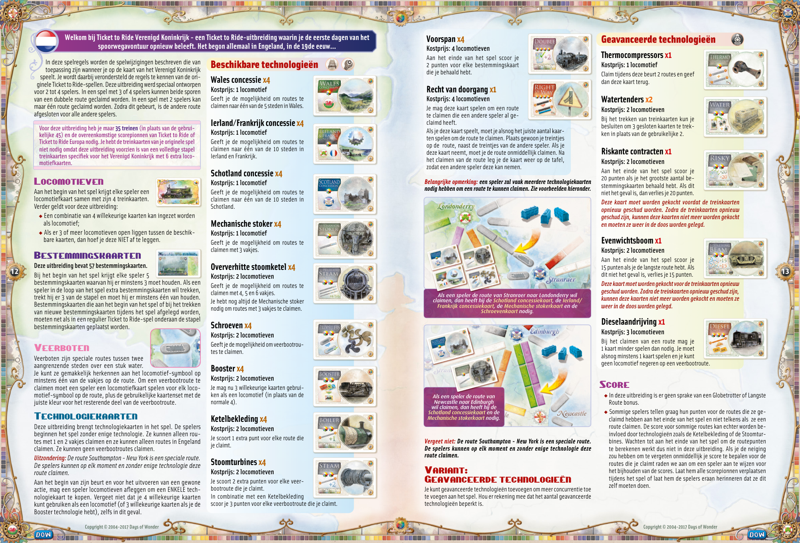

## PDF page 8

**Tervetuloa! Menolippu Englanti on on Menolipun lisäosa, joka vie sinut rautateiden alkuaikoihin. Rautateiden nousu alkoi Englannissa jo 1800-luvulla...**

Nämä säännöt selittävät Yhdistyneen kuningaskunnan kart- taan liittyvät säännöt ja olettavat, että tunnet alkuperäisen Menolipun säännöt. Lisäosa on suunniteltu 2–4 pelaajalle. Kolmin- ja nelinpeleissä pelaajat voivat rakentaa tuplareittien molemmat radat. Kaksinpeleissä tuplareiteistä saa rakentaa vain toisen radan.

**Lisäosan pelaamiseen tarvitaan vain 35 vaunua (tavallisen 45:n sijasta) ja pelaajien pistemerkit joko Menolipusta tai Meno-**

#### lippu Euroopasta. Peruspelin vaunukortteja ei tarvita, koska li-säosassa on oma vaunukorttipakka, jossa on kuusi ylimää-

**räistä veturikorttia.**

## Veturit

Pelin alussa jokainen pelaaja saa veturin neljän vaunukortin lisäksi. Lisäksi: u Mitkä tahansa neljä korttia voi pelata veturina; u Kun avoimissa korteissa on näkyvillä vähintään kolme veturia, niitä EI heitetä pois.

## Menoliput

#### Tämä laajennusosa sisältää 57 menolippua.

**14** Pelin alussa jokaiselle pelaajalle jaetaan 5 menolippua, joista on pidettävä vähintään 3. Pelin aikana, jos pelaaja haluaa nostaa lisää menolippuja, hän nostaa 4, joista on pidettävä vähintään 1. Ne menoliput, joita pelaaja ei pidä pelin alussa tai nostaessaan uusia menolippuja pelin kuluessa, viedään nostopakan pohjalle aivan kuten Menolippu peruspelissäkin.

## Lautat

Lautat ovat reittejä, jotka yhdistävät kaksi kaupunkia veden poikki. Ne on helppo tunnistaa reitillä olevista veturimerkeistä. Lauttayhteyden rakentamiseksi pelaajan on pelattava vähintään niin monta veturikorttia kuin reitillä on veturin kuvia. Muuten reitti rakennetaan tavalliseen tapaan.

## Teknologiakortit

Tämä lisäosa tuo peliin teknologiakortit. Pelaajat aloittavat pelin ilman teknologiakortteja, joten he voivat rakentaa vain yhden tai kahden ruudun reittejä ja vain Englannissa. Lauttareittejä ei voi rakentaa.

_Poikkeus: Southampton – New York -reitti on erikoisreitti, jonka_ _voi rakentaa koska tahansa ilman mitään teknologiaa._

Vuoron alussa, ennen tavallista toimintoa, pelaaja voi heittää pois vetureita ja ostaa YHDEN teknologiakortin. Muistakaa, että mitkä tahansa neljäkorttia (kolme korttia, jos pelaajalla on Kiihdytin) ovat yksi veturi, myös tässä tarkoituksessa.

# Teknologiat

### Walesin toimilupa x4

#### Hinta: 1 veturi

Voit rakentaa reittejä Walesin kaupunkeihin.

### Irlannin ja Ranskan toimilupa x4

#### Hinta: 1 veturi

Voit rakentaa reittejä Irlannin ja Ranskan kaupunkeihin.

### Skotlannin toimilupa x4

#### Hinta: 1 veturi

Voit rakentaa reittejä Skotlannin kaupunkeihin.

### Mekaaninen lämmittäjä x4

#### Hinta: 1 veturi

Voit rakentaa kolmen ruudun reittejä.

### Tulistinhöyryveturi x4

#### Hinta: 2 veturia

Voit rakentaa 4–6 ruudun reittejä. _Tarvitset edelleen mekaanisen lämmittäjän kolmen ruudun reittien rakentamiseen._

### Potkurit x4

#### Hinta: 2 veturia

Voit rakentaa lauttareittejä.

### Kiihdytin x4

#### Hinta: 2 veturia

Voit käyttää kolmea mitä tahansa korttia veturina (tavallisen neljän sijasta).

### Boilerin eristys x4

#### Hinta: 2 veturia

Saat lisäpisteen jokaisesta reitistä, jonka rakennat.

### Höyryturbiinit x4

#### Hinta: 2 veturia

Saat kaksi lisäpistettä jokaisesta lauttareitistä, jonka rakennat. _Jos sinulla on myös Boilerin eristys, saat_ _kolme pistettä jokaisesta lauttareitistä, jonka rakennat._

### Kaksinveto x4

#### Hinta: 2 veturia

Saat pelin lopussa kaksi pistettä jokaisesta matkalipusta, jotka saat valmiiksi.

### Etuoikeus x1

#### Hinta: 4 veturia

Voit pelata tämän kortin rakentaak- sesi reitin, jonka toinen pelaaja on jo rakentanut. Sinun täytyy silti pelata oikeat kortit reitin rakentamiseksi. Laita omat vaunusi toisen pelaajan vaunujen viereen. Kun otat tämän kortin, sinun on heti rakennettava reitti, jonka jälkeen pa- lautat tämän kortin pöydälle, jotta joku toinen pelaaja voi ottaa sen.

#### Tärkeä huomio: Pelaajat tarvitsevat usein monta teknologiakorttia reitin rakentamiseen. Katsokaa esimerkkejä alla:

# Kehittyneet teknologiat

### Termokompressorit x1

#### Hinta: 1 veturi

Rakenna kaksi reittiä tällä vuorolla ja palauta sitten tämä kortti.

### Vesitenderit x2

#### Hinta: 2 veturia

Kun nostat vaunukortteja, saat nostaa kolme korttia sokkona tavallisen kahden sijasta.

### Riskisopimukset x1

#### Hinta: 2 veturia

Saat pelin lopussa 20 pistettä, jos sinulla on eniten suoritettuja matka- lippuja. Jos sinulla ei ole eniten lip- puja, menetät 20 pistettä. _Tämä kortti on ostettava ennen vaunukorttien sekoitta-_ _mista. Kun vaunukortit on sekoitettu, korttia ei voi enää_ _nostaa ja se palautetaan laatikkoon._

### Tasapainopalkki x1

#### Hinta: 2 veturia

Saat pelin lopussa 15 pistettä, jos **15** sinulla on pisin reitti. Jos sinulla ei ole pisintä reittiä, menetät 15 pistettä. _Tämä kortti on ostettava ennen vaunukorttien sekoitta-_ _mista. Kun vaunukortit on sekoitettu, korttia ei voi enää_ _nostaa ja se palautetaan laatikkoon._

### Dieselmoottorix1

#### Hinta: 3 veturia

Kun rakennat reitin, voit pelata yhden kortin vähemmän kuin vaaditaan. Sinun on silti pelattava vähintään yksi kortti, etkä voi jättää huomioimatta lauttareitin vetureita.

## Pisteenlasku

u Tässä lisäosassa ei ole Globetrotter- tai Pisin reitti -bonusta. u Jotkut laskevat reittien pisteet pelin lopussa mieluummin kuin pelin aikana. Koska Boilerin eristys ja Höyryturbiinit -teknologiat voivat vaikuttaa reittien pisteytykseen, reitit täytyy pisteyttää pelin aikana tässä lisäosassa. Jos arvelette, että pisteytyksen muistaminen on vaikeaa, nimittäkää yksi pelaajista pisteenlaskijaksi, jonka tehtävänä on huolehtia, että kaikki muistavat pisteyttää reittinsä heti kun ne rakennetaan.

_Jos pelaaja haluaa rakentaa reitin Stranraerista Londonderryyn,_ _hän tarvitsee Skotlannin toimiluvan, Irlannin ja Ranskan toimiluvan,_ _mekaanisen lämmittäjän ja potkurit._

_Jos pelaaja haluaa rakentaa_ _reitin Newcastlesta_ _Edinburghiin, hän tarvitsee_ _Skotlannin toimiluvan ja_ _mekaanisen lämmittäjän._

**_Muistutus: Southampton – New York -reitti on erikoisreitti, jonka voi rakentaa koska tahansa ilman mitään teknologiaa._**

## Muunnelma: Kehittyneet teknologiat

Kehittyneet teknologiat tekevät pelistä kilpailullisemmin. Huomat- kaa, että näitä teknologioita on rajallinen määrä.

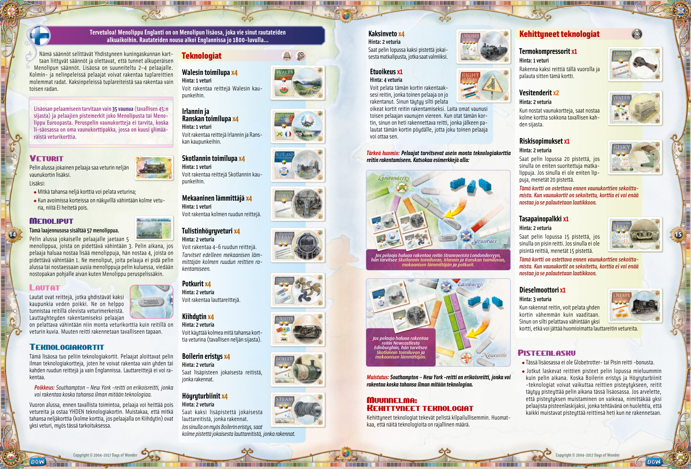

## PDF page 9

#### United Kingdom – en Ticket to Ride-udvidelse, der lader dig spille din vej

**Velkommen til Ticket to Ride® igennem jernbaneeventyrets spæde start. Det hele begyndte i England tilbage i det 19. århundrede...**

Reglerne i dette hæfte beskriver hvordan spillet på United Kingdom-kortet adskiller sig fra det normale spil og forudsætter, at du allerede er bekendt med reglerne i det originale Ticket to Ride. Denne udvidelse kan spilles af 2-4 personer. I et spil med 3 eller 4 spillere kan begge spor bruges på de dobbelte strækninger. I et spil med 2 spillere kan kun et af de 2 spor på en dobbeltstrækning bruges.

#### For at spille denne udvidelse skal du kun bruge 35 togvogne (i

**stedet for 45 som normalt) og den tilhørende pointmarkør fra enten Ticket to Ride eller Ticket to Ride Europe. Togvognskortene**

#### fra det originale spil skal ikke bruges, da der i denne udvidelse

**er et komplet sæt af togvognskort lavet specifikt til denne udvidelse. Sættet indeholder 6 ekstra lokomotivkort.**

## Lokomotiver

Ved spillets start får hver spiller, ud over de 4 togvognskort, også et lokomotivkort. I udvidelsen gælder følgende: u 4 vilkårlige kort kan spilles som et lokomotivkort. u Når 3 eller flere lokomotivkort ligger med billedsiden opad og kan vælges, skal kortene IKKE lægges i brugtbunken.

## Rutekort

#### Denne udvidelse indeholder 57 rutekort.

**16** Hver spiller får 5 rutekort i starten af spillet, som han skal beholde mindst 3 af. Ønsker spilleren i løbet af spillet at trække flere rutekort, skal han trække 3 og beholde mindst 1. Rutekort, som ikke vælges, enten i starten af spillet eller når en spiller trækker flere rutekort i løbet af spillet, skal lægges i bunden af bunken med rutekort, som i et normalt spil Ticket to Ride.

## Færger

Færger er specielle strækninger, der for- binder 2 byer på tværs af vand. Disse gen- kendes let ved lokomotivikonet/-ikonerne, som kan ses på mindst et af felterne på strækningen. For at gøre krav på en strækning skal spilleren spille et lokomotivkort for hvert lokomotivsymbol på strækningen samt det påkrævede antal togvognskort i den korrekte farve for de øvrige felter på færgestrækningen.

## Teknologikort

Denne udvidelse indeholder teknologikort. Spillerne starter spillet uden teknologi og kan kun gøre krav på strækninger med 1 eller 2 felter og kun strækninger i England. Færgestrækninger kan ikke benyttes.

_Undtagelse: Strækningen Southampton – New York er en speciel_ _strækning, som man kan gøre krav på når som helst uden teknologi._

I starten af sin tur, inden spilleren gør andet, må han bruge lokomotivkort til at købe ET teknologikort. Lokomotivkortene lægges i brugtbunken. Husk, at også her kan 4 vilkårlige kort bruges som et lokomotivkort (eller 3 kort hvis du har teknologikortet Booster).

# Tilgængelige teknologikort

### Wales Concession x4

#### Pris: 1 lokomotivkort

Du må nu gøre krav på strækninger ind i de 5 byer i Wales.

### Ireland / France Concession x4

#### Pris: 1 lokomotivkort

Du må nu gøre krav på strækninger ind i de 10 byer i Irland og ind i Frankrig.

### Scotland Concession x4

#### Pris: 1 lokomotivkort

Du må nu gøre krav på strækninger ind i de 10 byer i Skotland.

### Mechanical Stoker x4

#### Pris: 1 lokomotivkort

Du må nu gøre krav på strækninger med 3 felter.

### Superheated Steam Boiler x4

#### Pris: 2 lokomotivkort

Du må nu gøre krav på strækninger med 4, 5 og 6 felter. _Mechanical Stoker skal stadig bruges_ _for at gøre krav på strækninger med 3 felter._

### Propellers x4

#### Pris: 2 lokomotivkort

Du må nu gøre krav på færgestrækninger.

### Booster x4

#### Pris: 2 lokomotivkort

Du må nu bruge 3 vilkårlige kort som et lokomotivkort (i stedet for 4 som normalt).

### Boiler Lagging x4

#### Pris: 2 lokomotivkort

Du får 1 ekstra point pr. strækning, du gør krav på.

### Steam Turbines x4

#### Pris: 2 lokomotivkort

Du får 2 ektra point pr. færgestrækning, du gør krav på. _Har du også Boiler Lagging får du nu_ _3 ekstra point for hver færgestrækning du gør krav på._

### Double Heading x4

#### Pris: 4 lokomotivkort

I slutningen af spillet får du 2 point for hvert rutekort, som du har klaret.

### Right of Way x1

#### Pris: 4 lokomotivkort

Du kan spille dette kort for at gøre krav på en strækning, som en anden spiller allerede har gjort krav på. Når du spiller dette kort, skal du stadig spille det korrekte antal togvognskort, som kræves for at gøre krav på strækningen. Sæt dine togvogne ved siden af den anden spillers togvogne. Når du køber dette kort skal du med det samme gøre krav på en strækning. Teknologikortet lægges herefter tilbage på bordet så det kan købes af en anden spiller.

**_Vigtigt: Ofte vil en spiller have behov for adskillige teknologikort for at gøre krav på en strækning. Se eksemplerne herunder._**

# Advanced Technologies

### Thermocompressors x1

#### Pris: 1 lokomotivkort

Du må gøre krav på 2 strækninger i denne tur. Læg kortet tilbage på bordet efter din tur er slut.

### Water Tenders x2

#### Pris: 2 lokomotivkort

Når du trækker togvognskort, må du tage 3 kort fra toppen af bunken i stedet for 2 som normalt.

### Risky Contracts x1

#### Pris: 2 lokomotivkort

I slutningen af spillet får du 20 point hvis du har klaret flest rutekort. Hvis du ikke har klaret flest rutekort mister du 20 point. _Dette kort skal købes inden bunken med togvognskort_ _er løbet tør og brugtbunken blandes. Når brugtbunken_ _er blevet blandet, kan dette kort ikke købes længere og_ _lægges tilbage i æsken._

### Equalising Beam x1

#### Pris: 2 lokomotivkort

**17** I slutningen af spillet får du 15 point hvis du har den længste, ubrudte strækning. Har du ikke det, mister du 15 point. _Dette kort skal købes inden bunken med togvognskort_ _er løbet tør og brugtbunken blandes. Når brugtbunken_ _er blevet blandet, kan dette kort ikke købes længere og_ _lægges tilbage i æsken._

### Diesel Power x1

#### Pris: 3 lokomotivkort

Når du gør krav på en strækning må du spille et kort mindre end påkræ- vet. Du skal stadig spille mindst ét kort og kan ikke fravælge at spille et lokomotivkort på en færgestrækning.

## Beregning af point

u Der er hverken Globetrotterbonus eller bonus for længste, ubrudte strækning i denne udvidelse. uNogle spillere kan bedst lide at vente til slutningen af spillet med at tælle point for strækninger, de har gjort krav på. Dette fungerer dog ikke i denne udvidelse, da antallet af point, der tildeles for hver strækning kan påvirkes af teknologikort som f.eks. Boiler Lagging eller Steam Turbines. Er I tilbøjelige til at glemme at tildele point hver gang der gøres krav på en strækning, anbefaler vi, at I udpeger en pointansvarlig spiller, som i hele spillet sørger for, at der tildeles point og at pointmarkøren flyttes.

_Hvis en spiller vil gøre krav på strækningen fra Stranraer til London-_ _derry skal han have følgende teknologikort: Scotland Concession,_ _Ireland / France Concession, Mechanical Stoker og Propellers._

_Hvis en spiller vil gøre krav_ _på strækningen fra Newcastle_ _til Edinburgh skal han have_ _følgende teknologikort:_ _Scotland Concession og_ _Mechanical Stoker._

#### Påmindelse: Strækningen fra Southampton til New York er speciel og

#### denne kan man gøre krav på når som helst uden teknologikort.

## Variant: Advanced Technologies

Advanced Technologies, de avancerede teknologikort, kan føjes til og gør spillet mere konkurrencepræget. Bemærk, at der er et be- grænset antal af disse kort.

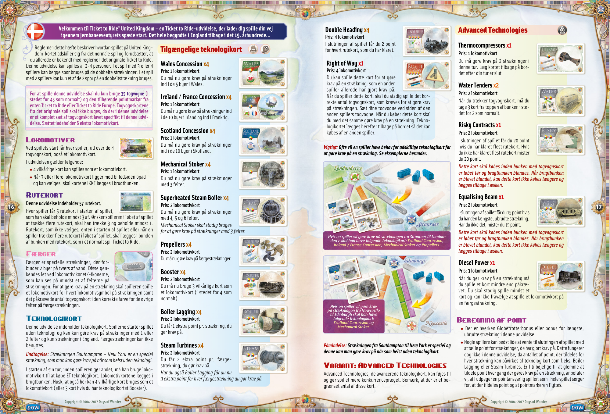

## PDF page 10

#### Storbritannia – en utvidelse til Ticket to Ride som tar deg

**Velkommen til Ticket to Ride® med på eventyr tilbake til jernbanens spede begynnelse på 1800-tallet i England…**

Denne regelboken går igjennom de spillereglene som er endret fra originalutgaven til Storbritannia utvidelsen, og går dermed ut i fra at spillere er kjent med reglene fra hovedspillet. Denne utvidelsen er laget for 2-4 spillere. Når man spiller med 3 til 4 spillere, kan man bruke doble ruter. I spill med bare 2 spillere, er det slik at når ett spor blir tatt kan det andre ikke lenger brukes.

#### For å spille denne utvidelsen, trenger dere bare 35 Tog (ikke 45

**som vanlig) og tilhørende poengmarkører fra enten Ticket to Ride eller Ticket to Ride Europa. Dere trenger ikke vognkortene fra**

**disse spillene, denne utvidelsen kommer med et helt nytt sett som passer til Storbritannia og inkluderer også 6 ekstra lokomotivkort.**

## Lokomotivkort

I begynnelsen av spillet, får hver spiller et lokomotivkort i tillegg til sine fire vognkort. I denne utvidelsen gjelder også: u Et sett med 4 like vognkort i valgfri farge kan spilles som lokomotivkort; u Når 3 eller flere lokomotivkort blir trukket og plassert der hvor de åpne kortene er, skal de ikke fjernes.

## Togbilletter

**18** og bonusbilletter **Denne utvidelsen inneholder 57 togbilletter.** Når man starter spillet, får hver spiller utdelt 5 Togbilletter og må beholde minst 3 av disse. Gjennom spillet kan spillerne trekke flere slike, kalt bonusbilletter. Det trekkes tre, og spilleren må beholde minst ett av disse. De billettene som ikke blir brukt legges nederst i sin egen bunke, sånn som i et vanlig Ticket to Ride spill.

## Ferger

Ferger er spesielle ruter som knytter sam- men to nabobyer over vann. En fergerute har minst ett lokomotivsymbol. For å ta i bruk en fergerute må du spille ut like mange lokomotivkort som angitt på ruten, samt et sett av vognkort for å dekke opp for de andre feltene. Du kan selvfølgelig også her spille lokomotivkort som erstatning for vognkort.

## Teknologikort

For første gang blir “teknologikort” introdusert i Ticket to Ride. Alle spillere starter spillet uten en teknologi. De kan derfor bare opprette ruter med 1 eller 2 felter i England. Fergeruter kan ikke opprettes.

_Unntak: Southampton-New York ruten er en spesiell rute som kan_ _bli opprettet når som helst, med eller uten teknologikort._ Før hver tur og den vanlige handlingen spillerne kan utføre, kan man velge å kjøpe ETT teknologikort mot et gitt antall lokomotivkort. Husk at 4 like vognkort kan brukes som et lokomotivkort (eller 3 like vognkort hvis du har Booster Teknologien).

# Teknologier

### Wales Forbindelsen x4

#### Pris : 1 Lokomotivkort

Lar deg opprette ruter inn til alle de 5 byene i Wales.

### Irland / Frankrike Forbindelsen x4

#### Pris : 1 Lokomotivkort

Lar deg opprette ruter inn til alle de 10 byene i Irland og Frankrike.

### Skottland Forbindelsen x4

#### Pris : 1 Lokomotivkort

Lar deg opprette ruter inn til alle de 10 byene i Skottland.

### Mekanisk Oppgradering x4

#### Pris : 1 Lokomotivkort

Lar deg opprette ruter med 3 felter.

### Supereffektiv dampgenerator x4

#### Pris : 2 Lokomotivkort

Lar deg opprette ruter 4, 5, og 6 felter. _Man må likevel ha den Mekaniske_ _Oppgraderingen for å opprette ruter_ _med 3 felter._

### Propeller x4

#### Pris : 2 Lokomotivkort

Lar deg opprette Fergeruter.

### Booster x4

#### Pris : 2 Lokomotivkort

Du får bruke 3 vognkort som et lokomotivkort (isteden for den vanlige regelen om 4).

### Dampgenerator Bonus x4

#### Pris : 2 Lokomotivkort

Du får et ekstra poeng for hver rute du oppretter.

### Dampturbiner x4

#### Pris : 2 Lokomotivkort

Du får 2 ekstra poeng for hver fergerute du oppretter. _Kombinert med Dampgenerator Bonus,_ _får du 3 ekstra poeng for hver fergerute._

### Dobbel Destinasjon x4

#### Pris : 4 Lokomotivkort

På slutten av spillet, får du 2 poeng ekstra for hver togbillett og bonusbil- lett du har gjennomført.

### Forkjørsrett x1

#### Pris : 4 Lokomotivkort

Du kan bruke dette kortet til å opprette en rute som allerede har blitt tatt av en annen spiller. Når du bruker dette kortet må du som vanlig ha riktige vognkort å legge ned. Sett togene dine ved siden av den andre spillerens tog rett etter at du har fått dette kortet. Så må du legge det tilbake igjen, slik at andre spillere kan kjøpe det dersom de vil.

#### Viktig: Ofte vil man trenge flere teknologikort for å opprette en rute. Se eksempler under.

# Avanserte Teknologier

### Termokompressor x1

#### Pris : 1 Lokomotivkort

Du kan opprette 2 ruter på din tur. Legg tilbake dette kortet etter bruk.

### Bonuskort x2

#### Pris : 2 Lokomotivkort

Når du trekker vognkort kan du velge å trekke 3 kort og ikke de vanlige 2. Dette gjelder ikke for de kortene som ligger åpne på bordet.

### Sjansespill x1

#### Pris : 2 Lokomotivkort

På slutten av spillet får du 20 ekstra poeng om du har fullført flest togbilletter. Hvis ikke du klarer det, mister du 20 poeng. _Dette kortet må kjøpes før man stokker om vognkortene_ _og starter den bunken på ny. Det kan ikke kjøpes dersom_ _dette har blitt gjort, og kan legges tilbake igjen i boksen._

### Utgjevning x1

#### Pris : 2 Lokomotivkort

På slutten av spillet får du 15 poeng ek-**19** stra dersom du har den lengste ruten. Hvis du ikke har det, mister du 15 poeng. _Dette kortet må kjøpes før man stokker om vognkortene_ _og starter den bunken på ny. Det kan ikke kjøpes dersom_ _dette har blitt gjort, og kan legges tilbake igjen i boksen._

### Dieselkraft x1

#### Pris : 3 Lokomotivkort

Når du oppretter en rute, bruker du 1 vognkort mindre enn det som kreves. Du må fortsatt legge ned minst ett kort, og du kan ikke ignorere lokomotivsymbolet på fergerutene.

## Poengberegning

u Det finnes ikke en Globetrotter eller Lengste Rute Bonus (Med Utgjevningsteknologien kan du få dette) i denne utvidelsen. u På grunn av teknologiene “Dampgenerator Bonus” og “Dampturbiner”, som gir ekstra poeng for hver rute man oppretter, er det best å telle poengene mens man spiller og ikke på slutten. Vi anbefaler at én spiller utnevnes til denne oppgaven og flyt- ter poengmarkørene etterhvert som spillere fullfører sine ruter, togbilletter og bonusbilletter.

_Hvis en spiller vil opprette en rute mellom Stranraer til Londonderry,_ _trenger han Skottland Forbindelsen, Irland/Frankrike Forbindelsen,_ _den Mekaniske Oppgraderingen og Propell-teknologien._

_en rute mellom Newcastle_ _Hvis en spiller vil opprette_ _til Edinburgh, trenger han_ _Skottland Forbindelsen og den_ _Mekaniske Oppgraderingen._

#### Påminnelse: Southampton-New York ruten er en spesiell rute som

#### kan bli opprettet når som helst, med eller uten teknologikort.

## Variasjon: Avanserte Teknologier

Avanserte Teknologier kan legges til i spillet for en litt større ut- fordring. Legg merke til at antallet som finnes av hver teknologi er begrenset.

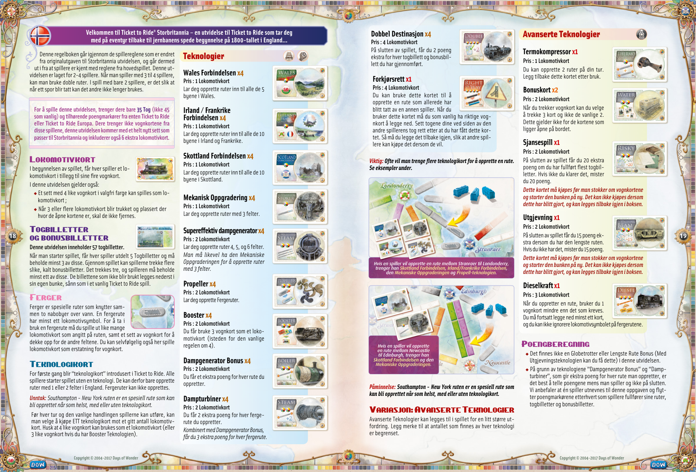

## PDF page 11

#### United Kingdom – ett tillägg till Ticket to Ride som får dig att återuppleva

#### Välkommen till Ticket to Ride®

**de första stapplande stegen i järnvägens historia. Det hela började i England ända tillbaka på 1800-talet…**

Detta regelhäfte beskriver de regelförändringar som är specifika för United Kingdomkartan och förutsätter att du är bekant med reglerna från originalspelet Ticket to Ride. Denna expansion är till för 2-4 spelare. I ett 3 eller 4 personers spel kan båda spåren i en dubbelsträcka mutas in. I ett 2 personers spel kan det andra spåret inte mutas in av någon när det första är taget.

**För att spela med detta tillägg behöver du endast 35 tåg (istället för** **de vanliga 45) och matchande poängmarkörer från Ticket to Ride** **eller Ticket to Ride Europe. Du behöver inte tågkorten från ditt ori-** **ginalspel då detta tillägg kommer med sin egen specifika United** **Kingdom uppsättning tågkort som innehåller 6 extra lokomotivkort.**

## Lokomotiven

I början av spelet delas ett lokomotivkort ut till varje spelare tillsammans med de 4 tågkorten. Detta gäller också: u 4 valfria kort kan alltid spelas som ett lokomotiv. u När 3 eller fler lokomotiv är uppåtvända bland tågkorten vid draghögen ska dessa INTE kastas.

## Biljettkort

#### Denna expansion innehåller 57 biljettkort.

**20** I början av spelet delas 5 biljettkort ut till varje spelare. Av dessa måste spelaren behålla minst 3. En spelare som under spelets gång vill dra nya biljettkort drar 3 biljetter varav minst 1 måste behållas. De biljettkort som väljs bort, både i spelets början och under spelets gång, läggs tillbaka i botten på biljettkortshögen, precis som i vanliga Ticket to Ride.

## Färjor

Färjor är speciella sträckor som går genom vatten och binder samman två städer. De är lätta att känna igen på att åtminstone en av rutorna innehåller en lokomotivikon. För att muta in en färjesträcka måste spelaren lösa in ett lokomotiv för varje ikon på sträckan och ett set av tågkort i en färg för de resterande rutorna på färjesträckan.

## Teknologikort

Detta tillägg introducerar teknologikort. I början av spelet har ingen spelare något teknologikort. Därför kan de bara muta in sträckor av längden 1 eller 2 rutor och bara sträckor i England. Inga färjesträckor kan mutas in.

_Undantag: Sträckan Southampton-New York är en specialsträcka_ _som alltid kan mutas in, även utan något teknologikort._

I början på sin runda, innan sin vanliga handling, får spelaren kasta lokomotivkort för att köpa ETT teknologikort. Kom ihåg att 4 valfria kort kan användas som ett lokomotiv (eller 3 valfria kort om du har köpt teknologin Hjälpmaskineri) även vid detta tillfälle.

# Tillgängliga teknologier

### Wales medgivande x4

#### Kostnad : 1 Lokomotiv

Tillåter dig att muta in sträckor till de 5 städerna i Wales.

### Irland / Frankrikes medgivande x4

#### Kostnad : 1 Lokomotiv

Tillåter dig att muta in sträckor till de 10 städerna på Irland och in i Frankrike.

### Skottlands medgivande x4

#### Kostnad : 1 Lokomotiv

Tillåter dig att muta in sträckor till de 10 städerna i Skottland.

### Mekanisk eldare x4

#### Kostnad : 1 Lokomotiv

Tillåter dig muta in sträckor av längden 3 rutor.

### Överhettad ångpanna x4

#### Kostnad : 2 Lokomotiv

Tillåter dig muta in sträckor av längden 4, 5 och 6 rutor. _Du behöver fortfarande den Meka-_ _niska eldaren för sträckor av längden 3._

### Propellrar x4

#### Kostnad : 2 Lokomotiv

Tillåter dig muta in färjesträckor.

### Hjälpmaskineri x4

#### Kostnad : 2 Lokomotiv

Du kan nu använda 3 kort som ett lokomotiv (istället för de vanliga 4).

### Värmeisolerad ångpanna x4

#### Kostnad : 2 Lokomotiv

Du får 1 extra poäng för varje sträcka du mutar in.

### Ångturbiner x4

#### Kostnad : 2 Lokomotiv

Du får 2 extra poäng för varje färjesträcka du mutar in. _Om du också äger Värmeisolerad ångpanna får du 3 poäng för varje färjesträcka du mutar in._

### Dubbla lok x4

#### Kostnad : 4 Lokomotiv

I slutet på spelet får du 2 extra poäng för varje biljett du lyckats med.

### Förkörsrätt x1

#### Kostnad : 4 Lokomotiv

Du kan spela detta kort för att muta in en sträcka som redan mutats in av en annan spelare. Du måste fortfarande spela ut korrekt antal kort för att muta in sträckan. Placera dina tågvagnar bredvid den andre spelarens. När du köper detta kort måste du omedelbart använda det och muta in en sträcka. Därefter lämnar du tillbaka kortet så att andra spelare också kan köpa det.

**_Viktigt: Det kan oftast behövas flera teknologikort för att kunna muta in en sträcka. Se exemplen nedan._**

# Avancerade teknologier

### Värmepumpar x1

#### Kostnad : 1 Lokomotiv

Muta in 2 sträckor denna runda, lämna sedan tillbaka kortet.

### Vattentenders x2

#### Kostnad : 2 Lokomotiv

När du drar tågkort kan du välja att dra 3 dolda kort istället för de vanliga 2.

### Riskabla kontrakt x1

#### Kostnad : 2 Lokomotiv

I slutet på spelet får du 20 poäng om du har flest avklarade biljetter. Om inte förlorar du 20 poäng istället. _Detta kort måste köpas innan tågkortshögen blandas_ _om. När högen väl blandats om kan detta kort inte köpas_ _och läggs då tillbaka i lådan._

### Fördelare x1

#### Kostnad : 2 Lokomotiv

I slutet på spelet får du 15 poäng om du har den längsta tåglinjen. Om inte förlorar du 15 poäng istället. _Detta kort måste köpas innan tågkortshögen blandas_ **21** _om. När högen väl blandats om kan detta kort inte köpas_ _och läggs då tillbaka i lådan._

### Dieselmotor x1

#### Kostnad : 3 Lokomotiv

När du mutar in en sträcka får du betala med 1 kort mindre än vad som behövs. Du måste fortfarande betala minst 1 kort och du måste betala alla lokomotivrutor på en färjesträcka.

## Poängräkning

u Det finns inga Globetrotter eller Längsta sträckan bonusar i detta tillägg. u Vissa spelare brukar räkna ihop poängen för alla sträckor de mutar in i slutet på spelet istället för när de mutas in. Eftersom poängen för vissa sträckor kan komma att påverkas av teknologikort som Värmeisolerad ångpanna och Ångturbiner går det inte att vänta till slutet för att räkna poäng. Om ni har tendens att glömma räkna poäng när sträckor mutas in föreslår vi att ni utser någon att vara poängräknare. Denna person är den enda som flyttar poängmarkörerna genom hela spelet eller som hela tiden påminner spelare om att flytta sin poängmarkör när de själva glömmer det.

_Om en spelare vill muta in sträckan från Stranraer till Londonderry_ _behövs korten Skottlands medgivande, Irland/Frankrikes_ _medgivande, Mekanisk eldare och Propeller._

_Om en spelare vill muta in_ _sträckan från Newcastle till_ _Edinburgh behövs korten_ _Skottlands medgivande_ _och Mekanisk eldare._

**_Påminnelse: Sträckan Southampton-New York är en specialsträcka som alltid kan mutas in, även utan något teknologikort._**

## Variant: Avancerade teknologier

Avancerade teknologier kan användas för att göra spelet mer tä- vlingsinriktat. Notera att antalet Avancerade teknologier är be- gränsade.

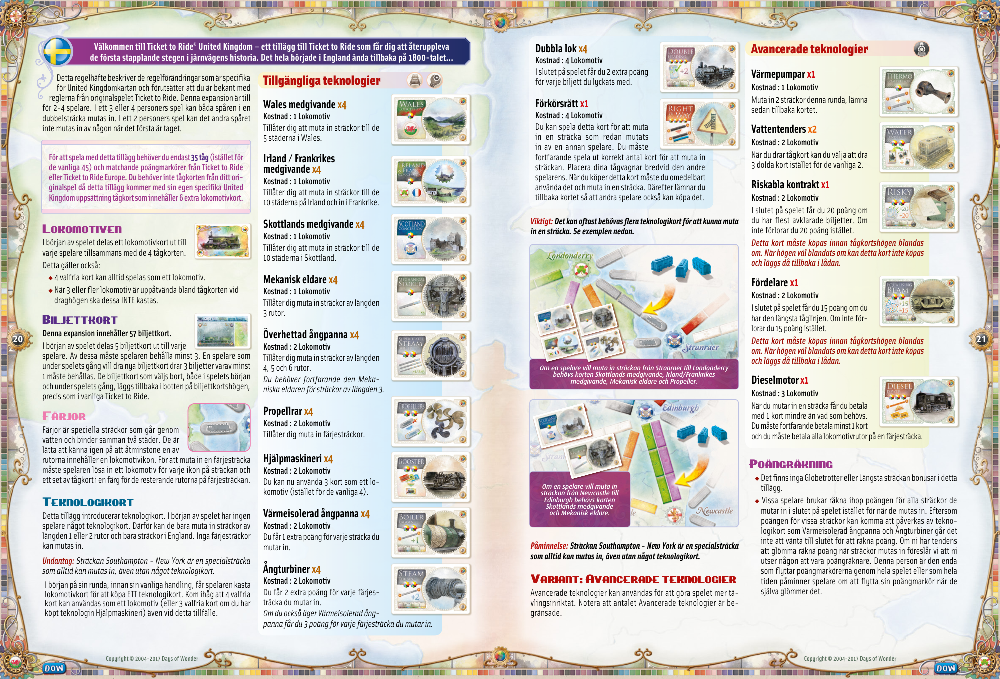

## PDF page 12

The parser returned no text for this page. Refer to the page image below.

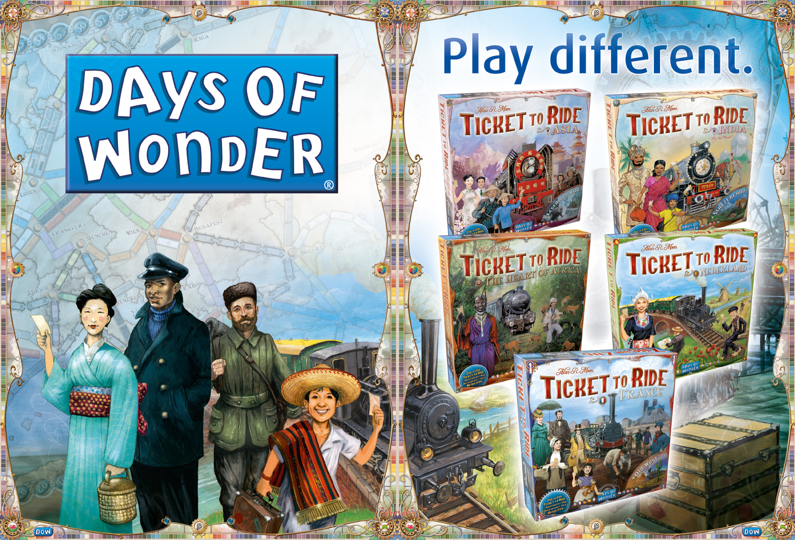

## PDF page 13

# Credits

## Game Design by Alan R. Moon

### Illustrations by Julien Delval Graphic Design by Cyrille Daujean

#### Play testing

**24** **Tests • Spieletests • Pruebas de Juego • Playtester • Testspelers**

- **Kiitokset • Spiltestere • Spilltesting • Speltestare**

##### Thank you to everyone who contributed: Janet E. Moon, Martha Garcia-Murillo

##### & Ian MacInnes, Delight & Seth Merrill, Emilee Lawson Hatch & Ryan Hatch,

##### Jonathan Yost, Ron Krantz, Matthew Kopel

##### Copyright © 2004-2017 Days of Wonder

Days of Wonder, the Days of Wonder logo, Ticket to Ride, Ticket to Ride Europe and Ticket to Ride United Kingdom are all trademarks or registered trademarks of Days of Wonder, Inc. and copyrights ©2004-2017 Days of Wonder, Inc. All Rights Reserved.

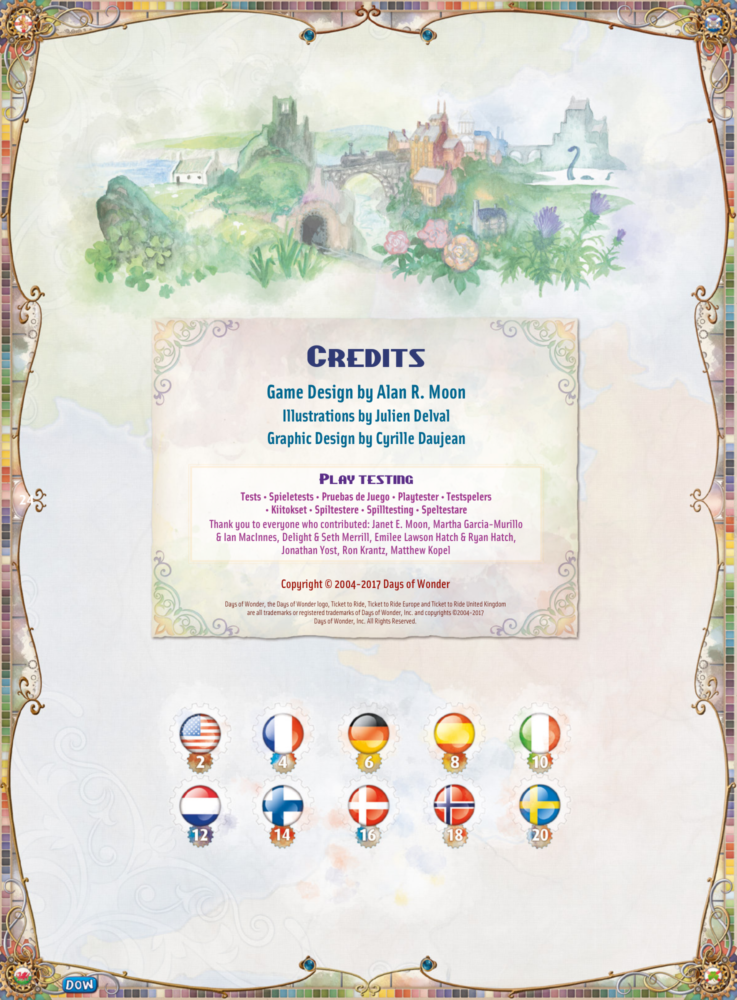
