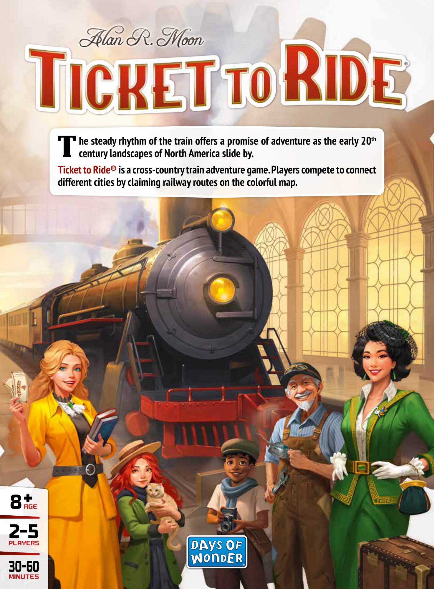
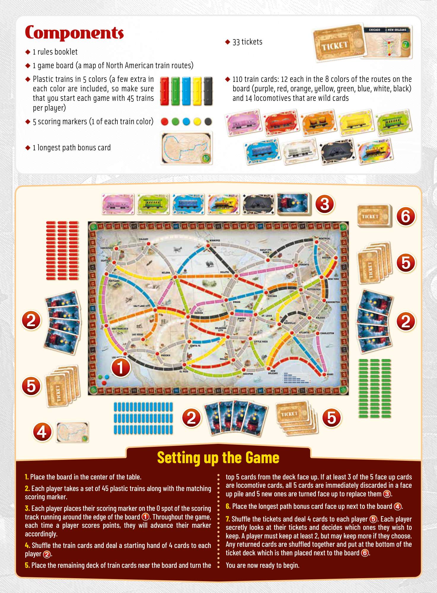
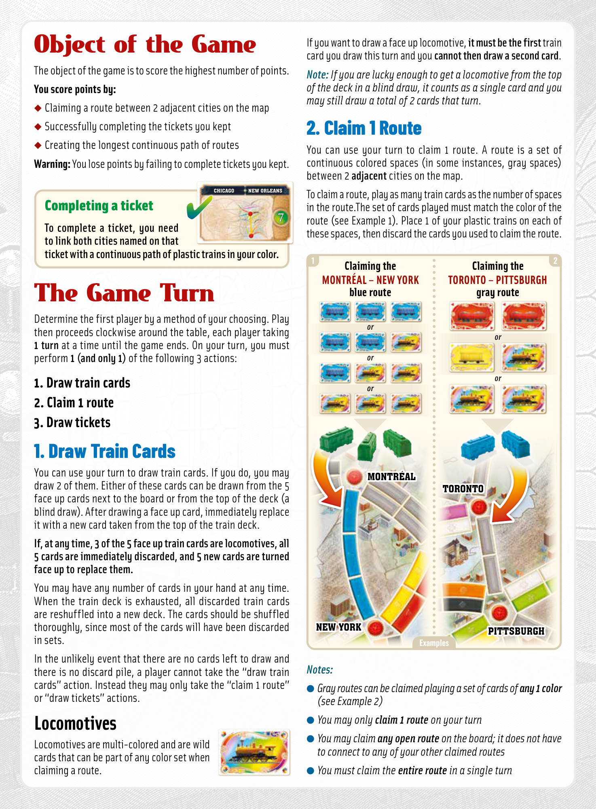
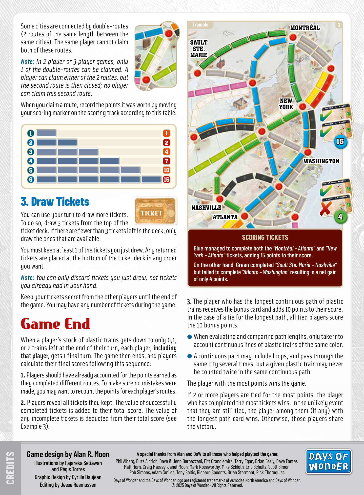

# USA

[Source PDF](rules.pdf) · [Map reference](map.png) · [Map image source](https://www.verkkokauppa.com/fi/product/678595/Ticket-To-Ride-USA-strategiapeli)

Parsed locally with pdf-inspector. Original page images preserve diagrams, tables, and layout; consult them where extraction is unclear.

## PDF page 1

### he steady rhythm of the train offers a promise of adventure as the early 20th

# Tcentury landscapes of North America slide by.

### Ticket to Ride® is a cross-country train adventure game. Players compete to connect

### different cities by claiming railway routes on the colorful map.

## 8AGE 2-5

PLAYERS

30-60 MINUTES

## PDF page 2

**CHICAGO** **CHICAGO NEW ORLEANS**

# ComponentsNEW ORLEANS

◆ 33 tickets ◆ 1 rules booklet

◆

◆ 1 game board (a map of North American train routes) ◆ Plastic trains in 5 colors (a few extra in 110 train cards: 12 each in the 8 colors of the routes on the each color are included, so make sure board (purple, red, orange, yellow, green, blue, white, black) that you start each game with 45 trains and 14 locomotives that are wild cards

◆ per player) 5 scoring markers (1 of each train color)

◆ 1 longest path bonus card**10**

**MONTRÉAL MONTRÉAL** **CALGARY CALGARY WINNIPEG WINNIPEG** **VANCOUVER VANCOUVER SAULT STE. SAULT STE.** **MARIE MARIE** **BOSTON BOSTON** **SEATTLE SEATTLE** **TORONTO TORONTO** **HELENA HELENA DULUTH DULUTH** **PORTLAND PORTLAND NEW YORK NEW YORK** **PITTSBURGH PITTSBURGH** **CHICAGO CHICAGO** **OMAHA OMAHA WASHINGTON WASHINGTON** **SALT LAKE CITY SALT LAKE CITY** **DENVER DENVER** **ST. LOUIS ST. LOUIS** **KANSAS KANSAS** **CITY CITY** **RALEIGH RALEIGH** **NASHVILLE NASHVILLE** **SAN FRANCISCO SAN FRANCISCO OKLAHOMA OKLAHOMA CITY CITY** **LAS VEGAS LAS VEGAS ATLANTA ATLANTA CHARLESTON CHARLESTON** **LITTLE ROCK LITTLE ROCK** **SANTA FE SANTA FE**

**LOS ANGELES LOS ANGELES PHOENIX PHOENIX DALLAS DALLAS**

**EL PASO EL PASO NEW NEW** **HOUSTON HOUSTON ORLEANS ORLEANS 12** **3 42** **1MIAMI MIAMI** **4** **5** **6 1510** **7**

## Setting up the Game

**10**

### 1. Place the board in the center of the table.

**2. Each player takes a set of 45 plastic trains along with the matching scoring marker.**
**3. Each player places their scoring marker on the 0 spot of the scoring** **track running around the edge of the board. Throughout the game,** **each time a player scores points, they will advance their marker accordingly.**
**4. Shuffle the train cards and deal a starting hand of 4 cards to each player .**

### 5. Place the remaining deck of train cards near the board and turn the

**top 5 cards from the deck face up. If at least 3 of the 5 face up cards** **are locomotive cards, all 5 cards are immediately discarded in a face** **up pile and 5 new ones are turned face up to replace them .**

### 6. Place the longest path bonus card face up next to the board.

**7. Shuffle the tickets and deal 4 cards to each player. Each player** **secretly looks at their tickets and decides which ones they wish to** **keep. A player must keep at least 2, but may keep more if they choose.** **Any returned cards are shuffled together and put at the bottom of the** **ticket deck which is then placed next to the board .**

### You are now ready to begin.

## PDF page 3

# Object of the Game

The object of the game is to score the highest number of points.

#### You score points by:

◆ Claiming a route between 2 adjacent cities on the map

◆ Successfully completing the tickets you kept

◆ Creating the longest continuous path of routes **Warning:** You lose points by failing to complete tickets you kept.

**CHICAGO** **CHICAGO NEW ORLEANS** **NEW ORLEANS**

### Completing a ticket

**7** **To complete a ticket, you need to link both cities named on that**

#### ticket with a continuous path of plastic trains in your color.

# The Game Turn

Determine the first player by a method of your choosing. Play then proceeds clockwise around the table, each player taking **1 turn** at a time until the game ends. On your turn, you must perform **1 (and only 1)** of the following 3 actions:

### 1. Draw train cards 2. Claim 1 route

### 3. Draw tickets

## 1. Draw Train Cards

You can use your turn to draw train cards. If you do, you may draw 2 of them. Either of these cards can be drawn from the 5 face up cards next to the board or from the top of the deck (a blind draw). After drawing a face up card, immediately replace it with a new card taken from the top of the train deck.

#### If, at any time, 3 of the 5 face up train cards are locomotives, all

**5 cards are immediately discarded, and 5 new cards are turned face up to replace them.**

You may have any number of cards in your hand at any time. When the train deck is exhausted, all discarded train cards are reshuffled into a new deck. The cards should be shuffled thoroughly, since most of the cards will have been discarded in sets.

In the unlikely event that there are no cards left to draw and there is no discard pile, a player cannot take the “draw train cards” action. Instead they may only take the “claim 1 route” or “draw tickets” actions.

## Locomotives

Locomotives are multi-colored and are wild cards that can be part of any color set when claiming a route.

If you want to draw a face up locomotive, **it must be the first** train card you draw this turn and you **cannot then draw a second card**.

_Note: If you are lucky enough to get a locomotive from the top_

_of the deck in a blind draw, it counts as a single card and you_ _may still draw a total of 2 cards that turn._

## 2. Claim 1 Route

You can use your turn to claim 1 route. A route is a set of continuous colored spaces (in some instances, gray spaces) between 2 **adjacent** cities on the map.

To claim a route, play as many train cards as the number of spaces in the route.The set of cards played must match the color of the route (see Example 1). Place 1 of your plastic trains on each of these spaces, then discard the cards you used to claim the route.

#### Claiming the Claiming the MONTRÉAL – NEW YORK TORONTO – PITTSBURGH blue route gray route

_or_ _or_

_or_

_or_ _or_

**MONTRÉAL MONTRÉAL** **TORONTO TORONTO**

**NEW YORK NEW YORK** **PITTSBURGH PITTSBURGH** **Examples**

_Notes:_

- _Gray routes can be claimed playing a set of cards of any 1 color_ _(see Example 2)_
- _You may only claim 1 route on your turn_
- _You may claim any open route on the board; it does not have_ _to connect to any of your other claimed routes_
- _You must claim the entire route in a single turn_

## PDF page 4

**Example** Some cities are connected by double-routes **MONTRÉAL MONTRÉAL** (2 routes of the same length between the same cities). The same player cannot claim **SAULT SAULT** **STE. STE.** both of these routes. **MARIE MARIE**

_Note: In 2 player or 3 player games, only_

_1 of the double-routes can be claimed. A_ _player can claim either of the 2 routes, but_ _the second route is then closed; no player_ _can claim this second route._ **NEW NEW** When you claim a route, record the points it was worth by moving **YORK YORK MONTRÉAL ATLANTA** **MONTRÉAL ATLANTA** your scoring marker on the scoring track according to this table: **9** **ATLANTA** **NEW YORK** **ATLANTA** **NEW YORK** **6** **11 11** **15 15** **22 22**

| 3 3 | 4 4   |                       |
| --- | ----- | --------------------- |
| 4 4 | 7 7   | WASHINGTON WASHINGTON |
| 5 5 | 10 10 |                       |
| 6 6 | 15 15 |                       |

**33 44**

## 3. Draw Tickets

You can use your turn to draw more tickets. To do so, draw 3 tickets from the top of the ticket deck. If there are fewer than 3 tickets left in the deck, only draw the ones that are available.

You must keep at least 1 of the tickets you just drew. Any returned tickets are placed at the bottom of the ticket deck in any order you want.

_Note: You can only discard tickets you just drew, not tickets_

_you already had in your hand._

Keep your tickets secret from the other players until the end of the game. You may have any number of tickets during the game.

# Game End

When a player’s stock of plastic trains gets down to only 0,1, or 2 trains left at the end of their turn, each player, **including** **that player**, gets 1 final turn. The game then ends, and players calculate their final scores following this sequence:

**1.** Players should have already accounted for the points earned as they completed different routes. To make sure no mistakes were made, you may want to recount the points for each player’s routes.
**2.** Players reveal all tickets they kept. The value of successfully completed tickets is added to their total score. The value of any incomplete tickets is deducted from their total score (see Example 3).
**SAULT STE. MARIE** **NASHVILLE** **NASHVILLE** **SAULT STE. MARIE** **8** **ATLANTA** **ATLANTA WASHINGTON WASHINGTON** **4** **NASHVILLE NASHVILLE** **ATLANTA ATLANTA 44**

#### SCORING TICKETS

**Blue managed to complete both the** _“Montréal – Atlanta”_ **and** _“New_ _York – Atlanta”_ **tickets, adding 15 points to their score.** **On the other hand, Green completed** _“Sault Ste. Marie – Nashville”_ **but failed to complete** _“Atlanta – Washington”_ **resulting in a net gain** **of only 4 points.**

**3.** The player who has the longest continuous path of plastic trains receives the bonus card and adds 10 points to their score. In the case of a tie for the longest path, all tied players score the 10 bonus points. ● When evaluating and comparing path lengths, only take into

- account continuous lines of plastic trains of the same color. A continuous path may include loops, and pass through the same city several times, but a given plastic train may never be counted twice in the same continuous path. The player with the most points wins the game. If 2 or more players are tied for the most points, the player who has completed the most tickets wins. In the unlikely event that they are still tied, the player among them (if any) with the longest path card wins. Otherwise, those players share the victory.
  **Game design by Alan R. Moon A special thanks from Alan and DoW to all those who helped playtest the game:** Phil Alberg, Buzz Aldrich, Dave & Jenn Bernazzani, Pitt Crandlemire, Terry Egan, Brian Fealy, Dave Fontes, **Illustrations by Fajareka Setiawan** Matt Horn, Craig Massey, Janet Moon, Mark Noseworthy, Mike Schloth, Eric Schultz, Scott Simon, **and Régis Torres** Rob Simons, Adam Smiles, Tony Soltis, Richard Spoonts, Brian Stormont, Rick Thornquist. **Graphic Design by Cyrille Daujean** Days of Wonder and the Days of Wonder logo are registered trademarks of Asmodee North America and Days of Wonder.

### CREDITS

**Editing by Jesse Rasmussen** © 2025 Days of Wonder-All Rights Reserved.

